# 기술 설계 문서 (Technical Design Document)

**AI ESG Twin Exchange**

---

## Overview

### 이 시스템이 다른 이유

기존 ESG SaaS는 `데이터 수집 → 집계 → 공시`에서 끝난다. 본 시스템의 가치 사슬은 한 단계 더 나아간다.

```
활동량 데이터 → Digital_Twin(ESG 상태 그래프) → AI 분석/리스크
→ 시나리오 시뮬레이션(ROI) → 마켓플레이스 연결 → 공시 리포트
```

설계상 이 흐름이 의미하는 것은 **하나의 데이터가 6개 서로 다른 정확성 계약을 동시에 만족해야 한다**는 것이다.

| 소비 지점 | 요구되는 성질 | 근거 |
|---|---|---|
| 배출량 산정 | 결정성, 불변 레코드, 6자리 정밀도, 집계 불변식 | Req 5-8, 5-10, 5-12 |
| ESG 점수 | 동일 트윈 버전 → 정수 완전 일치 | Req 7-9 |
| AI 권고 | 모든 정량 값이 저장 레코드 식별자로 소급 가능 | Req 10-10 |
| 시뮬레이션 | 동일 시드 → 동일 시나리오 집합 | Req 11-13 |
| 리포트 | 동일 스냅샷 → 동일 산출물 (재현성) | Req 9-7 |
| 정산 | 최소통화단위까지 금액 보존 | Req 17-6, 17-13 |

따라서 본 설계의 중심 원칙은 하나다. **모든 수치는 불변 레코드로 append-only 저장하고, 모든 파생 값은 자신이 소비한 입력의 버전 식별자를 명시적으로 참조한다.** 값을 갱신(UPDATE)하는 것은 마스터 데이터와 상태 플래그에 한정한다.

### 설계 목표

1. **검증 등급 감사성(assurance-grade auditability)** — 임의의 tCO2e 수치에서 원본 활동량 레코드, 적용 계수, GWP 버전, 산정 실행 식별자까지 단조 경로로 역추적 가능하다.
2. **결정성 우선** — 결정성이 요구되는 경로에서는 AI를 호출하지 않는다. AI 산출물은 트윈 버전에 **고정 저장(freeze)** 되고, 이후 소비자는 저장값만 읽는다.
3. **테넌트 격리는 DB에서 강제** — 애플리케이션 코드의 `where companyId` 누락이 데이터 유출로 이어지지 않도록 RLS를 최종 방어선으로 둔다.
4. **계층 경계는 CI가 강제** — 규율이 아니라 기계 검사로 유지한다 (Req 28-1, 28-2, 28-8).
5. **무거운 작업은 요청 경로에서 제거** — 300초 시뮬레이션, 180초 리포트는 서버리스 요청 안에서 실행하지 않는다.

### 최상위 설계 긴장과 해소 방침

이 시스템의 요구사항에는 서로 밀어내는 세 쌍이 있다. 설계는 각각에 대해 명시적 입장을 취한다.

#### 긴장 1: 검증 등급 감사성 ↔ AI 비결정성

Req 5-12/7-9/9-7/11-13은 완전한 결정성을 요구하고, Req 10/11/13은 AI 생성물을 요구한다. AI 호출은 본질적으로 비결정적이다.

**해소:** AI 출력을 **계산 경로에서 완전히 배제**한다. 시스템을 두 개의 평면으로 분리한다.

- **결정 평면(deterministic plane)** — Emission_Calculator, Score_Engine, Scenario_Simulator의 재무·감축 계산. 순수 함수. 입력은 저장 레코드와 버전 식별자뿐. AI 호출 금지(lint 규칙으로 강제).
- **조언 평면(advisory plane)** — ESG_Agent, Copilot, 벤치마크 요약, 리포트 서술 문단. AI 호출 허용. 출력은 항상 `AI 생성` 라벨과 근거 레코드 식별자를 동반.

두 평면 사이의 유일한 통로는 **freeze**다. AI가 파생한 값(예: 추정 배출량)이 트윈에 들어갈 때 `TwinNodeValue.provenance = 'ESTIMATED'`, `sourceAiHistoryId`와 함께 **불변 값으로 고정**된다. 이후 Score_Engine은 그 고정값을 읽을 뿐 AI를 재호출하지 않는다(Req 7-9). 따라서 "같은 트윈 버전 → 같은 점수"가 성립한다.

#### 긴장 2: 멀티테넌트 격리 ↔ 회사 간 벤치마킹

Req 24-1은 예외 없는 회사 경계 차단을 요구하고, Req 15는 회사 간 통계 비교를 요구한다.

**해소:** 두 개의 물리적으로 분리된 데이터 영역을 둔다.

- `tenant` 스키마 — 모든 테이블에 `companyId`, RLS 강제. 크로스 테넌트 읽기 경로가 존재하지 않는다.
- `commons` 스키마 — `AnonymizedRecord`, `BenchmarkSnapshot`. `companyId` 컬럼이 **애초에 없다**. 산업 중분류 + 규모 구간만 보유(Req 15-2).

두 영역 사이의 유일한 통로는 **단방향 익명화 파이프라인**이다. 명시적 동의 → PII 제거 → k-익명성(k ≥ 5) 검증 → `commons` 삽입. 역방향 조인은 스키마 수준에서 불가능하다(공통 키가 없다). 통계 조회 시 회사 수 < 5인 값은 SQL 함수 레벨에서 억제한다(Req 15-3, 15-4).

#### 긴장 3: 무거운 비동기 작업 ↔ 서버리스 호스팅

Vercel Function은 300초 트윈 생성(Req 4-8), 500~2000개 시나리오 시뮬레이션(Req 11-9), 180초 리포트 생성(Req 9-6)을 요청 타임아웃 안에서 신뢰성 있게 수행할 수 없다. 게다가 Req 4-10(트윈당 단일 워커 큐), Req 10-11(반복 갱신 병합), Req 9-6(회사당 동시 3건)은 **큐 시맨틱** 자체를 요구한다. 서버리스 함수는 상태가 없어 이런 제약을 표현할 수 없다.

**해소:** Vercel을 **요청/스트리밍 계층으로만** 사용하고, 내구성 있는 작업 큐를 PostgreSQL에 두고 **전용 장기 실행 워커 프로세스**(컨테이너 호스트)를 별도로 운영한다. 상세는 아래 "비동기 작업 아키텍처"에서 결정 근거와 함께 확정한다. 이 결정은 협상 대상이 아니다. Vercel Function만으로는 위 세 요구사항을 만족할 수 없다.

---

## 이 설계의 범위 (Scope of This Design)

30개 요구사항을 균등하게 설계하는 것은 실행 가능한 문서를 만들지 못한다. 본 문서는 깊이를 계층에 따라 차등한다.

### 상세 설계 대상 (구현자가 추측 없이 만들 수 있는 수준)

| 요구사항 | 내용 | 본 문서 해당 섹션 |
|---|---|---|
| Req 1 | 인증/계정 | 멀티테넌시와 인가 |
| Req 2 | 조직 4단계 계층 | Data Models |
| Req 3 | 활동량 입력/임포트 | Data Models, Error Handling |
| Req 4 | Digital_Twin | Data Models, 비동기 작업 |
| Req 5 | Scope 1·2 산정 | 배출량 산정 엔진, 정밀도 |
| Req 6 | 배출계수 레지스트리 | Data Models, 배출량 산정 엔진 |
| Req 7 | ESG 점수 | 점수 엔진 |
| Req 8 | 실시간 대시보드 | 실시간 대시보드 |
| Req 9 | 리포트 생성 | 리포트 생성 |
| Req 10 | ESG_Agent | ESG_Agent 설계, AI_Adapter |
| Req 11 | Scenario_Simulator | Scenario_Simulator 설계 |
| Req 31 | Core ESG 데이터 모델 및 프레임워크 매핑 | Data Models, 프레임워크 매핑과 커버리지 |
| Req 32 | ESG Rule Engine | ESG Rule Engine 설계 |
| Req 33 | 배출계수 Provider 아키텍처 | 배출량 산정 엔진, 계수 Provider |
| Req 23–29 | 성능/보안/코드구조/CI | 해당 전용 섹션 |

### 아키텍처 이음새(seam)까지만 설계 — 인터페이스와 데이터 모델은 확정, 내부 알고리즘은 별도 설계

아래 3건은 모두 **post-MVP**다. MVP 릴리스에서 구현하지 않으며, 이 문서는 나중에 이어붙일 수 있도록 이음새만 고정한다.

| 요구사항 | 이 문서에서 확정하는 것 | 확정하지 않는 것 |
|---|---|---|
| Req 12 Scope 3 (post-MVP) | 카테고리/방법/품질등급 데이터 모델 | EEIO 계수 출처, PCAF 자산군 세부 |
| Req 13 Copilot (post-MVP) | 도구 화이트리스트 모델, 권한 위임 경로, 프롬프트 인젝션 방어 | 의도 분류기 구현 |
| Req 14 Marketplace (post-MVP) | 상태 기계, Matching_Engine 점수 인터페이스 | 매칭 가중치 튜닝 |

### MVP 티어 범위 확정 (오너 결정)

이 문서의 이전 판은 "어느 요구사항이 MVP인가"를 미결정으로 이월하고 있었다. 오너 결정으로 그 모호성은 제거되었다: **Req 10, 11, 31, 32, 33이 MVP에 포함되고, Req 12, 13, 14는 post-MVP다.**

결과는 두 가지다. 첫째, MVP가 실질적으로 커졌다 — 이음새 수준이던 두 요구사항(Req 10, 11)이 상세 설계 대상으로 올라오고, 이전 판에 아예 없던 세 요구사항(Req 31, 32, 33)이 추가된다. 둘째, **크리티컬 패스가 Rule Engine을 통과한다.** Req 7-11은 Score_Engine이 산식·가중치·정규화 기준·점수 방향을 코드에 내장하지 못하고 Rule Engine에서 조회하도록 강제한다. 즉 Score_Engine은 이제 Rule Engine에 의존하며, Rule Engine 없이는 점수 산출 자체가 성립하지 않는다. Rule Engine을 나중에 끼워 넣는 순서는 불가능하다.

### 인터페이스 수준만 (P2/P3)

Req 15(Exchange), 16(리스크 맵), 17(결제·정산), 18(Admin_Console), 19(감사·검증), 20(Public_API), 21(플러그인), 22(Agent_Marketplace)는 **포트 인터페이스, 테이블 형상, 아키텍처 제약**만 정의한다. Req 17과 Req 19, Req 21은 MVP 단계에서 되돌리기 어려운 구조적 결정(금액 정수 연산, 감사 해시 체인, 선언적 플러그인)을 포함하므로 그 결정만 지금 확정한다.

Req 25(UI 품질), 26(국제화), 30(SEO)는 횡단 관심사로서 규약 수준으로만 기술한다.

---

## Architecture

### 계층 구조

Clean Architecture를 적용하되 계층 수를 4개로 제한한다. 계층을 더 쪼개면 이 규모에서는 간접화 비용만 늘어난다.

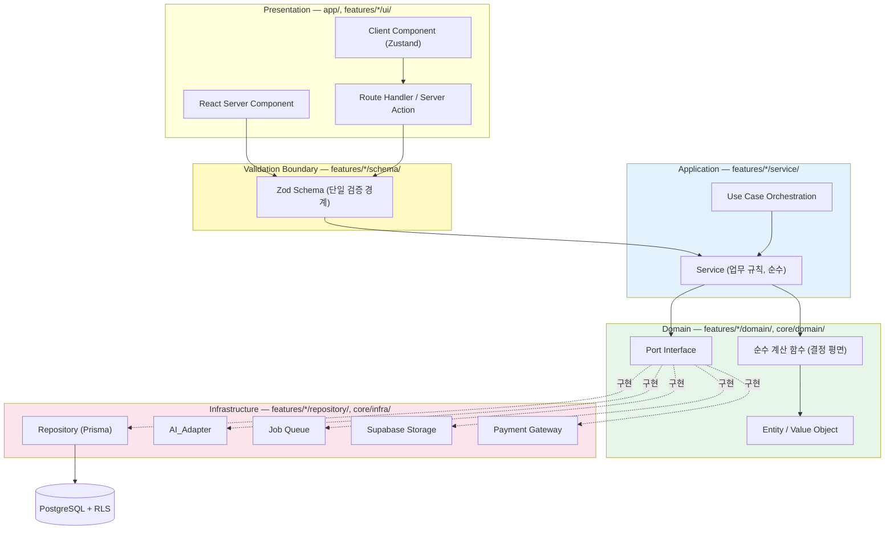

핵심은 `PORT -.구현.-> REPO` 화살표의 방향이다. Service는 Repository **구현**을 모른다. Domain에 선언된 포트 인터페이스만 안다. 이것이 Req 28-2의 (b)항(Service가 ORM을 직접 import 금지)을 구조적으로 만족시키는 방법이다.

### 요청 처리 흐름 (동기 경로)

```mermaid
sequenceDiagram
    participant U as Browser
    participant RH as Route Handler
    participant Z as Zod Schema
    participant S as Service
    participant R as Repository
    participant DB as Postgres (RLS)
    participant A as Audit_Service

    U->>RH: POST /api/activity-data
    RH->>RH: 세션 → AuthContext{userId, companyId, roles}
    RH->>Z: parse(rawBody)
    alt 검증 실패
        Z-->>RH: ZodError
        RH-->>U: 422 + 필드별 위반 (영속 상태 불변, Req 28-9)
    end
    Z-->>RH: ActivityDataInput (타입 확정)
    RH->>S: activityDataService.create(ctx, input)
    S->>S: 정책 판정 (deny-by-default, Req 24-2)
    S->>S: 단위 정규화 → canonical value (순수)
    S->>R: tx( insert ActivityData; insert AuditLog; enqueue Job )
    R->>DB: BEGIN ... COMMIT (단일 트랜잭션)
    DB-->>R: ok
    R->>A: (동일 트랜잭션 내 기록됨)
    S-->>RH: ActivityDataResult
    RH-->>U: 201 + {id, originalValue, originalUnit, conversionFactor, canonicalValue}
```

Audit 기록과 Job enqueue가 도메인 쓰기와 **같은 트랜잭션**에 있다는 점이 중요하다. 이것이 Req 3-7(모든 변경 감사 기록), Req 19-1(커밋 후 1초 내 저장), 그리고 작업 큐의 dual-write 문제를 동시에 제거한다.

### 디렉터리 구조 (feature-first)

```
/
├─ app/                                  # Next.js App Router (라우팅 전용, 로직 없음)
│  ├─ (public)/                          # SSR 공개 페이지 (Req 30)
│  │  ├─ page.tsx
│  │  ├─ sitemap.xml/route.ts
│  │  └─ robots.txt/route.ts
│  ├─ (app)/                             # 인증 필요 (noindex, Req 30-8)
│  │  ├─ dashboard/page.tsx
│  │  ├─ twin/[twinId]/page.tsx
│  │  ├─ emissions/page.tsx
│  │  ├─ scenarios/page.tsx
│  │  └─ reports/page.tsx
│  ├─ (admin)/                           # Super_Admin (Req 18)
│  └─ api/
│     ├─ v1/…                            # Public_API (Req 20)
│     └─ internal/…                      # 브라우저 전용 Route Handler
│
├─ features/                             # ★ 기능 단위. 이 경계가 CI로 강제된다
│  ├─ auth/                              # Auth_Service
│  │  ├─ index.ts                        # ★ 유일한 공개 진입점 (Req 28-1)
│  │  ├─ schema/                         # Zod (단일 검증 경계, Req 28-4)
│  │  ├─ domain/                         # Entity, Port, 순수 정책 판정
│  │  ├─ service/
│  │  ├─ repository/
│  │  └─ ui/
│  ├─ company/                           # Company_Service
│  ├─ activity-data/                     # Data_Importer, Data_Exporter
│  ├─ twin/                              # Twin_Engine
│  ├─ emission/                          # Emission_Calculator
│  ├─ factor/                            # Factor_Registry
│  ├─ score/                             # Score_Engine
│  ├─ dashboard/
│  ├─ report/                            # Report_Generator
│  ├─ agent/                             # ESG_Agent, Risk_Analyzer, Recommendation_Engine
│  ├─ scenario/                          # Scenario_Simulator
│  ├─ copilot/                           # Copilot
│  ├─ marketplace/                       # Marketplace_Service, Matching_Engine
│  ├─ exchange/                          # Exchange_Service, Benchmark_Engine
│  ├─ risk-map/                          # Risk_Map_Service
│  ├─ billing/                           # Billing_Service
│  ├─ plugin/                            # Plugin_Registry
│  ├─ agent-market/                      # Agent_Marketplace
│  ├─ admin/                             # Admin_Console
│  ├─ notification/                      # Notification_Service
│  └─ audit/                             # Audit_Service
│
├─ core/                                 # 기능 비의존 공유 커널
│  ├─ domain/
│  │  ├─ decimal.ts                      # Decimal 연산 규약
│  │  ├─ unit/                           # 정규 단위 레지스트리 (Req 3-1, 26-5)
│  │  ├─ money.ts                        # 최소통화단위 BigInt (Req 17-7)
│  │  ├─ result.ts                       # Result<T, E>
│  │  └─ errors.ts                       # 오류 택소노미
│  ├─ ai/                                # AI_Adapter (Req 27)
│  │  ├─ port.ts
│  │  ├─ registry.ts
│  │  ├─ circuit-breaker.ts
│  │  ├─ redaction.ts
│  │  └─ providers/{openai,anthropic,gemini,deepseek}.ts
│  ├─ jobs/                              # 작업 큐 (계약 + 클라이언트)
│  │  ├─ port.ts
│  │  ├─ contracts.ts                    # JobType별 payload Zod 스키마
│  │  └─ postgres-queue.ts
│  ├─ db/
│  │  ├─ client.ts                       # PrismaClient (RLS 세션 변수 설정 포함)
│  │  └─ rls.ts
│  ├─ auth/                              # AuthContext, 정책 엔진
│  ├─ i18n/                              # Req 26
│  ├─ observability/
│  └─ config/                            # Zod 검증된 환경변수
│
├─ worker/                               # ★ 별도 배포 단위 (Vercel 아님)
│  ├─ main.ts                            # 폴링 루프
│  ├─ handlers/                          # JobType → handler 매핑
│  └─ Dockerfile
│
├─ ui/                                   # shadcn/ui 기반 디자인 시스템 (Req 25-5)
├─ prisma/
│  ├─ schema.prisma
│  └─ migrations/
├─ tests/
│  ├─ property/                          # fast-check (Req 28-7)
│  ├─ integration/
│  ├─ rls/                               # 크로스 테넌트 부정 테스트 (Req 24-11)
│  └─ e2e/                               # Playwright, 5개 핵심 경로 (Req 28-6)
└─ tools/
   └─ eslint-rules/                      # 계층 규칙 (Req 28-2, 28-8)
```

### 의존 방향 규칙과 기계적 강제

Req 28-1/28-2/28-8은 "lint 규칙으로 강제한다"를 명시적으로 요구한다. 규칙과 강제 수단을 1:1로 대응시킨다.

| # | 규칙 | 강제 수단 |
|---|---|---|
| R1 | `features/A/**`는 `features/B/index.ts`만 import. `features/B/service/**` 직접 import 금지 | `eslint-plugin-boundaries` element 타입 + `no-restricted-imports` 패턴 `features/*/!(index)` |
| R2 | `ui/`(Presentation)은 `repository/` import 금지 | `boundaries/element-types` allow 매트릭스 |
| R3 | `service/`는 `next/*`, `@prisma/client`, `fs`, `node:*`, `http` import 금지 | `no-restricted-imports` (paths + patterns) |
| R4 | `repository/`는 `service/`, `ui/` import 금지 | `boundaries/element-types` |
| R5 | `domain/`은 `features/` 외부와 `core/infra` import 금지 (순수) | `boundaries` + `import/no-extraneous-dependencies` |
| R6 | 결정 평면(`emission/domain`, `score/domain`, `scenario/domain`)은 `core/ai` import 금지 | 전용 `no-restricted-imports` 존 |
| R7 | 모든 Route Handler / Server Action 진입점은 Zod parse 1회 통과 | 커스텀 ESLint 규칙 `require-schema-at-entrypoint` (`tools/eslint-rules/`) |
| R8 | `any` 금지 | `@typescript-eslint/no-explicit-any: error`, `no-unsafe-*` 계열 error. `eslint-disable`는 설명 텍스트 필수(`eslint-comments/require-description`), 저장소 전체 10건 상한은 CI 스크립트로 카운트 |
| R9 | `SUPABASE_SERVICE_ROLE_KEY`가 클라이언트 번들에 포함 금지 | 빌드 산출물 문자열 스캔 CI 단계 |

R7 커스텀 규칙의 판정 방식: `app/**/route.ts`의 export된 HTTP 메서드 함수, 그리고 `'use server'` 파일의 export된 async 함수 본문에서 `<schema>.parse(...)` 또는 `.safeParse(...)` 호출이 도달 가능한 경로에 1개 이상 존재하는지 AST로 확인한다. 미충족 진입점 수가 0이 아니면 실패(Req 28-4).

**GET 요청 예외 처리:** 쿼리 파라미터가 없는 순수 조회 진입점도 예외로 두지 않는다. 빈 스키마(`z.object({})`)를 명시적으로 parse하도록 요구한다. 예외 목록을 두면 목록이 곧 우회로가 된다.

### 컴포넌트 배치 지도

Glossary 26개 컴포넌트 전부의 물리적 위치를 확정한다. 계층 태그는 요구사항의 Tier다.

| 컴포넌트 | 위치 | 실행 위치 | 계층 |
|---|---|---|---|
| Auth_Service | `features/auth/service` | Vercel (+ Supabase Auth) | MVP |
| Company_Service | `features/company/service` | Vercel | MVP |
| Data_Importer | `features/activity-data/service/importer.ts` | Vercel(≤1000행) / **Worker**(>1000행, Req 3-11) | MVP |
| Data_Exporter | `features/activity-data/service/exporter.ts` | Vercel (스트리밍) | MVP |
| Twin_Engine | `features/twin/service` | **Worker** (Req 4-8: 300초) | MVP |
| Emission_Calculator | `features/emission/domain` (순수) + `features/emission/service` | Worker (배치) / Vercel (단건) | MVP |
| Factor_Registry | `features/factor/service` + `features/factor/repository` | Vercel (캐시 계층) | MVP |
| Score_Engine | `features/score/domain` (순수) + `features/score/service` | **Worker** (Req 7-1: 120초) | MVP |
| ESG_Agent | `features/agent/service` | **Worker** (Req 10-3: 10분) | P1 |
| Risk_Analyzer | `features/agent/domain/risk` | Worker | P1 |
| Recommendation_Engine | `features/agent/domain/recommendation` | Worker | P1 |
| Scenario_Simulator | `features/scenario/domain` (생성+평가, 순수) + `service` | **Worker**(생성) / Vercel(재평가, Req 11-12: 30초) | P1 |
| Copilot | `features/copilot/service` | Vercel (스트리밍, Req 13-3) | P1 |
| Report_Generator | `features/report/service` | **Worker** (Req 9-6: 180초) | MVP |
| Marketplace_Service | `features/marketplace/service` | Vercel | P1 |
| Matching_Engine | `features/marketplace/domain/matching` | Worker (Req 14-3: 60초) | P1 |
| Exchange_Service | `features/exchange/service` | Vercel + Worker(익명화) | P2 |
| Benchmark_Engine | `features/exchange/service/benchmark.ts` | **Worker** (30일 주기 스냅샷, Req 15-11) | P2 |
| Risk_Map_Service | `features/risk-map/service` | Vercel | P2 |
| Billing_Service | `features/billing/service` | Vercel (웹훅) + Worker (정산·대조) | P2 |
| Public_API | `app/api/v1/**` + `features/*/index.ts` | Vercel | P3 |
| Plugin_Registry | `features/plugin/service` | Vercel | P3 |
| Agent_Marketplace | `features/agent-market/service` | Vercel + Worker | P3 |
| Admin_Console | `features/admin` + `app/(admin)` | Vercel | P2 |
| Notification_Service | `features/notification/service` | Worker (발송) | MVP |
| Audit_Service | `features/audit/service` | 인프로세스 라이브러리 (호출자 트랜잭션 참여) | MVP |
| AI_Adapter | `core/ai` | 양쪽 (Vercel + Worker) | NFR |

Audit_Service만 `features/`가 아니라 인프로세스로 두는 이유: 감사 기록은 도메인 쓰기와 **같은 트랜잭션**에 있어야 한다(Req 19-1). 별도 서비스 호출로 만들면 커밋 원자성이 깨진다. `core/audit/append.ts`가 호출자의 `Prisma.TransactionClient`를 인자로 받는다.

---

## 비동기 작업 아키텍처

이 섹션은 본 설계에서 가장 결정적인 부분이다. 여기가 틀리면 Req 4, 9, 10, 11이 전부 무너진다.

### 문제 정의

| 요구사항 | 요구되는 것 | 서버리스 함수로 불가능한 이유 |
|---|---|---|
| Req 4-8 | 트윈 생성 300초 | 요청 타임아웃, 중단 시 부분 상태 보존 불가 |
| Req 4-10 | **트윈당 단일 워커 순차 처리** | 함수 인스턴스 간 상호배제 상태 없음 |
| Req 10-11 | 10분 내 2회 이상 갱신 → **1건으로 병합** | 큐 대기 상태를 관찰·병합할 주체 없음 |
| Req 9-6 | **회사당 동시 3건 상한** | 동시성 카운터 없음 |
| Req 11-9 | 시뮬레이션 300초, 진행률 조회 | 동일 |
| Req 3-11 | 1000행 초과 임포트 300초 | 동일 |
| Req 4-7 | **2초 이하 간격 진행률 갱신** | 함수가 클라이언트에 push할 채널 없음 |

이들은 성능 문제가 아니라 **상태 문제**다. 큐 상태를 관찰하고 병합·상호배제·동시성 제한을 적용할 수 있는 지속적 저장소와, 그것을 소비하는 장기 실행 프로세스가 필요하다.

### 결정: PostgreSQL 기반 내구성 큐 + 전용 컨테이너 워커

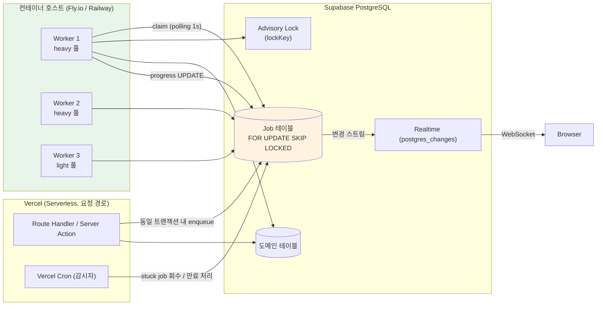

**구체적 선택:**

- **큐 저장소**: PostgreSQL `Job` 테이블. `SELECT ... FOR UPDATE SKIP LOCKED`로 원자적 클레임. 별도 큐 미들웨어 없음.
- **워커 실행 환경**: Node.js 22 컨테이너를 Fly.io(또는 Railway)에 최소 2 인스턴스로 상시 구동. 동일 모노레포에서 빌드되어 `features/*/service`를 그대로 import한다. 코드 중복 없음.
- **워커 풀 분리**: `heavy`(트윈, 리포트, 시뮬레이션, ESG_Agent)와 `light`(알림, 익명화, 웹훅 재시도)를 별도 프로세스로 분리. 무거운 작업이 알림 발송을 굶기지 않도록.
- **진행률 전달**: 워커가 `Job.progress`를 UPDATE → Supabase Realtime `postgres_changes`가 브라우저로 push. 별도 push 인프라 불필요. 갱신 주기 1초(Req 4-7의 2초 이하 요건 충족).
- **감시자**: Vercel Cron이 1분마다 (a) `lease_expires_at < now()`인 `running` 작업을 `queued`로 회수, (b) 타임아웃 초과 작업을 `timed_out`으로 전이, (c) 30일 경과 완료 작업 정리.

### 대안과 기각 이유

| 대안 | 기각 이유 |
|---|---|
| Vercel Function `maxDuration` 확대 | 300초 상한에 여유가 없고(Req 4-8/11-9가 정확히 300초), 상호배제·병합·동시성 제한을 표현할 수 없다. Req 4-10과 10-11이 원리적으로 불가능. |
| Inngest / Trigger.dev | DX는 우수하나 작업 상태가 외부 서비스에 존재한다. 도메인 쓰기와 enqueue를 한 트랜잭션에 넣을 수 없어 dual-write 문제가 생기고, 감사 등급 추적성(Req 19)에서 외부 시스템이 진실의 출처가 된다. Req 4-10의 twin 단위 상호배제를 표현하려면 결국 DB 락이 필요해 이중 관리가 된다. |
| Supabase `pgmq` + `pg_cron` | 큐 자체는 적합하나 실행 주체가 여전히 없다. `pg_cron`은 SQL만 실행하므로 PDF 렌더링·AI 호출을 할 수 없다. |
| AWS SQS + Lambda | Lambda 15분 상한으로 실행 시간은 충족하나, 인프라 표면이 Vercel/Supabase 외로 크게 늘고 Req 29의 단일 파이프라인 배포·롤백 규율이 복잡해진다. Postgres 큐로 충분한 규모에서 과도하다. |
| Postgres `LISTEN/NOTIFY` 푸시 | 폴링을 대체할 수 있으나 NOTIFY는 전달 보장이 없어 내구성 큐의 근거가 될 수 없다. 폴링 1초는 Req의 어떤 지연 목표도 위협하지 않는다. |

**감수하는 대가:** Vercel 외에 운영해야 할 런타임이 하나 늘어난다. 배포 파이프라인이 2개 타깃(Vercel + 컨테이너 레지스트리)을 다뤄야 한다. 이는 Req 4-10, 9-6, 10-11을 만족하기 위한 최소 비용이며, 대안 중 이 비용 없이 요건을 만족하는 것은 없다.

### Job 테이블 스키마

```prisma
enum JobStatus {
  queued
  running
  succeeded
  failed
  timed_out
  cancelled
  superseded   // 병합으로 대체됨 (Req 10-11)
}

enum JobType {
  twin_build
  twin_refresh
  emission_calculate
  emission_recalculate
  score_compute
  activity_import
  report_generate
  scenario_simulate
  agent_recommend
  matching_run
  benchmark_snapshot
  anonymize_record
  notification_dispatch
  webhook_deliver
  settlement_reconcile
}

model Job {
  id            String    @id @default(uuid()) @db.Uuid
  companyId     String?   @db.Uuid              // 시스템 작업은 null
  type          JobType
  status        JobStatus @default(queued)
  priority      Int       @default(100)         // 낮을수록 먼저
  pool          String    @default("heavy")     // "heavy" | "light"

  // 페이로드와 결정성
  payload       Json                            // JobType별 Zod 스키마로 검증됨
  payloadHash   String    @db.Char(64)          // sha256(canonicalJson(payload))
  idempotencyKey String?                        // 외부 유입 요청의 멱등성 (Req 17-8, 20-13)

  // 상호배제와 병합
  lockKey       String?                         // 예: "twin:<twinId>" (Req 4-10)
  dedupeKey     String?                         // 예: "agent_recommend:<companyId>" (Req 10-11)
  supersededById String?  @db.Uuid

  // 실행 제어
  runAfter      DateTime  @default(now())       // 백오프 스케줄
  attempt       Int       @default(0)
  maxAttempts   Int       @default(3)
  timeoutMs     Int                             // JobType 기본값에서 주입
  leaseExpiresAt DateTime?                      // 워커 사망 감지
  claimedBy     String?                         // 워커 인스턴스 식별자

  // 진행률 (Req 4-7, 11-9)
  progress      Int       @default(0)           // 0..100
  progressLabel String?                         // 현재 처리 중 도메인 노드명

  // 결과
  result        Json?
  errorCode     String?                         // 오류 택소노미 코드
  errorDetail   Json?

  cancelRequestedAt DateTime?                   // 협조적 취소 (Req 22-5, 23-10)

  createdAt     DateTime  @default(now())
  startedAt     DateTime?
  finishedAt    DateTime?

  @@index([status, pool, runAfter, priority])
  @@index([companyId, type, status])
  @@index([lockKey, status])
  @@unique([dedupeKey, status], name: "uq_job_dedupe_pending")  // 부분 인덱스로 구현
  @@index([leaseExpiresAt])
}
```

`@@unique([dedupeKey, status])`는 Prisma로 표현되지만 실제로는 `status = 'queued'` 조건의 **부분 유일 인덱스**여야 한다(완료된 작업들이 유일성을 침해하면 안 되므로). 마이그레이션에서 raw SQL로 작성한다.

```sql
CREATE UNIQUE INDEX uq_job_dedupe_pending
  ON "Job" ("dedupeKey")
  WHERE "status" = 'queued' AND "dedupeKey" IS NOT NULL;
```

### 클레임 쿼리

```sql
-- 워커가 1초 주기로 실행. 원자적 클레임.
WITH candidate AS (
  SELECT id
  FROM "Job"
  WHERE status = 'queued'
    AND pool = $1
    AND "runAfter" <= now()
    -- Req 4-10: 동일 lockKey의 running 작업이 있으면 건너뛴다
    AND (
      "lockKey" IS NULL
      OR NOT EXISTS (
        SELECT 1 FROM "Job" r
        WHERE r."lockKey" = "Job"."lockKey"
          AND r.status = 'running'
      )
    )
    -- Req 9-6: 회사당 동시 상한
    AND (
      "companyId" IS NULL
      OR (
        SELECT count(*) FROM "Job" c
        WHERE c."companyId" = "Job"."companyId"
          AND c.type = "Job".type
          AND c.status = 'running'
      ) < $2                     -- report_generate 는 3
    )
  ORDER BY priority ASC, "createdAt" ASC
  LIMIT 1
  FOR UPDATE SKIP LOCKED
)
UPDATE "Job" j
SET status = 'running',
    attempt = j.attempt + 1,
    "claimedBy" = $3,
    "startedAt" = coalesce(j."startedAt", now()),
    "leaseExpiresAt" = now() + make_interval(secs => $4)
FROM candidate
WHERE j.id = candidate.id
RETURNING j.*;
```

`FOR UPDATE SKIP LOCKED`가 여러 워커의 중복 클레임을 막고, `lockKey` NOT EXISTS 절이 트윈당 단일 워커를 보장한다. 동시성 상한은 `$2`로 JobType별 주입.

### 병합(coalescing) 규칙

Req 10-11(10분 내 2회 이상 트윈 갱신 → 1회 권고 생성)과 Req 4-5(활동량 변경 시 트윈 갱신)는 폭풍 유입 시 작업 증폭을 일으킨다. 병합은 enqueue 시점에 처리한다.

```ts
// core/jobs/postgres-queue.ts
async function enqueue(tx: Prisma.TransactionClient, spec: JobSpec): Promise<EnqueueResult> {
  if (!spec.dedupeKey) {
    return { kind: 'created', job: await tx.job.create({ data: toRow(spec) }) };
  }

  // 대기 중인 동일 dedupeKey 작업이 있으면 페이로드를 최신으로 갱신하고 새 작업을 만들지 않는다.
  const merged = await tx.$queryRaw<JobRow[]>`
    UPDATE "Job"
       SET payload      = ${spec.payload},
           "payloadHash"= ${hashPayload(spec.payload)},
           "runAfter"   = GREATEST("runAfter", ${spec.runAfter}),
           priority     = LEAST(priority, ${spec.priority})
     WHERE "dedupeKey" = ${spec.dedupeKey}
       AND status = 'queued'
     RETURNING *`;

  if (merged.length > 0) return { kind: 'merged', job: merged[0] };
  return { kind: 'created', job: await tx.job.create({ data: toRow(spec) }) };
}
```

병합 시 페이로드를 **최신 값으로 덮어쓴다**. Req 10-11이 "최종 Digital_Twin 버전 기준으로 1회만 수행"을 요구하므로, 마지막 갱신의 트윈 버전이 남아야 한다. 중간 버전 기준 작업은 실행되지 않는다.

`dedupeKey` 명명 규약:

| JobType | dedupeKey | lockKey |
|---|---|---|
| `twin_refresh` | `twin_refresh:{twinId}` | `twin:{twinId}` |
| `twin_build` | — (명시 요청) | `twin:{twinId}` |
| `agent_recommend` | `agent_recommend:{companyId}` | `agent:{companyId}` |
| `score_compute` | `score_compute:{twinVersionId}` | `score:{companyId}` |
| `benchmark_snapshot` | `benchmark:{peerGroupId}:{periodKey}` | — |
| `report_generate` | — (각 요청이 독립 산출물) | — |
| `scenario_simulate` | — | `scenario:{companyId}` |

### 멱등성

작업 핸들러는 재시도로 두 번 실행될 수 있다. 두 층에서 방어한다.

**1층 — 작업 수준 멱등성.** 외부 유입 요청(Req 17-8 결제, Req 20-13 Public_API)은 `idempotencyKey`에 부분 유일 인덱스를 걸고, 중복 enqueue 시 기존 작업의 `result`를 그대로 반환한다.

**2층 — 핸들러 수준 멱등성.** 각 핸들러는 자연 멱등 키를 갖는 upsert로 결과를 쓴다.

```ts
// features/emission/service/calculate.ts
// Req 5-12: 동일 활동량 + 동일 계수세트 + 동일 GWP → 중복 불변 레코드를 만들지 않는다
const fingerprint = sha256(canonicalJson({
  activityDataId, activityDataRevision,
  factorSetVersionId, gwpVersion, methodologyVersion,
}));

await tx.emissionResult.upsert({
  where: { companyId_fingerprint: { companyId, fingerprint } },
  create: { ...computed, fingerprint, calculationRunId },
  update: {},           // ★ 의도적 no-op. 불변 레코드는 갱신하지 않는다.
});
```

`update: {}`가 핵심이다. 이것이 Req 5-12(중복 레코드 미생성)와 Req 5-10(불변 레코드)을 동시에 만족시킨다. 재실행은 아무것도 바꾸지 않는다.

### 재시도, 백오프, 타임아웃

| 항목 | 정책 | 근거 |
|---|---|---|
| 재시도 대상 | `RETRYABLE`로 분류된 오류만 (일시적 DB 오류, 5xx 업스트림, 네트워크) | 오류 택소노미 참조 |
| 재시도 제외 | `VALIDATION`, `AUTHORIZATION`, `PRECONDITION` 계열 | 재시도해도 결과 동일 |
| 백오프 | `runAfter = now() + min(2^attempt * 1s, 5min)` + jitter ±20% | 동시 재시도 군집 방지 |
| 기본 최대 시도 | 3회 | |
| AI 호출 실패 | **재시도 1회, 대체 제공자로** (Req 10-9) | AI_Adapter 레벨에서 처리, 작업 레벨 재시도와 분리 |
| 웹훅 발송 | 1, 2, 4, 8, 16분 최대 5회 (Req 20-5) | 전용 백오프 스케줄 |
| 결제 갱신 | 72시간 간격 최대 3회 (Req 17-4) | 전용 스케줄 |
| 타임아웃 | JobType별 상수 | 아래 표 |

JobType별 타임아웃(`timeoutMs`):

| JobType | timeout | 근거 |
|---|---|---|
| `twin_build` / `twin_refresh` | 300s | Req 4-8 |
| `report_generate` | 180s | Req 9-6 |
| `scenario_simulate` | 300s | Req 11-9 |
| `activity_import` | 300s | Req 3-11 |
| `score_compute` | 120s | Req 7-1, 7-10 |
| `agent_recommend` | 600s | Req 10-3 |
| `matching_run` | 60s | Req 14-3 |

타임아웃 강제는 두 겹이다. (1) 워커 인프로세스에서 `AbortController` + `setTimeout`으로 핸들러를 취소하고 `timed_out` 전이. (2) 워커 프로세스가 죽어 (1)이 동작하지 않는 경우, `leaseExpiresAt` 경과를 Cron 감시자가 감지해 회수. `leaseExpiresAt = startedAt + timeoutMs + 30s` 여유를 둔다.

**타임아웃 시 부분 상태 처리.** 요구사항이 유형별로 다르게 규정하므로 핸들러 계약에 명시한다.

- `twin_build` — 부분 결과를 `partial` 상태로 **보존**하고, 직전 완료 버전을 활성 유지 (Req 4-8).
- `report_generate` — 부분 생성 파일을 **저장하지 않음** (Req 9-11).
- `scenario_simulate` — 부분 생성 시나리오를 **저장하지 않음** (Req 11-10).
- `score_compute` — 직전 스냅샷 **변경 없이 보존** (Req 7-10).

핸들러는 `PartialResultPolicy = 'preserve' | 'discard'`를 선언하고, 워커 프레임워크가 `discard`인 경우 핸들러 트랜잭션을 롤백한다. 이 정책을 핸들러 안 코드에 맡기면 반드시 어긋난다.

### 취소

```ts
// 취소 요청: 상태를 직접 바꾸지 않고 플래그만 세운다
await prisma.job.updateMany({
  where: { id: jobId, companyId: ctx.companyId, status: { in: ['queued', 'running'] } },
  data: { cancelRequestedAt: new Date() },
});
```

`queued` 작업은 클레임 시점에 `cancelRequestedAt`을 확인해 즉시 `cancelled`로 전이한다. `running` 작업은 **협조적 취소**다. 핸들러가 진행률 보고 지점마다 취소 플래그를 확인한다.

```ts
// worker/handlers/scenario-simulate.ts
for (const [i, batch] of batches.entries()) {
  await ctx.checkpoint(i / batches.length, `시나리오 평가 ${i}/${batches.length}`);
  // checkpoint 내부: cancelRequestedAt 확인 → CancelledError throw, 그리고 progress UPDATE
  evaluateBatch(batch);
}
```

Req 22-5(에이전트 제거 시 5초 내 진행 중 실행 중단)는 checkpoint 간격을 5초 이내로 유지해야 함을 의미한다. 시나리오 평가는 배치 크기를 조정해 이를 보장한다.

### 클라이언트 진행률 구독

```ts
// features/*/ui/use-job-progress.ts
export function useJobProgress(jobId: string) {
  const [job, setJob] = useState<JobView | null>(null);

  useEffect(() => {
    // 1. 초기 상태를 한 번 읽는다 (구독 이전에 완료된 경우 대비)
    void fetchJob(jobId).then(setJob);

    // 2. 변경 스트림 구독. RLS가 companyId 경계를 강제한다.
    const ch = supabase
      .channel(`job:${jobId}`)
      .on('postgres_changes',
        { event: 'UPDATE', schema: 'public', table: 'Job', filter: `id=eq.${jobId}` },
        (p) => setJob(toJobView(p.new)))
      .subscribe();

    return () => { void supabase.removeChannel(ch); };
  }, [jobId]);

  return job;
}
```

구독 이전에 작업이 끝나는 경쟁 조건을 (1)의 초기 fetch가 막는다. 이 순서를 뒤집으면 짧은 작업의 완료를 놓친다.

---

## Data Models

### 엔터티 그룹 지도

요구사항이 언급하는 28개 엔터티 그룹의 전체 목록과 소속 기능, 테넌트 키 유무, 변경 가능성을 먼저 확정한다. "불변"은 append-only이며 UPDATE 경로가 존재하지 않음을 뜻한다. 번호에 `b`가 붙은 그룹(5b, 8b, 14b)은 Req 31·32·33이 추가한 그룹으로, 인접 그룹과 같은 기능 모듈에 속하지만 수명주기가 다르므로 별도 행으로 둔다.

| # | 그룹 | 주요 모델 | 기능 | `companyId` | 변경성 |
|---|---|---|---|---|---|
| 1 | 사용자·세션 | `User`, `Session`, `Invitation`, `MfaEnrollment` | auth | 조인 테이블 | 가변 |
| 2 | 소속·역할 | `Membership`, `RoleAssignment`, `AuditorAssignment` | auth | ✓ | 가변 |
| 3 | 회사 | `Company`, `CompanySettings` | company | ✓ (자신) | 가변 |
| 4 | 조직 계층 | `OrgNode`, `OrgNodeClosure`, `OrgNodeRevision` | company | ✓ | 가변 + 이력 |
| 5 | 정규 단위 | `UnitDefinition`, `UnitConversion`, `ActivityItemDef` | core | ✗ (플랫폼) | 가변(관리자) |
| 5b | Core ESG 필드 | `EsgFieldDefinition`, `EsgFieldValue`, `DraftFieldValue` | core | 정의 ✗ / 값 ✓ | 정의는 버전 추가, 값은 가변 |
| 6 | 활동량 | `ActivityData`, `ActivityDataRevision` | activity-data | ✓ | 가변 + 이력 |
| 7 | 증빙·임포트 | `Attachment`, `ImportBatch`, `ImportRowError` | activity-data | ✓ | 가변 |
| 8 | 배출계수 | `FactorSet`, `EmissionFactor`, `GwpTable`, `GwpValue` | factor | 재정의만 ✓ | **불변**(행 단위) |
| 8b | 계수 Provider | `ProviderRegistration`, `ProviderCoverage` | factor | ✗ (플랫폼) | 가변(임포트 시) |
| 9 | 산정 결과 | `CalculationRun`, `EmissionResult`, `EmissionGasAmount` | emission | ✓ | **불변** |
| 10 | 집계 읽기 모델 | `EmissionRollup` | emission | ✓ | 파생(재생성 가능) |
| 11 | Scope 3 | `Scope3CategoryResult`, `Scope3Exclusion`, `FinancedEmission` | emission | ✓ | **불변** |
| 12 | 목표 | `EmissionTarget`, `SbtiValidation`, `BaseYear` | emission | ✓ | 가변 |
| 13 | 디지털 트윈 | `DigitalTwin`, `TwinVersion`, `TwinNodeValue`, `TwinValueBlob` | twin | ✓ | **불변**(버전) |
| 14 | 점수 스냅샷 | `ScoreSnapshot`, `ScoreContribution` | score | ✓ | **불변**(스냅샷) |
| 14b | 규칙 엔진 | `ScoreRubric`, `ScoringRule`, `FrameworkMapping`, `FrameworkItemCatalog` | score | ✗ (플랫폼) | 발행 후 **불변**(세트 단위) |
| 15 | AI 권고 | `RecommendationSet`, `RiskItem`, `OpportunityItem`, `ActionItem`, `ItemFeedback` | agent | ✓ | 버전 추가 |
| 16 | 시나리오 | `MeasureCatalog`, `AssumptionSet`, `ScenarioRun`, `Scenario`, `ScenarioMeasure`, `AdoptedPlan` | scenario | ✓ | **불변**(런) |
| 17 | 리포트 | `Report`, `ReportArtifact`, `ReportSnapshotRef`, `ReportApproval` | report | ✓ | 상태 전이 |
| 18 | 마켓플레이스 | `Supplier`, `SupplierCertification`, `Demand`, `Proposal`, `MatchScore`, `Order`, `OrderReview`, `ReductionEvidence` | marketplace | ✓ | 상태 전이 |
| 19 | 공급망 리스크 | `SupplierLink`, `RiskAssessment`, `RiskAxisScore`, `RiskDispute` | risk-map | ✓ | 가변 |
| 20 | 익명 공유·벤치마크 | `ShareConsent`(테넌트) / `AnonymizedRecord`, `PeerGroup`, `BenchmarkSnapshot`, `BenchmarkStat`(commons) | exchange | 분리 | 불변 + 스냅샷 |
| 21 | 과금·정산 | `Plan`, `Subscription`, `Invoice`, `Payment`, `LedgerEntry`, `Settlement`, `Refund`, `IdempotencyRecord` | billing | ✓ | **불변**(원장) |
| 22 | 공개 API | `ApiKey`, `ApiKeyScope`, `WebhookSubscription`, `WebhookDelivery`, `DeadLetter` | (public-api) | ✓ | 가변 |
| 23 | 플러그인 | `Plugin`, `PluginVersion`, `PluginActivation`, `PluginResourceKey` | plugin | 활성화만 ✓ | 버전 불변 |
| 24 | AI 운영 | `AiProviderConfig`, `AiHistory`, `AiCostAccumulator`, `PromptRetention`, `CircuitState` | core/ai | 이력 ✓ | 혼합 |
| 25 | 감사·알림 | `AuditLog`, `AuditAnchor`, `AuditOpinion`, `ReportingPeriodLock`, `Notification` | audit, notification | ✓ | **불변**(감사) |

추가로 `Job`(비동기 작업)과 `AgentListing`/`AgentInstallation`/`AgentPermissionGrant`(Req 22)가 있다. 후자는 P3이므로 인터페이스 수준만 다룬다.

### 결정 1: 테넌트 키는 모든 테이블에 물리적으로 존재한다

`companyId`를 부모 테이블 조인으로 유도하지 않고 **모든 테넌트 테이블에 컬럼으로 중복 저장**한다.

근거:
- RLS 정책이 조인 없이 판정 가능해야 한다. 조인 기반 정책은 매 행마다 서브쿼리를 실행하여 Req 23-3(p95 500ms, 활동 데이터 100만 건)을 만족할 수 없다.
- 정책 표현이 모든 테이블에서 **동일한 한 줄**이 되어 감사와 부정 테스트(Req 24-11) 생성이 자동화된다.
- 정규화 위반이지만, 부모-자식 간 `companyId` 불일치를 복합 외래키로 봉쇄하면 무결성 위험이 제거된다.

```prisma
model ActivityData {
  id        String @id @default(uuid()) @db.Uuid
  companyId String @db.Uuid
  orgNodeId String @db.Uuid

  // ★ 복합 FK: 자식의 companyId가 부모의 companyId와 다르면 삽입 자체가 실패한다
  orgNode   OrgNode @relation(fields: [companyId, orgNodeId], references: [companyId, id])
  company   Company @relation(fields: [companyId], references: [id])
  // ...
}

model OrgNode {
  id        String @id @default(uuid()) @db.Uuid
  companyId String @db.Uuid
  // 복합 FK의 참조 대상이 되기 위한 유일 제약
  @@unique([companyId, id])
}
```

이 복합 FK 패턴이 "코드 버그로 다른 회사의 조직 노드에 데이터를 붙이는" 사고를 DB 수준에서 불가능하게 만든다. RLS는 읽기 경계를, 복합 FK는 쓰기 무결성을 담당한다.

### 결정 2: 4단계 조직 계층 — 인접 리스트 + 폐쇄 테이블 + 리비전

Req 2-3(4단계, 부모당 1000, 회사당 10000), Req 2-8(변경 이력 5년), Req 2-9(조직경계 방식 + 지분율), Req 2-10(가동 개시/종료일), Req 5-8(계층 집계)을 동시에 만족해야 한다.

단순 인접 리스트만으로는 Req 5-8의 재귀 집계가 매 조회마다 재귀 CTE를 요구하여 Req 23-3을 위협한다. 폐쇄 테이블(closure table)을 병행한다.

```prisma
enum OrgNodeKind { company factory facility production_line }
enum ConsolidationApproach { equity_share financial_control operational_control }

model OrgNode {
  id           String      @id @default(uuid()) @db.Uuid
  companyId    String      @db.Uuid
  parentId     String?     @db.Uuid
  kind         OrgNodeKind
  name         String      @db.VarChar(100)          // Req 2-3: 1~100자
  depth        Int                                    // 0=company .. 3=production_line
  sortKey      String                                 // 결정적 정렬 (재현성)

  // Req 2-9: 조직 경계
  consolidationApproach ConsolidationApproach
  equitySharePct        Decimal? @db.Decimal(5, 2)   // 0.00~100.00. equity_share일 때 필수

  // Req 2-10: 가동 기간
  operationStartDate DateTime  @db.Date
  operationEndDate   DateTime? @db.Date

  // Req 2-6: 좌표 (사업장). 소수점 6자리
  latitude     Decimal?  @db.Decimal(9, 6)
  longitude    Decimal?  @db.Decimal(9, 6)
  geocodeStatus GeocodeStatus @default(not_required)  // pending|resolved|review_required

  // Req 2-4: soft delete, 30일 복원
  deactivatedAt DateTime?
  purgeAfter    DateTime?

  currentRevision Int    @default(1)

  parent     OrgNode?  @relation("OrgNodeTree", fields: [companyId, parentId], references: [companyId, id])
  children   OrgNode[] @relation("OrgNodeTree")
  revisions  OrgNodeRevision[]

  @@unique([companyId, id])
  @@index([companyId, parentId, deactivatedAt])
  @@index([companyId, kind])
}

// Req 5-8: 임의 수준 집계를 재귀 없이 수행하기 위한 폐쇄 테이블
model OrgNodeClosure {
  companyId    String @db.Uuid
  ancestorId   String @db.Uuid
  descendantId String @db.Uuid
  distance     Int                 // 0 = 자기 자신

  @@id([companyId, ancestorId, descendantId])
  @@index([companyId, descendantId])
}

// Req 2-8: 변경 이력 5년 이상 보존
model OrgNodeRevision {
  id            String   @id @default(uuid()) @db.Uuid
  companyId     String   @db.Uuid
  orgNodeId     String   @db.Uuid
  revision      Int
  changedAt     DateTime @default(now())
  changedByUserId String @db.Uuid
  changeKind    String                          // create|update|reparent|deactivate
  beforeState   Json?                           // 변경 전 부모-자식 관계 및 속성 전체
  afterState    Json

  @@unique([companyId, orgNodeId, revision])
  @@index([companyId, changedAt])
}
```

폐쇄 테이블 유지는 애플리케이션이 아니라 **트리거**로 한다. Service 코드에 맡기면 재부모화(reparent) 경로에서 반드시 어긋난다.

```sql
-- 재부모화 시: 대상 서브트리와 조상들의 폐쇄 항목을 재구성
CREATE OR REPLACE FUNCTION rebuild_org_closure(p_company uuid, p_node uuid)
RETURNS void LANGUAGE plpgsql AS $$
BEGIN
  DELETE FROM "OrgNodeClosure" c
   WHERE c."companyId" = p_company
     AND c."descendantId" IN (
       SELECT "descendantId" FROM "OrgNodeClosure"
        WHERE "companyId" = p_company AND "ancestorId" = p_node);

  INSERT INTO "OrgNodeClosure" ("companyId", "ancestorId", "descendantId", distance)
  WITH RECURSIVE sub AS (
    SELECT id, id AS root, 0 AS d FROM "OrgNode"
     WHERE "companyId" = p_company AND id = p_node
    UNION ALL
    SELECT n.id, s.root, s.d + 1 FROM "OrgNode" n
      JOIN sub s ON n."parentId" = s.id
     WHERE n."companyId" = p_company
  ),
  anc AS (
    SELECT "ancestorId", distance FROM "OrgNodeClosure"
     WHERE "companyId" = p_company AND "descendantId" = p_node
  )
  SELECT p_company, a."ancestorId", s.id, a.distance + s.d
    FROM sub s CROSS JOIN anc a
  UNION
  SELECT p_company, p_node, s.id, s.d FROM sub s;
END $$;
```

깊이 상한이 4이므로 재구성 비용은 항상 유계다.

### 결정 3: 활동량 데이터 — 원본 보존 + 정규 환산값 병기

Req 3-1은 원본 수량·원본 단위·적용 환산 계수·기준 단위 환산값을 **모두 반환**하도록 요구한다. 즉 넷 모두 저장해야 한다. Req 26-5는 저장은 미터법만, 변환은 표시 시점만을 요구한다.

```prisma
enum ActivityProvenance { manual file_import api plugin }

model ActivityData {
  id            String @id @default(uuid()) @db.Uuid
  companyId     String @db.Uuid
  orgNodeId     String @db.Uuid

  itemCode      String                              // ActivityItemDef.code
  periodStart   DateTime @db.Date
  periodEnd     DateTime @db.Date                   // Req 3-1: 1~366일

  // 원본 (사용자가 입력한 그대로. 절대 재계산하지 않는다)
  originalValue Decimal  @db.Decimal(24, 6)         // Req 3-1: ≤999,999,999.999999, 6자리
  originalUnit  String                              // UnitDefinition.code

  // 정규 환산 (미터법 기준 단위)
  canonicalValue      Decimal @db.Decimal(38, 12)   // 환산 손실 방지를 위해 더 높은 정밀도
  canonicalUnit       String
  conversionFactor    Decimal @db.Decimal(38, 18)   // 감사 추적용 (Req 5-5)
  conversionSourceId  String?                       // UnitConversion.id

  // Req 3-7: 프로비넌스
  provenance      ActivityProvenance
  enteredByUserId String   @db.Uuid
  enteredAt       DateTime @default(now())
  importBatchId   String?  @db.Uuid

  currentRevision Int      @default(1)
  supersededAt    DateTime?                          // Req 3-6 덮어쓰기 시

  attachments   Attachment[]                         // Req 3-8: 최대 5개
  revisions     ActivityDataRevision[]

  orgNode  OrgNode @relation(fields: [companyId, orgNodeId], references: [companyId, id])

  @@unique([companyId, id])
  // Req 3-6: 동일 노드·기간·항목 중복 감지 (활성 레코드에 한정 → 부분 인덱스로 구현)
  @@index([companyId, orgNodeId, itemCode, periodStart, periodEnd])
  @@index([companyId, periodStart, periodEnd])
}
```

Req 3-6의 중복 감지는 부분 유일 인덱스로 강제한다.

```sql
CREATE UNIQUE INDEX uq_activity_active_period
  ON "ActivityData" ("companyId", "orgNodeId", "itemCode", "periodStart", "periodEnd")
  WHERE "supersededAt" IS NULL;
```

덮어쓰기는 기존 행을 UPDATE하지 않고 `supersededAt`을 설정하고 새 행을 삽입한다. 이렇게 하면 이미 산정에 사용된 값이 사후에 바뀌지 않아 `EmissionResult`의 불변성이 유지된다(Req 5-10). Req 3-6이 요구하는 "재산정 필요 표시"는 새 행 삽입 시 기존 행을 참조한 `EmissionResult`를 조회해 `staleFactorOrInput = true`로 마킹하는 것으로 구현한다.

정규 단위 레지스트리:

```prisma
model UnitDefinition {
  code       String  @id                  // "kWh", "MJ", "L", "kg", "t", "m3", "MMBtu"
  dimension  String                       // "energy" | "mass" | "volume" | "count" | "currency"
  isCanonical Boolean @default(false)      // dimension별로 정확히 1개 (미터법)
  displaySystem String @default("metric")  // "metric" | "imperial"  (Req 26-5)
}

model UnitConversion {
  id        String  @id @default(uuid()) @db.Uuid
  fromUnit  String
  toUnit    String
  // 유리수로 저장한다. 부동소수 왕복 오차를 구조적으로 제거한다 (Req 26-5)
  numerator   Decimal @db.Decimal(38, 0)
  denominator Decimal @db.Decimal(38, 0)
  source      String

  @@unique([fromUnit, toUnit])
}

model ActivityItemDef {
  code          String   @id            // "electricity_purchased", "diesel_stationary"
  scope         Int                     // 1 | 2 | 3
  canonicalUnit String
  allowedUnits  String[]                // Req 3-1: 항목별 허용 단위 목록
  requiresNcv   Boolean  @default(false) // 질량/부피 → 에너지 변환 필요 (Req 5-2)
}
```

`UnitConversion`을 소수 계수가 아니라 **유리수(분자/분모)** 로 저장하는 것이 Req 26-5의 왕복 일치(metric → imperial → metric 시 최초 표시값과 동일)를 보장하는 핵심이다. 소수 계수를 쓰면 `× 2.20462 ÷ 2.20462 ≠ 1`이 되어 왕복이 깨진다.

### 결정 4: 배출계수 — 버전 세트 안의 불변 행

Req 6-2(신규 세트 등록 시 기존 계수 유효 종료일 설정), Req 6-7(유효기간 중복 시 세트 전체 거부), Req 6-9(사용된 계수의 삭제·직접 수정 거부)를 만족하려면 계수 행은 **불변**이어야 하고, 유효기간만 시스템이 조정할 수 있어야 한다.

```prisma
enum FactorGas { CO2 CH4 N2O CO2e }
enum FactorSetStatus { draft validating active superseded rejected }

model FactorSet {
  id         String @id @default(uuid()) @db.Uuid
  code       String                            // "KR-NIR-2024", "DEFRA-2024"
  version    String                            // MAJOR.MINOR.PATCH
  status     FactorSetStatus @default(draft)
  sourceName String
  sourceUrl  String?
  // Req 6-1: 출처의 재배포 허용 여부. Factor_Registry가 계수 값을 API/리포트에 노출할지 결정
  redistributionAllowed Boolean
  licenseNote String?
  publishedYear Int                             // 1990~2100
  // 회사 전용 재정의 세트인 경우에만 설정 (Req 6-5 1순위)
  companyId  String? @db.Uuid
  pluginVersionId String? @db.Uuid              // 국가 플러그인 제공 세트 (Req 6-5 2순위)

  factors    EmissionFactor[]

  @@unique([code, version])
  @@index([companyId, status])
}

model EmissionFactor {
  id           String @id @default(uuid()) @db.Uuid
  factorSetId  String @db.Uuid

  // 조회 키 (Req 6-5)
  countryCode  String  @db.Char(2)
  energySource String                            // "electricity_grid", "diesel", "residual_mix"
  activityType String                            // "stationary_combustion", "purchased_electricity"
  gas          FactorGas

  // 값
  value        Decimal @db.Decimal(24, 6)        // Req 6-1: 0~1,000,000, 6자리
  unit         String                            // "kgCO2e/kWh", "kgCH4/TJ"
  // Req 5-2: 순발열량. 질량/부피 → 에너지 변환용
  netCalorificValue     Decimal? @db.Decimal(24, 9)
  netCalorificValueUnit String?                  // "TJ/Gg", "MJ/L"
  ncvSource             String?

  // 유효 기간 (Req 6-1: 종료일 null = 무기한)
  validFrom    DateTime  @db.Date
  validTo      DateTime? @db.Date

  publishedYear Int                              // Req 6-8: 3년 소급 대체 판단용

  createdAt    DateTime @default(now())
  // ★ UPDATE 경로 없음. 유효 종료일 설정만 예외적으로 허용 (Req 6-2)
  supersededByFactorId String? @db.Uuid

  factorSet    FactorSet @relation(fields: [factorSetId], references: [id])

  @@index([countryCode, energySource, activityType, gas, validFrom, validTo])
  @@index([factorSetId])
}
```

**유효기간 비중첩 강제.** Req 6-7은 세트 전체 거부를 요구한다. 애플리케이션 검증에만 의존하면 동시 등록 시 경쟁 조건으로 중첩이 발생한다. PostgreSQL 배제 제약으로 DB 수준에서 봉쇄한다.

```sql
CREATE EXTENSION IF NOT EXISTS btree_gist;

ALTER TABLE "EmissionFactor"
  ADD COLUMN validity daterange
    GENERATED ALWAYS AS (daterange("validFrom", "validTo", '[)')) STORED;

-- 회사 재정의 세트와 플랫폼 세트는 서로 중첩 가능해야 하므로 스코프 키를 포함한다
ALTER TABLE "EmissionFactor"
  ADD COLUMN scope_key text
    GENERATED ALWAYS AS (
      "countryCode" || '|' || "energySource" || '|' || "activityType" || '|' || gas::text
    ) STORED;

ALTER TABLE "EmissionFactor"
  ADD CONSTRAINT no_overlapping_validity
  EXCLUDE USING gist (
    scope_key WITH =,
    (SELECT coalesce("companyId"::text, 'platform')
       FROM "FactorSet" WHERE id = "factorSetId") WITH =,
    validity WITH &&
  );
```

배제 제약의 두 번째 항이 서브쿼리를 쓸 수 없으므로, 실제 구현에서는 `EmissionFactor`에 `scopeOwner text` 컬럼(=`'platform'` 또는 `companyId`)을 비정규화하여 삽입 시 채우고 그 컬럼을 배제 제약에 사용한다.

**GWP 테이블.** Req 5-2는 AR4/AR5/AR6 선택을 요구한다. 코드 상수로 두면 새 IPCC 보고서마다 배포가 필요하다. 데이터로 둔다.

```prisma
model GwpTable {
  version   String @id                    // "AR4" | "AR5" | "AR6"
  horizon   Int    @default(100)          // 100년 GWP
  citation  String
  values    GwpValue[]
}

model GwpValue {
  gwpVersion String
  gasCode    String                        // "CO2","CH4","N2O","HFC-134a","SF6","NF3","PFC-14"
  // Req 5-1: HFCs/PFCs는 개별 종(species)이므로 문자열 키가 필요하다
  value      Decimal @db.Decimal(12, 4)
  isBiogenic Boolean @default(false)

  @@id([gwpVersion, gasCode])
}
```

### 결정 4b: 배출계수 Provider 아키텍처

Req 33은 계수 조회를 Provider 인터페이스 뒤로 추상화하고 MVP에 6개 구현을 요구한다. 이 절은 그 인터페이스의 성격을 확정한다 — **Provider는 데이터 수집·정규화 어댑터이며, 런타임 질의 프록시가 아니다.**

#### Provider 포트

Req 33-3의 조회 연산과 Req 33-7의 메타데이터 선언을 한 인터페이스가 함께 요구한다. 메타데이터가 조회와 같은 계약에 있어야 Req 33-8의 원인 귀속이 Provider 구현을 뒤지지 않고 성립한다.

```ts
// features/factor/provider/port.ts
export interface ProviderMetadata {
  readonly providerId: string;              // "KR-NIR" | "IPCC" | "DEFRA" | "US-EPA" | "IEA" | "UNFCCC"
  readonly displayName: string;
  readonly sourceUrl: string;
  /** Req 6-1: 이 Provider가 공급한 계수의 값 노출 가능 여부 */
  readonly redistributionAllowed: boolean;
  readonly licenseNote: string;

  // ── Req 33-7: 네 개 차원의 지원 범위 선언 ──
  readonly supportedCountries: readonly string[];    // ISO 3166-1 alpha-2. ["*"] = 전세계
  readonly supportedActivityTypes: readonly string[];
  readonly supportedGases: readonly FactorGas[];
  readonly publishedYearRange: { readonly from: number; readonly to: number };
}

export interface ProviderFactorRecord {
  readonly countryCode: string;
  readonly energySource: string;
  readonly activityType: string;
  readonly gas: FactorGas;
  readonly value: Decimal;
  readonly unit: string;
  readonly netCalorificValue: Decimal | null;
  readonly netCalorificValueUnit: string | null;
  readonly ncvSource: string | null;
  readonly validFrom: Date;
  readonly validTo: Date | null;
  readonly publishedYear: number;
}

export interface EmissionFactorProvider {
  readonly metadata: ProviderMetadata;

  /** Req 33-3: 조건에 대해 계수 0개 또는 1개. 정규화 검증용 단건 조회. */
  lookup(q: ProviderLookupQuery): Promise<ProviderFactorRecord | null>;

  /**
   * 관리자 임포트 경로. 출처 원본 형식(CSV/XLSX/JSON/API 페이지네이션)을
   * ProviderFactorRecord 스트림으로 정규화한다. Req 33-10의 5초 타임아웃이 걸리는 지점.
   */
  ingest(input: ProviderIngestInput): AsyncIterable<ProviderFactorRecord>;
}

export interface ProviderLookupQuery {
  readonly countryCode: string;
  readonly activityType: string;
  readonly energySource: string;
  readonly gas: FactorGas;
  readonly publishedYear: number;
}
```

#### MVP 6개 구현

| `providerId` | 출처 | 라이선스 | 주 용도 |
|---|---|---|---|
| `KR-NIR` | 환경부·산업통상자원부 국가 배출계수 | 공공누리 (재배포 허용) | 한국 전력 배출계수, 연료 계수 |
| `IPCC` | IPCC 2006 Guidelines + 2019 Refinement | 공개 (재배포 허용) | 기본 계수, NCV, 산화계수 |
| `DEFRA` | UK DEFRA Conversion Factors | OGL v3 (재배포 허용) | 영국·국제 활동 계수, 출장·물류 |
| `US-EPA` | US EPA GHG Emission Factors Hub / eGRID | 미국 정부 저작물 (재배포 허용) | 미국 eGRID 지역별 전력 계수 |
| `IEA` | IEA Emission Factors — **공개 범위만** | 공개 배포분 한정 | 국가별 전력 grid mix (공개분) |
| `UNFCCC` | UNFCCC National Inventory Submissions | 공개 (재배포 허용) | Annex I 국가 인벤토리 계수 |

**6개 전부 오픈 라이선스인 것이 설계의 전제다.** Req 6-11은 계수 값 자체를 마스킹 없이 산정 상세·리포트 부록·공개 API에 노출하도록 요구한다. MVP Provider 전부가 `redistributionAllowed = true`이므로 이 노출이 무조건 성립한다. IEA를 **공개 범위로 한정**한 것도 같은 이유다 — 유료 데이터셋을 끌어오면 이 전제가 깨지고 MVP 전체에 마스킹 분기가 활성화된다.

#### 핵심 결정: Provider는 임포트 시점의 어댑터다

각 Provider는 **관리자 임포트 시점에** 자기 출처의 원본 형식을 `FactorSet` + `EmissionFactor` 행으로 변환한다. 산정 hot path는 정규화된 테이블만 읽는다. Provider 코드는 산정 중에 실행되지 않는다.

```
[관리자 임포트]  Provider.ingest() → 정규화 → FactorSet(status=validating)
                 → 배제 제약 검증(결정 4) → status=active
                                                    │
[산정 hot path]  resolveFactor() → EmissionFactor 조회만 ─┘   (Provider 미실행)
```

**기각한 대안: 산정 시점에 Provider API를 호출하는 런타임 프록시.** Req 33-1의 "Provider 인터페이스 뒤로 추상화"를 문자 그대로 읽으면 이 구조가 자연스러워 보인다. 기각한다.

- Req 5-12는 동일 입력에 대한 산정 결과의 결정성을 요구한다. 런타임 프록시는 이 결정성을 **제3자의 가동률과 그날 그들이 응답한 값**에 종속시킨다. DEFRA가 계수를 정정 배포하면 어제 산정한 값과 오늘 산정한 값이 달라지고, 우리는 그 변경을 인지조차 못 한다.
- Req 5-10은 산정 결과의 불변성(append-only, 재산정은 새 런)을 보장한다. 외부 호출이 산정 경로에 있으면 "동일 런을 재실행해 검증한다"는 감사 절차가 성립하지 않는다. 감사인이 검증할 수 있는 대상은 우리 DB에 고정된 계수 행이어야 한다.
- Req 6-9는 사용된 계수의 수정을 거부한다. 외부에 있는 값은 우리가 거부할 수 없다.

**귀결: Req 33-10의 5초 Provider 타임아웃은 임포트 경로에 적용되며, 레코드 단위 산정에는 적용되지 않는다.** 100만 건 활동 데이터를 산정할 때 Provider 타임아웃이 100만 번 걸릴 여지가 없다. 타임아웃으로 제외된 Provider와 사유는 `ImportBatch`에 기록되고 Super_Admin 통지로 나간다.

#### Req 33-5 우선순위와의 정합

Req 33-5는 "우선순위에 따라 Provider를 순차 조회"라고 쓰여 있다. 위 결정 하에서 이 문장은 **정규화된 행 위에서 해석된다** — Provider를 순차 호출하는 것이 아니라, `FactorSet.providerId`로 태깅된 행 집합을 tier 순서로 훑는다. 반환하는 `providerId`는 Req 33-6이 요구하는 것과 동일한 식별자다.

```prisma
model FactorSet {
  // ... 결정 4의 기존 컬럼 유지 ...

  // ★ Req 33-5/33-6: 이 세트를 정규화해 넣은 Provider. 회사 직접 업로드 세트는 null.
  providerId String?
  provider   ProviderRegistration? @relation(fields: [providerId], references: [providerId])

  @@index([providerId, status])
}

// Req 33-7 메타데이터의 영속 사본. 코드의 ProviderMetadata를 임포트 시 스냅샷한다.
model ProviderRegistration {
  providerId            String  @id            // "KR-NIR" | "IPCC" | ...
  displayName           String
  sourceUrl             String
  redistributionAllowed Boolean
  licenseNote           String
  publishedYearFrom     Int
  publishedYearTo       Int
  isPluginProvided      Boolean @default(false) // Req 33-4: 상용 Provider는 true
  pluginVersionId       String? @db.Uuid
  lastIngestedAt        DateTime?

  factorSets FactorSet[]
  coverage   ProviderCoverage[]
}
```

메타데이터를 코드에만 두지 않고 DB에 스냅샷하는 이유: 산정 결과가 참조하는 Provider가 코드에서 제거되어도(플러그인 비활성화) Req 33-6의 "산정 상세·리포트 부록에 Provider 표시"가 계속 성립해야 한다.

#### `ProviderCoverage` — Req 33-9 커버리지와 Req 33-8 원인 귀속

```prisma
model ProviderCoverage {
  providerId   String
  // Req 33-7의 네 차원을 행으로 펼친 것. ("*" = 전 범위 지원)
  countryCode  String @db.Char(2)
  activityType String
  gas          FactorGas
  yearFrom     Int
  yearTo       Int
  // Req 33-9: 이 Provider가 실제로 계수를 반환한 조회 건수
  resolvedHits BigInt @default(0)

  provider ProviderRegistration @relation(fields: [providerId], references: [providerId])

  @@id([providerId, countryCode, activityType, gas])
  @@index([countryCode, activityType, gas])
}
```

Req 33-8은 `FACTOR_NOT_FOUND`를 그냥 통지하는 것으로 만족하지 않는다. 어느 차원이 막혔는지 특정해야 한다. `ProviderCoverage`를 차원별로 부분 조회하면 귀속이 계산으로 나온다.

```ts
// features/factor/service/attribute-gap.ts
export type GapDimension =
  | 'UNSUPPORTED_COUNTRY'        // 미지원 국가
  | 'UNSUPPORTED_ACTIVITY_TYPE'  // 미지원 활동 유형
  | 'UNSUPPORTED_GAS'            // 미지원 가스
  | 'YEAR_OUT_OF_RANGE';         // 연도 범위 외

export interface AttributedGap {
  readonly dimensions: readonly GapDimension[];   // 복수 가능 (Req 33-8: "하나 이상")
  readonly checkedProviders: readonly string[];
  /** Req 33-10으로 조회 대상에서 제외된 Provider와 사유 */
  readonly excludedProviders: readonly { providerId: string; reason: 'TIMEOUT' | 'ERROR' }[];
}

export async function attributeGap(
  q: FactorQuery, repo: CoverageRepository,
): Promise<AttributedGap> {
  const dims: GapDimension[] = [];
  // 좁은 차원 하나만 풀어 조회하여, 그 차원이 유일한 병목인지 판별한다
  if (!(await repo.anyCovering({ countryCode: q.countryCode })))
    dims.push('UNSUPPORTED_COUNTRY');
  if (!(await repo.anyCovering({ activityType: q.activityType })))
    dims.push('UNSUPPORTED_ACTIVITY_TYPE');
  if (!(await repo.anyCovering({ gas: q.gas })))
    dims.push('UNSUPPORTED_GAS');
  if (!(await repo.anyCovering({
        countryCode: q.countryCode, activityType: q.activityType,
        gas: q.gas, year: q.targetYear })))
    dims.push('YEAR_OUT_OF_RANGE');
  return { dimensions: dims, checkedProviders: await repo.activeProviderIds(), excludedProviders: [] };
}
```

네 번째 검사가 가장 좁은 조합에 걸리므로, 앞의 세 검사가 모두 통과하면 남는 원인은 연도 범위다. 이 순서가 "국가는 지원하지만 그 국가의 2019년 계수만 없다"를 정확히 `YEAR_OUT_OF_RANGE`로 귀속시킨다.

#### 상용 Provider와 마스킹 분기

ecoinvent, GaBi는 Req 21의 플러그인 경로로 들어온다(Req 33-4). `ProviderRegistration.isPluginProvided = true`, `redistributionAllowed = false`. **이것이 Req 6-13의 마스킹이 활성화되는 유일한 경우다.**

```ts
// Req 6-11 / 6-13: 값 노출 여부를 resolution이 스스로 들고 다닌다
export function presentFactorValue(r: FactorResolution): FactorValueView {
  if (r.redistributionAllowed) {
    return { masked: false, value: r.value.toFixed(6), unit: r.unit, providerId: r.providerId };
  }
  // Req 6-13: 값은 가리고 출처·단위·Provider만 노출. 산정 결과 자체는 정상 산출된다.
  return { masked: true, value: null, unit: r.unit, providerId: r.providerId,
           maskReason: 'REDISTRIBUTION_NOT_ALLOWED' };
}
```

**MVP Provider 중 이 분기를 실행하는 것이 하나도 없다.** 그럼에도 분기는 처음부터 존재해야 한다 — 나중에 넣으면 계수 값이 이미 리포트 아티팩트와 공개 API 응답 스키마에 박혀 있고, 그때 마스킹을 추가하는 것은 스키마 변경이 된다.

**기각한 대안: 상용 Provider가 실제로 붙을 때 마스킹을 구현한다.** 실행되지 않는 분기는 처음 실행될 때 반드시 틀려 있다. 따라서 `redistributionAllowed = false`인 **합성 픽스처**로 마스킹 경로를 테스트한다. 이 픽스처는 실제 상용 데이터가 아니라 플래그만 false인 가짜 세트이며, 산정 상세·리포트 부록·공개 API 세 표출 경로 모두에서 값이 가려지는지 검증한다. 테스트 없는 마스킹 분기는 마스킹이 없는 것과 같다.

### 결정 5: 배출 산정 결과 — append-only, 가스별 분해, NUMERIC(38,12)

Req 5-8의 집계 불변식(|부모 − Σ자식| ≤ 0.000001 tCO2e)을 "희망"이 아니라 **구조적으로** 보장하려면 두 가지가 필요하다.

1. 부모 값을 **별도로 계산해 저장하지 않는다.** 부모 값은 항상 리프 `EmissionResult` 행들의 SQL SUM으로 도출된다. 독립적으로 계산된 두 값을 비교하지 않으므로 차이가 발생할 여지가 없다.
2. 합산이 **정확 연산**이어야 한다. `double precision`은 결합법칙이 성립하지 않아 합산 순서에 따라 결과가 달라진다. PostgreSQL `NUMERIC`은 임의 정밀도 십진 연산이며 `SUM(numeric)`은 정확하다.

따라서 **부동소수점을 배출량 경로에 사용하지 않는다.** Prisma `Decimal` ↔ Postgres `NUMERIC`, 애플리케이션 연산은 `decimal.js`로만 한다. `Number`로의 변환은 최종 표시 직전(JSON 직렬화)에만 허용하며, 그 지점은 lint 규칙으로 감시한다.

```prisma
enum CalculationStatus { computed on_hold superseded }

model CalculationRun {
  id                String   @id @default(uuid()) @db.Uuid
  companyId         String   @db.Uuid
  triggeredBy       String                          // "activity_data_saved" | "factor_update" | "base_year_change" | "manual"
  triggeredByUserId String?  @db.Uuid
  reason            String?                         // Req 5-10: 재산정 사유
  factorSetVersionIds String[]                      // 이 런에서 사용된 세트들
  gwpVersion        String
  methodologyVersion String                         // 산정 코드 버전 (결정성 지문에 포함)
  startedAt         DateTime @default(now())
  finishedAt        DateTime?
  results           EmissionResult[]

  @@index([companyId, startedAt])
}

model EmissionResult {
  id             String @id @default(uuid()) @db.Uuid
  companyId      String @db.Uuid
  orgNodeId      String @db.Uuid                   // ★ 항상 리프 노드
  activityDataId String @db.Uuid
  activityDataRevision Int

  calculationRunId String @db.Uuid

  scope          Int                                // 1 | 2 | 3
  scope3Category Int?                               // 1..15
  // Req 5-3: 위치기반/시장기반을 별도 행으로 저장한다 (합산 대상이 겹치지 않게)
  scope2Method   Scope2Method?                      // location_based | market_based

  periodStart    DateTime @db.Date
  periodEnd      DateTime @db.Date

  // Req 5-8: 6자리 이상 정밀도. 12자리로 여유를 둔다.
  totalTco2e     Decimal @db.Decimal(38, 12)
  // Req 5-11: biogenic CO2는 Scope 1 합계에 포함하지 않고 별도 항목
  biogenicCo2T   Decimal @db.Decimal(38, 12) @default(0)

  // Req 5-5: 감사 추적
  appliedFactorId       String  @db.Uuid
  factorSetVersionId    String  @db.Uuid
  factorSourceTier      FactorSourceTier            // company_override | country_plugin | platform_default
  factorFallbackYears   Int     @default(0)         // Req 6-8: 소급 대체 연수
  gwpVersion            String
  appliedNcv            Decimal? @db.Decimal(24, 9)
  appliedNcvSource      String?
  unitConversionFactor  Decimal  @db.Decimal(38, 18)
  // Req 5-4: residual mix 부재로 location 계수 대체 적용
  residualMixFallback   Boolean  @default(false)
  fallbackAppliedKwh    Decimal? @db.Decimal(38, 12)

  status         CalculationStatus @default(computed)
  // Req 6-4: 계수 갱신 후 재산정 전까지 "구버전 계수 적용" 표시
  staleFactor    Boolean @default(false)

  // Req 5-12: 결정성 지문. 동일 지문의 중복 레코드를 만들지 않는다.
  fingerprint    String @db.Char(64)

  computedAt     DateTime @default(now())

  gasAmounts     EmissionGasAmount[]
  calculationRun CalculationRun @relation(fields: [calculationRunId], references: [id])

  @@unique([companyId, fingerprint])
  @@index([companyId, orgNodeId, periodStart, scope])
  @@index([companyId, activityDataId])
  @@index([calculationRunId])
}

// Req 5-1: 가스별 배출량 (가스 고유 질량 단위 t) + tCO2e 환산값
model EmissionGasAmount {
  emissionResultId String @db.Uuid
  gasCode          String                          // "CO2","CH4","N2O","HFC-134a",...
  massT            Decimal @db.Decimal(38, 12)     // 가스 고유 질량, 톤
  gwpApplied       Decimal @db.Decimal(12, 4)
  tco2e            Decimal @db.Decimal(38, 12)
  isBiogenic       Boolean @default(false)

  result EmissionResult @relation(fields: [emissionResultId], references: [id], onDelete: Cascade)

  @@id([emissionResultId, gasCode, isBiogenic])
}
```

**왜 `orgNodeId`가 항상 리프인가.** 만약 중간 노드에 직접 `EmissionResult`를 붙이면 "부모 = Σ자식"이 성립하지 않는다(부모 자신의 직접 배출이 존재하므로). 요구사항 5-8은 "상위 노드 값과 그 직계 하위 노드 합계"의 일치를 요구한다. 이를 만족하는 유일한 깔끔한 방법은 배출을 리프에만 귀속시키는 것이다. 사업장 수준의 직접 배출이 있으면 해당 사업장 아래에 `kind = production_line`, `name = '(사업장 직접)'`인 암묵 리프 노드를 자동 생성한다. 이것은 데이터 모델링 트릭이 아니라 불변식을 구조로 보장하는 유일한 방법이다.

집계 쿼리:

```sql
-- 임의 노드의 tCO2e 합계. 폐쇄 테이블로 재귀 제거. NUMERIC 정확 합산.
SELECT sum(er."totalTco2e") AS tco2e
  FROM "EmissionResult" er
  JOIN "OrgNodeClosure" c
    ON c."companyId" = er."companyId"
   AND c."descendantId" = er."orgNodeId"
 WHERE c."companyId" = $1
   AND c."ancestorId" = $2
   AND er.status = 'computed'
   AND er.scope = 1
   AND er."periodStart" >= $3 AND er."periodEnd" <= $4;
```

Scope 2를 합산할 때는 `scope2Method`를 항상 필터에 포함해야 한다. 누락하면 위치기반과 시장기반이 이중 계상된다. 이를 실수로 빠뜨릴 수 없도록 Repository는 Scope 2 조회 시 `scope2Method`를 **필수 인자**로 받는다(타입 수준 강제).

### 결정 5b: Core ESG 필드 카탈로그와 프레임워크 매핑

Req 31은 "무엇을 입력해야 하는가"를 코드가 아니라 **데이터로** 확정할 것을 요구한다. Req 31-9가 "필드 추가를 정의 버전 추가만으로 수용하며 코드 배포를 요구하지 않는다"고 명시하므로, 필드 정의를 TypeScript 상수나 Prisma enum으로 두는 선택지는 처음부터 배제된다.

#### `EsgFieldDefinition` — 버전이 부여된 정의

```prisma
enum EsgAxis { E S G }
enum EsgDataType { integer decimal boolean enumeration string }
enum ReportingPeriod { monthly quarterly annual }

model EsgFieldDefinition {
  fieldCode         String                 // "env.energy.total", "soc.safety.ltifr", "gov.board.independent_ratio"
  definitionVersion String                 // ★ 복합 PK의 두 번째 축 (Req 31-9)

  axis              EsgAxis                // Req 31-1: E/S/G 세 영역
  domain            TwinDomain             // Req 31-16: 트윈 12개 도메인에 사상
  dataType          EsgDataType
  unit              String?                // boolean/enumeration은 null
  enumValues        String[]               // dataType=enumeration일 때만 비어있지 않음
  reportingPeriod   ReportingPeriod
  isRequired        Boolean                // Req 31-16/31-17 분모의 근거

  // Req 31-6/31-7: 이 필드가 동반 컬럼을 강제하는지
  requiresDenominatorBasis Boolean @default(false)
  requiresVerification     Boolean @default(false)

  labelKo           String
  labelEn           String
  validFrom         DateTime @db.Date
  validTo           DateTime? @db.Date

  values            EsgFieldValue[]
  mappings          FrameworkMapping[]

  @@id([fieldCode, definitionVersion])
  @@index([domain, isRequired])
  @@index([axis, definitionVersion])
}
```

`domain`이 `TwinDomain`을 재사용하는 것이 의도적이다. Req 31-16이 Req 4-2의 분모를 이 카탈로그로 산출하라고 요구하므로, 두 축이 다른 enum이면 매 조회마다 사상 테이블이 끼어든다. 같은 enum이면 분모가 `WHERE domain = ? AND "isRequired"` 한 줄이 된다.

**기각한 대안: 필드 정의를 코드 상수 + Zod 스키마로 두고 Prisma 컬럼을 필드마다 하나씩 만든다.** 타입 안전성은 확실히 낫다. 그러나 Req 31-9가 "코드 배포를 요구하지 않는다"를 명시적 수락 기준으로 걸었고, Req 31-10은 정의 버전 간 값 보존과 대응 관계 조회까지 요구한다. 컬럼-per-필드 구조에서 이것은 필드 추가마다 마이그레이션이며, 버전 간 대응 관계를 표현할 자리가 없다. 요구사항이 EAV를 지시한다.

#### `EsgFieldValue` — 출처 정보와 정의 버전을 함께 고정

Req 31-8은 값마다 Req 3-7과 **동일한** 출처 컬럼을 요구한다. `ActivityData`의 출처 컬럼 집합을 그대로 복제한다(공유 타입으로 뽑되 물리 컬럼은 각 테이블에 둔다 — 결정 1의 원칙과 동일하게 조인 없이 판정 가능해야 한다).

```prisma
// 출처 유형은 결정 3의 ActivityProvenance(manual|file_import|api|plugin)를 그대로 재사용한다.
// Req 31-8이 "Req 3-7과 동일한 출처 정보"를 요구하므로 별도 enum을 만들면 두 축이 갈라진다.
enum MeasurementBasis { measured estimated }     // Req 31-8: 실측/추정 구분
enum DenominatorBasis { PER_200K PER_1M }        // Req 31-5
enum VerificationMethod { self_check third_party_audit supplier_self_assessment site_visit }

model EsgFieldValue {
  id                String @id @default(uuid()) @db.Uuid
  companyId         String @db.Uuid
  orgNodeId         String @db.Uuid

  fieldCode         String
  // ★ Req 31-10: 입력 당시의 정의 버전을 값에 고정한다. 정의가 바뀌어도 값은 불변.
  definitionVersion String

  periodStart       DateTime @db.Date
  periodEnd         DateTime @db.Date

  // 자료형별 저장 슬롯. dataType에 따라 정확히 하나만 채워진다.
  numericValue      Decimal? @db.Decimal(38, 12)
  booleanValue      Boolean?
  stringValue       String?
  unit              String?

  // ── Req 31-5/31-6: LTIFR·TRIR 분모 기준 ──
  denominatorBasis  DenominatorBasis?

  // ── Req 31-7: 인권 관련 논리값의 확인 근거 ──
  verificationMethod VerificationMethod?
  verifiedOn         DateTime? @db.Date

  // ── Req 31-8 = Req 3-7과 동일한 출처 집합 ──
  enteredByUserId   String   @db.Uuid
  enteredAt         DateTime @default(now())
  provenance        ActivityProvenance             // 결정 3과 동일한 출처 유형 축
  evidenceAttachmentId String? @db.Uuid
  measurementBasis  MeasurementBasis

  definition        EsgFieldDefinition @relation(fields: [fieldCode, definitionVersion], references: [fieldCode, definitionVersion])
  orgNode           OrgNode @relation(fields: [companyId, orgNodeId], references: [companyId, id])

  @@unique([companyId, orgNodeId, fieldCode, periodStart, periodEnd])
  @@index([companyId, fieldCode, periodStart])
}
```

#### 측정 기준 문제 — LTIFR / TRIR

LTIFR과 TRIR은 **숫자만으로 비교 불가능하다.** 동일한 재해 건수와 동일한 근로시간에서, 분모 기준이 200,000 근로시간이면 1.0이고 1,000,000 근로시간이면 5.0이다. 같은 안전 성과가 **5배 차이 나는 수치**로 표현된다. 두 회사의 LTIFR을 분모 기준 확인 없이 나란히 놓고 "A사가 더 안전하다"고 말하는 벤치마킹은 그냥 틀린 것이며, 틀린 방향조차 예측할 수 없다.

그래서 Req 31-6은 분모 기준 없는 값의 **저장을 거부**한다. 애플리케이션 검증이 아니라 CHECK 제약으로 강제한다.

```sql
-- Req 31-6: 분모 기준을 요구하는 필드는 denominatorBasis 없이 저장될 수 없다
ALTER TABLE "EsgFieldValue"
  ADD COLUMN requires_denominator boolean NOT NULL DEFAULT false;  -- 삽입 시 정의에서 복사

ALTER TABLE "EsgFieldValue"
  ADD CONSTRAINT denominator_basis_required
  CHECK (requires_denominator = false OR "denominatorBasis" IS NOT NULL);
```

거부는 입력 내용의 소실을 뜻하지 않는다. Req 31-6은 임시 저장 보존을 함께 요구하므로, 거부된 입력은 `EsgFieldValue`에 들어가지 않고 `DraftFieldValue`(동일 컬럼 + `validationErrors jsonb`)에 남아 사용자가 분모 기준만 채워 승격시킬 수 있다.

비교·집계·벤치마킹은 환산을 거친다. Req 31-5는 환산 사실과 원 기준을 함께 표시하도록 요구하므로, 환산 함수는 값만 반환하지 않는다.

```ts
// features/esg-field/domain/rate-normalize.ts
const CANONICAL: DenominatorBasis = 'PER_200K';   // 플랫폼 정규 기준

export interface NormalizedRate {
  readonly value: Decimal;
  readonly basis: DenominatorBasis;              // 항상 CANONICAL
  readonly originalValue: Decimal;
  readonly originalBasis: DenominatorBasis;      // Req 31-5: 원 기준 병기
  readonly wasConverted: boolean;                // Req 31-5: 환산 사실 표시
}

export function normalizeRate(value: Decimal, basis: DenominatorBasis): NormalizedRate {
  if (basis === CANONICAL) {
    return { value, basis: CANONICAL, originalValue: value, originalBasis: basis, wasConverted: false };
  }
  // PER_1M → PER_200K : ×(200,000 / 1,000,000) = ×0.2
  return {
    value: value.mul(new Decimal('0.2')),
    basis: CANONICAL, originalValue: value, originalBasis: basis, wasConverted: true,
  };
}
```

벤치마크·피어그룹 집계(Req 20)와 점수 산출(Req 7)은 원시 `numericValue`를 직접 읽는 것이 금지되고 `normalizeRate`를 통과한 값만 사용한다. 타입 수준에서 강제한다 — 집계 함수는 `Decimal`이 아니라 `NormalizedRate`를 받는다.

#### 인권 논리값 문제

Req 31-7은 인권 실사 / 강제노동 / 아동노동 세 논리값에 대해 확인 방법과 확인 일자를 **필수**로 요구한다. 근거는 명확하다 — "아동노동 없음: true"라는 단독 논리값은 감사 근거가 아니다. 누가 어떻게 확인했는지 없이는 그 true가 제3자 현장 실사의 결과인지 담당자의 짐작인지 구별되지 않는다.

이것도 애플리케이션 검증이 아니라 CHECK 제약이다.

```sql
-- Req 31-7: 확인 방법과 확인 일자가 모두 있어야 논리값이 성립한다
ALTER TABLE "EsgFieldValue"
  ADD COLUMN requires_verification boolean NOT NULL DEFAULT false;  -- 삽입 시 정의에서 복사

ALTER TABLE "EsgFieldValue"
  ADD CONSTRAINT verification_required
  CHECK (
    requires_verification = false
    OR ("verificationMethod" IS NOT NULL AND "verifiedOn" IS NOT NULL)
  );
```

**애플리케이션 검증을 기각한 이유.** nullable 동반 컬럼은 반드시 null로 남는다 — 배치 임포트 경로, 시드 스크립트, 플러그인 쓰기 경로, 마이그레이션 백필 중 어느 하나가 검증 계층을 우회하면 그 순간부터 감사 근거 없는 true가 테이블에 존재한다. 그리고 그 사실은 감사 시점에야 발견된다. 제약이 DB에 있으면 우회 경로가 없다.

#### 프레임워크 매핑 테이블

Req 31-11은 필드 코드를 키로 하고 Req 31-13은 N:M을 요구한다.

```prisma
// Req 31-11: ISSB는 IFRS S1·S2를 별도 값으로 둔다. 두 기준의 필수 항목 집합이 다르므로
//   커버리지 분모가 분리되어야 한다.
enum Framework { GRI ISSB_S1 ISSB_S2 ESRS TCFD SASB CDP KSSB }
enum MappingType { direct partial derived }        // Req 31-11: 매핑 유형

model FrameworkMapping {
  id                String @id @default(uuid()) @db.Uuid

  fieldCode         String
  definitionVersion String
  framework         Framework
  itemCode          String                          // 원 표준 표기 유지 (Req 26-9)
  mappingType       MappingType
  mappingVersion    String                          // Req 31-11
  isMandatory       Boolean

  // ★ 규칙 행 FK가 아니라 지표 코드로 참조한다 (결정 7의 규칙 세트 도입 결과)
  indicatorCode     String
  requiredUnit      String?
  requiredPeriod    String?

  definition EsgFieldDefinition @relation(fields: [fieldCode, definitionVersion], references: [fieldCode, definitionVersion])

  @@unique([framework, itemCode, fieldCode, mappingVersion])
  @@index([framework, isMandatory])
  @@index([indicatorCode])
}
```

Req 31-12(프레임워크 추가는 행 추가만으로)가 성립하는 것은 `framework`가 값이고 매핑이 행이기 때문이다. `@@unique`가 `mappingVersion`을 포함하므로 기존 매핑 행을 변경하지 않고 새 버전 행을 추가할 수 있다.

#### 재지정이 만든 검증 공백과 그 봉쇄

`FrameworkMapping`이 채점 규칙 행을 직접 FK로 가리키던 초기 설계에서는, 매핑이 존재하면 규칙도 존재하는 것이 DB가 보장했다. 결정 7에서 루브릭을 Rule Engine 규칙 세트로 옮기면서 이 참조를 **`indicatorCode` 문자열**로 재지정했다 — 규칙 세트가 버전 단위로 교체되므로 개별 규칙 행 FK가 성립하지 않기 때문이다.

그 대가로 **검증 공백**이 생겼다. 이제 매핑이 어떤 규칙 세트에도 없는 `indicatorCode`를 인용할 수 있다. 그러면 `computeCoverage`는 그 항목의 값을 찾지 못하고 **미충족**으로 보고한다. 그러나 실제 상태는 **플랫폼 미지원**이다 — 회사가 데이터를 안 넣은 것이 아니라 우리가 그 지표를 채점할 규칙을 만들지 않은 것이다. Req 31-14/31-15가 두 구분의 분리를 명시적으로 요구하므로 이것은 표시 오류가 아니라 요구사항 위반이다.

**해결: 규칙 세트 발행 시점 검증(publish gate).** 규칙 세트를 발행할 때 매핑된 모든 `indicatorCode`가 그 세트 안의 `ScoringRule`로 최소 1개 해석되는지 확인하고, 고아 코드가 있으면 **발행 자체를 거부**하며 고아 코드 목록을 반환한다.

```ts
// features/score/service/publish-validation.ts
export interface OrphanIndicatorReport {
  readonly code: 'ORPHANED_INDICATOR_CODES';
  readonly orphans: readonly {
    indicatorCode: string;
    citedBy: readonly { framework: Framework; itemCode: string; fieldCode: string }[];
  }[];
}

/**
 * 규칙 세트 발행 게이트. 발행 대상 세트가 모든 매핑된 indicatorCode를 덮는지 검증한다.
 * 성공 시에만 ruleSet.status = 'published' 전이를 허용한다.
 */
export function validateIndicatorCoverage(
  candidate: LoadedRuleSet,
  mappings: readonly FrameworkMapping[],
): Result<void, OrphanIndicatorReport>;
```

**이것은 의도적으로 발행 게이트이며 런타임 검사가 아니다.** 런타임에 매 커버리지 조회마다 "이 indicatorCode에 규칙이 있는가"를 확인하면, 프레임워크당 수백 개 필수 항목에 대해 규칙 세트 전체를 스캔하는 조회가 매번 붙는다. Req 23-3(p95 500ms)과 Req 7-1(120초 내 점수 산출)이 이 비용을 감당할 이유가 없다 — 고아 코드는 규칙 세트를 발행하거나 매핑 행을 추가할 때만 생길 수 있고, 두 시점 모두 관리자 작업이며 초 단위 지연이 허용된다. 발행 게이트가 통과했다면 런타임은 매핑된 모든 코드에 규칙이 있다고 **가정할 수 있다.**

매핑 행 추가 경로에도 같은 검증을 대칭으로 적용한다 — 새 매핑이 인용하는 `indicatorCode`가 현재 발행된 세트에 없으면 매핑 등록을 거부한다. 두 방향을 모두 막지 않으면 게이트가 우회된다.

#### ERD

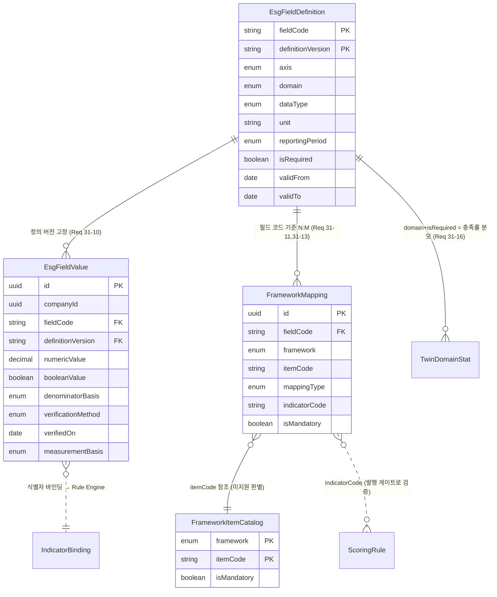

`EsgFieldValue → IndicatorBinding` 점선이 Rule Engine 진입점이다. 규칙 식은 `soc.safety.ltifr` 같은 식별자를 참조하고, 바인딩 계층이 그 식별자를 `(companyId, fieldCode, period)` 조회로 해석한다. LTIFR·TRIR은 이 지점에서 `normalizeRate`를 통과한 값이 바인딩되므로, 규칙 식은 분모 기준을 알 필요가 없다.

### 결정 6: Digital_Twin — 콘텐츠 주소화 스냅샷 (델타 아님)

**선택: 스냅샷.** 각 `TwinVersion`은 자신의 전체 노드 값 집합을 갖는다. 단, 값 본문은 콘텐츠 해시로 주소화된 `TwinValueBlob`에 저장하여 버전 간 동일 값을 물리적으로 공유한다.

델타를 기각하는 이유:

| 요건 | 스냅샷 | 델타 |
|---|---|---|
| Req 9-7 리포트 재현성 (임의 과거 버전 읽기) | O(1) 단일 조회 | 기원부터 재생(replay) 필요 |
| Req 7-9 점수 결정성 (트윈 버전 → 점수) | 직접 읽기 | 재생 로직 자체가 결정성 위험 요소 |
| Req 4-6 임의 두 버전 diff 10초 이내 | 두 집합 비교 | 중간 델타 전부 재생 후 비교 |
| Req 4-6 24개월 초과분 월말 버전만 보존 | 중간 버전 삭제 가능 | 삭제 시 체인이 끊겨 재생 불가 |

마지막 항목이 결정적이다. Req 4-6의 보존 규칙(월말 버전만 유지)은 델타 체인과 **원리적으로 양립할 수 없다**. 중간 델타를 지우면 이후 버전을 복원할 수 없다. 따라서 스냅샷이 선택이 아니라 필연이다.

```prisma
enum TwinVersionStatus { building partial active superseded }
enum NodeProvenance { user_input calculated estimated }   // Req 4-4

model DigitalTwin {
  id            String @id @default(uuid()) @db.Uuid
  companyId     String @db.Uuid @unique          // 회사당 1개
  activeVersionId String? @db.Uuid
  versions      TwinVersion[]
}

model TwinVersion {
  id           String @id @default(uuid()) @db.Uuid
  companyId    String @db.Uuid
  twinId       String @db.Uuid
  versionNo    Int                                // Req 4-1: 1부터 시작
  status       TwinVersionStatus @default(building)

  // 이 버전이 소비한 입력의 버전 식별자 (재현성의 근거)
  orgRevisionHigh   Int
  activityDataAsOf  DateTime
  calculationRunId  String? @db.Uuid
  factorSetVersionIds String[]

  createdAt    DateTime @default(now())
  createdByJobId String? @db.Uuid
  // Req 4-6: 보존 정책 판정용
  isMonthEndKeeper Boolean @default(false)

  nodeValues   TwinNodeValue[]
  domainStats  TwinDomainStat[]

  @@unique([companyId, twinId, versionNo])
  @@index([companyId, createdAt])
}

// Req 4-2: 12개 도메인별 데이터 충족률
model TwinDomainStat {
  twinVersionId   String @db.Uuid
  domain          TwinDomain                      // organization|site|facility|line|energy|emission|water|waste|supplychain|safety|human_rights|ethics
  // ★ Req 31-16: 분모 산출에 적용한 필드 정의 버전을 충족률과 함께 기록한다
  definitionVersion String
  requiredFields  Int                             // EsgFieldDefinition에서 파생 (하드코딩 아님)
  filledFields    Int                             // 추정치는 미충족 (Req 4-2)
  completenessPct Int                             // floor(filled/required*100)
  state           String                          // "ok" | "not_entered"  (Req 4-3)

  @@id([twinVersionId, domain])
}

model TwinNodeValue {
  twinVersionId String @db.Uuid
  companyId     String @db.Uuid
  nodePath      String                            // "energy.electricity.purchased_kwh" | "org.<orgNodeId>.scope1_tco2e"
  provenance    NodeProvenance
  blobHash      String @db.Char(64)               // → TwinValueBlob

  // Req 4-3: 추정치의 하한/상한 구간
  estimateLow   Decimal? @db.Decimal(38, 12)
  estimateHigh  Decimal? @db.Decimal(38, 12)
  estimateSampleSize Int?                          // Req 4-3: 5 이상일 때만 추정치 제시
  // Req 10-10 / 긴장 1의 freeze: AI 파생값의 출처
  sourceAiHistoryId String? @db.Uuid
  sourceRecordIds   String[]                       // 근거 저장 레코드 식별자 (Req 10-5)

  @@id([twinVersionId, nodePath])
  @@index([companyId, nodePath])
  @@index([twinVersionId, provenance])              // Req 4-4 / 4-11 필터링
}

// 콘텐츠 주소화 저장. 버전 간 동일 값을 물리적으로 1회만 저장한다.
model TwinValueBlob {
  hash      String @id @db.Char(64)               // sha256(canonicalJson(value))
  valueJson Json
  createdAt DateTime @default(now())
}
```

`TwinNodeValue`가 값 자체가 아니라 `blobHash`를 갖기 때문에, 60초 주기로 트윈 버전이 생성되어도(Req 4-5) 실제로 변한 노드의 blob만 새로 쓰인다. 나머지는 기존 blob을 재참조한다. 논리적으로는 완전 스냅샷, 물리적으로는 델타에 가까운 저장 효율을 얻는다.

**충족률 분모 확정 — 이전 초안이 막혀 있던 지점.** 이 설계의 이전 초안은 `TwinDomainStat.requiredFields`를 12개 도메인 중 9개까지만 채울 수 있었다. 에너지·배출·용수·폐기물처럼 활동량 항목 정의(`ActivityItemDef`)가 존재하는 도메인은 분모가 자연히 도출되었지만, **안전 / 인권 / 윤리 세 도메인은 필수 필드 목록이 어디에도 정의되어 있지 않았다.** 분모를 모르면 `completenessPct`를 계산할 수 없고, Req 4-2가 요구하는 12개 도메인 충족률이 9개로 줄어든다. 초안은 이 항목을 "차단(blocked) — 필수 필드 집합 미정의"로 표시했다.

**Req 31-16이 이 공백을 닫는다.** 결정 5b의 `EsgFieldDefinition`이 안전(LTIFR, TRIR, 사망사고 건수 등), 인권(인권 실사·강제노동·아동노동 여부 등), 윤리(윤리교육 건수, 부패 사건, 내부신고 등)의 필수 필드를 데이터로 확정하므로, 세 도메인의 분모도 나머지 아홉 개와 **동일한 방식으로** 도출된다.

`requiredFields`는 하드코딩하지 않는다. `EsgFieldDefinition`을 `domain`과 `isRequired`로 필터링한 개수다.

```sql
-- 도메인별 충족률 분모. 하드코딩 상수 없음. definitionVersion이 결과를 고정한다.
SELECT d.domain,
       count(*) AS required_fields,
       count(v.id) FILTER (
         WHERE v.id IS NOT NULL AND v."measurementBasis" = 'measured'
       ) AS filled_fields                                  -- Req 4-2: 추정치는 미충족
  FROM "EsgFieldDefinition" d
  LEFT JOIN "EsgFieldValue" v
    ON  v."fieldCode"         = d."fieldCode"
    AND v."definitionVersion" = d."definitionVersion"
    AND v."companyId"         = $1
    AND v."periodStart"      >= $2 AND v."periodEnd" <= $3
 WHERE d."isRequired" = true
   AND d."definitionVersion" = $4                          -- Req 31-16: 적용 정의 버전
 GROUP BY d.domain;
```

`TwinDomainStat.definitionVersion`이 이 쿼리의 `$4`를 그대로 보관하므로, 정의가 개정되어 필수 필드가 늘어나도 과거 트윈 버전의 충족률은 **당시 분모로 재현된다.** 정의 버전을 기록하지 않으면 Req 9-7의 리포트 재현성이 깨진다 — 같은 트윈 버전을 다시 읽었을 때 충족률이 달라지기 때문이다.

**기록: 12개 도메인 전부가 이제 해석 가능한 분모를 갖는다.** 초안이 차단으로 표시한 안전·인권·윤리 세 도메인의 분모 미정의 문제는 Req 31-16과 결정 5b로 해소되었으며, `TwinDomainStat`에 하드코딩된 도메인별 상수는 존재하지 않는다. Req 7-6의 점수 충족률 분모(Req 31-17)도 같은 테이블에서 도출되므로, 트윈 충족률과 점수 충족률이 서로 다른 분모를 쓰는 불일치도 함께 제거된다.

**diff 구현 (Req 4-6, 10초 이내).**

```sql
SELECT coalesce(a."nodePath", b."nodePath") AS node_path,
       CASE WHEN a."nodePath" IS NULL THEN 'added'
            WHEN b."nodePath" IS NULL THEN 'removed'
            ELSE 'changed' END AS change_kind,
       ba."valueJson" AS before_value, bb."valueJson" AS after_value
  FROM (SELECT * FROM "TwinNodeValue" WHERE "twinVersionId" = $1) a
  FULL OUTER JOIN (SELECT * FROM "TwinNodeValue" WHERE "twinVersionId" = $2) b
    ON a."nodePath" = b."nodePath"
  LEFT JOIN "TwinValueBlob" ba ON ba.hash = a."blobHash"
  LEFT JOIN "TwinValueBlob" bb ON bb.hash = b."blobHash"
 WHERE a."blobHash" IS DISTINCT FROM b."blobHash";
```

`blobHash` 비교만으로 변경 여부를 판정하므로 JSON 비교 비용이 없다.

**보존 정책 (Req 4-6).** `twin_retention` 야간 작업이 수행한다.

```
최신 버전 시각을 T라 할 때,
  createdAt >= T - 24개월           → 전부 보존
  createdAt <  T - 24개월           → 각 월의 마지막 버전만 보존 (isMonthEndKeeper = true)
그 외 버전은 삭제. 단 아래는 삭제 금지:
  - activeVersionId 로 참조 중
  - ReportSnapshotRef 에서 참조 중 (Req 9-7 재현성)
  - ScoreSnapshot 에서 참조 중 (Req 7-7 10년 시계열)
```

마지막 세 예외가 중요하다. 보존 정책이 리포트 재현성과 충돌하므로, **참조되는 버전은 보존 정책보다 우선한다**. `TwinVersion` 삭제는 참조 무결성 검사를 통과한 것만 수행한다.

### 결정 7: 점수 — 루브릭은 Rule Engine 규칙 세트, 스냅샷은 불변

이전 판의 `RubricIndicator`는 지표당 `weight` + `normalization` + `direction` + `scaleMin`/`scaleMax`를 데이터로 두었지만, **산식 자체는 코드에 있었다**(`sourceNodePath`가 가리키는 값을 코드가 어떻게 조합할지는 코드가 결정). Req 7-11과 Req 32-1은 이것을 거부한다. 산식이 코드에 있으면 공시 기준 개정이 배포를 요구한다.

**결정: `ScoreRubric`은 버전 컨테이너로 유지하되 그 역할을 "루브릭"에서 "규칙 세트(rule set)"로 바꾼다. `RubricIndicator`는 폐기하고, 산식을 데이터로 갖는 `ScoringRule`로 대체한다.**

```prisma
// 규칙 세트 = 특정 시점에 함께 적용되는 ScoringRule 집합의 버전 컨테이너
model ScoreRubric {
  id            String @id @default(uuid()) @db.Uuid
  version       String @unique                    // "2025.1" — 이하 ruleSetVersion
  effectiveFrom DateTime @db.Date
  // Req 미결정 8: 공개 수준. 지금은 축별 기여도까지 공개로 설정하고 설정값으로 둔다.
  disclosureLevel String @default("contribution") // "full" | "contribution"
  // Req 32-4: 이 규칙 세트의 산식이 준수하는 문법 버전. 문법 변경 시 저장된 AST 재검증 필요.
  grammarVersion Int    @default(1)
  rules         ScoringRule[]
}

// Req 32-1: 프레임워크·지표·국가·산업·규칙버전·유효기간·산식·가중치·정규화·방향
model ScoringRule {
  id             String @id @default(uuid()) @db.Uuid
  ruleSetVersion String
  framework      Framework
  axis           ScoreAxis                        // E | S | G
  indicatorCode  String                           // "e_ghg_intensity"
  countryCode    String?                          // null = 기본 (Req 32-10)
  industryCode   String?                          // null = 기본 (Req 32-10)

  // ★ 산식이 데이터다. formula 는 사람이 읽고 편집하는 원문,
  //   formulaAst 는 등록 시점에 파싱·검증을 통과한 AST.
  //   Req 32-5: 채점 시점에 신뢰할 수 없는 문자열을 다시 파싱하지 않는다.
  formula        String                           // "scope1 / revenue"
  formulaAst     Json                             // FormulaAst (판별 유니온 직렬화)

  weight         Decimal @db.Decimal(5, 4)        // Req 7-2: 소수 넷째 자리
  normalization  String                           // "absolute" | "per_revenue" | "per_production"
  direction      String                           // "higher_better" | "lower_better" (Req 28-7)
  scaleMin       Decimal @db.Decimal(24, 6)
  scaleMax       Decimal @db.Decimal(24, 6)

  validFrom      DateTime  @db.Date
  validTo        DateTime? @db.Date               // Req 32-3: 삭제 대신 종료일 설정
  isRequired     Boolean @default(true)           // Req 7-6 충족률 산정 대상

  @@index([ruleSetVersion, indicatorCode, industryCode, countryCode])
  @@index([framework, indicatorCode])
}
```

**중복 유효 기간 배제는 DB가 강제한다.** Req 32-12는 동일 지표·동일 차원·중복 유효 기간을 갖는 규칙의 등록 거부를 요구한다. 애플리케이션에서 "겹치는 규칙이 있는지 SELECT 후 INSERT"는 동시 삽입에 진다 — 두 트랜잭션이 서로의 미커밋 행을 보지 못하고 둘 다 통과한다. `EmissionFactor`에서 계수 유효 기간 중복을 배제 제약으로 막은 것과 동일한 방식을 쓴다.

```sql
-- Prisma 스키마로 표현되지 않으므로 마이그레이션에 직접 기술한다.
CREATE EXTENSION IF NOT EXISTS btree_gist;

ALTER TABLE "ScoringRule" ADD CONSTRAINT "scoring_rule_no_overlap"
  EXCLUDE USING gist (
    "ruleSetVersion" WITH =,
    "indicatorCode"  WITH =,
    -- NULL 차원을 sentinel 로 정규화해야 배제 제약이 성립한다(NULL WITH = 는 항상 통과).
    (COALESCE("countryCode",  '*')) WITH =,
    (COALESCE("industryCode", '*')) WITH =,
    daterange("validFrom", COALESCE("validTo", 'infinity'::date), '[)') WITH &&
  );
```

`COALESCE(..., '*')` 정규화가 핵심이다. `countryCode WITH =`만 쓰면 `NULL = NULL`이 성립하지 않아 기본 규칙끼리는 중복 검사를 통과해 버린다. 위반 시 Postgres가 `23P01`(exclusion_violation)을 던지고, 그것을 잡아 충돌 규칙 식별자 목록과 중복 기간으로 변환해 반환한다(Req 32-12).

**프레임워크 매핑.** `FrameworkMapping`의 정본 정의는 **결정 5b**에 있다(Req 31-11이 매핑 행에 `fieldCode`·`mappingType`·`mappingVersion`을 요구하므로 Core ESG 필드 카탈로그와 같은 자리에 두는 것이 옳다). 이 절에서 중요한 것은 그 모델이 채점 규칙을 **`indicatorId`(규칙 행 FK)가 아니라 `indicatorCode`(문자열)로 참조한다**는 점이다. 규칙은 국가·산업·기간별로 여러 행이 되지만 프레임워크 매핑은 지표 코드 하나에 대해 한 번만 성립하므로, 규칙 행 FK는 애초에 성립하지 않는다.

이 재지정이 만드는 검증 공백(매핑이 규칙 없는 지표 코드를 인용할 수 있음)과 그것을 봉쇄하는 **규칙 세트 발행 게이트**(`validateIndicatorCoverage`)는 결정 5b에서 다룬다. 발행 게이트가 통과했다는 전제 하에서만 아래 `ScoreSnapshot`과 커버리지 산출이 "매핑된 모든 지표 코드에 규칙이 있다"를 가정할 수 있다.

```prisma
model ScoreSnapshot {
  id             String @id @default(uuid()) @db.Uuid
  companyId      String @db.Uuid
  twinVersionId  String @db.Uuid
  rubricVersion  String
  // Req 32-13: 산출에 사용된 규칙 세트 버전. 과거 점수를 당시 규칙으로 설명·재현한다.
  ruleSetVersion String
  industryWeightSetId String?

  // Req 7-1: 내부 연속값 → 사사오입 정수
  scoreE         Int
  scoreS         Int
  scoreG         Int
  scoreTotal     Int
  rawE           Decimal @db.Decimal(8, 4)        // 감사 추적용 연속값
  rawS           Decimal @db.Decimal(8, 4)
  rawG           Decimal @db.Decimal(8, 4)
  rawTotal       Decimal @db.Decimal(8, 4)

  // Req 7-6
  dataCompletenessPct Int
  confidenceGrade     ConfidenceGrade             // high | medium | insufficient

  computedAt     DateTime @default(now())
  contributions  ScoreContribution[]

  // Req 7-9 + Req 32-13: 동일 (트윈버전, 루브릭, 규칙세트, 가중치세트) → 동일 결과.
  // 중복 스냅샷 생성 금지.
  @@unique([companyId, twinVersionId, rubricVersion, ruleSetVersion, industryWeightSetId])
  @@index([companyId, computedAt])
}

model ScoreContribution {
  scoreSnapshotId String @db.Uuid
  indicatorCode   String
  rawValue        Decimal? @db.Decimal(38, 12)    // null = 값 부재 (Req 7-3)
  normalizedValue Decimal? @db.Decimal(8, 4)
  weightOriginal  Decimal  @db.Decimal(5, 4)
  weightRenormalized Decimal @db.Decimal(5, 4)    // Req 7-3: 재정규화 후
  excluded        Boolean  @default(false)
  contributionPoints Decimal @db.Decimal(5, 1)    // Req 7-2: 소수 첫째 자리

  @@id([scoreSnapshotId, indicatorCode])
}
```

`@@unique([companyId, twinVersionId, rubricVersion, ruleSetVersion, industryWeightSetId])`가 Req 7-9의 멱등성을 DB 수준에서 강제한다. 재실행은 유일 제약 충돌로 no-op된다. `ruleSetVersion`을 유일 키에 포함시킨 것은 의도적이다 — 규칙 세트가 바뀌면 같은 트윈 버전에 대해서도 **다른** 점수가 정당하게 나오므로, 그것을 중복으로 판정해 기각하면 규칙 개정 후 재산출이 불가능해진다.

산식·가중치·정규화 기준·방향의 상세 설계는 아래 **ESG Rule Engine 설계** 절에 있다.

### 결정 8: 감사 로그 — 해시 체인 + 가명화

Req 19-2(수정·삭제 거부), Req 19-8(무결성 점검으로 누락·변경 감지), Req 19-5/24-12(삭제 요청에도 레코드는 보존하고 행위자만 가명화)를 만족해야 한다.

```prisma
model AuditLog {
  id            BigInt   @id @default(autoincrement())
  companyId     String?  @db.Uuid                  // 플랫폼 이벤트는 null
  // 회사별 독립 체인. 회사 A의 기록이 회사 B의 체인 검증에 영향을 주지 않게 한다.
  chainKey      String                             // companyId ?? 'platform'
  seq           BigInt                             // chainKey 내 1부터 단조 증가

  occurredAt    DateTime @db.Timestamptz(3)        // Req 19-1: UTC, 밀리초 정밀도
  eventType     String
  // Req 19-5: 삭제 요청 승인 시 이 컬럼만 가명 식별자로 교체된다
  actorId       String?  @db.Uuid
  actorPseudonym String?                            // "pseudo:<hmac>"
  actorPseudonymizedAt DateTime?

  resourceType  String
  resourceId    String?
  beforeValue   Json?                               // PII·자격정보 필드는 마스킹된 형태
  afterValue    Json?
  sourceIp      String?  @db.Inet

  // 위조 증거 (tamper evidence)
  prevHash      String   @db.Char(64)
  recordHash    String   @db.Char(64)

  @@unique([chainKey, seq])
  @@index([companyId, occurredAt])
  @@index([companyId, resourceType, eventType, occurredAt])
}

// Req 19-8: 24시간 주기 무결성 점검의 기준점
model AuditAnchor {
  chainKey   String
  anchoredAt DateTime @db.Timestamptz(3)
  lastSeq    BigInt
  lastHash   String   @db.Char(64)
  verifiedOk Boolean
  @@id([chainKey, anchoredAt])
}
```

해시 계산:

```ts
// core/audit/hash.ts
export function computeRecordHash(prevHash: string, rec: AuditPayload): string {
  // actorId는 해시 입력에서 제외한다. ★ 가명화가 체인을 깨지 않기 위한 핵심 결정.
  const canonical = canonicalJson({
    chainKey: rec.chainKey,
    seq: rec.seq.toString(),
    occurredAt: rec.occurredAt.toISOString(),
    eventType: rec.eventType,
    actorRef: rec.actorRefHash,        // HMAC(actorId, tenantPepper) — 가명화 후에도 불변
    resourceType: rec.resourceType,
    resourceId: rec.resourceId,
    beforeValue: rec.beforeValue,
    afterValue: rec.afterValue,
    sourceIpHash: rec.sourceIp ? sha256(rec.sourceIp) : null,
  });
  return sha256(prevHash + canonical);
}
```

**여기가 요구사항 간 긴장의 세 번째 지점이다.** Req 19-2는 감사 기록의 불변성을, Req 19-5/24-12는 행위자 식별정보의 사후 가명화를 요구한다. 그대로 두면 가명화 UPDATE가 해시 체인을 깬다.

해소: 해시 입력에 `actorId` 원문을 넣지 않고 `actorRefHash = HMAC(actorId, tenantPepper)`를 넣는다. `actorRefHash`는 처음부터 복원 불가능한 값이고 가명화 이후에도 변하지 않는다. 가명화는 `actorId → null`, `actorPseudonym → 'pseudo:' + actorRefHash` UPDATE만 수행하므로 체인이 유지된다. 삭제(Req 24-12) 대신 가명화라는 요구사항의 선택이 이 설계를 가능하게 한다.

체인 순번의 원자성은 `chainKey`별 advisory lock으로 확보한다.

```sql
SELECT pg_advisory_xact_lock(hashtextextended($1, 42));  -- $1 = chainKey
INSERT INTO "AuditLog" (...) VALUES (..., (SELECT coalesce(max(seq),0)+1 FROM "AuditLog" WHERE "chainKey" = $1), ...);
```

트랜잭션 범위 lock이므로 도메인 쓰기와 함께 커밋/롤백된다.

**append-only 강제.** 애플리케이션 규율이 아니라 권한으로 막는다.

```sql
REVOKE UPDATE, DELETE ON "AuditLog" FROM authenticated, anon, app_writer;
GRANT INSERT, SELECT ON "AuditLog" TO app_writer;

-- 가명화만 수행하는 전용 함수 (SECURITY DEFINER)
CREATE OR REPLACE FUNCTION pseudonymize_actor(p_actor uuid, p_pseudonym text)
RETURNS bigint LANGUAGE sql SECURITY DEFINER SET search_path = public AS $$
  WITH u AS (
    UPDATE "AuditLog" SET "actorId" = NULL,
           "actorPseudonym" = p_pseudonym,
           "actorPseudonymizedAt" = now()
     WHERE "actorId" = p_actor RETURNING 1)
  SELECT count(*) FROM u;
$$;
```

### 코어 클러스터 ERD

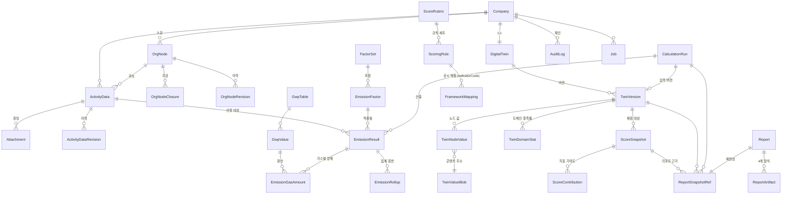

### 읽기 모델 (`EmissionRollup`)

Req 23-3(활동 데이터 100만 건에서 p95 500ms)은 대시보드가 `EmissionResult`를 직접 집계해서는 달성할 수 없다. 월 단위 사전 집계 테이블을 둔다.

```prisma
model EmissionRollup {
  companyId     String @db.Uuid
  orgNodeId     String @db.Uuid                   // 리프 노드 (부모는 폐쇄 테이블로 합산)
  periodMonth   DateTime @db.Date                 // 월초 날짜
  scope         Int
  scope2Method  Scope2Method?
  scope3Category Int?

  tco2e         Decimal @db.Decimal(38, 12)
  biogenicCo2T  Decimal @db.Decimal(38, 12) @default(0)
  energyMwh     Decimal @db.Decimal(38, 12) @default(0)
  waterM3       Decimal @db.Decimal(38, 12) @default(0)
  wasteT        Decimal @db.Decimal(38, 12) @default(0)

  // 재생성 가능성 추적: 이 값을 만든 산정 런들의 최댓값
  sourceRunAt   DateTime
  recordCount   Int

  @@id([companyId, orgNodeId, periodMonth, scope, scope2Method, scope3Category])
  @@index([companyId, periodMonth])
}
```

Rollup은 **파생 데이터**이며 언제든 `EmissionResult`로부터 완전 재생성 가능해야 한다. 이것이 진실의 출처를 하나로 유지하는 방법이다. 갱신은 산정 런 커밋과 **동일 트랜잭션**에서 영향받은 (노드, 월, scope) 조합만 재계산한다. 별도 작업으로 미루면 대시보드가 산정 결과와 어긋난 값을 보여주는 창이 생긴다.

Rollup과 `EmissionResult`의 일치는 야간 검증 작업이 확인한다(전체 재계산 후 비교). 불일치 발견 시 rollup을 재생성하고 운영자에게 통지한다.

### 기타 결정 (요약)

| 대상 | 결정 |
|---|---|
| 금액 | `BigInt` 최소통화단위 + `currencyCode`. `Decimal`조차 쓰지 않는다. Req 17-7이 정수 연산만을 요구하므로 타입이 그것을 표현해야 한다. 통화 혼합 합산은 `Money` 값 객체가 런타임에 거부한다. |
| Scope 3 결과 | `Scope3CategoryResult`에 `method`(spend/average/supplier_specific), `dataQualityGrade`(1~5), `coveragePct`, `deflatorApplied`를 저장. 카테고리별 append-only. |
| 중복 계상 (Req 12-8) | `Scope3DoubleCountCandidate` 테이블에 후보를 보류 상태로 적재. 사용자가 귀속 카테고리를 확정할 때까지 `excludedFromTotal = true`. 합계 쿼리가 이 플래그를 항상 필터한다. |
| 원장 (Req 17) | `LedgerEntry`는 복식 부기. 모든 금액 이동이 차변/대변 쌍으로 기록되고 `sum(amount) = 0`이 CHECK 제약으로 강제된다. 이것이 Req 17-6/17-13의 금액 보존을 구조적으로 보장한다. |
| 익명 레코드 | 별도 스키마 `commons`. `companyId` 컬럼 없음. `industryCodeMid`, `sizeBand`만 보유(Req 15-2). 공유 동의(`ShareConsent`)는 테넌트 스키마에 남고, 익명 레코드와의 연결은 **일방향 삽입 시점의 감사 기록으로만** 남긴다(재연결 불가). |
| 첨부 파일 | `Attachment`는 Supabase Storage 경로만 보유. 경로 규약 `{companyId}/{resourceType}/{resourceId}/{attachmentId}`로 Storage 정책이 경로 접두어로 테넌트를 판정할 수 있게 한다(Req 9-5 회사 경계 격리). |

---

## 정밀도와 계산 정확성

### 수치 타입 전략 (end-to-end)

| 구간 | 타입 | 비고 |
|---|---|---|
| PostgreSQL 저장 | `NUMERIC(p, s)` | 부동소수 컬럼 0개. `double precision`, `real` 사용 금지 |
| Prisma 모델 | `Decimal` (`@db.Decimal`) | Prisma는 `decimal.js` 인스턴스를 반환한다 |
| 애플리케이션 연산 | `Decimal` (decimal.js) | 전역 설정 `Decimal.set({ precision: 40, rounding: Decimal.ROUND_HALF_UP })` |
| JSON 경계(API 응답) | **문자열** | `Decimal.toFixed()`. `Number`로 직렬화하면 IEEE754 왕복에서 정밀도가 손실된다 |
| 금액 | `BigInt` 최소통화단위 | Req 17-7 |
| 표시 | `Number` 허용 | `Intl.NumberFormat` 입력 직전에만. 이미 반올림된 값 |

정밀도별 스케일 근거:

| 대상 | 타입 | 근거 |
|---|---|---|
| 활동량 원본 | `NUMERIC(24,6)` | Req 3-1: ≤999,999,999.999999, 소수 6자리 |
| 활동량 정규 환산값 | `NUMERIC(38,12)` | 단위 환산 후 자릿수 증가를 흡수 |
| 배출계수 | `NUMERIC(24,6)` | Req 6-1: ≤1,000,000, 소수 6자리 |
| 단위 환산 계수 | `NUMERIC(38,18)` | 유리수 나눗셈 결과 기록용 (감사 추적) |
| 순발열량 | `NUMERIC(24,9)` | TJ/Gg 단위에서 유효자리 확보 |
| 배출량 tCO2e | `NUMERIC(38,12)` | Req 5-8이 최소 6자리를 요구. 6자리에 정확히 맞추면 중간 합산에서 여유가 없다. **12자리로 6자리 여유를 둔다** |
| GWP | `NUMERIC(12,4)` | AR6 최대값 25,200 (SF6) 수용 |
| 점수 연속값 | `NUMERIC(8,4)` | Req 7-1: 소수 둘째 자리 계산 후 정수 확정 |
| 가중치 | `NUMERIC(5,4)` | Req 7-2: 소수 넷째 자리, 합계 1.0000 |

**`float`를 쓰지 않는 이유를 명시한다.** `double precision`은 (a) 결합법칙이 성립하지 않아 `SUM()`이 행 순서에 의존하고, (b) `0.1 + 0.2 ≠ 0.3`이므로 Req 5-12의 "절대 차이 0"을 원리적으로 만족할 수 없고, (c) Req 5-8의 1e-6 허용오차를 여러 만 건 합산 시 초과할 수 있다. 성능 이점은 이 시스템의 병목(I/O)과 무관하다.

### 반올림이 허용되는 지점

Req 5-8은 "모든 중간 계산과 집계는 반올림되지 않은 값으로 수행하고 반올림은 표시 및 보고 단계에서만 소수점 3자리로 적용"을 명시한다. 이를 코드 구조로 강제한다.

```ts
// core/domain/decimal.ts

/** 도메인 계산이 반환하는 값. 반올림되지 않았음을 타입으로 표시한다. */
export type Exact = Decimal & { readonly __brand: 'Exact' };

/** 표시/보고를 위해 반올림된 값. 계산 입력으로 사용할 수 없다. */
export type Presented = string & { readonly __brand: 'Presented' };

/** ★ Exact → Presented 로의 유일한 통로. */
export function present(v: Exact, decimals: 3 | 2 | 1 | 0 = 3): Presented {
  return v.toFixed(decimals, Decimal.ROUND_HALF_UP) as Presented;
}
```

`Presented`가 `string`이므로 산술 연산에 쓰면 컴파일 오류가 난다. 반올림된 값이 다시 계산에 들어가는 사고가 타입 시스템에서 막힌다. 도메인 계산 함수는 `Exact`만 주고받고, `present()`는 `ui/`와 `report/` 레이어에서만 호출한다(lint 규칙으로 `service/`, `domain/`에서 `present` import 금지).

### 정규 단위 환산

```ts
// core/domain/unit/convert.ts
export interface ConversionResult {
  readonly value: Exact;
  readonly unit: string;
  readonly factorNumerator: Decimal;
  readonly factorDenominator: Decimal;
  readonly conversionId: string | null;
}

export function toCanonical(
  value: Decimal, fromUnit: string, itemDef: ActivityItemDef, registry: UnitRegistry
): Result<ConversionResult, UnitError> {
  if (!itemDef.allowedUnits.includes(fromUnit)) {
    return err({ code: 'UNIT_NOT_ALLOWED_FOR_ITEM', unit: fromUnit, allowed: itemDef.allowedUnits });
  }
  if (fromUnit === itemDef.canonicalUnit) {
    return ok({ value: value as Exact, unit: fromUnit,
                factorNumerator: new Decimal(1), factorDenominator: new Decimal(1), conversionId: null });
  }
  const c = registry.find(fromUnit, itemDef.canonicalUnit);
  if (!c) return err({ code: 'NO_CONVERSION_PATH', from: fromUnit, to: itemDef.canonicalUnit });

  // ★ 유리수 곱셈. 소수 계수로 곱하지 않는다.
  const converted = value.times(c.numerator).dividedBy(c.denominator) as Exact;
  return ok({ value: converted, unit: itemDef.canonicalUnit,
              factorNumerator: c.numerator, factorDenominator: c.denominator, conversionId: c.id });
}
```

**왕복 불변성 (Req 26-5).** `metric → imperial → metric` 왕복이 최초 값과 일치해야 한다. 유리수 표현이면 `v × (n/d) × (d/n) = v`가 **정확히** 성립한다(decimal.js의 40자리 정밀도 내에서, 그리고 유리수 곱셈은 약분 가능하므로 실질적으로 무손실). 표시 시 유효숫자 6자리로 반올림하지만, 저장값은 변하지 않으므로 원래 단위계로 돌리면 동일 저장값에서 동일 표시값이 나온다. Req 26-5의 요구가 정확히 이것이다 — "단위계 변경은 저장값을 변경하지 않아".

### 산정 결정성과 멱등성

Req 5-12는 "동일한 활동량 데이터, 동일한 계수 세트 버전, 동일한 GWP 버전"에서 절대 차이 0을 요구한다. 결정성을 위협하는 요소를 열거하고 각각을 제거한다.

| 위협 | 제거 방법 |
|---|---|
| 부동소수 비결합성 | `NUMERIC`/`Decimal`만 사용 |
| `Date.now()`, 시간대 | 산정 함수는 시각을 인자로 받는다. 함수 내부에서 현재 시각을 읽지 않는다 |
| `Object.keys()` 순서 의존 | 가스 목록 등 순회 대상은 명시적 정렬 배열로 고정 |
| Map/Set 순회 순서 | 합산 전 `sort()` 적용. `NUMERIC` 합산은 순서 무관이지만 명시적 정렬로 로그·해시까지 결정적으로 만든다 |
| 계수 조회 시점 의존 | 조회 결과(`factorId`)를 결과 레코드에 고정 저장. 재산정은 저장된 `factorId`를 사용 |
| 병렬 처리 순서 | 병렬로 계산하되 결과를 `activityDataId` 기준으로 정렬 후 삽입 |
| AI 호출 | 결정 평면에서 금지 (lint R6) |
| 코드 변경 | `methodologyVersion`을 지문에 포함. 코드가 바뀌면 지문이 달라져 새 레코드가 생성되고, 과거 결과는 보존된다 |

지문(fingerprint):

```ts
export function emissionFingerprint(i: CalcInput): string {
  return sha256(canonicalJson({
    activityDataId: i.activityDataId,
    activityDataRevision: i.activityDataRevision,
    canonicalValue: i.canonicalValue.toFixed(12),     // ★ 문자열 고정. Decimal 객체는 직렬화가 불안정하다
    canonicalUnit: i.canonicalUnit,
    factorId: i.factorId,
    factorSetVersionId: i.factorSetVersionId,
    gwpVersion: i.gwpVersion,
    ncv: i.ncv?.toFixed(9) ?? null,
    scope2Method: i.scope2Method ?? null,
    methodologyVersion: METHODOLOGY_VERSION,
  }));
}
```

`canonicalJson`은 키 사전순 정렬 + 유니코드 정규화(NFC) + 배열 순서 보존 규약이다. `JSON.stringify` 직접 호출은 키 순서가 삽입 순서에 의존하므로 금지한다(lint 규칙).

### 집계 불변식을 구조로 보장하기

Req 5-8: `|부모 − Σ직계자식| ≤ 0.000001 tCO2e`.

이 불변식이 깨지는 전형적인 방식은 부모 값과 자식 값을 **서로 다른 경로로 계산**하는 것이다. 본 설계는 그 경로를 애초에 만들지 않는다.

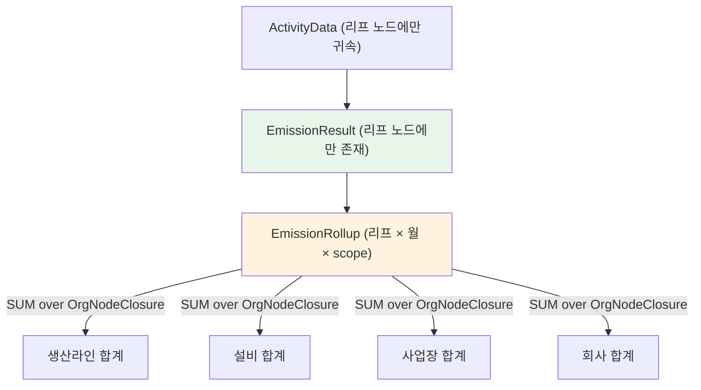

모든 수준의 값이 **동일한 리프 행 집합의 NUMERIC 합**이다. 따라서:

- 부모 = Σ(부모의 모든 후손 리프)
- Σ직계자식 = Σ(각 자식의 모든 후손 리프)
- 조직 트리에서 후손 리프 집합은 자식별로 분할(partition)이므로 두 값은 **동일한 항들의 합**이다.
- `NUMERIC` 덧셈은 정확하고 결합·교환법칙을 만족하므로 두 합은 **정확히 같다**. 차이 = 0.

즉 허용오차 1e-6은 여유로 남고, 설계는 0을 달성한다. 이것이 "희망하지 않고 구조로 보장한다"의 의미다.

이 보장이 유지되기 위한 불변 조건 세 개를 코드와 DB로 강제한다.

1. **`EmissionResult.orgNodeId`는 항상 리프.** CHECK 제약으로 확인한다.
   ```sql
   ALTER TABLE "EmissionResult" ADD CONSTRAINT er_leaf_only CHECK (
     NOT EXISTS (SELECT 1 FROM "OrgNode" c WHERE c."parentId" = "orgNodeId")
   );
   ```
   PostgreSQL CHECK는 서브쿼리를 허용하지 않으므로 실제로는 `BEFORE INSERT` 트리거로 구현한다. 또한 `ActivityData` 삽입 시 대상 노드가 리프가 아니면 Service가 거부하고, 사업장 직접 배출은 자동 생성된 `(사업장 직접)` 리프 노드로 유도한다.
2. **Scope 2 이중 계상 금지.** 합산 쿼리에 `scope2Method` 필터 필수. Repository 타입으로 강제.
3. **제외 플래그 일관 적용.** `status = 'computed'`, `excludedFromTotal = false` 필터를 모든 합산 경로에서 적용. 합산은 단 하나의 Repository 메서드(`sumTco2e`)만을 통해 수행하고, 다른 곳에서 `EmissionResult`에 직접 `SUM`을 쓰는 것을 lint로 금지한다.

---

## 멀티테넌시와 인가

### 3중 방어

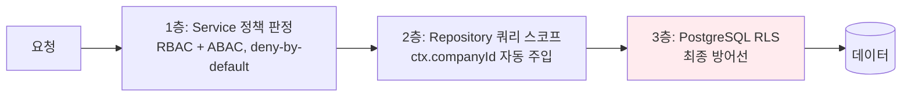

1층은 **권한**(이 사용자가 이 동작을 해도 되는가), 3층은 **격리**(이 행이 이 회사 것인가)를 담당한다. 1층의 버그가 데이터 유출로 이어지지 않는 것이 3층의 존재 이유다. Req 24-1이 "예외 없이 모든(100%)"을 요구하므로 새 테이블 추가 시 RLS 미적용을 CI가 검출한다.

### RLS 정책 패턴

Supabase 세션은 JWT를 갖는다. 사용자가 여러 회사에 소속될 수 있으므로(예: 컨설턴트, Auditor) JWT에 회사 목록을 넣는 대신 `Membership` 테이블을 조회하는 안정적 함수를 사용한다.

```sql
-- 요청자가 접근 가능한 companyId 집합. STABLE 이므로 쿼리 내에서 1회만 평가된다.
CREATE OR REPLACE FUNCTION app.current_company_ids()
RETURNS uuid[]
LANGUAGE sql STABLE SECURITY DEFINER SET search_path = public, app AS $$
  SELECT coalesce(array_agg(m."companyId"), '{}'::uuid[])
    FROM "Membership" m
   WHERE m."userId" = auth.uid()
     AND m.status = 'active'
     AND (m."expiresAt" IS NULL OR m."expiresAt" > now());   -- Req 19-3: Auditor 기한부 권한
$$;

-- Auditor 의 보고 기간 범위 (Req 19-3, 19-4)
CREATE OR REPLACE FUNCTION app.auditor_periods(p_company uuid)
RETURNS TABLE(period_start date, period_end date)
LANGUAGE sql STABLE SECURITY DEFINER SET search_path = public, app AS $$
  SELECT a."periodStart", a."periodEnd"
    FROM "AuditorAssignment" a
   WHERE a."auditorUserId" = auth.uid()
     AND a."companyId" = p_company
     AND a."revokedAt" IS NULL
     AND a."expiresAt" > now();
$$;
```

모든 테넌트 테이블에 적용하는 표준 정책:

```sql
ALTER TABLE "ActivityData" ENABLE ROW LEVEL SECURITY;
ALTER TABLE "ActivityData" FORCE ROW LEVEL SECURITY;   -- 테이블 소유자에게도 적용

-- 읽기
CREATE POLICY activity_data_select ON "ActivityData"
  FOR SELECT TO authenticated
  USING ("companyId" = ANY (app.current_company_ids()));

-- 쓰기: USING(기존 행) 과 WITH CHECK(신규 행) 을 모두 지정한다.
-- WITH CHECK 를 빠뜨리면 다른 회사 companyId 로의 UPDATE 가 통과한다. 흔한 사고다.
CREATE POLICY activity_data_insert ON "ActivityData"
  FOR INSERT TO authenticated
  WITH CHECK (
    "companyId" = ANY (app.current_company_ids())
    AND app.has_permission("companyId", 'activity_data:write')
    AND NOT app.is_period_locked("companyId", "periodStart", "periodEnd")   -- Req 19-9
  );

CREATE POLICY activity_data_update ON "ActivityData"
  FOR UPDATE TO authenticated
  USING ("companyId" = ANY (app.current_company_ids()))
  WITH CHECK (
    "companyId" = ANY (app.current_company_ids())
    AND app.has_permission("companyId", 'activity_data:write')
    AND NOT app.is_period_locked("companyId", "periodStart", "periodEnd")
  );

-- 삭제는 정책을 만들지 않는다 → deny-by-default 로 항상 거부 (soft delete 만 허용)
```

`FORCE ROW LEVEL SECURITY`와 "DELETE 정책 부재"가 중요하다. 후자는 Req 2-4(물리 삭제 대신 soft delete)를 DB 수준에서 보장한다.

**보고 기간 잠금 (Req 19-9).**

```sql
CREATE OR REPLACE FUNCTION app.is_period_locked(p_company uuid, p_start date, p_end date)
RETURNS boolean LANGUAGE sql STABLE SECURITY DEFINER SET search_path = public, app AS $$
  SELECT EXISTS (
    SELECT 1 FROM "ReportingPeriodLock" l
     WHERE l."companyId" = p_company
       AND l."releasedAt" IS NULL
       AND daterange(l."periodStart", l."periodEnd", '[]') && daterange(p_start, p_end, '[]')
  );
$$;
```

검증 의견 확정 시 `ReportingPeriodLock` 행이 삽입되고, 이후 해당 기간과 겹치는 활동량 쓰기가 RLS에서 거부된다. 잠금 해제는 사유·행위자·시각이 감사 기록으로 남는 전용 함수를 통해서만 가능하다.

**Auditor 범위 제한.** Auditor는 지정된 보고 기간 데이터만 읽을 수 있다(Req 19-3). `Membership`만으로는 표현되지 않으므로 기간 조건이 필요한 테이블에 추가 정책을 둔다.

```sql
CREATE POLICY activity_data_auditor_select ON "ActivityData"
  FOR SELECT TO authenticated
  USING (
    "companyId" = ANY (app.current_company_ids())
    AND (
      NOT app.has_role("companyId", 'Auditor')     -- Auditor 가 아니면 기간 제약 없음
      OR EXISTS (
        SELECT 1 FROM app.auditor_periods("companyId") p
         WHERE daterange(p.period_start, p.period_end, '[]')
               @> daterange("periodStart", "periodEnd", '[]')
      )
    )
  );
```

여러 SELECT 정책은 OR로 결합되므로, Auditor 제약을 강제하려면 기존 `activity_data_select` 정책 자체에 조건을 통합해야 한다. 실제 구현에서는 **테이블당 SELECT 정책을 정확히 1개**만 두고 그 안에서 역할 분기를 처리한다. 정책을 여러 개 두면 OR 결합으로 의도치 않은 허용이 생긴다.

### 세션 컨텍스트 주입

Prisma는 Supabase의 `auth.uid()`를 자동으로 갖지 않는다. 요청마다 세션 변수를 설정한다.

```ts
// core/db/client.ts
export async function withTenant<T>(
  ctx: AuthContext,
  fn: (tx: Prisma.TransactionClient) => Promise<T>,
): Promise<T> {
  return prisma.$transaction(async (tx) => {
    // RLS 판정에 사용되는 역할과 사용자 식별자를 트랜잭션 로컬로 설정
    await tx.$executeRaw`SELECT set_config('request.jwt.claim.sub', ${ctx.userId}, true)`;
    await tx.$executeRaw`SELECT set_config('role', 'authenticated', true)`;
    return fn(tx);
  });
}
```

`set_config(..., true)`의 세 번째 인자가 `true`이므로 트랜잭션 종료 시 자동 초기화된다. 커넥션 풀에서 다음 요청이 이전 요청의 컨텍스트를 물려받는 사고를 구조적으로 막는다. 이것을 `false`로 두면 커넥션 재사용 시 크로스 테넌트 유출이 발생한다.

### service_role 키 봉쇄 (Req 24-2)

| 키 | 사용 위치 | 강제 |
|---|---|---|
| `NEXT_PUBLIC_SUPABASE_ANON_KEY` | 브라우저 | RLS 적용됨. 공개 가능 |
| `SUPABASE_SERVICE_ROLE_KEY` | 워커 프로세스, 관리 작업 전용 | `NEXT_PUBLIC_` 접두어 없음 → Next.js가 클라이언트 번들에 넣지 않는다 |

추가 강제:
- `core/config/env.server.ts`는 파일 최상단에 `import 'server-only'`를 둔다. 클라이언트 컴포넌트에서 import하면 빌드가 실패한다.
- CI에 빌드 산출물 스캔 단계를 둔다: `.next/static/**`에서 서비스 롤 키의 앞 12자를 grep. 1건이라도 발견되면 배포 차단.
- 서비스 롤을 쓰는 코드 경로는 `core/db/admin-client.ts` 단일 모듈로 제한하고, 이 모듈의 import 허용 위치를 `worker/**`와 `features/admin/repository/**`로 lint에서 화이트리스트한다.

### RBAC + ABAC 결정 계층

```ts
// core/auth/policy.ts
export type Action = `${Resource}:${Verb}`;           // "activity_data:write"

export interface PolicyInput {
  readonly ctx: AuthContext;                          // userId, companyId, roles, mfaVerified, ip
  readonly action: Action;
  readonly resource: {
    companyId: string;
    orgNodePath?: string[];                           // ABAC: 조직 노드 범위 제한
    period?: { start: Date; end: Date };
    ownerUserId?: string;
  };
}

export type Decision =
  | { allow: true;  matchedRule: string }
  | { allow: false; reason: DenyReason; missing?: string[] };

/** ★ deny-by-default. 명시적 허용 규칙이 없으면 거부한다 (Req 24-2). */
export function decide(input: PolicyInput, rules: PolicyRule[]): Decision {
  // 1. 명시적 금지가 하나라도 매치되면 즉시 거부 (허용보다 우선)
  for (const r of rules) {
    if (r.effect === 'deny' && matches(r, input)) {
      return { allow: false, reason: 'EXPLICIT_DENY', missing: [r.id] };
    }
  }
  // 2. 허용 규칙 탐색
  for (const r of rules) {
    if (r.effect === 'allow' && matches(r, input)) return { allow: true, matchedRule: r.id };
  }
  // 3. 매치 없음 → 거부
  return { allow: false, reason: 'NO_MATCHING_ALLOW_RULE' };
}
```

역할별 허용 규칙(발췌):

| 역할 | 허용 | ABAC 제약 |
|---|---|---|
| Member | `activity_data:read/write`, `dashboard:read`, `report:read` | `orgNodePath`가 배정 범위 내 |
| Company_Admin | 위 + `member:invite`, `role:assign`, `subscription:manage`, `report:approve`, `auditor:assign` | 자기 회사 |
| Supplier | `proposal:write`, `product:write`, `demand:read` | `supplier.status = approved` (Req 14-8) |
| Auditor | `activity_data:read`, `emission:read`, `audit_log:read`, `audit_opinion:write` | `period ⊆ assignedPeriod` AND `now < expiresAt` (Req 19-3) |
| Super_Admin | `admin:*` | MFA 완료 AND IP 허용목록 AND 세션 유휴<15분 (Req 18-10) |

Copilot이 사용자를 대행할 때는 **새 권한을 만들지 않는다**. Req 13-1이 "UI와 동일한 Auth_Service 권한 판정 경로"를 요구하므로, Copilot의 도구 실행은 요청자의 `AuthContext`를 그대로 전달해 `decide()`를 통과한다. 별도 서비스 계정을 쓰면 권한 상승 취약점이 된다.

### 부정 테스트 의무 (Req 24-11)

Req 24-11은 RLS 부정 테스트가 없거나 실패하면 CI를 실패시키라고 요구한다. 테스트를 손으로 쓰면 새 테이블에서 빠진다. **생성**한다.

```ts
// tests/rls/cross-tenant.spec.ts
const TENANT_TABLES = await introspectTenantTables();   // companyId 컬럼을 가진 모든 테이블

describe.each(TENANT_TABLES)('RLS 격리: %s', (table) => {
  it('타 회사 행을 SELECT 로 읽을 수 없다', async () => {
    const rows = await asUser(userOfCompanyB).from(table).select('*').eq('companyId', companyA.id);
    expect(rows.data).toHaveLength(0);
  });

  it('타 회사 companyId 로 INSERT 할 수 없다', async () => {
    const r = await asUser(userOfCompanyB).from(table).insert(fixtureFor(table, companyA.id));
    expect(r.error?.code).toBe('42501');    // insufficient_privilege
  });

  it('타 회사 행을 UPDATE 할 수 없다', async () => { /* ... */ });
  it('RLS 가 활성화되어 있다', async () => {
    const { relrowsecurity, relforcerowsecurity } = await pgClass(table);
    expect(relrowsecurity).toBe(true);
    expect(relforcerowsecurity).toBe(true);
  });
});

// Req 24-1: 100% 커버리지. 새 테넌트 테이블이 추가되면 자동으로 이 스위트에 포함된다.
it('companyId 를 가진 모든 테이블이 검사되었다', () => {
  expect(TENANT_TABLES.length).toBe(countTablesWithCompanyIdColumn());
});
```

테이블 목록을 `information_schema`에서 introspect하므로 새 테이블 추가 시 테스트가 **자동으로 늘어난다**. 개발자가 잊을 수 없다. 이것이 "100%"를 실제로 유지하는 유일한 방법이다.

---

## AI 아키텍처

### AI_Adapter 포트

Req 27-1은 5개 역량 선언을 요구하고, Req 27-6은 미지원 역량 요청 시 **역량 축소 대체 호출 없이 거부**를 요구한다. 후자가 중요하다. 어댑터가 조용히 기능을 낮추면 호출자가 그것을 알 수 없다.

```ts
// core/ai/port.ts
export interface ProviderCapabilities {
  readonly streaming: boolean;
  readonly toolCalling: boolean;
  readonly structuredOutput: boolean;
  readonly visionInput: boolean;
  readonly maxContextTokens: number;
}

export type AiTaskType =
  | 'agent_recommend' | 'copilot_answer' | 'report_narrative'
  | 'benchmark_summary' | 'scenario_ranking' | 'pii_scan' | 'anonymize_check';

export interface AiTaskConfig {
  readonly taskType: AiTaskType;
  readonly providerPriority: readonly ProviderId[];    // Req 27-2, 18-4
  readonly model: string;
  readonly timeoutMs: number;                          // Req 27-2: 1000..120000, 기본 30000
  readonly temperature: number;                        // 0.0..2.0
  readonly seed: number | null;
  readonly requiresReproducibility: boolean;           // Req 27-3 → temperature 0, seed 고정
  readonly requiredCapabilities: readonly (keyof ProviderCapabilities)[];
}

export interface AiRequest<TOut = unknown> {
  readonly taskType: AiTaskType;
  readonly companyId: string;
  readonly messages: readonly AiMessage[];
  /** 구조화 출력이 필요하면 Zod 스키마를 넘긴다. 넘기면 structuredOutput 역량이 필수가 된다. */
  readonly outputSchema?: z.ZodType<TOut>;
  readonly tools?: readonly ToolDefinition[];
  readonly abortSignal?: AbortSignal;
}

export interface AiUsage {
  readonly provider: ProviderId;
  readonly model: string;
  readonly inputTokens: number;
  readonly outputTokens: number;
  readonly costMinorUnits: bigint;                     // Req 17-7 정수 연산
  readonly latencyMs: number;
}

export interface AiResult<TOut> {
  readonly output: TOut;
  readonly usage: AiUsage;
  readonly aiHistoryId: string;                        // Req 10-8: 추적 식별자
}

export interface AiAdapter {
  /** Req 27-1: 역량 조회 */
  capabilities(provider: ProviderId, model: string): ProviderCapabilities;

  /** Req 27-6: 미지원 역량이면 호출 없이 거부. 역량을 낮춘 대체 호출을 하지 않는다. */
  complete<TOut>(req: AiRequest<TOut>): Promise<Result<AiResult<TOut>, AiError>>;

  /** Req 13-3, 23-7: 스트리밍. TTFB 3초 목표 */
  stream(req: AiRequest<string>): Promise<Result<AsyncIterable<StreamChunk>, AiError>>;

  /** Req 27-9: 사전 비용 추정 */
  estimateCost(req: AiRequest<unknown>): Promise<Result<bigint, AiError>>;
}

export type AiError =
  | { code: 'CAPABILITY_UNSUPPORTED'; provider: ProviderId; missing: string[] }
  | { code: 'MODEL_UNAVAILABLE'; provider: ProviderId; model: string }
  | { code: 'SCHEMA_VALIDATION_FAILED'; attempts: 2; issues: z.ZodIssue[] }
  | { code: 'ALL_PROVIDERS_UNAVAILABLE'; tried: ProviderId[] }
  | { code: 'COST_CEILING_REACHED'; limitMinorUnits: bigint; usedMinorUnits: bigint }
  | { code: 'RESIDENCY_POLICY_EXCLUDED'; excluded: ProviderId[] }
  | { code: 'TIMEOUT'; provider: ProviderId; timeoutMs: number }
  | { code: 'CONTEXT_LIMIT_EXCEEDED'; limit: number; requested: number };
```

### 호출 파이프라인

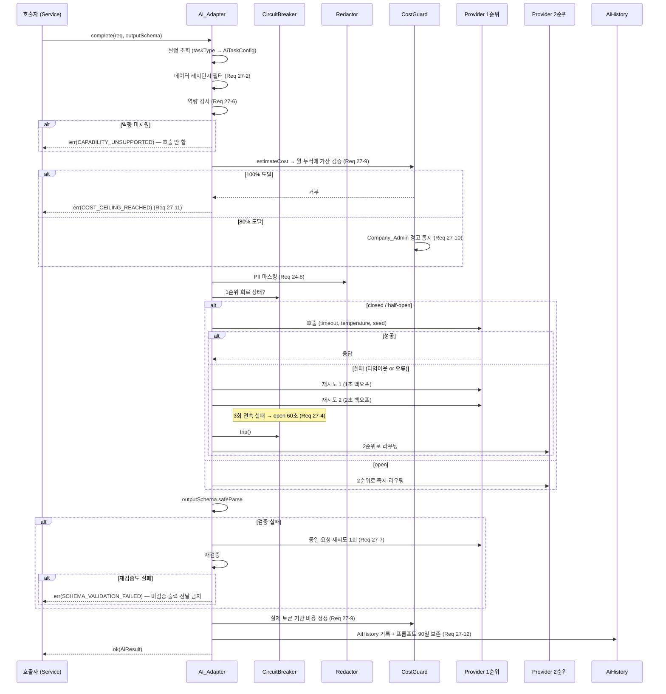

### 회로 차단기

```ts
// core/ai/circuit-breaker.ts
type CircuitState =
  | { kind: 'closed'; consecutiveFailures: number }
  | { kind: 'open'; openedAt: Date; reopenCount: number }
  | { kind: 'half_open'; trialSuccesses: number };      // Req 27-5: 3회 연속 성공 시 closed

const OPEN_DURATION_MS = 60_000;         // Req 27-4
const FAILURE_THRESHOLD = 3;             // Req 27-4: 최초 1회 + 재시도 2회
const HALF_OPEN_SUCCESS_TARGET = 3;      // Req 27-5
```

상태는 **DB에 저장**한다(`CircuitState` 테이블). Vercel 함수 인스턴스와 워커 프로세스가 여러 개이므로 인메모리 상태는 인스턴스별로 갈라져 Req 27-4의 "60초간 open"을 보장하지 못한다. 조회 비용을 줄이기 위해 5초 TTL 인메모리 캐시를 앞에 두되, `trip()` 시에는 즉시 DB에 쓰고 캐시를 무효화한다.

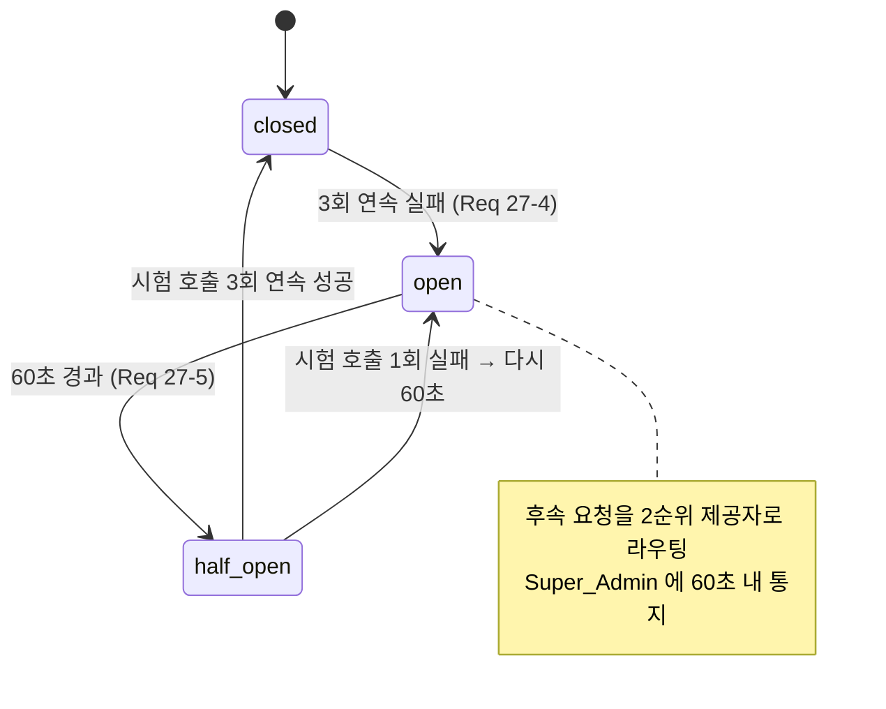

### 구조화 출력 검증

```ts
async function completeStructured<TOut>(
  req: AiRequest<TOut>, cfg: AiTaskConfig, provider: ProviderId,
): Promise<Result<TOut, AiError>> {
  const schema = req.outputSchema!;
  const issues: z.ZodIssue[] = [];

  for (let attempt = 0; attempt < 2; attempt++) {       // Req 27-7: 최대 1회 재시도
    const raw = await callProvider(provider, cfg, req, attempt === 1 ? repairHint(issues) : undefined);
    if (!raw.ok) return raw;
    const parsed = schema.safeParse(raw.value);
    if (parsed.success) return ok(parsed.data);
    issues.push(...parsed.error.issues);
  }
  // ★ 미검증 출력을 호출자에게 전달하지 않는다 (Req 27-7)
  return err({ code: 'SCHEMA_VALIDATION_FAILED', attempts: 2, issues });
}
```

### 비용 사전 추정과 정정

```prisma
model AiCostAccumulator {
  companyId       String @db.Uuid
  yearMonth       String                              // "2025-03"
  // 사전 예약(reserved)과 실제(actual)를 분리한다. 정정 시 예약을 해제하고 실제를 가산한다.
  reservedMinorUnits BigInt @default(0)
  actualMinorUnits   BigInt @default(0)
  currencyCode    String @db.Char(3)
  planCeilingMinorUnits BigInt
  warned80At      DateTime?                            // Req 27-10: 중복 경고 방지
  blockedAt       DateTime?                            // Req 27-11

  @@id([companyId, yearMonth])
}
```

```ts
async function reserve(tx: Prisma.TransactionClient, companyId: string, estimate: bigint) {
  const row = await tx.$queryRaw<Acc[]>`
    UPDATE "AiCostAccumulator"
       SET "reservedMinorUnits" = "reservedMinorUnits" + ${estimate}
     WHERE "companyId" = ${companyId} AND "yearMonth" = ${currentYearMonth()}
       AND "reservedMinorUnits" + "actualMinorUnits" + ${estimate} <= "planCeilingMinorUnits"
     RETURNING *`;
  if (row.length === 0) return err({ code: 'COST_CEILING_REACHED', ... });   // Req 27-11
  const used = row[0].reservedMinorUnits + row[0].actualMinorUnits;
  if (used * 100n >= row[0].planCeilingMinorUnits * 80n && !row[0].warned80At) {
    await enqueueWarning(tx, companyId, used, row[0].planCeilingMinorUnits);  // Req 27-10
  }
  return ok(row[0]);
}

async function settle(tx, companyId: string, estimate: bigint, actual: bigint) {
  await tx.$executeRaw`
    UPDATE "AiCostAccumulator"
       SET "reservedMinorUnits" = GREATEST(0, "reservedMinorUnits" - ${estimate}),
           "actualMinorUnits"   = "actualMinorUnits" + ${actual}
     WHERE "companyId" = ${companyId} AND "yearMonth" = ${currentYearMonth()}`;
}
```

한도 검사를 `WHERE` 절에 넣어 원자적으로 처리한다. 읽고-검사하고-쓰는 방식은 동시 호출에서 한도를 초과한다. 월 초기화(Req 27-11)는 `yearMonth`가 키에 포함되므로 새 월에 새 행이 생겨 자동으로 0에서 시작한다.

### PII 제거와 프롬프트 보존

```ts
// core/ai/redaction.ts
export interface RedactionResult {
  readonly text: string;
  readonly map: ReadonlyMap<string, string>;    // 가명 → 원문 (프로세스 메모리에만 존재)
  readonly detected: readonly PiiKind[];
}

const PII_RULES: readonly PiiRule[] = [
  { kind: 'email',        pattern: /[\w.+-]+@[\w-]+\.[\w.]+/g,          token: 'EMAIL' },
  { kind: 'phone_kr',     pattern: /01[016789][-\s]?\d{3,4}[-\s]?\d{4}/g, token: 'PHONE' },
  { kind: 'brn_kr',       pattern: /\d{3}-?\d{2}-?\d{5}/g,               token: 'BRN' },
  { kind: 'rrn_kr',       pattern: /\d{6}-?[1-4]\d{6}/g,                 token: 'RRN' },
  { kind: 'person_name',  source: 'entity_lookup',                       token: 'PERSON' },
  { kind: 'company_name', source: 'entity_lookup',                       token: 'ORG' },
];

/** Req 24-8: 제공자에게 전송하는 모든 페이로드에 적용. 복원 불가능한 가명으로 대체. */
export function redact(text: string, entities: TenantEntityIndex): RedactionResult {
  // 정규식 규칙 + 테넌트 엔터티 사전(사용자명, 회사명, 사업장명, 공급업체명) 매칭
  // 가명은 HMAC(원문, requestScopedSalt) 앞 8자 → 같은 요청 내 동일 엔터티는 같은 가명
  // 요청 종료 시 salt 폐기 → 사후 복원 불가
}
```

가명 salt를 **요청 범위**로 두는 것이 중요하다. 전역 salt를 쓰면 여러 요청의 프롬프트를 모아 상관 분석으로 엔터티를 식별할 수 있다. 요청 범위이면 동일 요청 안에서는 일관성(모델이 같은 사람을 같은 사람으로 인식)을 얻고, 요청 간 상관은 불가능하다.

프롬프트 보존(Req 27-12, 90일):

```prisma
model PromptRetention {
  id           String   @id @default(uuid()) @db.Uuid
  aiHistoryId  String   @db.Uuid @unique
  companyId    String   @db.Uuid
  taskType     String
  provider     String
  model        String
  requestedAt  DateTime
  // ★ 마스킹 이후의 텍스트만 저장한다. 원문은 어디에도 저장하지 않는다.
  redactedPrompt  Json
  redactedResponse Json
  expiresAt    DateTime                       // requestedAt + 90일
  @@index([expiresAt])
  @@index([companyId, requestedAt])
}
```

`expiresAt` 경과 행은 야간 작업이 삭제한다. 보존 대상이 마스킹 후 텍스트인 점이 중요하다 — 원문을 90일 보관하면 Req 24-8의 취지가 무의미해진다.

### ESG_Agent grounding 아키텍처

Req 10-2는 컨텍스트를 "소속 회사 식별자와 일치하는 저장 레코드의 조회·검색만으로" 구성하도록 제한하고, Req 10-10은 근거 레코드 식별자를 확인할 수 없는 정량 값을 **권고에서 제외**하도록 요구한다. 이것은 일반적인 RAG보다 강한 제약이다.

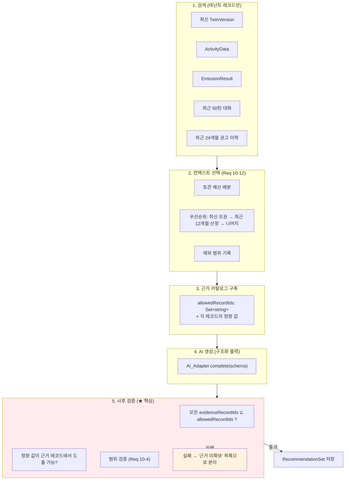

5단계 사후 검증이 Req 10-10을 만족시키는 유일한 방법이다. 프롬프트로 "근거를 붙여라"라고 지시하는 것만으로는 보장되지 않는다. 검증 코드:

```ts
// features/agent/domain/grounding.ts
export interface GroundingCatalog {
  /** 이 권고 생성에 제공된 레코드 식별자 전체. 여기에 없는 식별자는 환각이다. */
  readonly allowedRecordIds: ReadonlySet<string>;
  /** 식별자 → 그 레코드가 실제로 담고 있는 정량 값 */
  readonly quantities: ReadonlyMap<string, { tco2e?: Decimal; energyMwh?: Decimal; costMinor?: bigint }>;
}

export type GroundingVerdict =
  | { kind: 'grounded'; item: ActionItem }
  | { kind: 'ungrounded'; item: ActionItem; reason: UngroundedReason };

export function verifyGrounding(item: RawActionItem, cat: GroundingCatalog): GroundingVerdict {
  // Req 10-4: 근거 레코드 1개 이상
  if (item.evidenceRecordIds.length === 0) {
    return { kind: 'ungrounded', item, reason: 'NO_EVIDENCE_CITED' };
  }
  // Req 10-10: 인용된 모든 식별자가 실제 제공 레코드여야 한다
  const unknown = item.evidenceRecordIds.filter((id) => !cat.allowedRecordIds.has(id));
  if (unknown.length > 0) {
    return { kind: 'ungrounded', item, reason: 'HALLUCINATED_RECORD_ID' };
  }
  // Req 10-4: 정량 값 범위
  if (item.expectedReductionTco2e.lt('0.01') || item.expectedReductionTco2e.gt('9999999.99')) {
    return { kind: 'ungrounded', item, reason: 'QUANTITY_OUT_OF_RANGE' };
  }
  // Req 10-10: 감축량이 근거 레코드의 배출량을 초과할 수 없다 (물리적 상한)
  const base = item.evidenceRecordIds
    .map((id) => cat.quantities.get(id)?.tco2e ?? new Decimal(0))
    .reduce((a, b) => a.plus(b), new Decimal(0));
  if (base.gt(0) && item.expectedReductionTco2e.gt(base)) {
    return { kind: 'ungrounded', item, reason: 'REDUCTION_EXCEEDS_EVIDENCE_BASE' };
  }
  return { kind: 'grounded', item };
}
```

`REDUCTION_EXCEEDS_EVIDENCE_BASE` 검사가 실질적으로 가장 유용하다. AI가 "이 사업장에서 5,000 tCO2e를 줄일 수 있다"고 말했지만 근거 레코드의 총 배출량이 800 tCO2e라면 그 수치는 근거가 없다. 물리적 상한 검사만으로 상당수의 환각을 잡는다.

### 컨텍스트 예산 초과 처리 (Req 10-12)

```ts
const CONTEXT_BUDGET = [
  { source: 'latest_twin_version',      priority: 1, mandatory: true  },
  { source: 'emission_last_12_months',  priority: 2, mandatory: true  },
  { source: 'conversation_last_50',     priority: 3, mandatory: false },
  { source: 'recommendation_24_months', priority: 4, mandatory: false },
  { source: 'activity_data_detail',     priority: 5, mandatory: false },
] as const;

export function selectContext(sources: SourceBundle, maxTokens: number): ContextSelection {
  const budget = Math.floor(maxTokens * 0.75);     // 25% 는 출력용으로 예약
  const included: SourceRef[] = [];
  const excluded: ExcludedRange[] = [];
  let used = 0;

  for (const spec of CONTEXT_BUDGET) {
    const chunk = sources[spec.source];
    if (used + chunk.tokens <= budget) {
      included.push(chunk.ref); used += chunk.tokens;
    } else if (spec.mandatory) {
      // 필수 소스가 예산을 초과하면 잘라 넣되 잘린 범위를 기록한다
      const { kept, dropped } = truncate(chunk, budget - used);
      included.push(kept.ref); excluded.push(dropped.range); used = budget;
    } else {
      excluded.push(chunk.range);                  // Req 10-12: 제외 범위를 결과에 표시
    }
  }
  return { included, excluded, tokensUsed: used };
}
```

`excluded`는 `RecommendationSet.excludedContextRanges`에 저장되어 결과 화면에 표시된다(Req 10-12).

### freeze: AI 값이 결정 평면으로 넘어가는 유일한 통로

```ts
// features/twin/service/freeze-ai-value.ts
/**
 * AI 파생값을 트윈 버전에 불변으로 고정한다.
 * 이 함수를 통과한 이후 Score_Engine 은 AI 를 호출하지 않는다 (Req 7-9).
 */
export async function freezeAiDerivedValue(
  tx: Prisma.TransactionClient,
  args: {
    twinVersionId: string; companyId: string; nodePath: string;
    value: Decimal; low: Decimal; high: Decimal;
    sampleSize: number;                       // Req 4-3: 5 이상이어야 추정치 제시 가능
    aiHistoryId: string; evidenceRecordIds: string[];
  },
): Promise<Result<void, FreezeError>> {
  if (args.sampleSize < 5) return err({ code: 'SAMPLE_TOO_SMALL', required: 5 });   // Req 4-3
  if (args.evidenceRecordIds.length === 0) return err({ code: 'NO_EVIDENCE' });     // Req 10-10

  const blob = { value: args.value.toFixed(12), low: args.low.toFixed(12), high: args.high.toFixed(12) };
  const hash = sha256(canonicalJson(blob));
  await tx.twinValueBlob.upsert({ where: { hash }, create: { hash, valueJson: blob }, update: {} });
  await tx.twinNodeValue.create({
    data: {
      twinVersionId: args.twinVersionId, companyId: args.companyId, nodePath: args.nodePath,
      provenance: 'estimated',                  // Req 4-4 / Req 4-11 규제 공시에서 제외됨
      blobHash: hash,
      estimateLow: args.low, estimateHigh: args.high, estimateSampleSize: args.sampleSize,
      sourceAiHistoryId: args.aiHistoryId, sourceRecordIds: args.evidenceRecordIds,
    },
  });
  return ok(undefined);
}
```

`provenance = 'estimated'`가 자동으로 세 가지를 유발한다. (1) Req 4-2 데이터 충족률에서 미충족으로 계산됨, (2) Req 4-11 규제 공시용 산출물에서 제외됨, (3) Req 7-6 신뢰도 등급 계산에서 실측값으로 세지 않음. 프로비넌스를 단일 컬럼으로 통일한 덕에 세 요구사항이 한 곳에서 만족된다.

### Copilot: 도구 화이트리스트와 프롬프트 인젝션 방어

Req 13-1은 "사전 등록된 도구 목록에 포함된 도구만을 사용하여(자유 형식 질의문 생성 금지)"를 명시한다. 즉 **AI가 SQL이나 자유 질의를 생성하는 것을 금지**한다.

```ts
// features/copilot/domain/tools.ts
export interface ToolDefinition<P = unknown, R = unknown> {
  readonly name: string;
  readonly paramsSchema: z.ZodType<P>;        // AI 출력이 이 스키마를 통과해야 실행된다
  readonly requiredAction: Action;            // decide() 로 검사할 권한
  readonly mutates: boolean;                  // true → Req 13-6 사전 승인 필요
  readonly maxRows: number;                   // Req 13-9: 1000행 상한
  execute(ctx: AuthContext, params: P): Promise<Result<R, ToolError>>;
}

export const COPILOT_TOOLS: readonly ToolDefinition[] = [
  emissionSummaryTool,      // { orgNodeIds, periodStart, periodEnd, scopes } → 집계값
  activityDataQueryTool,    // { orgNodeIds, itemCodes, period, limit } → 행 목록
  scoreTrendTool,
  riskListTool,
  factorLookupTool,
  reportDraftSectionTool,   // mutates: false, 초안 텍스트 생성
  demandDraftTool,          // mutates: true → 승인 필요
];
```

파라미터가 Zod 스키마를 통과한 뒤 **타입이 확정된 함수**로 전달되므로, AI가 만들 수 있는 것은 정해진 파라미터 조합뿐이다. 쿼리 문자열을 만들 수 없다. 이것이 Req 13-1의 "자유 형식 질의문 생성 금지"를 구조로 만족시킨다.

**프롬프트 인젝션 방어 (Req 13-8).** 공급업체 제출 자료, 업로드 파일, 마켓플레이스 제안 본문이 Copilot 컨텍스트에 들어간다. 이 안에 지시문이 있으면 무시해야 한다.

```ts
// features/copilot/service/context-assembly.ts
type ContextBlock =
  | { trust: 'system';   content: string }    // 플랫폼 지시문
  | { trust: 'user';     content: string }    // 인증된 요청자의 질의
  | { trust: 'untrusted'; content: string; sourceRef: string };  // 외부 유입 콘텐츠

function assemble(blocks: readonly ContextBlock[]): AiMessage[] {
  return blocks.map((b) => {
    if (b.trust === 'untrusted') {
      return {
        role: 'user',
        // 1. 명시적 구조 분리. 지시문이 아니라 데이터임을 표시한다.
        content:
          `<untrusted_data source="${b.sourceRef}">\n` +
          // 2. 태그 위조 방지: 닫는 태그 유사 문자열을 이스케이프
          escapeTags(b.content) + `\n</untrusted_data>`,
      };
    }
    return { role: b.trust === 'system' ? 'system' : 'user', content: b.content };
  });
}
```

방어는 프롬프트 문구가 아니라 **실행 경계**에 있다. 인젝션이 성공해 모델이 다른 도구를 호출하려 해도:
1. 도구 이름이 화이트리스트에 없으면 실행되지 않는다.
2. 화이트리스트 도구라도 `decide(ctx, action, resource)`가 요청자 권한으로 판정된다. 인젝션은 `ctx`를 바꿀 수 없다(서버가 세션에서 만든 값이다).
3. `mutates: true` 도구는 사용자 승인 UI를 반드시 거친다(Req 13-6).

따라서 인젝션의 최대 피해는 "요청자가 이미 볼 수 있는 데이터를 요청자에게 다르게 서술하는 것"으로 제한된다. 추가로 응답에 인젝션 탐지 사실을 표기한다(Req 13-8): 휴리스틱(명령형 지시 패턴 + 도구/권한 언급)으로 탐지하고 `injectionDetected: true`를 응답 메타에 담는다.

---

## Scenario_Simulator 설계

### 미결정 사항 #11 해소: 규칙 기반 생성 + AI 순위화

요구사항 미결정 #11은 "AI 모델이 시나리오를 직접 생성하는지, 규칙 기반 조합 생성 후 AI가 평가·순위화하는지"를 묻는다.

**결정: 규칙 기반 조합 생성 + 실행가능성 필터링 + 결정적 시딩. AI는 순위화와 설명에만 사용한다.**

Req 11-13이 "동일한 입력 데이터와 동일한 가정값 및 동일한 난수 시드에 대해 동일한 Scenario 집합"을 요구하므로 AI 직접 생성은 **요구사항 위반**이다. 논쟁의 여지가 없다. 또한 Req 11-3의 모든 수치(투자비, 절감액, ROI, 회수기간, 감축량, 점수 변화량)는 감사 가능해야 하며 AI가 발명한 숫자는 Req 10-10의 정신과 충돌한다.

AI의 역할은 다음으로 한정한다.
- 상위 시나리오에 대한 **서술형 설명** 생성 (`AI 생성` 라벨 부착).
- 정성적 요소(실행 난이도, 조직 수용성)를 반영한 **보조 순위** 제시. 단 Req 11-5가 요구하는 3개 정렬 기준(감축량/ROI/회수기간)은 결정적 계산값으로만 산출한다.

### 조치 카탈로그

Req 11-2가 요구하는 8개 조치 유형을 데이터로 정의한다. 계수를 코드에 넣으면 국가·연도별 갱신마다 배포가 필요하다.

```prisma
enum MeasureType {
  solar_pv ess led_lighting biofuel_switch
  recycled_material eco_packaging ev_transition supplier_switch
}

model MeasureCatalog {
  id            String @id @default(uuid()) @db.Uuid
  measureType   MeasureType
  countryCode   String  @db.Char(2)
  version       String

  // 대상 배출원 (Req 11-4 중복 방지의 근거)
  targetScope   Int
  targetItemCodes String[]                           // 이 조치가 영향을 주는 활동 항목

  // 규모 단위와 허용 규모 구간 (조합 폭발을 통제하는 이산화 격자)
  sizeUnit      String                               // "kWp", "kWh", "unit", "pct", "vehicle"
  sizeSteps     Decimal[] @db.Decimal(18, 4)         // 예: [50, 100, 200, 500, 1000]

  // 공학 계수
  capexPerUnitMinor   BigInt                         // 단위당 투자비 (최소통화단위)
  opexRatePerYear     Decimal @db.Decimal(6, 4)      // Req 11-11: 유지보수 비율
  lifetimeYears       Int                            // Req 11-11: 설비 수명
  // 대상 항목 소비량의 저감 비율. 순차 적용의 기본 단위 (Req 11-4)
  reductionRate       Decimal @db.Decimal(6, 4)      // 0.0000~1.0000
  // 자체 생산량 기반 조치(태양광 등)를 위한 생산 계수
  yieldPerUnitPerYear Decimal? @db.Decimal(18, 6)    // kWh/kWp/year

  // 실행가능성 제약 소요량 (Req 11-1)
  areaPerUnitM2       Decimal? @db.Decimal(18, 6)
  gridCapacityPerUnitKw Decimal? @db.Decimal(18, 6)
  requiresFuelSupply  String?

  // 상호 배타 그룹 (Req 11-2)
  exclusionGroup      String?                        // 같은 그룹의 두 조치는 동일 설비에 공존 불가

  @@unique([measureType, countryCode, version])
}
```

### 실행가능성 제약과 상호 배타

```ts
// features/scenario/domain/feasibility.ts
export interface SiteCapacity {
  readonly orgNodeId: string;
  readonly installableAreaM2: Decimal;        // Req 11-1: 설치 가능 면적
  readonly spareGridCapacityKw: Decimal;      // Req 11-1: 전력 계통 여유 용량
  readonly availableFuels: ReadonlySet<string>; // Req 11-1: 연료·원료 조달 가능성
}

export interface MeasureInstance {
  readonly catalogId: string;
  readonly measureType: MeasureType;
  readonly orgNodeId: string;
  readonly size: Decimal;
  readonly targetItemCodes: readonly string[];
  readonly exclusionGroup: string | null;
}

/** Req 11-1: 제약을 모두 만족하는지. 조합 단위로 판정한다(자원은 공유되므로). */
export function isFeasible(
  combo: readonly MeasureInstance[], caps: ReadonlyMap<string, SiteCapacity>,
): Result<void, FeasibilityViolation> {
  const areaUsed = new Map<string, Decimal>();
  const gridUsed = new Map<string, Decimal>();

  for (const m of combo) {
    const cap = caps.get(m.orgNodeId);
    if (!cap) return err({ code: 'NO_CAPACITY_DATA', orgNodeId: m.orgNodeId });
    const cat = catalog.get(m.catalogId)!;

    if (cat.areaPerUnitM2) {
      const next = (areaUsed.get(m.orgNodeId) ?? ZERO).plus(cat.areaPerUnitM2.times(m.size));
      if (next.gt(cap.installableAreaM2)) return err({ code: 'AREA_EXCEEDED', orgNodeId: m.orgNodeId });
      areaUsed.set(m.orgNodeId, next);
    }
    if (cat.gridCapacityPerUnitKw) {
      const next = (gridUsed.get(m.orgNodeId) ?? ZERO).plus(cat.gridCapacityPerUnitKw.times(m.size));
      if (next.gt(cap.spareGridCapacityKw)) return err({ code: 'GRID_EXCEEDED', orgNodeId: m.orgNodeId });
      gridUsed.set(m.orgNodeId, next);
    }
    if (cat.requiresFuelSupply && !cap.availableFuels.has(cat.requiresFuelSupply)) {
      return err({ code: 'FUEL_UNAVAILABLE', fuel: cat.requiresFuelSupply });
    }
  }

  // Req 11-1/11-2: 동일 설비를 대상으로 하는 상호 배타 조치 조합 제외
  const seen = new Set<string>();
  for (const m of combo) {
    if (!m.exclusionGroup) continue;
    const key = `${m.orgNodeId}::${m.exclusionGroup}`;
    if (seen.has(key)) return err({ code: 'MUTUALLY_EXCLUSIVE', orgNodeId: m.orgNodeId, group: m.exclusionGroup });
    seen.add(key);
  }
  return ok(undefined);
}
```

### 결정적 생성 알고리즘

Req 11-1은 최소 500개, 최대 2000개를 요구한다. 조합 수는 `Σ_{k=1..5} C(n, k) × Π(규모 단계)`로 폭발한다. 결정적 축소가 필요하다.

```ts
// features/scenario/domain/generate.ts
const MIN_SCENARIOS = 500;
const MAX_SCENARIOS = 2000;

export interface GenerationInput {
  readonly companyId: string;
  readonly candidates: readonly MeasureInstance[];   // 실행가능 조치 인스턴스 (개별 검증 통과)
  readonly capacities: ReadonlyMap<string, SiteCapacity>;
  readonly seed: bigint;                             // Req 11-13
}

export function generateScenarios(input: GenerationInput): Result<ScenarioSet, GenerationError> {
  // 1. 후보를 결정적으로 정렬한다. 입력 순서에 의존하면 재현성이 깨진다.
  const sorted = [...input.candidates].sort((a, b) =>
    a.orgNodeId.localeCompare(b.orgNodeId) ||
    a.measureType.localeCompare(b.measureType) ||
    a.size.comparedTo(b.size));

  // 2. 결정적 PRNG. Math.random() 절대 사용 금지.
  const rng = splitmix64(input.seed);

  const out = new Map<string, Scenario>();           // canonicalKey → Scenario (Req 11-2 중복 제거)

  // 3. 크기 1~2 조합은 전수 열거 (설명 가능성 확보, 결정적)
  for (const combo of enumerateExhaustive(sorted, 1, 2)) {
    if (isFeasible(combo, input.capacities).ok) tryAdd(out, combo);
  }

  // 4. 크기 3~5 조합은 시드 기반 층화 표본. 상한 도달까지.
  for (let k = 3; k <= 5 && out.size < MAX_SCENARIOS; k++) {
    const quota = Math.floor((MAX_SCENARIOS - out.size) / (6 - k));
    let attempts = 0;
    while (out.size < MAX_SCENARIOS && attempts < quota * 20) {
      attempts++;
      const combo = sampleWithoutReplacement(sorted, k, rng);   // rng 만 사용 → 재현 가능
      if (isFeasible(combo, input.capacities).ok) tryAdd(out, combo);
    }
  }

  if (out.size < MIN_SCENARIOS) {
    // Req 11-7: 데이터가 부족해 최소 개수를 만들 수 없으면 실행하지 않고 오류
    return err({ code: 'INSUFFICIENT_FEASIBLE_COMBINATIONS', generated: out.size, required: MIN_SCENARIOS });
  }

  // 5. 결과를 canonicalKey 로 정렬해 반환 (Map 순회 순서에 의존하지 않는다)
  return ok({ scenarios: [...out.values()].sort(byCanonicalKey), seed: input.seed });
}

/** Req 11-2: 조치 유형 집합과 도입 규모가 모두 동일한 중복 시나리오는 1개만 유지 */
function canonicalKey(combo: readonly MeasureInstance[]): string {
  return combo
    .map((m) => `${m.measureType}|${m.orgNodeId}|${m.size.toFixed(4)}`)
    .sort()                        // ★ 정렬. 조합의 순서는 시나리오 정체성에 영향을 주지 않는다.
    .join('&');
}
```

`splitmix64`를 직접 구현하는 이유: Node의 `Math.random()`은 시드를 받을 수 없고, 플랫폼/버전에 따라 구현이 다를 수 있다. Req 11-13의 재현성은 PRNG 알고리즘이 코드에 고정되어야 성립한다.

### 순차 적용 보정 (Req 11-4)

동일 배출원에 2개 이상 조치가 적용되면 단순 합산은 이중 계상이다. 예: LED 교체(전력 −15%)와 태양광(전력 자가 생산 300 MWh)이 같은 사업장의 구매 전력에 적용되면, LED로 이미 줄어든 전력에 태양광을 적용해야 한다.

```ts
// features/scenario/domain/reduction.ts
export interface ReductionBreakdown {
  readonly correctedTco2e: Exact;        // 순차 적용 보정 후
  readonly naiveSumTco2e: Exact;         // 단순 합산
  readonly overlapTco2e: Exact;          // Req 11-4: 보정으로 줄어든 차이값
  readonly perMeasure: readonly { catalogId: string; attributedTco2e: Exact }[];
}

export function computeReduction(
  combo: readonly MeasureInstance[],
  baseline: ReadonlyMap<string, BaselineSource>,   // itemCode+orgNodeId → { consumption, emissionFactor }
): ReductionBreakdown {
  // ★ 결정적 적용 순서. measureType 의 고정 서열 → orgNodeId → size.
  //   이 순서가 흔들리면 같은 조합이 다른 감축량을 낸다 (Req 11-13 위반).
  const ordered = [...combo].sort((a, b) =>
    MEASURE_ORDER[a.measureType] - MEASURE_ORDER[b.measureType] ||
    a.orgNodeId.localeCompare(b.orgNodeId) ||
    a.size.comparedTo(b.size));

  // 잔여 소비량 테이블. 조치를 적용할 때마다 감소한다.
  const residual = new Map<string, Decimal>();
  for (const [k, v] of baseline) residual.set(k, v.consumption);

  const perMeasure: { catalogId: string; attributedTco2e: Exact }[] = [];
  let corrected = new Decimal(0);
  let naive = new Decimal(0);

  for (const m of ordered) {
    const cat = catalog.get(m.catalogId)!;
    let mCorrected = new Decimal(0);
    let mNaive = new Decimal(0);

    for (const item of cat.targetItemCodes) {
      const key = `${m.orgNodeId}|${item}`;
      const base = baseline.get(key);
      if (!base) continue;

      const remaining = residual.get(key) ?? new Decimal(0);

      // 감축 대상 소비량: 비율형은 잔여량에 비례, 생산형은 절대량(잔여량 상한)
      const reducible = cat.yieldPerUnitPerYear
        ? Decimal.min(cat.yieldPerUnitPerYear.times(m.size), remaining)   // 태양광: 잔여 구매 전력 한도
        : remaining.times(cat.reductionRate);                             // LED: 잔여량의 비율

      mCorrected = mCorrected.plus(reducible.times(base.emissionFactorTPerUnit));
      // 단순 합산: 잔여량이 아니라 원래 baseline 에 적용 (보정 전 값)
      const naiveReducible = cat.yieldPerUnitPerYear
        ? Decimal.min(cat.yieldPerUnitPerYear.times(m.size), base.consumption)
        : base.consumption.times(cat.reductionRate);
      mNaive = mNaive.plus(naiveReducible.times(base.emissionFactorTPerUnit));

      residual.set(key, remaining.minus(reducible));                      // ★ 잔여량 갱신
    }
    perMeasure.push({ catalogId: m.catalogId, attributedTco2e: mCorrected as Exact });
    corrected = corrected.plus(mCorrected);
    naive = naive.plus(mNaive);
  }

  return {
    correctedTco2e: corrected as Exact,
    naiveSumTco2e: naive as Exact,
    overlapTco2e: naive.minus(corrected) as Exact,   // Req 11-4: 함께 표시
    perMeasure,
  };
}
```

이 구조는 세 가지 성질을 보장한다. (1) `correctedTco2e ≤ naiveSumTco2e` (항상. 잔여량이 baseline 이하이므로). (2) `correctedTco2e ≤ Σ baseline 배출량` (잔여량이 음수가 될 수 없으므로 물리적 상한 준수). (3) 조합 순서를 바꿔도 같은 결과(정렬을 강제하므로). 세 성질 모두 속성 기반 테스트 대상이다.

### 재무 모델

Req 11-3은 ROI를 "분석 기간 동안 할인된 순현금흐름 합계를 초기 투자비로 나눈 비율"로 정의한다. 정의가 명확하므로 그대로 구현한다.

```ts
// features/scenario/domain/finance.ts
export interface AssumptionSet {
  readonly electricityPriceMinorPerKwh: bigint;   // Req 11-11: 0 초과
  readonly discountRatePct: Decimal;               // 0..30
  readonly lifetimeYears: number;                  // 1..40
  readonly maintenanceRatePct: Decimal;            // 0..20
  readonly analysisYears: number;                  // 1..30
  readonly currencyCode: string;                   // Req 11-3: 단일 통화
  readonly provenance: ReadonlyMap<keyof AssumptionSet, AssumptionProvenance>;
}

export interface AssumptionProvenance {
  readonly source: string;                         // "KEPCO 2024 산업용 을 고압A", "user_override"
  readonly isCountryDefault: boolean;              // Req 11-11: 국가별 기본값 적용 여부
  readonly asOf: Date;
}

export interface FinanceResult {
  readonly capexMinor: bigint;
  readonly annualNetSavingMinor: bigint;
  readonly roi: Decimal;                           // 할인 순현금흐름 합계 / capex
  readonly npvMinor: bigint;
  readonly paybackMonths: number | 'not_recoverable';  // Req 11-3: 1..600, 초과 시 회수 불가
}

export function evaluateFinance(
  combo: readonly MeasureInstance[], reduction: ReductionBreakdown, a: AssumptionSet,
): FinanceResult {
  let capex = 0n;
  let annualOpex = 0n;
  let annualGrossSaving = 0n;

  for (const m of combo) {
    const cat = catalog.get(m.catalogId)!;
    const unitCapex = cat.capexPerUnitMinor * BigInt(m.size.toFixed(0));
    capex += unitCapex;
    // 유지보수: 투자비 × 비율. 정수 연산 유지 (Req 17-7 정신)
    annualOpex += (unitCapex * BigInt(a.maintenanceRatePct.times(100).toFixed(0))) / 10_000n;
  }
  for (const pm of reduction.perMeasure) {
    annualGrossSaving += savedEnergyToMoney(pm, a);   // 절감 에너지 × 단가
  }
  const annualNet = annualGrossSaving - annualOpex;

  // 할인 순현금흐름 합계
  const r = a.discountRatePct.dividedBy(100);
  let discounted = new Decimal(0);
  for (let y = 1; y <= a.analysisYears; y++) {
    const cf = y <= a.lifetimeYears ? new Decimal(annualNet.toString()) : new Decimal(0);
    discounted = discounted.plus(cf.dividedBy(new Decimal(1).plus(r).pow(y)));
  }

  const roi = capex === 0n ? new Decimal(0) : discounted.dividedBy(new Decimal(capex.toString()));
  const npvMinor = BigInt(discounted.minus(new Decimal(capex.toString())).toFixed(0));

  // Req 11-3: 회수기간 = 초기 투자비 / 월평균 순절감액
  let payback: number | 'not_recoverable' = 'not_recoverable';
  if (annualNet > 0n) {
    const months = Math.ceil(Number((capex * 12n * 1000n) / annualNet) / 1000);
    payback = months >= 1 && months <= 600 ? months : 'not_recoverable';
  }
  return { capexMinor: capex, annualNetSavingMinor: annualNet, roi, npvMinor, paybackMonths: payback };
}
```

### 생성과 평가의 분리 — 30초 재계산 경로 (Req 11-8, 11-12)

Req 11-12는 가정값 변경 시 "신규 Scenario 생성 없이 기존 Scenario 집합에 대해 30초 이내 재계산"을 요구한다. 이것은 생성과 평가가 **분리된 함수**여야 함을 의미한다.

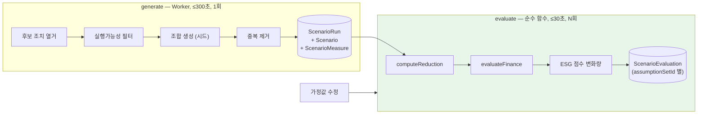

```prisma
model ScenarioRun {
  id            String @id @default(uuid()) @db.Uuid
  companyId     String @db.Uuid
  seed          BigInt                              // Req 11-13: 결과와 함께 반환
  catalogVersion String
  twinVersionId String @db.Uuid
  baselineCalculationRunId String @db.Uuid
  scenarioCount Int
  createdAt     DateTime @default(now())
  scenarios     Scenario[]
  evaluations   ScenarioEvaluation[]
}

model Scenario {
  id            String @id @default(uuid()) @db.Uuid
  companyId     String @db.Uuid
  scenarioRunId String @db.Uuid
  canonicalKey  String                              // Req 11-2 중복 제거 키
  measures      ScenarioMeasure[]
  @@unique([scenarioRunId, canonicalKey])
}

model ScenarioEvaluation {
  scenarioId      String @db.Uuid
  assumptionSetId String @db.Uuid                   // 가정값 세트별로 별도 평가 행
  reductionTco2e  Decimal @db.Decimal(38, 12)
  naiveSumTco2e   Decimal @db.Decimal(38, 12)       // Req 11-4
  capexMinor      BigInt
  annualNetSavingMinor BigInt
  roi             Decimal @db.Decimal(12, 6)
  npvMinor        BigInt
  paybackMonths   Int?                              // null = 회수 불가
  scoreDelta      Decimal @db.Decimal(5, 1)         // Req 11-3: -100.0 ~ +100.0
  currencyCode    String  @db.Char(3)
  computedAt      DateTime @default(now())

  @@id([scenarioId, assumptionSetId])
  @@index([scenarioId])
}
```

재계산은 `Scenario`/`ScenarioMeasure`를 그대로 두고 새 `assumptionSetId`로 `ScenarioEvaluation` 행만 삽입한다. 2000개 시나리오 × 순수 계산은 30초 안에 여유롭게 끝난다(계산은 산술뿐이고 DB 왕복이 1회의 벌크 삽입이다). Req 11-12의 "이전 가정값 기준 결과와의 차이"는 두 `assumptionSetId`의 평가 행을 조인해 제시한다.

### 점수 변화량 (Req 11-3)

`scoreDelta`는 Score_Engine의 채점 기준을 재사용해야 한다. AI로 추정하면 Req 11-3 위반이다.

```ts
// features/scenario/service/score-delta.ts
export function computeScoreDelta(
  base: ScoreSnapshot, contributions: readonly ScoreContribution[],
  reduction: ReductionBreakdown, rubric: LoadedRubric,
): Decimal {
  // 감축이 영향을 주는 지표 값을 가상으로 조정한 뒤 동일 채점 함수를 재실행한다.
  const shifted = applyReductionToIndicators(contributions, reduction, rubric);
  const hypothetical = scoreFromIndicators(shifted, rubric);      // ★ Score_Engine 과 동일한 순수 함수
  return hypothetical.rawTotal.minus(base.rawTotal);
}
```

`scoreFromIndicators`가 Score_Engine과 **같은 함수**여야 한다는 점이 중요하다. 시뮬레이터가 별도 채점 로직을 갖는 순간 두 값이 어긋나고, 사용자가 조치를 실행한 뒤 예측과 다른 점수를 받는다. 따라서 이 함수는 `features/score/domain/`에 있고 `features/score/index.ts`로 공개되며, `features/scenario`는 그 공개 진입점만 import한다(Req 28-1).

---

## Emission_Calculator 설계

### 산정 파이프라인

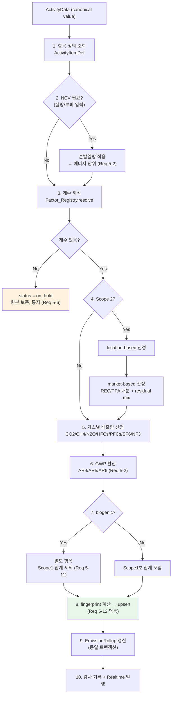

### 계수 해석 우선순위 (Req 6-5, 6-8, 33-5, 33-6)

```ts
// features/factor/service/resolve.ts
export interface FactorQuery {
  readonly companyId: string;
  readonly countryCode: string;
  readonly energySource: string;
  readonly activityType: string;
  readonly gas: FactorGas;
  readonly targetYear: number;
  readonly asOfDate: Date;
}

export interface FactorResolution {
  readonly factorId: string;
  readonly factorSetVersionId: string;
  readonly value: Decimal;
  readonly unit: string;
  readonly ncv: Decimal | null;
  readonly ncvSource: string | null;
  readonly tier: FactorSourceTier;          // Req 6-5: 적용된 출처 단계를 함께 반환
  readonly fallbackYears: number;           // Req 6-8: 0 이면 정확 일치
  readonly publishedYear: number;
  readonly redistributionAllowed: boolean;  // Req 6-1: 값 노출 가능 여부
  // ★ Req 33-5/33-6: 계수를 공급한 Provider 식별자. 회사 직접 업로드 세트는 null.
  readonly providerId: string | null;
}

const TIERS: readonly FactorSourceTier[] = [
  'company_override',    // 1순위: 회사 전용 재정의
  'country_plugin',      // 2순위: 활성화된 국가 배출계수 플러그인
  'platform_default',    // 3순위: 플랫폼 기본
];

export async function resolveFactor(
  q: FactorQuery, repo: FactorRepository,
): Promise<Result<FactorResolution, FactorError>> {
  for (const tier of TIERS) {
    // Req 6-8: 요청 연도 → 그 이전 최대 3개 연도까지 소급
    for (let back = 0; back <= 3; back++) {
      const year = q.targetYear - back;
      // Req 33-5: Provider를 순차 호출하지 않는다. FactorSet.providerId로 태깅된
      //           정규화 행 위에서 tier 순서로 해석한다 (결정 4b).
      const hit = await repo.findOne({ ...q, tier, publishedYear: year });
      if (hit) {
        // ★ 최초로 일치하는 계수 1개만 반환한다 (Req 6-5)
        //   providerId와 redistributionAllowed가 resolution에 함께 실려 나간다
        return ok({
          ...hit, tier, fallbackYears: back,
          providerId: hit.providerId,                          // Req 33-6
          redistributionAllowed: hit.redistributionAllowed,    // Req 6-11 / 6-13
        });
      }
    }
  }
  // Req 5-6 + Req 33-8: 계수 부재를 그냥 통지하지 않고 미지원 차원으로 귀속한다.
  //                     원본 데이터는 변경하지 않는다.
  const gap = await attributeGap(q, repo.coverage);
  return err({ code: 'PROVIDER_GAP', query: q, gap });
}
```

**`providerId`가 resolution에 실려 나가는 이유.** Req 33-6은 각 산정 결과에 Provider 식별자를 저장하고 산정 상세(Req 5-7)와 리포트 부록(Req 9-4)에 표시하도록 요구한다. `EmissionResult`가 `factorSetVersionId`만 갖고 있으면 표시 시점에 `FactorSet → ProviderRegistration` 조인이 필요하고, 그 세트가 나중에 `superseded`되거나 플러그인이 비활성화되면 표시가 깨진다. resolution이 `providerId`를 들고 오면 산정 시점에 결과 행에 그대로 고정된다.

**`redistributionAllowed`가 함께 이동하는 이유.** 이 플래그는 계수 값을 **노출할지 여부**를 결정하지만, 그 판단 주체는 Factor_Registry가 아니라 호출자다. 산정 엔진은 마스킹 여부와 무관하게 값을 그대로 계산에 써야 하고(Req 6-13은 값 노출만 제한하며 산정 자체를 막지 않는다), 마스킹은 표출 경로 — 산정 상세 뷰, 리포트 부록, 공개 API 직렬화 — 에서 결정 4b의 `presentFactorValue`가 수행한다. 따라서 Factor_Registry는 값을 가리지 않고 **가려야 하는지를 알려준다.** 이 분리가 없으면 산정 엔진이 마스킹된 null을 받아 계산하게 된다.

**tier를 연도보다 우선하는 이유.** 회사가 2023년 전용 계수를 등록했고 플랫폼에 2024년 기본 계수가 있다면, 회사 재정의를 존중해야 한다. Req 6-5가 tier 순서를 먼저 명시하고 Req 6-8이 별도 항으로 소급 규칙을 규정하므로, tier가 외부 루프인 것이 요구사항에 부합한다.

**캐싱.** 계수 조회는 산정마다 발생하고 Req 23-6(3600초 캐시, 캐시 적중 p95 100ms)을 요구한다. 캐시 키는 `factor:{tier}:{country}:{source}:{activityType}:{gas}:{year}`. Req 23-9(갱신 시 60초 내 무효화)는 계수 세트 활성화 트랜잭션에서 `factorCacheGeneration` 카운터를 증가시키고, 캐시 키에 generation을 포함하는 방식으로 처리한다. 개별 키 무효화보다 안전하다(어떤 키가 영향받는지 계산할 필요가 없다).

```ts
const key = `factor:g${generation}:${tier}:${country}:${source}:${activityType}:${gas}:${year}`;
```

generation이 바뀌면 이전 모든 키가 자동으로 미스가 된다. Vercel의 `unstable_cache` 태그 무효화와 Redis 계층 모두에 동일 방식을 적용한다.

### Scope 2 이원 산정 (Req 5-3, 5-4)

```ts
// features/emission/domain/scope2.ts
export interface EnergyContract {
  readonly kind: 'rec' | 'ppa';
  readonly contractedKwh: Decimal;         // Req 5-3: 계약 전력량 한도
  readonly factorTPerKwh: Decimal;         // 계약 계수 (REC 는 통상 0)
  readonly validFrom: Date;
  readonly validTo: Date;
  readonly evidenceAttachmentId: string;   // 증서 첨부 필수
}

export interface Scope2Result {
  readonly locationBased: Exact;
  readonly marketBased: Exact;
  readonly contractAllocations: readonly { contractId: string; appliedKwh: Exact; tco2e: Exact }[];
  readonly residualKwh: Exact;
  readonly residualFallbackApplied: boolean;   // Req 5-4
  readonly fallbackKwh: Exact;
}

export function computeScope2(
  consumedKwh: Decimal,
  locationFactor: Decimal,
  residualMixFactor: Decimal | null,          // Req 5-4: 부재 시 null
  contracts: readonly EnergyContract[],
): Scope2Result {
  // 위치기반: 소비량 전량에 그리드 평균 계수
  const locationBased = consumedKwh.times(locationFactor) as Exact;

  // 시장기반: 계약 전력량 한도 내에서 계약 계수 적용
  // ★ 계약을 결정적 순서로 적용한다. 계약 순서가 결과를 바꾸면 Req 5-12 위반.
  const ordered = [...contracts].sort((a, b) =>
    a.validFrom.getTime() - b.validFrom.getTime() || a.evidenceAttachmentId.localeCompare(b.evidenceAttachmentId));

  let remaining = consumedKwh;
  let marketBased = new Decimal(0);
  const allocations: { contractId: string; appliedKwh: Exact; tco2e: Exact }[] = [];

  for (const c of ordered) {
    if (remaining.lte(0)) break;
    const applied = Decimal.min(c.contractedKwh, remaining);   // 계약 한도 초과 적용 금지
    const tco2e = applied.times(c.factorTPerKwh);
    allocations.push({ contractId: c.evidenceAttachmentId, appliedKwh: applied as Exact, tco2e: tco2e as Exact });
    marketBased = marketBased.plus(tco2e);
    remaining = remaining.minus(applied);
  }

  // 잔여 전력량: residual mix → 부재 시 location 계수로 대체 (Req 5-4)
  const useFallback = residualMixFactor === null && remaining.gt(0);
  const residualFactor = residualMixFactor ?? locationFactor;
  marketBased = marketBased.plus(remaining.times(residualFactor));

  return {
    locationBased,
    marketBased: marketBased as Exact,
    contractAllocations: allocations,
    residualKwh: remaining as Exact,
    residualFallbackApplied: useFallback,
    fallbackKwh: (useFallback ? remaining : new Decimal(0)) as Exact,
  };
}
```

두 방식은 **별도 `EmissionResult` 행**으로 저장된다(`scope2Method` 구분). 같은 행에 두 컬럼으로 담으면 합산 쿼리가 어느 것을 쓸지 매번 판단해야 하고 실수하기 쉽다. 행을 나누면 `WHERE scope2Method = ?`를 강제할 수 있다. 대신 이중 계상 위험이 생기므로 Repository 타입으로 필터를 필수화한다.

### 계산 감사 추적 (Req 5-7)

Req 5-7은 상세 보기에서 "각 단계의 입력값·연산·출력값이 식별 가능한 순서로" 3초 이내 표시를 요구한다. 단계 로그를 결과와 함께 저장한다.

```prisma
model CalculationTrace {
  emissionResultId String @db.Uuid
  stepNo           Int
  stepKind         String    // "unit_conversion" | "ncv_application" | "factor_application" | "gwp_conversion" | "aggregation"
  inputValue       Decimal   @db.Decimal(38, 12)
  inputUnit        String
  operation        String    // "× 3.6", "× 0.4594 kgCO2e/kWh", "× 28 (AR5 CH4)"
  outputValue      Decimal   @db.Decimal(38, 12)
  outputUnit       String
  referenceId      String?   // factorId | unitConversionId | gwpVersion

  @@id([emissionResultId, stepNo])
}
```

트레이스를 사후 재구성하지 않고 산정 시점에 기록하는 이유: 재구성은 산정 코드와 트레이스 생성 코드가 두 벌 존재하게 만들고, 코드 버전이 바뀌면 과거 결과의 트레이스가 실제 계산과 달라진다. 감사 목적을 정면으로 배반한다.

### 기준연도 재산정 (Req 5-13)

```ts
// features/emission/service/base-year.ts
const RESTATEMENT_THRESHOLD_PCT = new Decimal('5');   // Req 5-13

export async function evaluateRestatement(
  ctx: AuthContext, baseYear: number, trigger: 'boundary_change' | 'methodology_change', deps: Deps,
): Promise<RestatementVerdict> {
  const before = await deps.emissionRepo.sumTco2eForYear(ctx.companyId, baseYear, { asOf: 'previous_run' });
  const after  = await deps.emissionRepo.sumTco2eForYear(ctx.companyId, baseYear, { asOf: 'latest_run' });

  if (before.isZero()) return { needed: after.gt(0), changePct: null, trigger };

  const changePct = after.minus(before).abs().dividedBy(before).times(100);
  if (changePct.gte(RESTATEMENT_THRESHOLD_PCT)) {
    await deps.baseYearRepo.mark(ctx.companyId, baseYear, 'restatement_required');
    await deps.notify.toCompanyAdminAndSuperAdmin({
      kind: 'base_year_restatement_required',
      changePct, trigger,
      affectedOrgNodeIds: await deps.emissionRepo.changedNodes(ctx.companyId, baseYear),
    });
    return { needed: true, changePct, trigger };
  }
  return { needed: false, changePct, trigger };
}
```

판정은 조직 경계 변경(`OrgNodeRevision` 삽입 중 `changeKind ∈ {reparent, deactivate}` 또는 `consolidationApproach` 변경)과 `methodologyVersion` 변경 시 자동 트리거된다. 사용자가 요청할 때만 판정하면 Req 5-13의 "변동한다면 표시한다"를 놓친다.

---

## ESG Rule Engine 설계

### 안전성 문제를 먼저 분명히 한다

Req 32-1은 산식을 데이터로 저장하라고 요구한다. 그러면 `"scope1 / revenue"` 같은 **문자열을 실행해야** 한다. 순진한 구현은 두 가지 중 하나다.

```ts
// ✗ 절대 금지
const value = eval(rule.formula);
const value = new Function('scope1', 'revenue', `return ${rule.formula}`)(s1, rev);
```

이것은 두 개의 서로 다른 결함을 동시에 만든다.

1. **원격 코드 실행.** 규칙 등록 권한을 가진 임의의 주체가 `process.env` 또는 `require('child_process')`를 산식에 넣으면 그 코드는 서버 프로세스 권한으로 실행된다. 멀티테넌트 시스템에서 이것은 전 테넌트 데이터 유출 경로다. Req 32-5가 이를 금지한다.
2. **결정성 파괴.** JavaScript의 산술은 IEEE 754 배정도 부동소수점이다. `0.1 + 0.2 !== 0.3`이며, 같은 식을 다른 순서로 계산하면 다른 결과가 나온다. Req 7-9는 "절대 차이 0"을, Req 32-7은 십진 연산을 요구한다. `eval`은 이 요구를 구조적으로 만족할 수 없다.

**결정: 하나의 결정으로 두 위험을 동시에 제거한다 — 화이트리스트된 제한 표현식 언어를 자체 파서로 AST로 변환하고, 그 AST를 `Decimal` 위에서 평가한다.** 실행 가능한 코드로 변환하는 단계가 존재하지 않으므로 RCE 경로가 없고, 모든 산술이 십진이므로 부동소수점 오차가 없다.

기각한 대안: **샌드박스 VM**(`vm2`, `isolated-vm`). 임의 JS를 안전하게 실행하려는 시도는 반복적으로 탈출 취약점을 냈고, 무엇보다 결정성 문제를 전혀 해결하지 못한다 — 샌드박스 안의 `/`도 여전히 부동소수점이다. 문제를 절반만 푸는 대안은 채택하지 않는다.

### 문법 (Req 32-4)

허용되는 산출 규칙은 아래가 전부다. 이 목록에 없는 생성 규칙은 **존재하지 않는다** — 멤버 접근(`a.b`), 인덱싱(`a[b]`), 대입(`=`), 화이트리스트 밖 함수 호출, 문자열 리터럴, 비교·논리 연산자, 삼항 연산자, 세미콜론, 주석은 모두 문법에 없으므로 토크나이저 단계에서 거부된다.

```ebnf
formula     ::= expression EOF

expression  ::= term { ( "+" | "-" ) term }
term        ::= factor { ( "*" | "/" ) factor }
factor      ::= [ "-" ] primary
primary     ::= number
              | identifier
              | call
              | "(" expression ")"

call        ::= function "(" expression { "," expression } ")"
function    ::= "min" | "max" | "sum" | "abs" | "ratio"

identifier  ::= letter { letter | digit | "_" }
number      ::= digit { digit } [ "." digit { digit } ]

letter      ::= "a".."z" | "A".."Z"
digit       ::= "0".."9"
```

정량 제약:

| 제약 | 값 | 근거 |
|---|---|---|
| 산식 원문 최대 길이 | 512 문자 | 토크나이저 단계 거부. 파서에 도달하기 전 차단 |
| AST 최대 깊이 | 16 | 재귀 평가의 스택 소진 방지. 깊이는 파싱 중 증분 검사 |
| 함수 최대 인자 수 | 8 | `sum`/`min`/`max` 가변 인자의 상한 |
| 허용 함수 | `min`, `max`, `sum`, `abs`, `ratio` | Req 32-4 열거. 확장은 문법 버전 증가를 요구 |

`identifier`는 두 종류만 유효하다: (a) Core ESG 필드 코드(Req 31의 필드 카탈로그에 등록된 코드), (b) 사전 등록된 파생 지표 코드. 등록되지 않은 식별자는 파싱 실패다(Req 32-6) — 평가 시점에 `undefined`가 되는 일은 없다.

`ratio(a, b)`는 `a / b`의 별칭이 아니다. 분모 0 처리를 산식 작성자에게 명시적으로 드러내기 위한 이름이며, 평가 의미는 `/`와 동일하게 `DIVISION_BY_ZERO`를 낸다.

### 타입과 인터페이스

```ts
// features/score/rule-engine/formula-ast.ts

export type BinaryOp = '+' | '-' | '*' | '/';
export type FormulaFn = 'min' | 'max' | 'sum' | 'abs' | 'ratio';

/** 판별 유니온. 이 4개 외의 노드 종류는 존재하지 않는다. */
export type FormulaAst =
  | { readonly kind: 'literal'; readonly value: string }              // 십진 문자열. number 아님.
  | { readonly kind: 'identifier'; readonly code: string }
  | { readonly kind: 'binary'; readonly op: BinaryOp;
      readonly left: FormulaAst; readonly right: FormulaAst }
  | { readonly kind: 'call'; readonly fn: FormulaFn;
      readonly args: readonly FormulaAst[] };

export interface FormulaParseError {
  readonly reason:
    | 'UNEXPECTED_CHARACTER' | 'UNEXPECTED_TOKEN' | 'UNTERMINATED_PAREN'
    | 'UNKNOWN_FUNCTION' | 'UNKNOWN_IDENTIFIER' | 'BAD_ARITY'
    | 'TOO_LONG' | 'TOO_DEEP' | 'EMPTY';
  readonly offset: number;          // Req 32-6: 위반 문자 오프셋
  readonly detail: string;          // 예: "unknown function 'require'"
}

export interface FormulaEvalError {
  readonly reason: 'DIVISION_BY_ZERO' | 'UNBOUND_IDENTIFIER' | 'DEPTH_EXCEEDED';
  readonly at: string;              // 원인 식별자 또는 연산자
}

/**
 * 순수 함수. 파싱만 한다. 평가하지 않는다. 던지지 않는다.
 * allowedIdentifiers = Core ESG 필드 코드 ∪ 등록된 파생 지표 코드
 */
export function parseFormula(
  src: string,
  allowedIdentifiers: ReadonlySet<string>,
): Result<FormulaAst, FormulaParseError>;

/** 순수 함수. Decimal 위에서만 동작. 부동소수점 연산 0회. */
export function evaluateFormula(
  ast: FormulaAst,
  bindings: ReadonlyMap<string, Decimal>,
): Result<Decimal, FormulaEvalError>;
```

`literal`이 `number`가 아니라 십진 문자열인 것이 중요하다. `"0.1"`을 `number`로 파싱하는 순간 이미 부동소수점 값이 되어 Req 32-7이 깨진다. AST는 원문 십진 표기를 보존하고 평가 시점에 `new Decimal(node.value)`로 만든다.

평가기 본체:

```ts
// features/score/rule-engine/evaluate.ts
export function evaluateFormula(
  ast: FormulaAst, bindings: ReadonlyMap<string, Decimal>,
): Result<Decimal, FormulaEvalError> {
  return go(ast, 0);

  function go(n: FormulaAst, depth: number): Result<Decimal, FormulaEvalError> {
    if (depth > MAX_AST_DEPTH) return err({ reason: 'DEPTH_EXCEEDED', at: n.kind });

    switch (n.kind) {
      case 'literal':
        return ok(new Decimal(n.value));

      case 'identifier': {
        const v = bindings.get(n.code);
        // 값 부재는 여기서 에러가 된다 → Req 7-3 재정규화로 라우팅된다.
        return v === undefined ? err({ reason: 'UNBOUND_IDENTIFIER', at: n.code }) : ok(v);
      }

      case 'binary': {
        const l = go(n.left, depth + 1);   if (!l.ok) return l;
        const r = go(n.right, depth + 1);  if (!r.ok) return r;
        switch (n.op) {
          case '+': return ok(l.value.plus(r.value));
          case '-': return ok(l.value.minus(r.value));
          case '*': return ok(l.value.times(r.value));
          case '/':
            // ★ Req 32-8: Infinity/NaN 을 만들지 않는다. 에러로 만든다.
            if (r.value.isZero()) return err({ reason: 'DIVISION_BY_ZERO', at: '/' });
            return ok(l.value.dividedBy(r.value));
        }
      }

      case 'call': {
        const args: Decimal[] = [];
        for (const a of n.args) {
          const v = go(a, depth + 1);
          if (!v.ok) return v;
          args.push(v.value);
        }
        switch (n.fn) {
          case 'min': return ok(Decimal.min(...args));
          case 'max': return ok(Decimal.max(...args));
          case 'sum': return ok(args.reduce((a, b) => a.plus(b), new Decimal(0)));
          case 'abs': return ok(args[0].abs());
          case 'ratio':
            if (args[1].isZero()) return err({ reason: 'DIVISION_BY_ZERO', at: 'ratio' });
            return ok(args[0].dividedBy(args[1]));
        }
      }
    }
  }
}
```

`switch (n.kind)`가 판별 유니온을 모두 소진하므로 `never` 검사로 컴파일 타임에 누락이 잡힌다. 노드 종류를 추가하면 컴파일이 깨진다 — 이것이 "유니온 밖 노드는 존재하지 않는다"를 타입 시스템으로 보장하는 방식이다.

`dividedBy`는 무한 십진 전개를 낼 수 있다(`1/3`). `Decimal` 전역 설정의 `precision`을 34자리로 고정하고 `Decimal.ROUND_HALF_UP`을 기본 반올림으로 둔다. 이 설정이 프로세스 전역이므로 규칙 엔진 모듈은 자체 `Decimal` 클론(`Decimal.clone({ precision: 34, rounding: 4 })`)을 사용해 다른 모듈의 설정 변경에 영향받지 않는다.

### 결정: 파싱은 등록 시점, 채점 시점이 아니다

**규칙 등록 시 산식을 파싱·검증하고, 결과 AST를 `ScoringRule.formulaAst`에 영속화한다. 채점은 저장된 AST를 평가하며 문자열을 파싱하지 않는다.**

근거 세 가지:

1. **검증이 단일 행정 경계로 모인다.** 산식이 유효한지 판단하는 코드 경로가 하나다. 채점기는 "AST는 이미 유효하다"를 전제로 쓸 수 있다.
2. **파싱 불가능한 규칙이 영속화될 수 없다.** 저장 전에 파싱이 성공해야 하므로 DB에 깨진 산식이 존재할 수 없다. 반대 배치(채점 시 파싱)에서는 잘못된 규칙이 조용히 저장되고 몇 달 뒤 야간 채점 배치에서 터진다.
3. **핫 경로에서 파싱 비용과 파서 공격면이 사라진다.** 점수 산출은 Req 7-1의 120초 예산 안에서 회사×지표 수만큼 평가를 돌린다. 여기서 문자열 파싱을 반복할 이유가 없고, 신뢰할 수 없는 텍스트를 다루는 코드가 애초에 호출되지 않는다.

**따름정리: 문법 변경은 저장된 AST의 재검증을 요구한다.** 그래서 AST는 `grammarVersion`을 함께 갖는다.

```ts
export interface StoredFormula {
  readonly grammarVersion: number;      // ScoreRubric.grammarVersion 과 일치해야 한다
  readonly ast: FormulaAst;
}
```

채점 시 `storedFormula.grammarVersion !== CURRENT_GRAMMAR_VERSION`이면 평가하지 않고 `RULE_GRAMMAR_STALE`로 처리한다. 문법 버전을 올리는 마이그레이션은 모든 `ScoringRule.formula` 원문을 새 문법으로 재파싱해 `formulaAst`를 다시 쓴다. 이 재검증이 실패하는 규칙이 있으면 마이그레이션이 중단된다 — 조용히 넘어가지 않는다.

### 두 경로

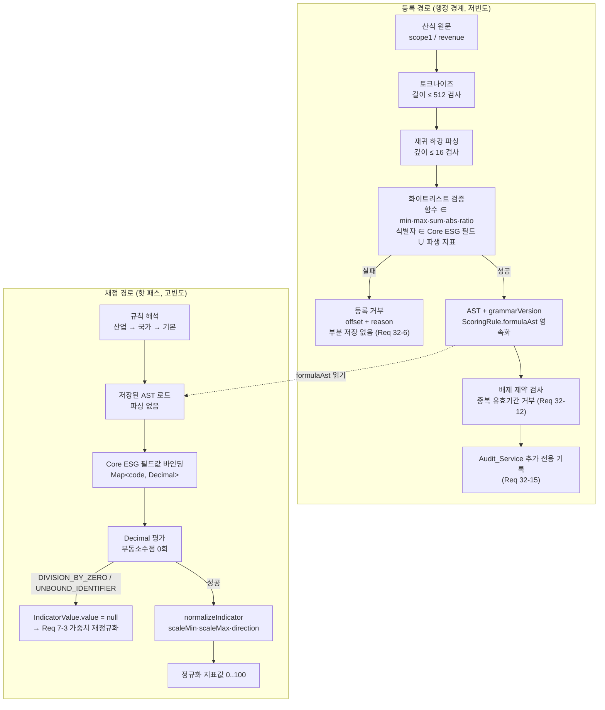

### 분모 0 처리 (Req 32-8)

분모가 0으로 평가되면 해당 지표는 **값 부재**가 된다. `Infinity`도 `0`도 아니다.

```ts
// features/score/rule-engine/indicator.ts
export function evaluateIndicator(
  rule: ResolvedRule, bindings: ReadonlyMap<string, Decimal>,
): IndicatorValue {
  const r = evaluateFormula(rule.formulaAst, bindings);
  if (!r.ok) {
    // DIVISION_BY_ZERO, UNBOUND_IDENTIFIER 모두 값 부재로 수렴한다.
    return { code: rule.indicatorCode, value: null, isMeasured: false, absentReason: r.error.reason };
  }
  return { code: rule.indicatorCode, value: r.value, isMeasured: true, absentReason: null };
}
```

`value: null`은 Score_Engine의 Req 7-3 경로로 들어가 해당 지표를 가중치 합계에서 제외하고 잔여 지표를 재정규화한다.

**0을 반환하면 왜 틀리는가.** `e_ghg_intensity = scope1 / revenue`에서 매출이 0인 회사(창업 첫해, 휴업, 지주회사)를 생각해 보자. `direction`이 `lower_better`인 원단위 지표에서 값 0은 "배출 원단위가 완벽하다"는 뜻이 되어 만점이 된다. 즉 매출이 없다는 사실이 최고 점수로 번역된다. 무한대를 반환하면 반대 방향으로 같은 종류의 거짓말(0점)을 하고, 게다가 `Decimal`로 표현할 수 없어 직렬화 경계에서 `null`이나 문자열 `"Infinity"`로 새어 나간다. 값 부재만이 사실에 부합한다 — 이 지표는 이 회사에 대해 정의되지 않는다.

### 규칙 해석 우선순위 (Req 32-10)

산업별 → 국가별 → 기본. 정확히 1개를 반환하고, 일치한 차원을 함께 공개한다(Req 32-11).

```ts
// features/score/rule-engine/resolve.ts
export type RuleDimension = 'industry' | 'country' | 'default';

export interface ResolvedRule {
  readonly ruleId: string;
  readonly ruleSetVersion: string;
  readonly indicatorCode: string;
  readonly matchedDimension: RuleDimension;   // Req 32-11: 호출자가 사용자에게 공개
  readonly formula: string;                   // 원문 (표시용)
  readonly formulaAst: FormulaAst;            // 평가용
  readonly weight: Decimal;
  readonly normalization: string;
  readonly direction: 'higher_better' | 'lower_better';
  readonly scaleMin: Decimal;
  readonly scaleMax: Decimal;
}

export interface RuleQuery {
  readonly ruleSetVersion: string;
  readonly indicatorCode: string;
  readonly industryCode: string | null;
  readonly countryCode: string | null;
  readonly asOf: Date;
}

export function resolveRule(
  candidates: readonly ScoringRule[], q: RuleQuery,
): ResolvedRule | null {
  const valid = candidates.filter(
    (r) => r.ruleSetVersion === q.ruleSetVersion
        && r.indicatorCode === q.indicatorCode
        && r.validFrom <= q.asOf
        && (r.validTo === null || q.asOf < r.validTo),
  );

  // ★ 산업이 바깥 루프다. 국가는 안쪽.
  const ladder: readonly [RuleDimension, (r: ScoringRule) => boolean][] = [
    ['industry', (r) => q.industryCode !== null && r.industryCode === q.industryCode],
    ['country',  (r) => q.countryCode  !== null && r.industryCode === null
                                                && r.countryCode === q.countryCode],
    ['default',  (r) => r.industryCode === null && r.countryCode === null],
  ];

  for (const [dimension, pred] of ladder) {
    const hit = valid.filter(pred);
    if (hit.length === 0) continue;
    // 배제 제약이 이미 hit.length ≤ 1 을 보장한다. 위반은 불변식 붕괴이므로 던진다.
    if (hit.length > 1) throw new InvariantViolation('RULE_OVERLAP', hit.map((r) => r.id));
    return toResolved(hit[0], dimension);
  }
  return null;    // Req 7-14: 임의의 기본 산식을 적용하지 않는다
}
```

**산업 차원이 바깥 루프인 이유**는 계수 레지스트리가 tier를 연도 바깥에 둔 것과 같다. 사다리의 순서가 곧 특이성(specificity)의 순서여야 한다. 시멘트 산업 전용 배출 원단위 규칙은 "한국 기업 일반" 규칙보다 반드시 이겨야 한다 — 국가를 바깥에 두면 한국 시멘트 회사가 한국 일반 규칙으로 채점되어 산업 특성이 사라진다. 산업 차원 규칙이 `countryCode`도 갖는 경우(한국 시멘트 전용)는 `industry` 단계에서 잡히므로 별도 4번째 단계가 필요 없다.

`resolveRule`이 `null`을 반환하면 Req 7-14가 적용된다: 해당 지표를 Req 7-3 재정규화 대상으로 넣고 `규칙 미정의` 목록에 분리 표시한다. 임의의 기본 산식으로 메우지 않는다.

### `no-eval` 린트 규칙 (Req 32-5)

문서상의 금지는 시간이 지나면 위반된다. CI가 막아야 한다.

```js
// eslint.config.js (발췌)
{
  files: ['src/features/score/**', 'src/features/score/rule-engine/**'],
  rules: {
    'no-eval': 'error',
    'no-implied-eval': 'error',
    'no-new-func': 'error',
    'no-restricted-globals': ['error',
      { name: 'eval', message: 'Req 32-5: 산식 평가에 임의 코드 실행 금지' },
    ],
    'no-restricted-syntax': ['error',
      { selector: "NewExpression[callee.name='Function']",
        message: 'Req 32-5: Function 생성자 금지' },
      { selector: "CallExpression[callee.name='Function']",
        message: 'Req 32-5: Function 생성자 금지' },
      { selector: 'ImportExpression',
        message: 'Req 32-5: 동적 import 금지 — 규칙 엔진은 정적 의존만 갖는다' },
    ],
    'no-restricted-imports': ['error',
      { paths: [
          { name: 'vm',  message: 'Req 32-5: vm 샌드박스 금지' },
          { name: 'node:vm', message: 'Req 32-5: vm 샌드박스 금지' },
          { name: 'vm2', message: 'Req 32-5: vm 샌드박스 금지' },
          { name: 'isolated-vm', message: 'Req 32-5: vm 샌드박스 금지' },
        ] },
    ],
  },
}
```

이 규칙 집합은 Req 27의 경계 린트와 동일한 CI 게이트에서 돌고, 위반은 빌드 실패다. `eslint-disable` 주석으로의 우회도 `reportUnusedDisableDirectives`와 `--no-inline-config`로 막는다.

### 재현성 (Req 32-13, 32-14)

`ScoreSnapshot.ruleSetVersion`이 과거 점수를 **당시 규칙으로** 설명할 수 있게 한다. 산출 근거 조회는 조회 시점 최신 규칙으로 대체하지 않는다.

```ts
export async function explainSnapshot(
  snapshotId: string, deps: Deps,
): Promise<SnapshotExplanation> {
  const snap = await deps.scoreRepo.findSnapshot(snapshotId);
  // ★ latest() 가 아니다. 스냅샷에 기록된 버전이다. (Req 32-14)
  const ruleSet = await deps.ruleRepo.loadRuleSet(snap.ruleSetVersion);
  return {
    computedAt: snap.computedAt,
    ruleSetVersion: snap.ruleSetVersion,
    contributions: snap.contributions.map((c) => {
      const rule = ruleSet.byCode.get(c.indicatorCode)!;
      return {
        indicatorCode: c.indicatorCode,
        formula: rule.formula,                    // 당시 산식
        weight: rule.weight,                      // 당시 가중치
        normalization: rule.normalization,        // 당시 정규화 기준
        matchedDimension: rule.matchedDimension,  // Req 7-13
        weightRenormalized: c.weightRenormalized,
        contributionPoints: c.contributionPoints,
      };
    }),
  };
}
```

그리고 12번 그룹의 추이 조회 교차 버전 재산출은 이제 하드코딩된 루브릭이 아니라 **규칙 세트**로 재산출한다 — 아래 Score_Engine 절의 `trend`가 `latest` 규칙 세트를 로드해 각 과거 트윈 버전을 다시 채점하는 형태로 바뀐다. 재산출값은 병기이며 스냅샷을 덮어쓰지 않는다.

---

## Score_Engine 설계

### 코드는 순수 해석기, 규칙은 Rule Engine이 공급한다

Req 7-2는 가중치·정규화 기준·산업별 가중치 세트를 사용자에게 표시하도록 요구하고, Req 7-8은 루브릭 버전 간 비교 불가 경고와 최신 루브릭 재산출 병기를 요구한다. Req 7-11은 여기에 한 걸음 더 나아가 **산식·가중치·정규화 기준·점수 방향을 코드에 내장하지 말 것**을 요구한다.

**결정: Score_Engine은 Rule Engine이 공급한 규칙에 대한 순수 해석기다. 하드코딩된 루브릭에 대한 해석기가 아니다.** 엔진은 산식을 알지 못하고, 어떤 지표가 존재하는지도 알지 못한다. 지표 목록·산식·가중치·정규화 기준·방향은 전부 `LoadedRuleSet`으로 주입된다. 엔진이 자체적으로 갖는 지식은 재정규화 규칙(Req 7-3), 정수 확정 규칙(Req 7-1), 충족률 산정 규칙(Req 7-6)뿐이다 — 이것들은 규정이 아니라 산술 규약이므로 코드에 있어도 된다.

```ts
// features/score/domain/score.ts
export interface IndicatorValue {
  readonly code: string;
  readonly value: Decimal | null;        // null = 값 부재 (Req 7-3)
  readonly isMeasured: boolean;          // 추정치는 false (Req 7-6)
  // Rule Engine 평가 실패 사유. 'DIVISION_BY_ZERO' 등. 값이 있으면 null.
  readonly absentReason: string | null;
}

/**
 * 이전 판의 LoadedRubric 을 대체한다. 지표가 formulaAst 를 직접 들고 있다는 점이
 * 유일하지만 결정적인 차이다 — 산식이 "코드가 아는 것"에서 "데이터로 주어지는 것"으로
 * 바뀌었다 (Req 7-11, Req 32-1).
 */
export interface LoadedRuleSet {
  readonly ruleSetVersion: string;       // Req 7-11: 산출 결과에 함께 기록
  readonly grammarVersion: number;
  readonly axisWeights: readonly { axis: ScoreAxis; weight: Decimal }[];
  readonly indicators: readonly LoadedIndicatorRule[];
  readonly mappings: readonly LoadedMapping[];
  readonly byCode: ReadonlyMap<string, LoadedIndicatorRule>;
}

export interface LoadedIndicatorRule {
  readonly ruleId: string;
  readonly indicatorCode: string;
  readonly axis: ScoreAxis;
  readonly formula: string;                            // 표시용 원문 (Req 7-13)
  readonly formulaAst: FormulaAst;                     // ★ 평가용. 함축된 산식이 아니다.
  readonly matchedDimension: RuleDimension;            // Req 7-13: 적용 차원 표시
  readonly weight: Decimal;                            // Req 7-2
  readonly normalization: string;
  readonly direction: 'higher_better' | 'lower_better';
  readonly scaleMin: Decimal;
  readonly scaleMax: Decimal;
  readonly denominatorValue: Decimal | null;           // per_revenue / per_production 분모
  readonly isRequired: boolean;                        // Req 7-6
}

export interface ScoreOutput {
  readonly rawE: Decimal; readonly rawS: Decimal; readonly rawG: Decimal; readonly rawTotal: Decimal;
  readonly scoreE: number; readonly scoreS: number; readonly scoreG: number; readonly scoreTotal: number;
  readonly contributions: readonly ContributionDetail[];
  readonly dataCompletenessPct: number;
  readonly confidenceGrade: 'high' | 'medium' | 'insufficient';
  readonly ruleSetVersion: string;                     // Req 7-11
  readonly undefinedRuleCodes: readonly string[];      // Req 7-14: `규칙 미정의` 분리 표시
}

/**
 * ★ 순수 함수. AI 호출 없음. 시각 참조 없음. 동일 입력 → 동일 출력 (Req 7-9).
 * 시그니처는 유지된다. 두 번째 인자의 타입만 LoadedRubric → LoadedRuleSet 으로 바뀐다.
 */
export function scoreFromIndicators(
  values: readonly IndicatorValue[], ruleSet: LoadedRuleSet,
): ScoreOutput {
  const byAxis = groupBy(ruleSet.indicators, (i) => i.axis);
  const axisRaw = new Map<ScoreAxis, Decimal>();
  const contributions: ContributionDetail[] = [];

  for (const [axis, indicators] of byAxis) {
    // Req 7-3: 값이 부재한 지표는 0점 처리하지 않고 가중치 합계에서 제외
    const present = indicators.filter((i) => valueOf(values, i.indicatorCode) !== null);
    const excluded = indicators.filter((i) => valueOf(values, i.indicatorCode) === null);

    const weightSum = present.reduce((a, i) => a.plus(i.weight), new Decimal(0));

    let axisScore = new Decimal(0);
    for (const ind of present) {
      // Req 7-3: 잔여 지표 가중치를 합계 1.0000 이 되도록 재정규화
      const w = weightSum.isZero()
        ? new Decimal(0)
        : ind.weight.dividedBy(weightSum).toDecimalPlaces(4, Decimal.ROUND_HALF_UP);
      // ind.scaleMin / scaleMax / direction / normalization 은 모두 Rule Engine 이 공급한 값이다.
      const normalized = normalizeIndicator(valueOf(values, ind.indicatorCode)!, ind);   // 0..100
      const points = normalized.times(w);
      axisScore = axisScore.plus(points);
      contributions.push({
        code: ind.indicatorCode, rawValue: valueOf(values, ind.indicatorCode), normalizedValue: normalized,
        weightOriginal: ind.weight, weightRenormalized: w,
        contributionPoints: points.toDecimalPlaces(1, Decimal.ROUND_HALF_UP),   // Req 7-2
        excluded: false,
      });
    }
    for (const ind of excluded) {
      contributions.push({
        code: ind.indicatorCode, rawValue: null, normalizedValue: null,
        weightOriginal: ind.weight, weightRenormalized: new Decimal(0),
        contributionPoints: new Decimal(0), excluded: true,     // Req 7-3: 제외 목록 표시
      });
    }
    axisRaw.set(axis, axisScore.toDecimalPlaces(4, Decimal.ROUND_HALF_UP));
  }

  const rawTotal = ruleSet.axisWeights.reduce(
    (a, { axis, weight }) => a.plus((axisRaw.get(axis) ?? new Decimal(0)).times(weight)), new Decimal(0),
  ).toDecimalPlaces(4, Decimal.ROUND_HALF_UP);

  // Req 7-6: 충족률은 실측값만 계산. 추정치는 제외.
  // 분모는 Req 31-16/31-17이 고정한 Core ESG 필수 필드 수다 (아래 주석 참조).
  const required = ruleSet.indicators.filter((i) => i.isRequired);
  const measured = required.filter(
    (i) => values.find((v) => v.code === i.indicatorCode)?.isMeasured === true,
  );
  const completeness = required.length === 0 ? 0 : Math.floor((measured.length / required.length) * 100);

  // Req 7-14: 값이 부재한 원인이 "규칙 미정의"인 지표는 별도 목록으로 분리한다.
  const undefinedRuleCodes = values
    .filter((v) => v.value === null && v.absentReason === 'RULE_UNDEFINED')
    .map((v) => v.code);

  return {
    rawE: axisRaw.get('E')!, rawS: axisRaw.get('S')!, rawG: axisRaw.get('G')!, rawTotal,
    // Req 7-1: 소수 둘째 자리 계산 후 사사오입 정수
    scoreE: toInt(axisRaw.get('E')!), scoreS: toInt(axisRaw.get('S')!),
    scoreG: toInt(axisRaw.get('G')!), scoreTotal: toInt(rawTotal),
    contributions, dataCompletenessPct: completeness,
    confidenceGrade: completeness >= 80 ? 'high' : completeness >= 60 ? 'medium' : 'insufficient',
    ruleSetVersion: ruleSet.ruleSetVersion,          // Req 7-11
    undefinedRuleCodes,
  };
}

function toInt(v: Decimal): number {
  // Req 7-1: 0 이상 100 이하 정수로 확정
  return Math.min(100, Math.max(0, v.toDecimalPlaces(0, Decimal.ROUND_HALF_UP).toNumber()));
}
```

**재정규화 가중치 합의 문제.** `toDecimalPlaces(4)`로 각 가중치를 4자리로 자르면 합이 정확히 1.0000이 되지 않을 수 있다(예: 3개 지표 균등 → 0.3333 × 3 = 0.9999). Req 7-2가 "축 내 가중치 합계 1.0000"을 요구하므로 **최대 잉여 배분(largest remainder)** 으로 보정한다.

```ts
function renormalizeToExactOne(weights: readonly Decimal[]): Decimal[] {
  const scaled = weights.map((w) => w.times(10_000));
  const floored = scaled.map((s) => s.floor());
  let deficit = new Decimal(10_000).minus(floored.reduce((a, b) => a.plus(b), new Decimal(0)));
  // 잔여를 소수부가 큰 순서로 1씩 배분. 동률은 인덱스 오름차순 (결정적)
  const order = scaled
    .map((s, i) => ({ i, frac: s.minus(floored[i]) }))
    .sort((a, b) => b.frac.comparedTo(a.frac) || a.i - b.i);
  const result = [...floored];
  for (const { i } of order) {
    if (deficit.lte(0)) break;
    result[i] = result[i].plus(1);
    deficit = deficit.minus(1);
  }
  return result.map((r) => r.dividedBy(10_000));
}
```

동률 처리에 인덱스 오름차순을 명시하는 것이 결정성의 핵심이다. 이것을 빠뜨리면 정렬 안정성에 의존하게 되어 엔진/버전에 따라 결과가 달라질 수 있다.

이 보정의 입력인 `weights`는 이제 `ScoringRule.weight`에서 온다. 보정 알고리즘 자체는 규정이 아니라 산술 규약이므로 코드에 남는다 — Rule Engine이 공급하는 것은 가중치 값이고, "합계를 정확히 1.0000으로 만드는 방법"은 엔진의 책임이다.

### 정규화 (Req 7-2)

```ts
function normalizeIndicator(raw: Decimal, ind: LoadedIndicatorRule): Decimal {
  const base = ind.normalization === 'absolute' ? raw
    : ind.normalization === 'per_revenue' ? raw.dividedBy(ind.denominatorValue!)
    : raw.dividedBy(ind.denominatorValue!);          // per_production

  const clamped = Decimal.min(Decimal.max(base, ind.scaleMin), ind.scaleMax);
  const span = ind.scaleMax.minus(ind.scaleMin);
  if (span.isZero()) return new Decimal(0);
  const pct = clamped.minus(ind.scaleMin).dividedBy(span).times(100);
  // Req 28-7 단조성: direction 에 따라 방향이 정해진다
  return ind.direction === 'higher_better' ? pct : new Decimal(100).minus(pct);
}
```

`direction`이 명시적 데이터인 덕에 단조성 속성 테스트가 가능하다. `higher_better` 지표는 입력 증가 시 점수 비감소, `lower_better`는 비증가. 이것이 Req 28-7의 단조성 속성 대상이다. `direction`·`scaleMin`·`scaleMax`·`normalization`은 모두 `ScoringRule` 행에서 오며, 규정 개정 시 새 규칙 버전 추가로 바뀐다.

여기서 `raw`는 이제 Rule Engine의 `evaluateFormula`가 반환한 값이다. 즉 정규화 함수의 입력은 코드가 조립한 값이 아니라 데이터로 주어진 산식의 평가 결과다. `raw`가 얻어지지 않는 경우(분모 0, 미바인딩 식별자)는 이 함수에 도달하지 않고 값 부재로 Req 7-3 경로로 간다.

### 충족률 분모 (Req 7-6, Req 31-16, Req 31-17)

이 문서의 이전 판은 "필수 지표 총수를 무엇으로 정의하는가"를 **미결정(blocked)** 으로 기록하고 있었다. Req 7-6은 분모를 "점수 산출 대상 필수 지표 총수"라고만 규정하고, 그 집합의 권위 있는 정의가 없었기 때문이다. 루브릭의 `isRequired` 개수를 쓰면 규칙 세트를 바꿀 때마다 과거 충족률이 재해석되어 시계열이 무의미해진다.

**Req 31-16과 Req 31-17이 이 공백을 닫는다.** 충족률 분모는 Core ESG 데이터 모델이 정의한 **필수 필드 수**로 고정된다. 결과:

| 지표 | 분자 | 분모 | 출처 |
|---|---|---|---|
| 데이터 충족률 (Req 7-6) | 실측값으로 채워진 Core ESG 필수 필드 수 | 점수 산출 대상 Core ESG 필수 필드 총수 | Req 31-17 |
| 도메인 충족률 (Req 4-2) | 도메인 내 실측 충족 필드 수 | 해당 도메인의 Core ESG 필수 필드 총수 | Req 31-16 |
| 프레임워크 커버리지 (Req 7-4) | **충족**(매핑 + 값 존재) 항목 수 | `FrameworkItemCatalog`의 필수 항목 총수 (미지원 항목 포함) | Req 31-14 |

두 분모가 규칙 세트 버전과 **독립**이라는 점이 핵심이다. 그래서 규칙이 개정되어 점수가 바뀌어도 충족률 시계열은 연속적이며, Req 7-7의 10년 추이 조회에서 충족률을 그대로 비교할 수 있다. 위 코드의 `ruleSet.indicators.filter(i => i.isRequired)`는 Core ESG 필수 필드 카탈로그로부터 파생된 집합이며, 규칙 세트가 임의로 늘리거나 줄일 수 없다.

### 프레임워크 매핑과 커버리지 (Req 7-4, 7-5, 31-14, 31-15)

커버리지는 결정 5b의 **Core ESG 필드 매핑** 위에서 계산된다. 분모는 `FrameworkItemCatalog`의 필수 항목 전체이며(Req 31-14), 각 항목은 정확히 세 구분 중 하나로 분류된다(Req 31-15).

| 구분 | 조건 | 분모 포함 | 분자 포함 |
|---|---|---|---|
| **충족** | `FrameworkMapping` 존재 + `indicatorCode`에 규칙 존재 + 값 존재 | ✓ | ✓ |
| **미충족** | 매핑 존재 + 규칙 존재 + **값 없음** | ✓ | ✗ |
| **플랫폼 미지원** | 카탈로그 항목에 `FrameworkMapping` 행이 **없음** | ✓ | ✗ |

세 구분이 모두 분모에 들어가는 것이 Req 31-14의 요구다. 플랫폼 미지원 항목을 분모에서 빼면 커버리지가 실제보다 높게 나온다 — 우리가 아직 지원하지 않는 항목이 많을수록 점수가 좋아지는 지표는 지표가 아니다.

```prisma
// 각 프레임워크의 필수 항목 전체 목록. 커버리지 분모의 원천.
model FrameworkItemCatalog {
  framework   Framework
  itemCode    String
  title       String                       // 원 표준 언어 (Req 26-9)
  isMandatory Boolean
  @@id([framework, itemCode])
}
```

```ts
export type ItemStatus = 'met' | 'unmet' | 'platform_unsupported';

export interface FrameworkCoverage {
  readonly framework: Framework;
  readonly mandatoryTotal: number;                   // Req 31-14: 미지원 항목까지 포함한 분모
  readonly mandatoryMet: number;
  readonly coveragePct: number;                      // Req 7-4: 사사오입 정수
  // Req 31-15: 3개 구분으로 각각 목록화
  readonly met: readonly string[];                   // itemCode
  readonly unmet: readonly UnmetItem[];              // Req 7-5
  readonly platformUnsupported: readonly UnsupportedItem[];
}

export interface UnmetItem {
  readonly itemCode: string;                         // Req 26-9: 원 표준 표기 유지
  readonly fieldCodes: readonly string[];            // 이 항목을 충족시키는 Core ESG 필드들
  readonly requiredInputs: readonly { name: string; unit: string | null; period: string | null }[];
}

export interface UnsupportedItem {
  readonly itemCode: string;
  readonly title: string;                            // 원 표준 언어 (Req 26-9)
}

export function computeCoverage(
  values: readonly IndicatorValue[],
  ruleSet: LoadedRuleSet,
  catalog: readonly FrameworkCatalogItem[],          // Req 31-14: 분모의 원천
  framework: Framework,
): FrameworkCoverage {
  const items = catalog.filter((c) => c.framework === framework && c.isMandatory);
  const byItem = groupBy(
    ruleSet.mappings.filter((m) => m.framework === framework),
    (m) => m.itemCode,
  );

  const met: string[] = [];
  const unmet: UnmetItem[] = [];
  const platformUnsupported: UnsupportedItem[] = [];

  for (const item of items) {
    const mappings = byItem.get(item.itemCode) ?? [];

    if (mappings.length === 0) {
      // 카탈로그에는 있으나 매핑 행이 없다 → 플랫폼 미지원
      platformUnsupported.push({ itemCode: item.itemCode, title: item.title });
      continue;
    }

    // Req 31-13: 하나의 항목이 복수 Core ESG 필드로 충족될 수 있다.
    //   direct 매핑은 전부, partial 매핑은 하나라도 값이 있으면 충족으로 본다.
    const satisfied = mappings.some((m) => valueOf(values, m.indicatorCode) !== null);

    if (satisfied) {
      met.push(item.itemCode);
    } else {
      // ★ 여기 도달했다면 매핑은 있고 값만 없다 = 미충족.
      //   "규칙이 없어서 값을 못 찾은 것"일 가능성은 발행 게이트가 이미 제거했다.
      unmet.push({
        itemCode: item.itemCode,
        fieldCodes: mappings.map((m) => m.fieldCode),
        requiredInputs: mappings.map((m) => ({
          name: m.indicatorCode, unit: m.requiredUnit, period: m.requiredPeriod,
        })),
      });
    }
  }

  const pct = items.length === 0 ? 0 : Math.round((met.length / items.length) * 100);
  return { framework, mandatoryTotal: items.length, mandatoryMet: met.length,
           coveragePct: pct, met, unmet, platformUnsupported };
}
```

**두 번째와 세 번째 구분이 런타임에 혼동될 수 없는 근거.** `computeCoverage`의 `unmet` 분기는 "매핑은 있고 값이 없다"만 확인하며, "그 `indicatorCode`에 채점 규칙이 존재하는가"는 **확인하지 않는다.** 이 생략이 안전한 것은 결정 5b의 **규칙 세트 발행 시점 검증**(`validateIndicatorCoverage`) 때문이다. 발행 게이트가 고아 `indicatorCode`를 가진 규칙 세트의 발행을 거부하고, 대칭으로 미등록 `indicatorCode`를 인용하는 매핑 행의 등록도 거부하므로, 런타임에 도달하는 모든 매핑은 규칙을 갖는다.

이 게이트가 없다면 규칙 없는 지표는 `valueOf`가 null을 반환해 **미충족**으로 분류된다. 그러나 실제 상태는 **플랫폼 미지원**이다 — 회사가 데이터를 안 넣은 것이 아니라 우리가 채점 규칙을 안 만든 것이다. 이 오분류는 사용자에게 "당신이 입력을 안 했다"고 잘못 지시하고, Req 31-15가 요구하는 3구분을 2구분으로 붕괴시킨다. 발행 게이트가 이 상태를 **애초에 존재할 수 없게** 만들기 때문에 런타임 확인이 불필요하다.

Req 9-3의 두 목록(플랫폼 미지원 / 데이터 미확보)은 `platformUnsupported`와 `unmet`에 그대로 대응한다.

### 규칙 세트 버전 경계 (Req 7-8)

```ts
export async function trend(
  ctx: AuthContext, range: DateRange, deps: Deps,
): Promise<TrendResult> {
  const snaps = await deps.scoreRepo.listSnapshots(ctx.companyId, range);
  // ★ 경계 판정 기준이 rubricVersion 단독에서 (rubricVersion, ruleSetVersion) 로 넓어진다.
  //   규칙 세트만 바뀐 경우도 직접 비교가 불가하다.
  const versions = new Set(snaps.map((s) => `${s.rubricVersion}/${s.ruleSetVersion}`));

  if (versions.size <= 1) return { points: snaps, boundaries: [], recomputed: null };

  // Req 7-8: 버전 경계 표시 + 비교 불가 경고 + 최신 규칙 세트 재산출 병기
  const boundaries = detectVersionBoundaries(snaps);
  // 하드코딩된 루브릭이 아니라 규칙 세트를 로드한다 (Req 7-11, 32-13).
  const latest: LoadedRuleSet = await deps.ruleRepo.latestRuleSet();

  // 재산출은 각 스냅샷의 트윈 버전을 최신 규칙 세트로 다시 채점한다.
  // ★ 트윈 버전이 보존되어 있어야 가능하다 → Req 4-6 보존 정책의 참조 예외 근거.
  const recomputed = await Promise.all(snaps.map(async (s) => {
    const values = await deps.twinRepo.indicatorValues(s.twinVersionId, latest);
    return { at: s.computedAt, score: scoreFromIndicators(values, latest) };
  }));

  return { points: snaps, boundaries, recomputed, warning: 'RULE_SET_VERSION_MISMATCH' };
}
```

재산출값은 **병기**다. 기존 스냅샷을 덮어쓰지 않는다 — Req 32-14가 과거 스냅샷의 산출 근거를 당시 규칙으로 반환할 것을 요구하므로, 원본 스냅샷과 그 `ruleSetVersion`은 불변으로 남아야 한다.

여기서 Req 7-8과 Req 4-6이 충돌한다. 재산출은 과거 트윈 버전을 필요로 하지만 보존 정책은 24개월 초과 버전을 월말만 남긴다. **해소:** `ScoreSnapshot`이 참조하는 `twinVersionId`는 보존 정책의 삭제 대상에서 제외한다(앞서 Data Models에서 규정한 참조 예외). 점수는 10년 보존이므로(Req 7-7) 점수와 연결된 트윈 버전도 10년 남는다. 저장 비용은 콘텐츠 주소화 blob 공유로 완화된다.

---

## 실시간 대시보드 설계

### 채널 스코핑

Req 8-3은 "사용자가 열람 권한을 가진 회사 및 조직 노드 범위로 한정된" Realtime 채널을 요구한다. Supabase Realtime의 `postgres_changes`는 RLS를 적용하지만, 브로드캐스트 범위를 조직 노드 수준까지 좁히려면 별도 설계가 필요하다.

**결정: `postgres_changes`를 원시 테이블에 걸지 않고, 전용 알림 테이블 `DashboardTick`에 건다.**

```prisma
model DashboardTick {
  id          BigInt   @id @default(autoincrement())
  companyId   String   @db.Uuid
  // 영향받은 조직 노드. 클라이언트는 자신의 필터와 교차 여부를 판단한다.
  orgNodeIds  String[] @db.Uuid
  widgets     String[]                        // 갱신 대상 위젯 코드
  periodMonths DateTime[] @db.Date
  emittedAt   DateTime @default(now())

  @@index([companyId, emittedAt])
}
```

```sql
ALTER TABLE "DashboardTick" ENABLE ROW LEVEL SECURITY;
CREATE POLICY tick_select ON "DashboardTick" FOR SELECT TO authenticated
  USING ("companyId" = ANY (app.current_company_ids()));

ALTER PUBLICATION supabase_realtime ADD TABLE "DashboardTick";
```

원시 테이블(`EmissionResult`, `ActivityData`)을 publication에 넣지 않는 이유:
1. **데이터 노출 최소화** — Realtime 페이로드에 행 전체가 실려 브라우저로 간다. 배출 원시 데이터가 WebSocket으로 흐르는 것을 피한다.
2. **볼륨 통제** — 임포트 10,000행이 10,000개 이벤트를 발생시키면 Req 8-4의 병합으로도 감당하기 어렵다. Tick은 트랜잭션당 1건이다.
3. **위젯 매핑** — 어떤 위젯이 영향받는지는 도메인 지식이다. 클라이언트가 원시 행을 보고 추론하게 하면 로직이 중복된다.

Tick 삽입은 산정/저장 트랜잭션의 마지막 단계다.

```ts
await tx.dashboardTick.create({
  data: { companyId, orgNodeIds: [...affectedNodes], widgets: ['carbon', 'energy'], periodMonths: [...months] },
});
```

### 1Hz 병합 (Req 8-4)

```ts
// features/dashboard/ui/use-dashboard-stream.ts
const COALESCE_WINDOW_MS = 1000;   // Req 8-4: 1초당 최대 1회 렌더

export function useDashboardStream(filter: DashboardFilter) {
  const pending = useRef(new Set<WidgetCode>());
  const timer = useRef<ReturnType<typeof setTimeout> | null>(null);
  const [dirty, setDirty] = useState<ReadonlySet<WidgetCode>>(new Set());

  const flush = useCallback(() => {
    timer.current = null;
    if (pending.current.size === 0) return;
    setDirty(new Set(pending.current));    // 병합 후 최신 값으로 1회 렌더
    pending.current.clear();
  }, []);

  useEffect(() => {
    const ch = supabase.channel(`dash:${filter.companyId}`)
      .on('postgres_changes',
        { event: 'INSERT', schema: 'public', table: 'DashboardTick',
          filter: `companyId=eq.${filter.companyId}` },
        (p) => {
          const tick = p.new as TickRow;
          // 현재 필터와 교차하지 않으면 무시 (조직 노드 범위 한정, Req 8-3)
          if (!intersects(tick.orgNodeIds, filter.orgNodeIds)) return;
          if (!overlapsMonths(tick.periodMonths, filter.range)) return;
          for (const w of tick.widgets) pending.current.add(w);
          // ★ 이미 예약된 타이머가 있으면 새로 만들지 않는다. 이것이 1Hz 상한을 만든다.
          if (timer.current === null) timer.current = setTimeout(flush, COALESCE_WINDOW_MS);
        })
      .subscribe();
    return () => { if (timer.current) clearTimeout(timer.current); void supabase.removeChannel(ch); };
  }, [filter, flush]);

  return dirty;
}
```

첫 이벤트에서 즉시 렌더하지 않고 1초 후 flush하는 이유: Req 8-3은 "커밋 시각으로부터 5초 이내" 갱신을 요구하므로 1초 지연은 여유가 있다. 즉시 렌더 후 1초 쿨다운 방식은 첫 이벤트 직후 도착한 두 번째 이벤트를 1초 늦게 반영해 결과적으로 총 지연이 커진다.

### 재연결 백필 (Req 8-5)

```ts
const lastSeenTickId = useRef<bigint | null>(null);
const backoff = useRef(0);

ch.on('system', {}, async (ev) => {
  if (ev.status === 'CHANNEL_ERROR' || ev.status === 'CLOSED') {
    setConnectionState('disconnected');            // Req 8-5: 위젯에 끊김 표시
    if (backoff.current >= 5) { setConnectionState('failed'); return; }   // 최대 5회
    const delay = Math.min(1000 * 2 ** backoff.current, 30_000);
    backoff.current++;
    setTimeout(() => ch.subscribe(), delay);       // 지수 백오프
  }
  if (ev.status === 'SUBSCRIBED') {
    backoff.current = 0;
    setConnectionState('connected');
    // ★ 끊김 구간의 tick 을 재조회하여 위젯 값을 보정한다 (Req 8-5)
    const missed = await fetchTicksSince(lastSeenTickId.current);
    const widgets = new Set(missed.flatMap((t) => t.widgets));
    if (widgets.size > 0) setDirty(widgets);
  }
});
```

`lastSeenTickId`를 추적하는 것이 백필의 근거다. 시각 기준으로 백필하면 클럭 스큐로 이벤트를 놓친다. `BigInt` 시퀀스는 단조 증가하므로 안전하다.

### 읽기 모델과 성능 예산 (Req 23-3)

목표: 사업장 500개, 활동 데이터 100만 건에서 위젯 조회 p95 500ms, 요청당 DB 질의 ≤10개(Req 23-11).

11개 위젯을 개별 쿼리하면 11개 질의가 되어 예산을 초과한다. **단일 집계 쿼리 + 위젯별 분해** 전략을 쓴다.

```sql
-- 1개 질의로 11개 위젯의 대표 지표를 모두 얻는다.
-- 3개 기간(선택 기간, 직전 동일 길이, 전년 동기)을 UNION 으로 함께 계산한다 (Req 8-1).
WITH scope AS (
  SELECT "descendantId" AS node_id
    FROM "OrgNodeClosure"
   WHERE "companyId" = $1 AND "ancestorId" = ANY($2::uuid[])
),
periods AS (
  SELECT 'current' AS bucket, $3::date AS s, $4::date AS e
  UNION ALL SELECT 'previous', $5::date, $6::date
  UNION ALL SELECT 'year_ago', $7::date, $8::date
)
SELECT p.bucket,
       sum(r.tco2e)        FILTER (WHERE r.scope IN (1,2)
                                     AND (r.scope <> 2 OR r."scope2Method" = 'location_based')) AS carbon_tco2e,
       sum(r."energyMwh")                                                                        AS energy_mwh,
       sum(r."waterM3")                                                                          AS water_m3,
       sum(r."wasteT")                                                                           AS waste_t
  FROM "EmissionRollup" r
  JOIN scope sc ON sc.node_id = r."orgNodeId"
  JOIN periods p ON r."periodMonth" >= p.s AND r."periodMonth" <= p.e
 WHERE r."companyId" = $1
 GROUP BY p.bucket;
```

`scope2Method` 필터가 명시적으로 들어간 것에 주의. 없으면 탄소 위젯이 정확히 2배로 나온다.

나머지 위젯(점수, 리스크, AI 인사이트, 공급업체, 안전, 인권, 윤리)은 각자의 읽기 모델을 갖고, 총 질의 수를 5개 이하로 유지한다.

| 위젯 | 데이터 출처 | 질의 |
|---|---|---|
| 탄소, 에너지, 용수, 폐기물 | `EmissionRollup` | 1 (위 쿼리) |
| ESG_Score | `ScoreSnapshot` 최신 + 전기 | 1 |
| 리스크 현황 | `RiskAssessment` 등급별 카운트 | 1 |
| AI 인사이트 | `RecommendationSet` 최신 5건 | 1 |
| 공급업체 현황, 안전, 인권, 윤리 | `TwinNodeValue` (활성 버전) | 1 |
| 목표 달성률 (Req 8-2) | `EmissionTarget` | 위 쿼리들과 조인 |

총 5개 질의. 예산 10개 이내에 여유가 있다.

**위젯별 실패 격리 (Req 8-10).** 각 위젯을 독립 Suspense 경계 + Error Boundary로 감싼다.

```tsx
// app/(app)/dashboard/page.tsx
export default function DashboardPage({ searchParams }: Props) {
  const filter = parseFilter(searchParams);      // Req 8-8: URL 쿼리에 필터 반영
  return (
    <WidgetGrid layout={/* 사용자 저장 배치, Req 8-6 */}>
      {VISIBLE_WIDGETS.map((w) => (
        <WidgetErrorBoundary key={w.code} widget={w}>     {/* Req 8-10: 이 위젯만 오류 표시 */}
          <Suspense fallback={<WidgetSkeleton />}>        {/* Req 8-9: 스켈레톤 */}
            <WidgetLoader code={w.code} filter={filter} timeoutMs={10_000} />
          </Suspense>
        </WidgetErrorBoundary>
      ))}
    </WidgetGrid>
  );
}
```

`timeoutMs={10_000}`가 Req 8-10의 "10초 내 응답 없으면 오류 상태"를 구현한다. 오류 상태에서도 직전 값을 유지해야 하므로(Req 8-10) `WidgetErrorBoundary`는 마지막 성공 데이터를 로컬 상태에 보관하고 오류 배지와 함께 표시한다.

---

## Report_Generator 설계

### 스냅샷 기반 재현성 (Req 9-7)

리포트는 "지금 데이터"를 읽지 않는다. **스냅샷 참조 집합**을 고정하고 그것만 읽는다.

```prisma
model ReportSnapshotRef {
  reportId              String @id @db.Uuid
  twinVersionId         String @db.Uuid
  calculationRunId      String @db.Uuid
  scoreSnapshotId       String @db.Uuid
  factorSetVersionIds   String[]
  rubricVersion         String
  frameworkCatalogVersion String
  // 렌더링 코드 버전. 템플릿이 바뀌면 재현 결과가 달라지므로 함께 고정한다.
  generatorVersion      String
  pluginVersionIds      String[]                 // Req 21-11
}

model Report {
  id            String @id @default(uuid()) @db.Uuid
  companyId     String @db.Uuid
  framework     Framework                        // Req 9-1: 정확히 1개
  language      ReportLanguage                   // ko | en | ja | zh_CN
  periodStart   DateTime @db.Date
  periodEnd     DateTime @db.Date                // 최대 24개월
  status        ReportStatus @default(draft)     // draft | in_review | final | failed

  // Req 9-3, 9-8
  unmetItemCodes        String[]
  unsupportedItemCodes  String[]
  fulfillmentPct        Int
  aiGeneratedSections   String[]                 // Req 9-8: "AI 생성 - 검토 필요"
  estimatedValuePaths   String[]                 // Req 9-8: "추정값"

  approvedByUserId String? @db.Uuid              // Req 9-9
  approvedAt       DateTime?

  retainUntil   DateTime                         // Req 9-5: 최소 7년
  snapshotRef   ReportSnapshotRef?
  artifacts     ReportArtifact[]

  @@index([companyId, framework, periodStart])
}

model ReportArtifact {
  id          String @id @default(uuid()) @db.Uuid
  reportId    String @db.Uuid
  format      ReportFormat                       // pdf | docx | xlsx | pptx
  storagePath String                             // {companyId}/reports/{reportId}/{format}
  sizeBytes   Int
  sha256      String @db.Char(64)
  // Req 9-2: 4개 형식 간 수치 동일성 검증의 근거
  contentDigest String @db.Char(64)              // 정규화된 항목-값 집합의 해시
  isDraftMarked Boolean                          // Req 9-1: "초안 - 공시 제출 불가"
  createdAt   DateTime @default(now())

  @@unique([reportId, format, isDraftMarked])
}
```

`generatorVersion`을 스냅샷에 포함하는 것이 중요하다. Req 9-7은 "동일 스냅샷 버전·동일 프레임워크·동일 언어로 재생성한 결과가 최초와 동일"을 요구한다. 템플릿 코드가 바뀌면 이것이 깨진다. 재생성 요청 시 현재 `generatorVersion`이 스냅샷의 것과 다르면 **경고와 함께** 진행하고, 재현성 보장은 동일 버전에 한정됨을 명시한다.

### 4개 형식 상호 일치 (Req 9-2)

Req 9-2는 "4개 형식 간 항목 구성과 수치 값이 동일함을 보장"을 요구한다. 형식별로 별도 렌더링 코드를 짜면 반드시 어긋난다.

**결정: 단일 중간 표현(IR)에서 4개 형식을 파생한다.**

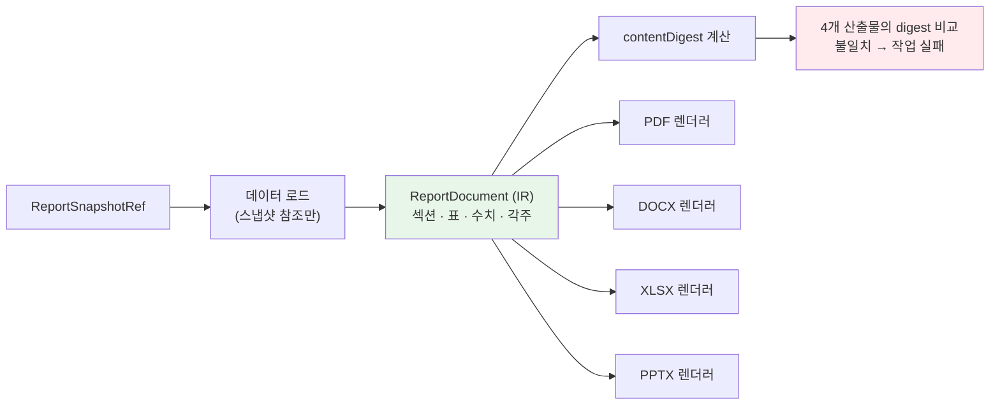

```ts
// features/report/domain/ir.ts
export interface ReportDocument {
  readonly framework: Framework;
  readonly language: ReportLanguage;
  readonly period: { start: Date; end: Date };
  readonly sections: readonly ReportSection[];
  readonly appendix: {
    readonly calculationBasis: readonly CalculationBasisEntry[];   // Req 9-4
    readonly auditOpinions: readonly AuditOpinionRef[];            // Req 9-4
  };
}

export type ReportBlock =
  | { kind: 'paragraph'; text: LocalizedText; aiGenerated: boolean }        // Req 9-8
  | { kind: 'metric'; itemCode: string; label: LocalizedText;
      value: Presented; unit: string; isEstimated: boolean;                 // Req 9-8
      basisRef: string }
  | { kind: 'table'; header: readonly LocalizedText[];
      rows: readonly (readonly Presented[])[] }
  | { kind: 'chart'; data: ChartData; altText: LocalizedText }              // Req 25-9
  | { kind: 'unmet'; itemCode: string; reason: 'no_data' | 'unsupported' }; // Req 9-3

/** 4개 형식이 동일한 수치를 담았는지 검증하기 위한 정규 다이제스트 */
export function contentDigest(doc: ReportDocument): string {
  const facts = collectBlocks(doc)
    .filter((b) => b.kind === 'metric' || b.kind === 'table')
    .map(normalizeFact)
    .sort();                            // 순서 무관
  return sha256(canonicalJson(facts));
}
```

각 렌더러는 IR을 소비할 때 자신이 실제로 출력한 수치를 수집해 다이제스트를 재계산한다. 4개가 일치하지 않으면 작업을 실패시키고 부분 산출물을 저장하지 않는다(Req 9-11). 이것이 Req 9-2를 "보장"하는 방법이다. 렌더러 코드를 조심스럽게 쓰는 것으로는 보장되지 않는다.

`value: Presented` 타입이 여기서 다시 작용한다. IR에는 이미 반올림된 문자열이 들어가므로 4개 렌더러가 각자 반올림해 다른 값을 내는 사고가 불가능하다.

### draft → review → final 상태 기계 (Req 9-1, 9-8, 9-9)

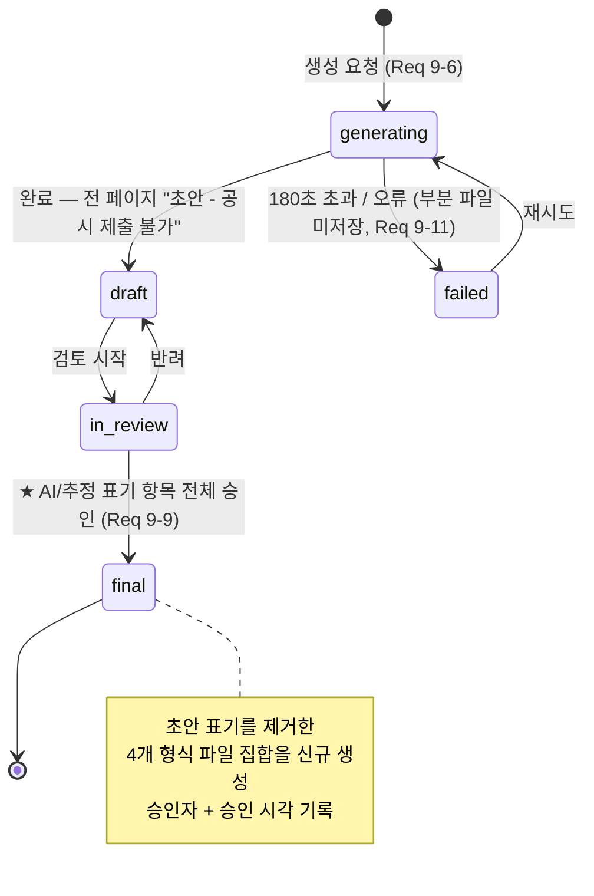

핵심 제약: `in_review → final` 전이는 `aiGeneratedSections`와 `estimatedValuePaths`의 **모든 항목**에 대한 승인 기록이 있을 때만 허용된다.

```ts
// features/report/service/approve.ts
export async function finalizeReport(
  ctx: AuthContext, reportId: string, deps: Deps,
): Promise<Result<Report, ApprovalError>> {
  const gate = await deps.policy.require(ctx, 'report:approve');   // Company_Admin 만
  if (!gate.allow) return err({ code: 'FORBIDDEN', reason: gate.reason });

  const report = await deps.reportRepo.get(ctx.companyId, reportId);
  const required = [...report.aiGeneratedSections, ...report.estimatedValuePaths];
  const approved = await deps.reportRepo.listItemApprovals(reportId);
  const missing = required.filter((k) => !approved.has(k));

  // Req 9-9: "표기 항목 전체에 대한 검토 승인" — 부분 승인으로는 final 이 되지 않는다
  if (missing.length > 0) return err({ code: 'INCOMPLETE_REVIEW', missing });

  return deps.tx(async (t) => {
    await deps.reportRepo.setStatus(t, reportId, 'final', { approvedByUserId: ctx.userId, approvedAt: new Date() });
    // Req 9-9: 초안 표기를 제거한 4개 형식 파일 집합을 신규 생성.
    // ★ 기존 draft 파일은 삭제하지 않는다. 무엇이 승인되었는지의 증거이므로.
    await deps.jobs.enqueue(t, {
      type: 'report_generate',
      payload: { reportId, mode: 'final', snapshotRefId: report.snapshotRef!.reportId },
      companyId: ctx.companyId, timeoutMs: 180_000,
    });
    await appendAudit(t, { eventType: 'report.finalized', resourceId: reportId, actorId: ctx.userId });
    return ok(report);
  });
}
```

final 생성이 **동일 스냅샷 참조**를 재사용하는 것이 중요하다. 승인 시점의 현재 데이터를 다시 읽으면 승인 대상과 다른 문서가 만들어진다.

### 규제 공시용 산출물에서 추정치 제외 (Req 4-11)

```ts
// features/report/service/load-snapshot.ts
export async function loadForReport(
  snapshot: ReportSnapshotRef, framework: Framework, deps: Deps,
): Promise<LoadedReportData> {
  const isRegulatory = REGULATORY_FRAMEWORKS.has(framework);   // ISSB, CSRD, KSSB

  const nodeValues = await deps.twinRepo.nodeValues(snapshot.twinVersionId, {
    // Req 4-11: 규제 공시용은 provenance='estimated' 노드를 제외하고 제외 목록을 반환
    excludeProvenance: isRegulatory ? ['estimated'] : [],
  });

  return {
    nodeValues: nodeValues.included,
    excludedEstimates: nodeValues.excluded,     // → Req 9-3 "데이터 미확보" 목록에 편입
  };
}
```

제외된 추정치 노드는 자동으로 Req 9-3의 미확보 항목으로 흘러가 첫 페이지 요약에 나타난다. 두 요구사항이 한 경로로 연결된다.

### 서명 URL 접근 제어 (Req 9-10)

```ts
export async function issueDownloadUrl(
  ctx: AuthContext, reportId: string, format: ReportFormat, deps: Deps,
): Promise<Result<{ url: string; expiresAt: Date }, DownloadError>> {
  const report = await deps.reportRepo.get(ctx.companyId, reportId);   // RLS 로 테넌트 검증
  if (!report) return err({ code: 'NOT_FOUND' });

  // Req 9-10: Member, Company_Admin, 또는 해당 보고 기간에 지정된 Auditor
  const allowed =
    ctx.roles.has('Company_Admin') ||
    ctx.roles.has('Member') ||
    (ctx.roles.has('Auditor') &&
     await deps.auditorRepo.coversPeriod(ctx.userId, ctx.companyId, report.periodStart, report.periodEnd));

  if (!allowed) return err({ code: 'FORBIDDEN', reason: 'ROLE_OR_PERIOD_MISMATCH' });

  const artifact = await deps.reportRepo.artifact(reportId, format, { draft: report.status !== 'final' });
  const signed = await deps.storage.createSignedUrl(artifact.storagePath, 900);   // Req 9-10: 900초

  // Req 19-1: 증빙 파일 다운로드는 로깅 대상 조회 이벤트
  await appendAudit(deps.tx, {
    eventType: 'report.download_url_issued',
    resourceType: 'ReportArtifact', resourceId: artifact.id, actorId: ctx.userId,
  });
  return ok({ url: signed.url, expiresAt: new Date(Date.now() + 900_000) });
}
```

---

## Components and Interfaces

각 기능은 `features/<name>/index.ts` 하나만 공개한다(Req 28-1). 아래는 그 공개 계약이다.

### 공용 타입

```ts
// core/domain/result.ts
export type Result<T, E> = { ok: true; value: T } | { ok: false; error: E };

// core/auth/context.ts
export interface AuthContext {
  readonly userId: string;
  readonly companyId: string;
  readonly roles: ReadonlySet<Role>;
  readonly orgNodeScope: readonly string[] | 'all';   // ABAC
  readonly mfaVerified: boolean;
  readonly locale: Locale;
  readonly requestId: string;                          // 관측성 상관 키
}

// core/jobs/port.ts
export interface JobHandle {
  readonly jobId: string;
  readonly status: JobStatus;
  readonly progress: number;
  readonly progressLabel: string | null;
}
```

### 검증 경계 스키마 (Req 28-4)

```ts
// features/activity-data/schema/activity-data.ts
export const activityDataInputSchema = z.object({
  orgNodeId: z.string().uuid(),
  itemCode: z.string().min(1).max(64),
  periodStart: z.coerce.date(),
  periodEnd: z.coerce.date(),
  // Req 3-1: 0 이상 999,999,999.999999 이하, 소수점 6자리 이하.
  // ★ number 가 아니라 문자열로 받는다. JSON number 는 정밀도를 잃는다.
  quantity: z.string()
    .regex(/^\d{1,9}(\.\d{1,6})?$/, 'DECIMAL_FORMAT')
    .transform((s) => new Decimal(s))
    .refine((d) => d.gte(0) && d.lte('999999999.999999'), 'OUT_OF_RANGE'),
  unit: z.string().min(1).max(32),
  attachmentIds: z.array(z.string().uuid()).max(5).default([]),   // Req 3-8
  onConflict: z.enum(['ask', 'overwrite', 'skip']).default('ask'), // Req 3-6
})
  .refine((v) => v.periodStart <= v.periodEnd, { path: ['periodEnd'], message: 'PERIOD_INVERTED' })
  .refine((v) => daysBetween(v.periodStart, v.periodEnd) <= 366, { path: ['periodEnd'], message: 'PERIOD_TOO_LONG' })
  .refine((v) => v.periodEnd <= today(), { path: ['periodEnd'], message: 'PERIOD_IN_FUTURE' });

export type ActivityDataInput = z.infer<typeof activityDataInputSchema>;
```

`quantity`를 문자열로 받는 것이 정밀도 전략의 시작점이다. `z.number()`로 받으면 `123456789.123456`이 IEEE754 왕복에서 이미 손상되어 도착한다. 이후 `Decimal`로 아무리 정확히 계산해도 입력이 틀렸다.

### Twin_Engine

```ts
// features/twin/index.ts
export interface TwinEnginePort {
  /** Req 4-1, 4-9: 사업장 0개면 거부. 비동기 작업 식별자 반환. */
  requestBuild(ctx: AuthContext): Promise<Result<JobHandle, TwinError>>;

  /** Req 4-5: 활동량/조직 변경 시 호출. dedupeKey 로 병합된다. */
  requestRefresh(
    tx: Prisma.TransactionClient, ctx: AuthContext, affected: AffectedScope,
  ): Promise<Result<JobHandle, TwinError>>;

  getActiveVersion(ctx: AuthContext): Promise<Result<TwinVersionView, TwinError>>;

  /** Req 4-4, 4-11: provenance 필터. 규제 공시용은 estimated 제외. */
  getNodeValues(
    ctx: AuthContext, versionId: string, opts: { excludeProvenance?: readonly NodeProvenance[] },
  ): Promise<Result<{ included: readonly TwinNodeValueView[]; excluded: readonly string[] }, TwinError>>;

  /** Req 4-6: 임의 두 보존 버전의 diff. 10초 이내. */
  diff(ctx: AuthContext, fromVersionId: string, toVersionId: string): Promise<Result<TwinDiff, TwinError>>;

  /** Req 4-2: 도메인별 충족률 */
  domainStats(ctx: AuthContext, versionId: string): Promise<Result<readonly TwinDomainStatView[], TwinError>>;
}

export type TwinError =
  | { code: 'NO_FACTORY_REGISTERED'; requiredInputs: readonly string[] }   // Req 4-9
  | { code: 'BUILD_IN_PROGRESS'; queuePosition: number; jobId: string }    // Req 4-10
  | { code: 'VERSION_PRUNED'; versionId: string }                          // Req 4-6 보존 정책
  | { code: 'FORBIDDEN'; reason: DenyReason };
```

### Emission_Calculator

```ts
// features/emission/index.ts
export interface EmissionCalculatorPort {
  /** Req 5-1: 활동량 저장 후 60초 이내 산정. 트랜잭션에 참여한다. */
  calculateForActivityData(
    tx: Prisma.TransactionClient, ctx: AuthContext, activityDataIds: readonly string[],
  ): Promise<Result<CalculationSummary, EmissionError>>;

  /** Req 5-9: 기준연도 변경 시 전체 재산정. 이전 결과는 보존. */
  recalculate(
    ctx: AuthContext, args: { baseYear: number; reason: string },
  ): Promise<Result<JobHandle, EmissionError>>;

  /**
   * Req 5-8: 임의 조직 노드의 배출 합계.
   * ★ Scope 2 조회 시 method 를 생략할 수 없다. 타입으로 이중 계상을 막는다.
   */
  sumTco2e(
    ctx: AuthContext,
    q: | { scope: 1 | 3; nodeId: string; period: DateRange; scope3Category?: number }
       | { scope: 2; nodeId: string; period: DateRange; scope2Method: Scope2Method },
  ): Promise<Result<Exact, EmissionError>>;

  /** Req 5-7: 단계별 계산 추적. 3초 이내. */
  trace(ctx: AuthContext, emissionResultId: string): Promise<Result<readonly CalculationStep[], EmissionError>>;

  /** Req 5-3: 위치기반/시장기반 병렬 제시 */
  scope2Comparison(ctx: AuthContext, nodeId: string, period: DateRange): Promise<Result<Scope2Comparison, EmissionError>>;
}

export interface CalculationSummary {
  readonly calculationRunId: string;
  readonly computed: number;
  readonly onHold: readonly OnHoldRecord[];      // Req 5-6: 계수 부재 건
  readonly restatementVerdict: RestatementVerdict | null;   // Req 5-13
}

export type EmissionError =
  // Req 5-6 + Req 33-8: 각 FactorGap은 Factor_Registry의 PROVIDER_GAP에서 귀속된
  //   미지원 차원(AttributedGap)을 그대로 실어 통지에 포함한다.
  | { code: 'FACTOR_NOT_FOUND'; missing: readonly FactorGap[] }           // Req 5-6
  | { code: 'PERIOD_LOCKED'; periodStart: Date; periodEnd: Date }         // Req 19-9
  | { code: 'NON_LEAF_ORG_NODE'; orgNodeId: string }                      // 집계 불변식 보호
  | { code: 'FORBIDDEN'; reason: DenyReason };
```

### Factor_Registry

```ts
// features/factor/index.ts
export interface FactorRegistryPort {
  /** Req 6-5: 회사 재정의 → 국가 플러그인 → 플랫폼 기본. 최초 일치 1개 + 출처 단계 반환. */
  resolve(ctx: AuthContext, q: FactorQuery): Promise<Result<FactorResolution, FactorError>>;

  /** Req 6-2, 6-7: 세트 단위 원자적 등록. 위반 시 부분 저장 없음. */
  registerSet(
    ctx: AuthContext, set: FactorSetInput,
  ): Promise<Result<{ factorSetId: string; activatedAt: Date }, FactorValidationReport>>;

  /** Req 6-9: 사용된 계수의 삭제/직접 수정은 거부. 유효 종료일 설정만 허용. */
  deactivate(
    ctx: AuthContext, factorId: string, validTo: Date,
  ): Promise<Result<void, FactorError>>;

  /** Req 6-3: 갱신 영향 회사·건수 조회 (알림 발송의 근거) */
  impactOfUpdate(factorSetId: string): Promise<Result<readonly FactorImpact[], FactorError>>;

  /** Req 33-7: 등록된 Provider의 메타데이터(지원 국가·활동 유형·가스·발행 연도 범위) 목록 */
  listProviders(ctx: AuthContext): Promise<Result<readonly ProviderMetadata[], FactorError>>;

  /**
   * Req 33-9: Super_Admin용 Provider별 커버리지.
   * 요건 33-7 메타데이터 + 해당 Provider가 실제로 반환한 계수 조회 건수.
   */
  coverage(
    ctx: AuthContext, providerId?: string,
  ): Promise<Result<readonly ProviderCoverageView[], FactorError>>;
}

export interface ProviderCoverageView {
  readonly metadata: ProviderMetadata;
  /** Req 33-9: resolvedHits 누적. Provider 전체 및 차원 조합별. */
  readonly resolvedHits: bigint;
  readonly byDimension: readonly {
    countryCode: string; activityType: string; gas: FactorGas;
    yearFrom: number; yearTo: number; resolvedHits: bigint;
  }[];
  readonly lastIngestedAt: Date | null;
}

export type FactorError =
  /** Req 33-8: 계수 부재를 미지원 차원으로 귀속한 결과. FACTOR_NOT_FOUND를 대체한다. */
  | { code: 'PROVIDER_GAP'; query: FactorQuery; gap: AttributedGap }
  | { code: 'FACTOR_IMMUTABLE'; factorId: string }                        // Req 6-9
  | { code: 'PROVIDER_UNAVAILABLE'; providerId: string; reason: 'TIMEOUT' | 'ERROR' }  // Req 33-10
  | { code: 'FORBIDDEN'; reason: DenyReason };

export interface FactorValidationReport {
  readonly code: 'SET_REJECTED';
  /** Req 6-7: 위반 행 번호와 사유 목록 */
  readonly violations: readonly {
    rowNumber: number;
    field: string;
    reason: 'VALIDITY_OVERLAP' | 'UNIT_MISMATCH' | 'VALUE_OUT_OF_RANGE' | 'MISSING_REQUIRED';
    detail?: string;
  }[];
}
```

### Score_Engine

```ts
// features/score/index.ts
export interface ScoreEnginePort {
  /** Req 7-1: 트윈 신규 버전 생성 시 120초 이내. 멱등(동일 조합은 no-op). */
  computeForTwinVersion(
    ctx: AuthContext, twinVersionId: string,
  ): Promise<Result<ScoreSnapshotView, ScoreError>>;

  /** Req 7-7, 7-8: 시계열 + 루브릭 버전 경계 + 최신 루브릭 재산출 병기 */
  trend(ctx: AuthContext, range: DateRange): Promise<Result<TrendResult, ScoreError>>;

  /** Req 7-4, 7-5: 프레임워크 커버리지 + 미충족 항목 */
  coverage(
    ctx: AuthContext, twinVersionId: string, frameworks: readonly Framework[],
  ): Promise<Result<readonly FrameworkCoverage[], ScoreError>>;
}

/** ★ 순수 함수로 공개한다. Scenario_Simulator 가 점수 변화량 계산에 재사용한다 (Req 11-3). */
export { scoreFromIndicators, type IndicatorValue, type ScoreOutput } from './domain/score';

export type ScoreError =
  | { code: 'TWIN_VERSION_NOT_FOUND'; twinVersionId: string }
  | { code: 'COMPUTE_TIMEOUT'; previousSnapshotPreserved: true }   // Req 7-10
  | { code: 'RUBRIC_NOT_EFFECTIVE'; asOf: Date };
```

### AI_Adapter

앞의 "AI 아키텍처" 섹션에 `AiAdapter` 정의가 있다. 추가로 제공자 등록 계약:

```ts
// core/ai/provider.ts
export interface AiProvider {
  readonly id: ProviderId;                          // 'openai' | 'anthropic' | 'gemini' | 'deepseek'
  readonly dataRegions: readonly string[];          // Req 24-8: 데이터 처리 지역 공개
  capabilities(model: string): ProviderCapabilities; // Req 27-1
  invoke(req: NormalizedRequest, signal: AbortSignal): Promise<NormalizedResponse>;
  invokeStream(req: NormalizedRequest, signal: AbortSignal): AsyncIterable<StreamChunk>;
  /** 제공자별 가격표. 토큰 → 최소통화단위 정수 */
  price(model: string, usage: TokenUsage): bigint;
}

// 신규 제공자 추가는 이 배열에 한 항목을 넣는 것으로 끝난다 (Req 27: 코드 수정 없이 교체)
export const PROVIDERS: readonly AiProvider[] = [openAiProvider, anthropicProvider, geminiProvider, deepSeekProvider];
```

### 작업 큐

```ts
// core/jobs/port.ts
export interface JobQueuePort {
  /** ★ tx 를 필수 인자로 받는다. 도메인 쓰기와 원자적으로 커밋되어야 한다. */
  enqueue(tx: Prisma.TransactionClient, spec: JobSpec): Promise<EnqueueResult>;

  get(ctx: AuthContext, jobId: string): Promise<Result<JobHandle, JobError>>;
  requestCancel(ctx: AuthContext, jobId: string): Promise<Result<void, JobError>>;
}

export interface JobSpec {
  readonly type: JobType;
  readonly companyId: string | null;
  readonly payload: unknown;                // JOB_PAYLOAD_SCHEMAS[type] 로 검증됨
  readonly lockKey?: string;                // Req 4-10
  readonly dedupeKey?: string;              // Req 10-11
  readonly idempotencyKey?: string;         // Req 17-8, 20-13
  readonly priority?: number;
  readonly runAfter?: Date;
  readonly maxAttempts?: number;
  readonly pool?: 'heavy' | 'light';
}

export type EnqueueResult =
  | { kind: 'created'; job: JobHandle }
  | { kind: 'merged'; job: JobHandle }       // Req 10-11: 기존 대기 작업에 병합됨
  | { kind: 'deduplicated'; job: JobHandle }; // idempotencyKey 재사용

/** 워커 프레임워크가 핸들러에 주는 실행 컨텍스트 */
export interface JobRunContext {
  readonly jobId: string;
  readonly attempt: number;
  readonly signal: AbortSignal;
  /** 진행률 보고 + 취소 확인. 5초 이내 간격으로 호출해야 한다 (Req 22-5). */
  checkpoint(progress: number, label: string): Promise<void>;
}

export interface JobHandler<P> {
  readonly type: JobType;
  readonly payloadSchema: z.ZodType<P>;
  readonly timeoutMs: number;
  /** 타임아웃/실패 시 부분 결과 처리 정책. 프레임워크가 강제한다. */
  readonly partialResultPolicy: 'preserve' | 'discard';
  run(ctx: JobRunContext, payload: P): Promise<JobResult>;
}
```

### Scenario_Simulator

```ts
// features/scenario/index.ts
export interface ScenarioSimulatorPort {
  /** Req 11-1, 11-9: 500~2000개 생성. 비동기, 300초 이내. */
  simulate(
    ctx: AuthContext, args: { seed?: bigint; assumptions?: Partial<AssumptionSetInput> },
  ): Promise<Result<JobHandle, ScenarioError>>;

  /** Req 11-12: 신규 생성 없이 기존 집합 재평가. 30초 이내. 동기 경로. */
  reevaluate(
    ctx: AuthContext, scenarioRunId: string, assumptions: AssumptionSetInput,
  ): Promise<Result<ReevaluationResult, ScenarioError>>;

  /** Req 11-5: 3개 정렬 기준으로 각각 상위 50개 */
  ranked(
    ctx: AuthContext, scenarioRunId: string, assumptionSetId: string,
  ): Promise<Result<{ byReduction: readonly ScenarioView[]; byRoi: readonly ScenarioView[];
                     byPayback: readonly ScenarioView[] }, ScenarioError>>;

  /** Req 11-6, 11-8: AND 조건 필터. 0건이면 제약별 최소 완화값 제시. */
  filter(
    ctx: AuthContext, scenarioRunId: string, assumptionSetId: string, c: ScenarioConstraints,
  ): Promise<Result<FilterResult, ScenarioError>>;

  /** Req 11-14: 채택 → 실행 계획 저장 + 마켓플레이스 수요 초안 생성 */
  adopt(ctx: AuthContext, scenarioId: string, assumptionSetId: string): Promise<Result<AdoptedPlanView, ScenarioError>>;
}

export interface FilterResult {
  readonly scenarios: readonly ScenarioView[];
  /** Req 11-8: 결과가 0건일 때 각 제약의 최소 완화값 */
  readonly relaxationHints: readonly {
    constraint: 'budget' | 'reductionTarget' | 'maxPayback';
    currentValue: string;
    minimumFeasibleValue: string;
  }[] | null;
}

export type ScenarioError =
  | { code: 'MISSING_BASELINE_DATA'; missing: readonly string[] }              // Req 11-7
  | { code: 'CONSTRAINT_OUT_OF_RANGE'; field: string; allowed: string }        // Req 11-7
  | { code: 'INSUFFICIENT_FEASIBLE_COMBINATIONS'; generated: number; required: 500 }
  | { code: 'SIMULATION_TIMEOUT'; partialDiscarded: true };                    // Req 11-10
```

### Repository 포트 (예시)

Repository 인터페이스는 `domain/`에 선언되고 구현은 `repository/`에 있다. Service는 인터페이스만 안다.

```ts
// features/emission/domain/ports.ts
export interface EmissionRepository {
  /** ★ 배출 합계를 얻는 유일한 경로. 다른 곳에서 EmissionResult 에 직접 SUM 하는 것을 lint 로 금지한다. */
  sumTco2e(q: SumQuery): Promise<Exact>;

  /** Req 5-12: fingerprint 기반 멱등 삽입 */
  upsertResults(tx: TxLike, rows: readonly EmissionResultRow[]): Promise<{ inserted: number; skipped: number }>;

  /** Req 5-10: 재산정 이력을 시간 순으로 */
  listRuns(companyId: string, range: DateRange): Promise<readonly CalculationRunRow[]>;

  /** 동일 트랜잭션에서 읽기 모델 갱신 */
  refreshRollups(tx: TxLike, scope: RollupScope): Promise<void>;

  markStaleByFactor(tx: TxLike, factorId: string): Promise<number>;   // Req 6-4
}

/** ORM 타입을 도메인에 노출하지 않기 위한 최소 트랜잭션 추상 (Req 28-2 (b)) */
export interface TxLike { readonly __tx: unique symbol }
```

`TxLike`가 불투명 타입인 이유: `Prisma.TransactionClient`를 `domain/`이 import하면 Req 28-2 (b)를 위반한다. Repository 구현체가 내부에서 실제 타입으로 캐스팅한다. 캐스팅은 `repository/` 안에서만 일어난다.

---

## Correctness Properties

*속성(property)은 시스템의 모든 유효한 실행에 대해 참이어야 하는 특성 또는 동작이다. 즉 시스템이 무엇을 해야 하는가에 관한 형식적 진술이다. 속성은 사람이 읽는 명세와 기계가 검증하는 정확성 보증 사이의 다리 역할을 한다.*

이 시스템은 순수 계산(단위 환산, 배출 산정, 점수, 재무 계산, 파싱/직렬화, 금액 정수 연산)이 핵심 로직의 다수를 차지하고, 요구사항이 결정성·멱등성·집계 불변식·왕복 속성을 **명시적으로** 요구한다(Req 3-5, 5-8, 5-12, 7-9, 11-13, 17-6, 21-4, 26-5, 28-7). 따라서 속성 기반 테스트가 적합하다.

아래 속성은 수락 기준별 사전 분석(테스트 유형 분류 → 속성 정식화 → 중복 제거 반영)을 거쳐 도출되었다. 사전 분석에서 INTEGRATION 또는 SMOKE로 분류된 기준(Realtime 전달 보장, Storage 보존 기간, 결제 대행사 서명, 지오코딩, Mapbox 렌더링, CloudWatch 계열)은 속성으로 만들지 않고 통합/스모크 테스트로 처리한다. 또한 중복 제거 결과로 다음을 통합했다.

- "활동량 추가 시 건수 증가"는 **속성 1**(왕복)에 포함되므로 별도 속성으로 두지 않는다.
- Req 5-12의 결정성과 멱등성은 하나의 재실행 불변성 속성으로 통합했다(**속성 4**).
- 조직 계층 4개 수준별 집계를 4개 속성으로 나누지 않고 임의 트리에 대한 단일 보편 속성으로 통합했다(**속성 3**).
- Req 17-6(수수료 분배)과 Req 17-13(환불 역산)을 연산 시퀀스에 대한 단일 보존 속성으로 통합했다(**속성 8**).
- Req 24-1과 24-11을 테이블·연산 곱집합에 대한 단일 속성으로 통합했다(**속성 11**).

### Property 1: 활동량 데이터 내보내기·가져오기 왕복

*임의의* 유효한 활동량 데이터 집합에 대하여, Data_Exporter로 CSV 또는 XLSX로 내보낸 뒤 Data_Importer로 다시 가져온 결과는 원본 집합과 동등하다.

동등성 정의: 레코드 순서와 무관한 집합 동등. 각 레코드에 대해 `orgNodeId`, `periodStart`, `periodEnd`, `itemCode`, `canonicalUnit`이 완전 일치하고 `canonicalValue`가 소수점 6자리까지 일치한다.

**Validates: Requirements 3-5, 3-4**

### Property 2: 플러그인 매니페스트 파싱·직렬화 왕복

*임의의* 1 MiB 이하 유효 플러그인 매니페스트에 대하여, 파싱 → 직렬화 → 재파싱한 결과는 최초 파싱 결과와 동등하다.

동등성 정의: (a) 모든 필수 필드 값 일치, (b) 미지정 선택 필드에 기본값을 적용한 뒤의 값 일치, (c) 수치 값은 선행 0 없는 10진 정규 표기 기준 일치, (d) 미지(unknown) 필드의 키와 값 일치. 키 순서와 공백은 무시한다.

**Validates: Requirements 21-4, 21-3, 21-2**

### Property 3: 조직 계층 집계 불변식

*임의의* 조직 트리(깊이 ≤ 4, 임의 분기 수)와 리프 노드에 귀속된 임의의 배출 결과 집합에 대하여, 임의의 내부 노드의 배출 합계와 그 직계 자식 노드들의 배출 합계의 총합의 절대 차이는 0이다.

허용오차: 요구사항은 0.000001 tCO2e 이하를 요구하지만 본 설계는 정확히 0을 달성한다. 테스트는 `expected.equals(actual)`로 판정한다(Decimal 정확 비교). 이 속성은 임의 Scope, 임의 기간, 임의 `scope2Method`에 대해 성립해야 한다.

**Validates: Requirements 5-8**

### Property 4: 배출량 산정 재실행 불변성 (결정성 + 멱등성)

*임의의* 활동량 레코드 집합, 계수 세트 버전, GWP 버전 조합에 대하여, 산정을 2회 이상 실행하면 (a) 모든 가스별 질량과 tCO2e 값의 절대 차이가 0이고, (b) 두 번째 실행 이후 `EmissionResult` 행 수가 증가하지 않는다.

**Validates: Requirements 5-12, 5-10**

### Property 5: ESG 점수 산출 결정성

*임의의* 지표 값 집합, 루브릭 버전, 산업 가중치 세트에 대하여, 점수 산출을 반복 실행하면 모든 축 하위 점수와 종합 점수가 정수 기준으로 완전히 일치하고, 연속값(`rawE/rawS/rawG/rawTotal`)도 소수 4자리까지 일치한다. 산출 과정에서 AI 제공자 호출이 0회 발생한다.

AI 호출 0회는 테스트 더블(호출 시 즉시 실패하는 `AiAdapter` 스텁)을 주입해 검증한다.

**Validates: Requirements 7-9, 7-1**

### Property 6: 가중치 재정규화 무결성

*임의의* 지표 값 집합(일부 지표의 값이 부재)에 대하여, 각 축에 대해 (a) 값이 존재하는 지표들의 재정규화 가중치 합계가 정확히 1.0000이고, (b) 값이 부재한 지표의 기여 점수가 0이며 제외 목록에 포함되고, (c) 값이 부재한 지표를 0점으로 처리했을 때의 점수보다 재정규화 점수가 크거나 같다.

(c)는 Req 7-3의 "0점으로 처리하지 않고"를 실질적으로 검증한다. 축의 모든 지표 값이 부재한 경우 가중치 합계는 0으로 정의한다(0으로 나누기 회피).

**Validates: Requirements 7-3, 7-2**

### Property 7: 시나리오 생성 재현성

*임의의* 입력 데이터, 가정값 세트, 난수 시드에 대하여, `generateScenarios`를 2회 호출하면 생성된 시나리오 집합이 `canonicalKey` 다중집합 기준으로 완전히 일치하고 반환 순서도 동일하다. 또한 생성된 모든 시나리오는 (a) 조치 개수가 1 이상 5 이하이고, (b) 실행가능성 제약을 만족하며, (c) 동일 조직 노드·동일 상호배타 그룹의 조치를 2개 이상 포함하지 않고, (d) `canonicalKey`가 유일하다.

**Validates: Requirements 11-13, 11-1, 11-2**

### Property 8: 결제·정산 금액 보존

*임의의* 결제 금액과 임의의 (부분 환불 · 전체 환불 · 차지백) 연산 시퀀스에 대하여, 각 연산 후 매 시점에 `플랫폼 수수료 + 공급자 정산액 == 잔여 결제 총액`이 최소통화단위 정수로 정확히 성립하고, 원장 항목 금액의 총합이 0이며, 세 값 모두 음수가 아니다.

모든 값은 `BigInt` 최소통화단위. 부동소수 비교를 사용하지 않는다. 단일 시퀀스 내 통화는 하나로 고정된다.

**Validates: Requirements 17-6, 17-13, 17-7**

### Property 9: 결제 멱등성 키

*임의의* 결제 요청과 임의의 재전송 횟수(1~10회), 임의의 재전송 시간 간격(최초 요청으로부터 7일 이내)에 대하여, 동일 멱등성 키의 요청은 추가 결제를 생성하지 않고 최초 처리 결과와 동일한 응답을 반환하며, 원장 항목 수가 증가하지 않는다.

7일을 초과한 재전송은 새 결제로 처리되어야 한다(경계 검증 포함).

**Validates: Requirements 17-8, 20-13**

### Property 10: 단위 환산 불변성과 표시 단위계 왕복

*임의의* 수량, 임의의 허용 단위 쌍, 임의의 단위계 전환 시퀀스에 대하여, (a) `metric → imperial → metric` 왕복 후 표시값이 최초 표시값과 문자열 수준으로 동일하고, (b) 저장된 정규 값이 전환에 의해 변경되지 않으며, (c) 동일 물리량을 서로 다른 허용 단위로 입력한 두 레코드의 정규 환산값이 소수 6자리까지 일치한다.

(c)가 Req 3-1의 항목별 기준 단위 환산이 단위 선택에 무관함을 보장한다.

**Validates: Requirements 26-5, 3-1**

### Property 11: 크로스 테넌트 접근 불가

*임의의* 테넌트 테이블, *임의의* 두 개의 서로 다른 회사, *임의의* 연산(SELECT · INSERT · UPDATE · DELETE)에 대하여, 회사 B 소속 사용자의 자격으로 회사 A의 행을 대상으로 하는 연산은 0행을 반환하거나 권한 오류로 거부되며, 회사 A의 데이터 상태는 변경되지 않는다.

테이블 목록은 `information_schema`에서 `companyId` 컬럼을 가진 테이블 전체를 introspect하여 생성한다(새 테이블 자동 포함). 각 테이블에 대해 `relrowsecurity`와 `relforcerowsecurity`가 모두 true임도 함께 검증한다.

**Validates: Requirements 24-1, 24-11, 24-9**

### Property 12: 지표 단조성

*임의의* 지표 값 쌍 `(v1, v2)`에서 `v1 ≤ v2`일 때, `direction = 'higher_better'` 지표는 정규화 점수가 `f(v1) ≤ f(v2)`를, `direction = 'lower_better'` 지표는 `f(v1) ≥ f(v2)`를 만족한다. 또한 *임의의* 활동량 레코드에서 수량을 증가시키면 해당 레코드의 tCO2e가 감소하지 않고, *임의의* 시나리오에 실행가능한 조치를 추가하면 보정 감축량이 감소하지 않는다.

**Validates: Requirements 28-7**

### Property 13: 순차 적용 보정의 상한

*임의의* 조치 조합과 임의의 기준 배출원 집합에 대하여, `correctedTco2e ≤ naiveSumTco2e`이고 `correctedTco2e ≤ Σ(기준 배출원의 배출량)`이며 `overlapTco2e == naiveSumTco2e − correctedTco2e ≥ 0`이다. 또한 조합 내 조치의 입력 순서를 임의로 뒤섞어도 `correctedTco2e`가 동일하다.

두 번째 부등식이 물리적 불가능(기존 배출량보다 많이 감축)을 배제한다. 세 번째 조건이 결정적 적용 순서 강제를 검증한다.

**Validates: Requirements 11-4, 11-3**

### Property 14: biogenic 배출 분리

*임의의* 연료 활동량 집합에 대하여, Scope 1 합계에 biogenic CO2가 포함되지 않고, 동일 연료의 비생물 기원 CH4 및 N2O는 Scope 1 합계에 포함되며, `biogenicCo2T`의 합계가 별도로 조회 가능하고 항상 0 이상이다.

**Validates: Requirements 5-11**

### Property 15: Scope 2 계약 한도와 이원 산정 일관성

*임의의* 소비 전력량과 임의의 REC/PPA 계약 집합에 대하여, (a) 각 계약에 배분된 전력량이 그 계약의 계약 전력량을 초과하지 않고, (b) 배분 전력량의 총합과 잔여 전력량의 합이 소비 전력량과 정확히 일치하며, (c) 계약 집합의 입력 순서를 뒤섞어도 시장기반 배출량이 동일하고, (d) 계약이 0개인 경우 시장기반 값이 잔여전력조합 계수(부재 시 위치기반 계수) 적용값과 일치한다.

**Validates: Requirements 5-3, 5-4**

### Property 16: 계수 해석 결정성과 소급 범위

*임의의* 계수 레지스트리 상태와 임의의 조회 질의에 대하여, (a) 반환되는 계수는 최대 1개이고, (b) 반환된 계수의 `tier`보다 높은 우선순위 tier에 해당 질의를 만족하는 계수가 존재하지 않으며, (c) `fallbackYears`가 0 이상 3 이하이고, (d) 동일 질의를 반복하면 동일 `factorId`를 반환한다. 또한 등록된 임의의 계수 세트에 대해 동일 스코프 키의 유효기간이 서로 중첩되지 않는다.

**Validates: Requirements 6-5, 6-8, 6-7, 6-1**

### Property 17: 임포트 행 분할 완전성

*임의의* 업로드 파일(유효 행과 무효 행이 임의로 섞임, 10,000행 이하)에 대하여, `성공 건수 + 실패 건수 == 전체 데이터 행 수`이고, 성공한 행만 저장되며, 실패 행 목록의 행 번호 집합이 저장되지 않은 행의 집합과 정확히 일치하고, 오류 리포트 CSV를 파싱하면 실패 행 수와 동일한 행 수를 얻는다.

**Validates: Requirements 3-3, 3-2**

### Property 18: 감사 로그 해시 체인 무결성

*임의의* 감사 이벤트 시퀀스에 대하여, (a) `chainKey`별 `seq`가 1부터 빈틈 없이 단조 증가하고, (b) 각 레코드의 `recordHash == sha256(prevHash + canonicalJson(payload))`이며, (c) 임의의 레코드에 대해 행위자 가명화를 수행한 후에도 전체 체인 검증이 통과하고, (d) UPDATE 또는 DELETE 시도가 권한 오류로 거부된다.

(c)가 Req 19-2(불변성)와 Req 19-5/24-12(사후 가명화)의 공존을 검증한다.

**Validates: Requirements 19-2, 19-5, 19-8, 24-12**

### Property 19: 벤치마크 k-익명성 억제

*임의의* 익명 레코드 집합과 임의의 Peer_Group 질의에 대하여, 반환되는 모든 통계값은 그 값 산출에 기여한 서로 다른 회사 수가 5 이상이며, 5 미만인 통계값은 반환되지 않고 억제 사유가 반환되고, 반환된 통계에 개별 레코드 값·최소값·최대값이 포함되지 않는다.

**Validates: Requirements 15-3, 15-4, 15-10**

### Property 20: 대시보드 이벤트 병합 상한

*임의의* 이벤트 도착 시각 시퀀스에 대하여, 임의의 1초 구간에서 발생하는 위젯 재렌더 횟수가 1회 이하이고, 병합 후 표시되는 값이 그 구간에 도착한 이벤트 중 가장 최신 값이며, 어떤 이벤트도 유실되지 않는다(모든 dirty 위젯 코드가 결국 flush에 포함된다).

가상 타이머(fake timers)로 시간을 제어하여 실행한다.

**Validates: Requirements 8-4, 8-3**

### Property 21: 리포트 4개 형식 수치 동일성

*임의의* `ReportDocument` 중간 표현에 대하여, PDF · DOCX · XLSX · PPTX 렌더러가 각각 산출한 항목-값 다이제스트가 모두 동일하고, IR의 다이제스트와도 동일하다.

**Validates: Requirements 9-2, 9-7**

### Property 22: 커서 페이지네이션 안정성

*임의의* 리소스 집합과 임의의 순회 중 삽입·삭제 연산 시퀀스에 대하여, 커서로 전체를 순회한 결과에 (순회 시작 시점에 존재했고 삭제되지 않은) 레코드의 중복이 없고 누락이 없다.

**Validates: Requirements 20-1**

### Property 23: 산식 파싱·평가 안전성과 결정성

*임의의* 문자열에 대하여, `parseFormula`는 화이트리스트된 생성 규칙만으로 구성된 AST를 반환하거나 위반 문자 오프셋과 사유를 담은 실패를 반환한다. 즉 `FormulaAst` 판별 유니온 밖의 노드를 결코 생성하지 않고, 예외를 던지지 않으며, 파싱 중에 어떤 것도 평가하지 않는다.

*임의의* 유효한 AST와 *임의의* 바인딩 집합에 대하여, 평가를 반복 실행하면 절대 차이 0의 동일한 `Decimal`을 반환하고, 평가 과정에서 부동소수점 연산이 0회 발생하며, 분모가 0으로 평가되는 경우 무한대 또는 NaN 대신 `DIVISION_BY_ZERO` 오류를 반환한다.

검증 방법: (a) 유니온 밖 노드 부재는 반환된 AST를 재귀 순회하며 `kind`가 4개 값 중 하나임을 확인한다. (b) 예외 부재는 임의 바이트열(제어문자·유니코드·초장문 포함)을 입력해 `Result` 외의 이탈이 없음을 확인한다. (c) 파싱 중 평가 부재는 `Decimal` 산술 메서드에 스파이를 걸어 `parseFormula` 호출 중 호출 횟수 0을 확인한다. (d) 부동소수점 연산 0회는 전역 `Math` 및 원시 `number` 산술 경로에 대한 스파이와, `literal` 노드가 `number`가 아닌 십진 문자열임을 확인하는 타입 수준 검사로 확인한다.

**Validates: Requirements 32-4, 32-5, 32-6, 32-7, 32-8, 32-9**

### Property 24: 규칙 해석 우선순위와 유일성

*임의의* 규칙 레지스트리 상태와 *임의의* 지표 조회에 대하여, `resolveRule`은 최대 1개의 규칙을 반환한다. 반환된 규칙보다 상위 우선순위 차원(산업 > 국가 > 기본)에 조회 조건을 만족하는 규칙이 존재하지 않고, 반환된 규칙의 유효 기간이 조회 기준일을 포함하며, 동일 조회를 반복하면 동일한 규칙 버전 식별자를 반환한다.

추가로, 등록된 어떤 두 규칙도 동일한 (`indicatorCode`, `countryCode`, `industryCode`) 범위에서 유효 기간이 겹치지 않는다.

허용오차: 없음. "최대 1개"는 정확히 `length <= 1`이며 동률 시 임의 선택을 허용하지 않는다. 중복 유효 기간 부재는 배제 제약이 활성화된 실제 DB에 임의의 규칙 등록 시퀀스를 시도해 겹치는 등록이 예외 없이 거부됨을 확인하는 방식으로 검증한다(애플리케이션 수준 사전 검사만으로는 동시 삽입을 놓친다).

**Validates: Requirements 32-10, 32-11, 32-12**

---

## Error Handling

### 오류 택소노미

```ts
// core/domain/errors.ts
export type ErrorCategory =
  | 'VALIDATION'      // 입력 형식/범위 위반. 재시도 무의미. HTTP 422
  | 'AUTHENTICATION'  // 미인증. HTTP 401
  | 'AUTHORIZATION'   // 권한 부족. HTTP 403
  | 'NOT_FOUND'       // 리소스 부재 (또는 테넌트 경계 밖 → 존재를 노출하지 않기 위해 404)
  | 'CONFLICT'        // 상태 충돌, 중복. HTTP 409
  | 'PRECONDITION'    // 선행 조건 미충족 (사업장 0개, 계수 부재). HTTP 422
  | 'QUOTA'           // 한도 초과 (AI 비용, API 요청, 행 수). HTTP 429 또는 402
  | 'LOCKED'          // 보고 기간 잠금, 읽기 전용 계정. HTTP 423
  | 'UPSTREAM'        // AI 제공자, 결제 대행사, 지오코딩 실패. 재시도 가능
  | 'TIMEOUT'         // 예산 초과. 재시도 가능
  | 'INTERNAL';       // 예상치 못한 오류. 재시도 가능

export interface AppError {
  readonly category: ErrorCategory;
  readonly code: string;                 // "FACTOR_NOT_FOUND", "PERIOD_LOCKED"
  readonly requestId: string;            // Req 20-12: 요청 추적 식별자
  /** 사용자에게 보이는 메시지 키. i18n 번역 대상. 내부 정보를 담지 않는다. */
  readonly messageKey: string;
  readonly fields?: readonly { path: string; reason: string }[];   // Req 28-9
  /** 서버 로그 전용. 응답에 포함하지 않는다. */
  readonly internal?: { cause?: unknown; detail?: Record<string, unknown> };
  readonly retryable: boolean;
}
```

`RETRYABLE = category ∈ {UPSTREAM, TIMEOUT, INTERNAL}`. 작업 큐의 재시도 판정이 이 필드만 본다. 핸들러가 재시도 여부를 판단하지 않는다.

### 사용자 노출 면과 내부 면의 분리

```ts
// app/api/_lib/to-response.ts
export function toResponse(e: AppError): Response {
  // ★ internal 은 응답에 포함하지 않는다. 로그에만 남긴다.
  logger.error({ requestId: e.requestId, code: e.code, category: e.category, internal: e.internal });

  const body = {
    error: {
      code: e.code,
      message: t(e.messageKey),          // 요청자 로케일로 번역 (Req 26-2)
      requestId: e.requestId,            // Req 20-12: 사용자가 지원 문의에 인용
      fields: e.fields,                  // Req 28-9: 실패 필드 식별
    },
  };
  return Response.json(body, { status: STATUS[e.category] });
}
```

`INTERNAL` 카테고리는 `messageKey`를 항상 `error.internal`(일반 메시지)로 강제한다. 예외 메시지가 그대로 사용자에게 노출되면 스택 정보나 SQL 조각이 유출된다.

### 단일 검증 경계 (Req 28-4)

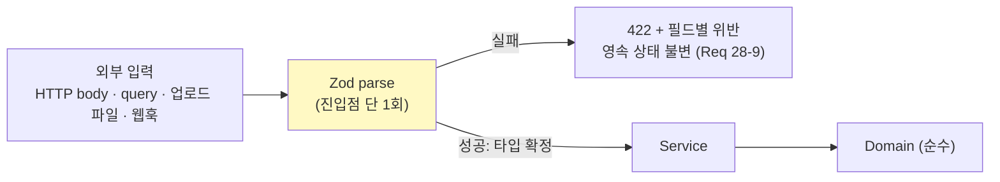

Service 계층은 **재검증하지 않는다**. 재검증을 허용하면 (a) 어느 곳이 진실의 검증인지 모호해지고, (b) 두 검증이 어긋나 통과했으나 거부되는 입력이 생긴다. 대신 Service의 입력 타입을 `z.infer<>`로 선언해 컴파일 시점에 스키마 통과 여부를 강제한다.

```ts
// features/activity-data/service/create.ts
import type { ActivityDataInput } from '../schema/activity-data';   // z.infer 타입

// ★ 이 타입은 스키마 parse 를 통과한 값만 만들 수 있다. 재검증이 필요 없다.
export async function createActivityData(
  ctx: AuthContext, input: ActivityDataInput, deps: Deps,
): Promise<Result<ActivityDataResult, AppError>> { /* ... */ }
```

업로드 파일 내용도 동일 경계를 통과한다. 파일 파싱 결과의 **각 행**에 행 스키마를 적용한다.

```ts
export const importRowSchema = activityDataInputSchema.omit({ attachmentIds: true, onConflict: true });
```

행 스키마를 수동 입력 스키마에서 파생시키므로 두 경로의 검증 규칙이 어긋날 수 없다. Req 3-5의 왕복 속성이 성립하기 위한 전제 조건이기도 하다.

### 부분 실패 시맨틱

요구사항은 세 곳에서 서로 다른 부분 실패 정책을 규정한다. 각각을 명시적 타입으로 표현한다.

#### 1) 행 단위 임포트 (Req 3-3)

```ts
export interface ImportOutcome {
  readonly batchId: string;
  readonly totalRows: number;
  readonly succeeded: number;
  readonly failed: number;
  readonly failures: readonly {
    rowNumber: number;
    rawRow: string;          // Req 3-3: 원본 행 내용
    field: string;
    reason: string;
  }[];
  readonly errorReportPath: string | null;   // UTF-8 BOM CSV (Req 3-3)
}
```

성공 행은 **커밋**하고 실패 행은 저장하지 않는다. 트랜잭션 경계는 배치 단위가 아니라 **청크 단위**(예: 500행)로 둔다. 배치 전체를 한 트랜잭션으로 두면 10,000행 처리 중 마지막 행 실패로 전부 롤백되어 Req 3-3을 위반한다.

```ts
for (const chunk of chunks(validRows, 500)) {
  await prisma.$transaction(async (tx) => {
    await repo.insertMany(tx, chunk);
    await audit.appendMany(tx, chunk.map(toAuditEvent));
  });
  await jobCtx.checkpoint(progressOf(chunk), `${processed}/${total}행 처리`);
}
```

#### 2) 레코드 단위 산정 보류 (Req 5-6)

```ts
export interface CalculationOutcome {
  readonly calculationRunId: string;
  readonly computed: readonly string[];        // 산정 완료된 activityDataId
  readonly onHold: readonly {
    activityDataId: string;
    reason: 'FACTOR_NOT_FOUND';
    gap: { countryCode: string; year: number; energySource: string; activityType: string };
    // ★ Req 33-8: Factor_Registry의 PROVIDER_GAP에서 온 귀속 결과.
    //   미지원 국가 / 미지원 활동 유형 / 미지원 가스 / 연도 범위 외 중 하나 이상.
    attribution: AttributedGap;
  }[];
}
```

계수가 없는 레코드는 `status = 'on_hold'`로 표시하되 **원본 활동량은 변경하지 않고**, 계수가 있는 다른 레코드의 산정은 계속한다. 누락 정보는 사용자와 Super_Admin에게 5분 이내 통지되며, 통지 본문에는 `attribution.dimensions`가 사람이 읽을 수 있는 사유로 렌더된다(Req 33-8). "계수를 찾을 수 없습니다"만 통지하면 운영자가 어떤 Provider를 추가해야 하는지 알 수 없다. 산정 런 전체를 실패시키면 Req 5-6을 위반한다.

#### 3) 위젯 단위 격리 (Req 8-10)

React Error Boundary + Suspense 경계로 물리적으로 분리한다(앞의 대시보드 섹션 참조). 한 위젯의 쿼리 실패가 다른 위젯의 렌더 트리에 도달할 수 없는 구조다.

### 오류 상태와 빈 상태의 구분 (Req 8-11)

```ts
type WidgetState<T> =
  | { kind: 'loading' }                                   // Req 8-9: 스켈레톤
  | { kind: 'ready'; data: T }
  | { kind: 'empty'; hint: EmptyStateHint }               // Req 8-11: 오류가 아님
  | { kind: 'error'; error: AppError; lastKnown: T | null }  // Req 8-10: 직전 값 유지
  | { kind: 'disconnected'; lastKnown: T; lastUpdatedAt: Date };  // Req 8-5, 25-8
```

`empty`와 `error`를 하나로 합치면 "데이터를 아직 입력하지 않은 신규 사용자"에게 오류를 보여주게 된다. 요구사항이 이를 명시적으로 구분한다.

### 재시도가 사용자에게 노출되는 방식

| 상황 | 사용자에게 보이는 것 |
|---|---|
| AI 1순위 제공자 실패 → 2순위 성공 | 아무것도 보이지 않음 (투명한 대체) |
| AI 양쪽 실패 (Req 10-9) | 실패 사유 유형 + 기존 권고 세트 유지 표시 |
| 작업 자동 재시도 중 | `attempt 2/3` 표시 + 다음 시도 예정 시각 |
| 작업 최종 실패 | 실패 원인 유형 + 재시도 버튼 |
| 결제 갱신 실패 (Req 17-4) | 실패 사유 + 다음 시도 예정 시각 + 결제 수단 변경 링크 |
| 웹훅 발송 최종 실패 (Req 20-5) | 실패 큐 항목 + 수동 재발송 수단 |

내부 재시도(1·2순위 대체)를 사용자에게 노출하지 않는 것이 중요하다. 노출하면 정상 동작이 오류처럼 보인다.

---

## Testing Strategy

### 계층별 테스트

| 계층 | 도구 | 대상 | 규모 기준 |
|---|---|---|---|
| 속성 기반 | Vitest + **fast-check** | 순수 도메인 함수 (배출 산정, 점수, ROI, 단위 환산, 파싱, 금액) | 속성별 최소 200 케이스 (Req 28-7) |
| 단위 | Vitest | Service 계층 (Repository·AI_Adapter를 테스트 더블로 대체) | 라인 커버리지 ≥ 80% (Req 28-5) |
| 계약 | Vitest | Repository 구현 ↔ 포트 인터페이스 (실제 Postgres 컨테이너) | 포트별 전 메서드 |
| RLS 부정 | Vitest + Supabase 로컬 | 테넌트 테이블 × 4개 연산 (자동 생성) | 100% 테이블 (Req 24-1, 24-11) |
| 통합 | Vitest + Testcontainers | 작업 큐, Realtime, Storage, 웹훅 서명 | 시나리오별 1~3 예시 |
| E2E | **Playwright** | 5개 핵심 경로 (Req 28-6) | 전체 15분 이내 |
| 변이 | **Stryker** | Service 계층 | 검출률 ≥ 60% (Req 28-5) |
| 접근성 | axe-core + Playwright | 주요 화면 라이트/다크 (Req 25-3, 25-4) | 위반 0건 |
| 성능 | k6 | Req 23-8 부하 프로파일 | 야간 파이프라인 |

### 속성 기반 테스트 규약 (Req 28-7, 28-10)

라이브러리는 **fast-check**를 사용한다. 직접 구현하지 않는다.

```ts
// tests/property/emission-aggregation.spec.ts
import fc from 'fast-check';

// ★ 태그 형식: Feature: {feature_name}, Property {number}: {property_text}
// Feature: ai-esg-twin-exchange, Property 3: 임의의 조직 트리와 리프 배출 결과에 대하여
//          임의 내부 노드의 합계와 직계 자식 합계 총합의 절대 차이는 0이다
describe('Property 3: 조직 계층 집계 불변식', () => {
  it('임의 내부 노드에서 부모 합계 == Σ직계자식 합계', () => {
    fc.assert(
      fc.property(orgTreeArb({ maxDepth: 4, maxChildren: 5 }), emissionSetArb(), (tree, emissions) => {
        const assigned = assignToLeaves(tree, emissions);
        for (const node of internalNodes(tree)) {
          const parent = sumSubtree(tree, node.id, assigned);
          const children = node.children
            .map((c) => sumSubtree(tree, c.id, assigned))
            .reduce((a, b) => a.plus(b), new Decimal(0));
          // 요구사항 허용오차는 1e-6 이지만 설계는 0을 달성한다
          expect(parent.equals(children)).toBe(true);
        }
      }),
      { numRuns: 200, endOnFailure: false, verbose: 2 },   // Req 28-7: 최소 200 케이스
    );
  });
});
```

fast-check 전역 설정:

```ts
// tests/property/setup.ts
fc.configureGlobal({
  numRuns: 200,          // Req 28-7
  // shrinking 은 fast-check 기본 활성. 명시적으로 끄지 않는다 (Req 28-7)
  reporter: (out) => {
    if (out.failed) {
      // Req 28-10: 축소된 최소 반례와 재현용 시드를 산출물에 기록
      writeCounterexample({
        seed: out.seed, path: out.counterexamplePath,
        shrunk: out.counterexample, numRuns: out.numRuns,
      });
      throw new Error(formatFailure(out));
    }
  },
});
```

`out.seed`와 `out.counterexamplePath`를 CI 산출물(`test-results/counterexamples/*.json`)로 남기면 `fc.assert(prop, { seed, path })`로 정확히 재현할 수 있다.

### 생성기 전략 (속성별)

| 속성 | 생성기 | 동등성/허용오차 | 케이스 수 |
|---|---|---|---|
| 1 활동량 왕복 | `activityDataSetArb`: 조직 노드 1~50개, 항목 코드 사전에서 선택, 기간 1~366일, 수량 `Decimal` 0~1e9(6자리), 단위는 항목별 허용 목록에서 선택. CJK·이모지·따옴표·개행·쉼표를 포함하는 노드명. 인코딩 3종(UTF-8, UTF-8 BOM, CP949) | 집합 동등(순서 무관). 노드·기간·항목·기준단위 완전 일치 + `canonicalValue` 6자리 일치 | 200 |
| 2 매니페스트 왕복 | `manifestArb`: 3개 유형, semver(프리릴리스·빌드 메타 포함), 의존성 0~20개, 리소스 키 0~5000개, 미지 필드 0~10개(중첩 객체·배열 포함), 수치에 선행 0·지수 표기·`-0` 포함 | 필수 필드 일치 + 기본값 적용 후 선택 필드 일치 + 수치 정규 표기 일치 + 미지 필드 일치. 키 순서·공백 무시 | 200 |
| 3 집계 불변식 | `orgTreeArb`(깊이 ≤4, 자식 0~5) × `emissionSetArb`(리프당 0~20건, tCO2e 0~1e6, 12자리) | `Decimal.equals` (차이 정확히 0) | 200 |
| 4 산정 재실행 | `calcInputArb`: 활동량 × 계수세트 × GWP(AR4/5/6) × Scope2 방식. NCV 필요/불필요 혼합 | 가스별 질량·tCO2e 절대 차이 0. 행 수 증분 0 | 200 |
| 5 점수 결정성 | `indicatorValuesArb`: 지표 20~60개, 30% 확률로 값 부재, 값 범위는 지표 스케일 기준 ±20% 이탈 포함 | 정수 완전 일치 + 연속값 4자리 일치. AI 호출 0회 | 200 |
| 6 재정규화 | 위와 동일 + 축별 전 지표 부재 케이스 강제 포함 | 가중치 합 `equals(1.0000)`. 0점 처리 대비 `gte` | 200 |
| 7 시나리오 재현성 | `seedArb`(64비트) × `candidateSetArb`(조치 10~40개) × `capacityArb`(면적/계통 여유가 조합을 실제로 제약하는 범위) | `canonicalKey` 배열 완전 일치(순서 포함) | 200 |
| 8 금액 보존 | `paymentArb`(1~1e12 최소통화단위) × `feeRateArb`(0.00~30.00%) × `opSeqArb`(부분환불·전체환불·차지백 0~10개, 누적 환불 ≤ 결제액) | `BigInt` 완전 일치. 원장 합 `=== 0n`. 음수 0건 | 200 |
| 9 멱등성 키 | `paymentArb` × 재전송 1~10회 × 간격 0~8일(7일 경계 양측 포함) | 응답 바이트 동일. 원장 행 수 증분 0 | 200 |
| 10 단위 환산 | `quantityArb` × `unitPairArb`(항목별 허용 단위에서 2개) × `systemSeqArb`(metric↔imperial 1~5회 전환) | 표시 문자열 동일. 저장값 `equals`. 교차 단위 6자리 일치 | 200 |
| 11 크로스 테넌트 | `tableArb`(introspect한 테넌트 테이블 전체) × `opArb`(4개 연산) × 2개 회사 픽스처 | 0행 또는 `42501`. 대상 데이터 상태 변경 0건 | 테이블 수 × 4 (전수) |
| 12 단조성 | `valuePairArb`(v1 ≤ v2, 스케일 경계·경계 외부 포함) × 지표 direction 양쪽 | `lte` / `gte` | 200 |
| 13 순차 보정 | `comboArb`(조치 1~5개, 동일 배출원 중복 강제 포함) × `baselineArb` × 순서 셔플 | `lte` 3건 + 셔플 후 `equals` | 200 |
| 14 biogenic | `fuelActivityArb`: 바이오/화석 연료 혼합, biogenic CO2와 화석 CH4/N2O 동시 발생 | Scope1 합계에 biogenic 미포함(`equals`). `biogenicCo2T ≥ 0` | 200 |
| 15 Scope 2 계약 | `consumptionArb` × `contractSetArb`(0~10개, 계약량 합이 소비량 미달/초과 양쪽) × 순서 셔플 | 배분량 ≤ 계약량. 배분합 + 잔여 `equals` 소비량. 셔플 후 `equals` | 200 |
| 16 계수 해석 | `registryArb`: 3개 tier × 연도 1990~2100 × 유효기간(중첩 시도 포함) | 반환 ≤ 1개. `fallbackYears ∈ [0,3]`. 반복 시 동일 `factorId` | 200 |
| 17 임포트 분할 | `fileArb`: 0~10,000행, 유효/무효 비율 0~100%, 무효 사유 8종 혼합 | `succeeded + failed === totalRows`. 행 번호 집합 일치 | 200 |
| 18 감사 체인 | `auditEventSeqArb`(1~500 이벤트, chainKey 1~5개) × 가명화 대상 0~10명 | `seq` 연속. 해시 재계산 일치. 가명화 후 검증 통과 | 200 |
| 19 k-익명성 | `anonRecordSetArb`: 회사 수 0~30, peer group 1~10, 지표 5~20개 | 기여 회사 수 ≥ 5인 값만 반환. min/max/개별값 0건 | 200 |
| 20 이벤트 병합 | `arrivalSeqArb`: 도착 시각 0~10초 구간에 1~200 이벤트 (버스트 포함), 가상 타이머 | 1초 구간당 렌더 ≤ 1. 최종 dirty 집합 = 전체 위젯 합집합 | 200 |
| 21 리포트 4형식 | `reportDocArb`: 섹션 1~30, 블록 유형 5종 혼합, 수치 0~1e12, 4개 언어 | 4개 다이제스트 + IR 다이제스트 완전 일치 | 200 |
| 22 커서 안정성 | `resourceSetArb`(0~500) × `mutationSeqArb`(순회 중 삽입·삭제 0~50) | 중복 0, 누락 0 (시작 시점 스냅샷 기준) | 200 |

### 단위 테스트 균형

속성 테스트가 입력 공간을 담당하므로 단위 테스트는 다음에 집중한다.

- 요구사항이 명시한 **구체적 경계값**: 비밀번호 12자/128자, 기간 366일, 파일 20MB/10,000행, 첨부 25MB/5개, 세션 60분/14일, 로그인 5회/15분, 대기열 3건, 매칭 60점/10개.
- **컴포넌트 간 통합 지점**: Service ↔ 작업 큐, Service ↔ AI_Adapter, 산정 ↔ 롤업 갱신.
- **오류 경로**: 각 `AppError.code`마다 최소 1개.

같은 로직을 속성 테스트와 단위 테스트로 이중 검증하지 않는다. 속성이 커버하는 것을 단위 테스트로 반복하면 유지 비용만 늘고 반례 발견 능력은 늘지 않는다.

### E2E 5개 경로 (Req 28-6)

| # | 경로 | 성공 판정 (관찰 가능한 최종 상태) |
|---|---|---|
| 1 | 회원가입 → 이메일 인증 → 로그인 | `User.status === 'active'` AND 대시보드 렌더 |
| 2 | 활동량 입력 (수동 + CSV 임포트) | `ActivityData` 행 존재 AND 화면에 환산값 표시 |
| 3 | 트윈 생성 → 진행률 관찰 → 완료 | `TwinVersion.status === 'active'` AND 12개 도메인 노드 표시 |
| 4 | 리포트 생성 → 검토 승인 → final | `Report.status === 'final'` AND 4개 형식 다운로드 링크 발급 |
| 5 | 마켓플레이스 수요 등록 → 제안 → 채택 → 주문 | `Order` 행 존재 AND `Demand.status === 'matched'` |

15분 예산을 지키기 위해: 5개를 병렬 shard로 실행, AI/결제/이메일은 결정적 모의 서버로 대체, 트윈·리포트 작업은 워커를 테스트 모드(폴링 100ms, 축소 데이터셋)로 구동.

### CI 게이트 (Req 28-5, 24-10, 24-11, 29-1)

```yaml
# .github/workflows/ci.yml (구조 발췌)
jobs:
  typecheck:      # tsc --noEmit (strict)
  lint:
    # 계층 경계 (Req 28-2, 28-8), any 금지 (Req 28-3),
    # eslint-disable 예외 10건 상한, Zod 진입점 검사 (Req 28-4)
  unit:
    # 커버리지 게이트: Service 계층 라인 ≥ 80% (Req 28-5)
  property:
    # 반례 발견 시 실패 + 시드/축소 반례 산출물 업로드 (Req 28-10)
  rls-negative:
    # 자동 생성 부정 테스트. 미존재 또는 실패 시 배포 차단 (Req 24-11)
  mutation:
    # Stryker. Service 계층 변이 검출률 ≥ 60% (Req 28-5)
  dep-scan:
    # High 이상 취약점 1건 이상 → 배포 차단 (Req 24-10)
  bundle-budget:
    # 라우트당 압축 후 JS ≤ 300KB (Req 23-11)
  seo-check:
    # 공개 라우트 메타데이터 + 인증 라우트 noindex 검증 (Req 30-9)
  secret-scan:
    # 빌드 산출물에 service_role 키 부재 확인 (Req 24-2)
  e2e:
    needs: [unit, property, rls-negative]
    # 5개 경로 전원 통과, 15분 이내 (Req 28-6)
  migration-dryrun:
    needs: [e2e]
    # 프로덕션 동일 스키마 스냅샷에 적용 시험 (Req 29-3)
```

단계별 15분·전체 30분 제한(Req 29-1)은 `timeout-minutes`로 설정하고 초과 시 실패 처리한다.

### 통합/스모크로 처리하는 항목 (속성 테스트 대상 아님)

사전 분석에서 PROPERTY가 아닌 것으로 분류된 항목들. 이들을 100회 반복해도 반례를 더 찾지 못하므로 1~3개 예시로 처리한다.

| 항목 | 분류 | 테스트 방식 |
|---|---|---|
| Supabase Realtime 이벤트 전달 | INTEGRATION | 실제 채널 1~2건 왕복 |
| Storage 서명 URL 만료 | INTEGRATION | 900초 경계 1건 (시간 모킹) |
| 결제 대행사 웹훅 서명 검증 | INTEGRATION | 각 대행사 유효/무효 픽스처 2건 |
| 지오코딩 재시도 | INTEGRATION | 모의 서버 실패 2회 + 성공 1회 |
| Mapbox 마커·클러스터 렌더링 | EXAMPLE | 시각 회귀 스냅샷 |
| PWA 서비스 워커 캐시 무효화 | INTEGRATION | 배포 전후 1건 |
| RLS 활성화 여부 | SMOKE | 부팅 시 전 테이블 확인 |
| 마이그레이션 자문 잠금 | INTEGRATION | 동시 2개 프로세스 1건 |
| 환경변수 스키마 | SMOKE | 부팅 시 Zod 검증 1회 |
| 다크/라이트 명도 대비 | EXAMPLE | axe-core 전 화면 |
| ISR 재생성 실패 시 직전 버전 유지 | INTEGRATION | 1건 |

---

## 성능과 캐싱

### Req 23 예산별 달성 수단

| 기준 | 목표 | 달성 수단 |
|---|---|---|
| 23-1 LCP p75 ≤ 2.5s (모바일 4G) | | 대시보드 셸을 RSC로 스트리밍, 위젯은 개별 Suspense. 폰트 `next/font` 자체 호스팅 + `font-display: optional`. 히어로 이미지 `priority` |
| 23-2 INP ≤ 200ms, CLS ≤ 0.1 | | 차트 라이브러리 동적 import, 위젯 컨테이너에 고정 `aspect-ratio` 예약. 필터 변경은 `useTransition`으로 비차단 |
| 23-3 조회 API p95 ≤ 500ms (100만 행) | | `EmissionRollup` 읽기 모델 + `OrgNodeClosure`. 재귀 CTE 제거. 커버링 인덱스 |
| 23-4 뷰포트 200px 밖 지연 로드 | | `IntersectionObserver` + `rootMargin: '200px'`. 차트/이미지 공통 `<LazyMount>` |
| 23-5 ISR 3600초, 실패 시 직전 버전 | | `export const revalidate = 3600`. Next.js는 재생성 실패 시 stale을 계속 제공한다 |
| 23-6 계수 캐시 3600초, 적중 p95 ≤ 100ms | | 2계층: 인메모리 LRU(60초) → Redis/`unstable_cache`(3600초) |
| 23-7 AI TTFB p95 ≤ 3s | | `stream()` 사용. 첫 토큰 전 DB 조회를 최소화(컨텍스트 선택을 병렬 실행) |
| 23-8 1000 동시 사용자, 오류율 ≤ 0.1% | | Supabase 커넥션 풀러(pgbouncer transaction 모드) + Prisma `connection_limit`. 워커는 별도 풀 |
| 23-9 계수 갱신 60초 내 캐시 무효화 | | `factorCacheGeneration` 카운터를 캐시 키에 포함 (앞의 산정 엔진 섹션 참조) |
| 23-10 장기 엔드포인트 예산 | | 리포트 30s / 시뮬레이션 10s / AI 완료 15s는 **조회 응답** 예산이다. 실제 처리는 작업 큐. 초과 시 요청 종료 + 데이터 불변 |
| 23-11 라우트당 JS ≤ 300KB, 질의 ≤ 10 | | 번들 예산 CI 게이트. ECharts/Mapbox는 동적 import. 질의 수는 요청별 Prisma 카운터로 측정하고 초과 시 개발 환경에서 예외 발생 |

### 캐시 계층과 무효화

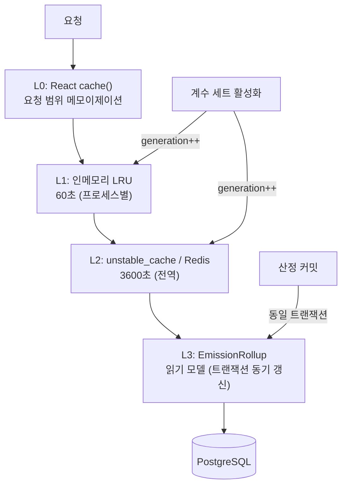

| 캐시 대상 | 계층 | TTL | 무효화 |
|---|---|---|---|
| 배출계수 조회 | L1 + L2 | 3600s | `generation` 증가 (Req 23-9) |
| GWP 테이블 | L1 + L2 | 24h | 버전 추가 시 generation |
| 국가/단위 마스터 | L1 + L2 | 24h | generation |
| 루브릭 정의 | L1 + L2 | 3600s | 루브릭 버전 활성화 시 |
| 프레임워크 항목 카탈로그 | L1 + L2 | 24h | 플러그인 활성화 시 |
| 대시보드 집계 | L3 (읽기 모델) | — | 산정 트랜잭션 동기 갱신 |
| 공개 페이지 | ISR | 3600s | 콘텐츠 발행 시 `revalidatePath` |
| 벤치마크 통계 | L3 (스냅샷 테이블) | 30일 | Req 15-11 고정 스냅샷 |

**대시보드 집계를 L1/L2에 캐시하지 않는 이유:** Req 8-3이 5초 이내 갱신을 요구한다. TTL 캐시는 이 요건과 충돌한다. 읽기 모델(L3)은 캐시가 아니라 트랜잭션 동기 갱신 파생 테이블이므로 항상 최신이다. 이것이 "실시간"과 "빠른 집계"를 동시에 만족하는 방법이다.

### DB 질의 예산 (Req 23-11: 요청당 ≤ 10)

```ts
// core/db/query-counter.ts — 개발/CI 환경에서만 활성
prisma.$use(async (params, next) => {
  const store = queryContext.getStore();
  if (store) {
    store.count++;
    if (store.count > 10 && process.env.NODE_ENV !== 'production') {
      throw new Error(
        `요청당 DB 질의 예산 초과 (${store.count} > 10): ${params.model}.${params.action} [requestId=${store.requestId}]`,
      );
    }
  }
  return next(params);
});
```

프로덕션에서는 예외를 던지지 않고 메트릭으로 기록해 임계 초과를 알린다. 개발 환경에서 예외를 던지는 것이 N+1을 조기에 잡는 가장 효과적인 방법이다.

### 인덱스 설계 (핵심)

```sql
-- 대시보드 집계 (Req 23-3): 커버링 인덱스로 힙 접근 제거
CREATE INDEX idx_rollup_dashboard
  ON "EmissionRollup" ("companyId", "periodMonth", scope, "orgNodeId")
  INCLUDE (tco2e, "energyMwh", "waterM3", "wasteT");

-- 계층 집계
CREATE INDEX idx_closure_ancestor ON "OrgNodeClosure" ("companyId", "ancestorId") INCLUDE ("descendantId");

-- 계수 조회 (Req 6-5): tier 별 조회 + 유효기간
CREATE INDEX idx_factor_lookup
  ON "EmissionFactor" ("countryCode", "energySource", "activityType", gas, "publishedYear" DESC)
  INCLUDE (value, unit, "netCalorificValue", "validFrom", "validTo");

-- 작업 클레임 (부분 인덱스로 queued 만)
CREATE INDEX idx_job_claim ON "Job" (pool, priority, "createdAt") WHERE status = 'queued';

-- 활동량 기간 조회
CREATE INDEX idx_activity_period
  ON "ActivityData" ("companyId", "orgNodeId", "periodStart" DESC)
  WHERE "supersededAt" IS NULL;

-- 감사 로그 검색 (Req 19-4: 3초 이내, 최대 1000건)
CREATE INDEX idx_audit_search
  ON "AuditLog" ("companyId", "occurredAt" DESC, "resourceType", "eventType");
```

---

## 보안 설계

### 필드 단위 암호화와 키 관리 (Req 24-4)

암호화 대상: 개인정보(이름, 전화번호, 주민등록번호 등), 재무 데이터(연매출 실액, 결제 관련 식별자).

**결정: PostgreSQL 컬럼 암호화가 아니라 애플리케이션 계층 봉투 암호화(envelope encryption).**

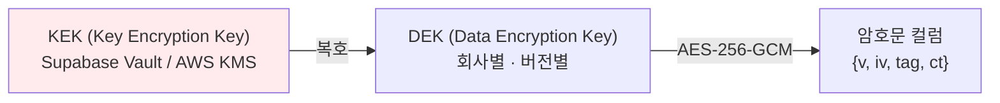

```prisma
model DataEncryptionKey {
  id          String   @id @default(uuid()) @db.Uuid
  companyId   String   @db.Uuid
  version     Int
  // KEK 로 감싼 DEK. 평문 DEK 는 어디에도 저장되지 않는다.
  wrappedKey  Bytes
  kekId       String                       // 어느 KEK 로 감쌌는지
  createdAt   DateTime @default(now())
  retiredAt   DateTime?                    // 신규 암호화에는 사용하지 않음
  @@unique([companyId, version])
}
```

```ts
// core/crypto/field.ts
export interface Encrypted {
  readonly v: number;        // DEK 버전 — ★ 복호화에 필요. 교체 후에도 과거 데이터 복호 가능 (Req 24-4)
  readonly iv: string;       // base64, 96bit
  readonly tag: string;      // base64, GCM 인증 태그
  readonly ct: string;       // base64
}

export async function encryptField(companyId: string, plaintext: string): Promise<Encrypted> {
  const dek = await keyProvider.currentDek(companyId);   // 미교체 최신 버전
  const iv = randomBytes(12);
  const c = createCipheriv('aes-256-gcm', dek.key, iv);
  const ct = Buffer.concat([c.update(plaintext, 'utf8'), c.final()]);
  return { v: dek.version, iv: b64(iv), tag: b64(c.getAuthTag()), ct: b64(ct) };
}

export async function decryptField(companyId: string, e: Encrypted): Promise<string> {
  const dek = await keyProvider.dekByVersion(companyId, e.v);   // 과거 버전도 조회 가능
  const d = createDecipheriv('aes-256-gcm', dek.key, unb64(e.iv));
  d.setAuthTag(unb64(e.tag));
  return Buffer.concat([d.update(unb64(e.ct)), d.final()]).toString('utf8');
}
```

**키 교체 (365일 주기, Req 24-4).** 새 DEK 버전을 생성하고 기존 DEK를 `retiredAt`으로 표시한다. **기존 데이터를 재암호화하지 않는다.** 암호문에 `v`가 들어 있으므로 과거 키로 계속 복호화된다. 이것이 "교체 후에도 이전 키로 암호화된 데이터의 복호화를 유지한다"를 만족하는 방법이다. 재암호화는 선택적 배경 작업으로 두되 교체의 전제 조건이 아니다.

**GCM 태그의 부수 효과:** 암호문이 변조되면 복호화가 실패한다. 즉 필드 단위 무결성 검증이 공짜로 얻어진다.

### 비밀 관리

| 비밀 | 저장 | 접근 |
|---|---|---|
| `SUPABASE_SERVICE_ROLE_KEY` | Vercel/컨테이너 환경변수 (암호화) | 서버 런타임만 |
| KEK | Supabase Vault (또는 KMS) | `core/crypto` 모듈만 |
| AI 제공자 API 키 | 환경변수 | `core/ai/providers/**`만 |
| 결제 대행사 시크릿 | 환경변수 | `features/billing/repository`만 |
| 웹훅 서명 시크릿 | DB (KEK로 암호화) | `features/*/service` |

환경변수는 부팅 시 Zod로 검증한다. 누락/형식 오류 시 **부팅을 거부**한다.

```ts
// core/config/env.server.ts
import 'server-only';

export const env = z.object({
  DATABASE_URL: z.string().url(),
  SUPABASE_SERVICE_ROLE_KEY: z.string().min(40),
  KEK_ID: z.string().min(1),
  OPENAI_API_KEY: z.string().startsWith('sk-').optional(),
  ANTHROPIC_API_KEY: z.string().optional(),
  NODE_ENV: z.enum(['development', 'test', 'production']),
}).parse(process.env);
```

부팅 시 실패시키는 것이 런타임에 `undefined`로 조용히 동작하는 것보다 안전하다. 프리뷰 환경에서 실제 자격증명이 없으면 부팅이 실패해 Req 29-6(프리뷰는 테스트 자격증명만)이 자동으로 검증된다.

### 업로드 악성코드 스캔 (Req 24-13)

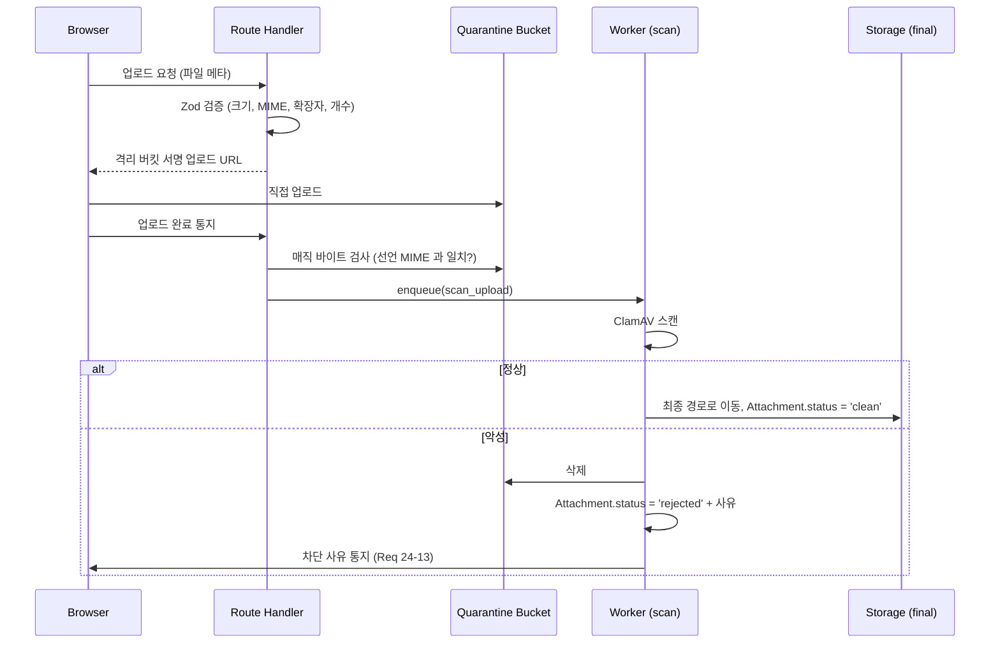

핵심은 **저장 전 스캔**이다. Req 24-13이 "저장 전에" 스캔을 요구하므로 격리 버킷을 경유한다. 격리 버킷은 애플리케이션 읽기 경로에서 접근할 수 없고, `Attachment.status = 'clean'`이 아닌 첨부는 어떤 조회 API에서도 반환되지 않는다.

매직 바이트 검사를 별도로 하는 이유: 확장자와 `Content-Type`은 클라이언트가 제어한다. XLSX로 선언된 실행 파일을 걸러야 한다.

### 프롬프트 인젝션 방어 (Req 13-8)

앞의 AI 아키텍처 섹션에서 상세히 다뤘다. 요약하면 방어의 무게가 프롬프트 문구가 아니라 **실행 경계**에 있다.

1. 신뢰 수준별 컨텍스트 블록 분리 + 태그 위조 방지 이스케이프.
2. 도구 화이트리스트 (AI는 도구 이름과 스키마 통과 파라미터만 만들 수 있다).
3. 모든 도구 실행이 요청자 `AuthContext`로 `decide()`를 통과 (인젝션은 `ctx`를 바꿀 수 없다).
4. 변경 유발 도구는 사용자 승인 UI 필수 (Req 13-6).
5. 인젝션 탐지 시 응답에 무시 사실 표기.

### SSRF 방어 (Req 20-4)

사용자가 제공한 웹훅 URL로 서버가 요청을 보낸다. 내부 네트워크 접근을 막아야 한다.

```ts
// features/public-api/domain/webhook-url.ts
const BLOCKED_CIDRS = [
  '0.0.0.0/8', '10.0.0.0/8', '100.64.0.0/10', '127.0.0.0/8', '169.254.0.0/16',
  '172.16.0.0/12', '192.0.0.0/24', '192.168.0.0/16', '198.18.0.0/15',
  '224.0.0.0/4', '240.0.0.0/4',
  '::1/128', 'fc00::/7', 'fe80::/10', '::ffff:0:0/96',
];

export async function validateWebhookUrl(raw: string): Promise<Result<ValidatedUrl, SsrfError>> {
  const u = safeParseUrl(raw);
  if (!u) return err({ code: 'MALFORMED_URL' });
  if (u.protocol !== 'https:') return err({ code: 'SCHEME_NOT_ALLOWED' });   // HTTPS 만
  if (u.port && !['', '443'].includes(u.port)) return err({ code: 'PORT_NOT_ALLOWED' });
  if (u.username || u.password) return err({ code: 'CREDENTIALS_IN_URL' });

  // DNS 해석 후 모든 A/AAAA 레코드를 검사한다. 하나라도 사설이면 거부.
  const addrs = await resolveAll(u.hostname);
  if (addrs.length === 0) return err({ code: 'DNS_RESOLUTION_FAILED' });
  for (const a of addrs) {
    if (BLOCKED_CIDRS.some((c) => inCidr(a, c))) {
      return err({ code: 'PRIVATE_ADDRESS', address: a });     // Req 20-4
    }
  }
  return ok({ url: u, resolvedAddresses: addrs });
}
```

**DNS 리바인딩 방어가 별도로 필요하다.** 검증 시점의 DNS 응답과 요청 시점의 응답이 다를 수 있다. 발송 시 검증된 IP로 직접 연결하고 `Host` 헤더를 원 호스트명으로 설정한다.

```ts
const agent = new https.Agent({
  lookup: (hostname, opts, cb) => {
    const pinned = validated.resolvedAddresses[0];       // 검증 시점의 IP 고정
    cb(null, pinned, net.isIPv6(pinned) ? 6 : 4);
  },
});
```

또한 리다이렉트를 따르지 않는다(`redirect: 'manual'`). 리다이렉트 대상은 재검증되지 않으므로 우회로가 된다.

### 관리자 break-glass (Req 18-12)

```ts
// features/admin/service/break-glass.ts
export async function requestPlaintextAccess(
  ctx: AuthContext, args: { resourceType: string; resourceIds: string[]; reason: string }, deps: Deps,
): Promise<Result<BreakGlassGrant, AdminError>> {
  if (!ctx.mfaVerified) return err({ code: 'MFA_REQUIRED' });                    // Req 18-10
  if (!deps.ipAllowlist.includes(ctx.sourceIp)) return err({ code: 'IP_NOT_ALLOWED' });
  if (args.reason.trim().length < 20) return err({ code: 'REASON_TOO_SHORT', min: 20 });  // Req 18-12

  // Req 18-12: 100건 초과 일괄 작업은 dry-run 미리보기 확인 필수
  if (args.resourceIds.length > 100) {
    const preview = await deps.adminRepo.dryRun(args);
    if (!args.dryRunAcknowledgedToken || !verifyDryRunToken(args.dryRunAcknowledgedToken, preview)) {
      return err({ code: 'DRY_RUN_REQUIRED', preview });
    }
  }
  // Req 18-11: 이중 승인 대상 작업은 다른 관리자 승인 전까지 실행하지 않음
  const grant = await deps.tx(async (t) => {
    const g = await deps.adminRepo.createGrant(t, { ...args, requestedBy: ctx.userId, ttlSeconds: 900 });
    await appendAudit(t, {
      eventType: 'admin.plaintext_access_granted', actorId: ctx.userId,
      resourceType: args.resourceType, afterValue: { reason: args.reason, count: args.resourceIds.length },
    });
    // ★ Req 18-12: 24시간 이내에 대상 회사의 Company_Admin 에게 열람 사실 통지
    await deps.jobs.enqueue(t, {
      type: 'notification_dispatch', pool: 'light',
      companyId: await deps.adminRepo.ownerCompanyOf(args.resourceIds[0]),
      payload: { kind: 'admin_plaintext_access', grantId: g.id, occurredAt: new Date().toISOString() },
    });
    return g;
  });
  return ok(grant);
}
```

통지를 작업 큐에 **같은 트랜잭션으로** 넣는 것이 핵심이다. 열람 권한 부여와 통지가 원자적으로 커밋되므로 "열람했으나 통지되지 않은" 상태가 존재할 수 없다.

### OWASP Top 10 대응 (Req 24-5)

| 항목 | 통제 |
|---|---|
| A01 접근 통제 실패 | RLS + deny-by-default 정책 엔진 + 자동 생성 부정 테스트 |
| A02 암호화 실패 | TLS 1.3 강제, AES-256 저장 암호화, 필드 단위 봉투 암호화 |
| A03 인젝션 | Prisma 파라미터 바인딩, `$queryRaw`는 태그 템플릿만 허용(lint), Zod 경계, 프롬프트 인젝션 방어 |
| A04 안전하지 않은 설계 | 본 설계 문서 + 속성 기반 테스트 + 감사 해시 체인 |
| A05 보안 설정 오류 | 환경변수 Zod 검증(부팅 거부), CSP, `FORCE ROW LEVEL SECURITY` |
| A06 취약 구성요소 | CI 의존성 스캔, High 이상 배포 차단 (Req 24-10) |
| A07 인증 실패 | 비밀번호 정책, MFA, 로그인 차단(5회/15분), 세션 만료 |
| A08 무결성 실패 | 감사 해시 체인, 산출물 SHA-256, GCM 인증 태그, 패키지 lockfile + provenance |
| A09 로깅·모니터링 실패 | Audit_Service append-only, 무결성 점검, Req 29-7 알림 임계값 |
| A10 SSRF | 위 SSRF 방어 (CIDR 차단 + IP 고정 + 리다이렉트 금지) |

---

## 배포와 마이그레이션

### expand/contract 마이그레이션 규율 (Req 29-5)

코드와 스키마가 독립적으로 롤백 가능해야 한다. 이는 **모든 마이그레이션이 직전 앱 버전과 호환**되어야 함을 의미한다.

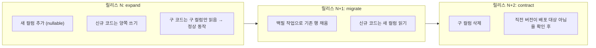

금지 사항과 대체 방법:

| 금지 | 대체 |
|---|---|
| 컬럼 삭제/이름 변경을 코드 변경과 같은 릴리스에 | 3단계 릴리스 (expand → migrate → contract) |
| `NOT NULL` 컬럼 추가 (기본값 없이) | nullable 추가 → 백필 → 제약 추가 |
| 컬럼 타입 변경 | 새 컬럼 추가 → 이중 쓰기 → 백필 → 전환 → 구 컬럼 제거 |
| enum 값 제거 | 사용 중단 표시 → 데이터 마이그레이션 → 별도 릴리스에서 제거 |
| 대형 테이블에 인덱스 생성 (블로킹) | `CREATE INDEX CONCURRENTLY` (Prisma 외부 raw SQL) |

각 마이그레이션에 역방향 스크립트를 함께 둔다.

```
prisma/migrations/
  20250312_120000_add_scope2_method/
    migration.sql          # 정방향
    down.sql               # ★ 역방향 (Req 29-5)
    meta.json              # { "phase": "expand", "destructive": false, "requiresBackfill": true }
```

CI가 `meta.json`을 검사한다. `destructive: true`인 마이그레이션은 (a) `phase: "contract"`여야 하고, (b) 직전 버전 미배포 확인 체크리스트가 PR에 있어야 병합된다.

### 마이그레이션 자문 잠금 (Req 29-9)

```sql
-- 마이그레이션 시작
SELECT pg_advisory_lock(4815162342);       -- 세션 수준 배타 잠금
-- ... 마이그레이션 실행 ...
SELECT pg_advisory_unlock(4815162342);
```

```ts
// scripts/migrate.ts
const LOCK_ID = 4815162342n;

async function main() {
  const client = new PgClient({ connectionString: env.DATABASE_URL });
  await client.connect();

  // Req 29-9: 동시 마이그레이션 시도를 거부한다 (대기하지 않고 즉시 실패)
  const { rows } = await client.query('SELECT pg_try_advisory_lock($1) AS acquired', [LOCK_ID]);
  if (!rows[0].acquired) {
    console.error('다른 마이그레이션이 진행 중입니다. 중단합니다.');
    process.exit(1);
  }
  try {
    await runPrismaMigrateDeploy();
  } catch (e) {
    // Req 29-9: 실패 시 적용 이전 상태로 되돌린 후 배포 중단
    await runDownMigration();
    await notifyOperator({ kind: 'migration_failed', error: e });
    process.exit(1);
  } finally {
    await client.query('SELECT pg_advisory_unlock($1)', [LOCK_ID]);
    await client.end();
  }
}
```

`pg_try_advisory_lock`(대기 없음)을 쓰는 것이 요구사항에 부합한다. `pg_advisory_lock`(대기)을 쓰면 두 번째 시도가 거부되지 않고 첫 번째 완료 후 실행되어 "동시 시도를 거부한다"를 위반한다.

### 배포 파이프라인 (Req 29-1 ~ 29-4)

```mermaid
graph TB
    PR["Pull Request"] --> CI["CI: typecheck → lint → unit → property → rls → mutation → e2e"]
    CI --> PREV["프리뷰 환경 배포<br/>합성 시드 + 테스트 자격증명만 (Req 29-6)"]
    PREV --> MERGE["기본 브랜치 병합"]
    MERGE --> CI2["CI 재실행"]
    CI2 --> DRY["마이그레이션 dry-run<br/>프로덕션 동일 스키마 스냅샷 (Req 29-3)"]
    DRY --> APPR{"승인자 1명 이상<br/>24시간 내 (Req 29-3)"}
    APPR -->|"미승인"| EXP["배포 요청 만료"]
    APPR -->|"승인"| MIG["마이그레이션 적용<br/>(자문 잠금, Req 29-9)"]
    MIG --> DEP["Vercel 프로덕션 + 워커 이미지 배포"]
    DEP --> HC["10분 상태 점검 (Req 29-8)"]
    HC -->|"오류율 3분 연속 >5%"| RB["자동 롤백"]
    HC -->|"정상"| DONE["완료"]
    RB --> NOTE["사유·결과 운영자 통지"]

    style RB fill:#ffebee
    style APPR fill:#fff9c4
```

**워커와 웹앱의 배포 순서.** 워커가 새 `JobType`을 처리할 수 있게 된 후에 웹앱이 그것을 enqueue해야 한다. 따라서 순서는 **워커 먼저 → 웹앱 나중**이다. 롤백은 역순(웹앱 먼저 → 워커 나중). 이를 파이프라인에 하드코딩한다. 워커가 모르는 `JobType`을 만나면 작업을 `queued`로 남기고 경고를 남긴다(실패시키지 않는다) — 배포 순서가 어긋나도 작업이 유실되지 않는다.

### 프리뷰 환경 격리 (Req 29-6)

| 항목 | 프로덕션 | 프리뷰 |
|---|---|---|
| DB | 프로덕션 Supabase | PR별 Supabase 브랜치 DB (합성 시드) |
| 결제 | 실제 키 | 테스트 모드 키 |
| AI | 실제 키 | 결정적 모의 제공자 (고정 응답) |
| 이메일 | 실제 발송 | 캡처 전용 (Mailpit) |
| Storage | 프로덕션 버킷 | PR별 임시 버킷 |
| 색인 | 허용 | `noindex, nofollow` + robots 차단 (Req 30-8) |

강제 수단: 프리뷰 환경변수에 프로덕션 자격증명을 **주입하지 않는다**. `env.server.ts`의 Zod 검증이 테스트 키 형식(`sk_test_`, `pk_test_`)을 요구하도록 환경별로 분기한다. 프로덕션 키가 들어오면 부팅이 실패한다.

```ts
const paymentKeySchema = env.VERCEL_ENV === 'production'
  ? z.string().startsWith('sk_live_')
  : z.string().startsWith('sk_test_');   // 프리뷰/개발은 test 키만 허용
```

PR 병합·종료 후 1시간 이내 프리뷰 환경과 데이터 삭제는 GitHub Actions `pull_request: [closed]` 트리거로 처리한다.

### 상태 점검 자동 롤백 (Req 29-8)

```ts
// scripts/post-deploy-watch.ts
const WINDOW_MINUTES = 10;
const ERROR_RATE_THRESHOLD = 0.05;      // 5%
const CONSECUTIVE_MINUTES = 3;

let breaches = 0;
for (let m = 0; m < WINDOW_MINUTES; m++) {
  await sleep(60_000);
  const rate = await metrics.errorRate({ lastMinutes: 1 });
  breaches = rate > ERROR_RATE_THRESHOLD ? breaches + 1 : 0;   // 연속이어야 한다
  if (breaches >= CONSECUTIVE_MINUTES) {
    await rollbackToPreviousDeployment();                       // Req 29-4: 10분 이내
    await notifyOperator({ kind: 'auto_rollback', reason: 'error_rate', rate, breaches });
    process.exit(1);
  }
}
```

`breaches`를 비연속 시 0으로 리셋하는 것이 중요하다. 요구사항이 "연속 3분간"을 명시한다. 누적 카운트로 구현하면 산발적 오류에도 롤백이 발동한다.

**롤백이 스키마를 건드리지 않는다는 점**(Req 29-4)이 expand/contract 규율의 존재 이유다. 스키마 롤백이 필요한 배포는 자동 롤백 대상이 될 수 없으므로, 파괴적 마이그레이션은 별도 릴리스로 분리된다.

### 백업과 복구 (Req 29-10)

| 항목 | 설정 |
|---|---|
| 백업 주기 | 24시간 이내 (Supabase 일일 백업 + PITR) |
| 보관 | 30일 |
| RTO 목표 | 4시간 |
| RPO 목표 | 24시간 (PITR로 실질 수 분) |
| 복원 시험 | 월 1회 이상. 별도 프로젝트로 복원 → 스모크 테스트 → RTO/RPO 실측 기록 |
| 미충족 시 | 운영자 통지 + 복구 계획 이슈 자동 생성 |

복원 시험은 수동 절차로 두지 않고 월간 스케줄 워크플로로 자동화한다. 수동 절차는 반드시 건너뛰어진다.

```yaml
# .github/workflows/restore-drill.yml
on:
  schedule: [{ cron: '0 3 1 * *' }]     # 매월 1일 03:00 UTC
jobs:
  drill:
    steps:
      - name: 최신 백업으로 임시 프로젝트 복원
      - name: 마이그레이션 상태 확인
      - name: 스모크 테스트 (핵심 조회 5건)
      - name: RTO/RPO 실측 기록
      - name: 목표 미충족 시 운영자 통지 + 이슈 생성
      - name: 임시 프로젝트 삭제
```

### 관측성 (Req 29-7)

| 임계값 | 평가 창 | 알림 |
|---|---|---|
| 오류율 > 1% | 5분 | 당번 운영자 5분 이내 |
| p95 응답 > 2초 | 5분 | 동일 |
| 일일 AI 비용 > 예산 80% | 실시간 | 동일 |
| 결제 실패 > 5건 | 10분 | 동일 |
| 15분 내 수신 확인 없음 | — | 차상위 담당자 재발송 |

추가로 본 설계가 도입한 구조에 대한 전용 지표:

| 지표 | 임계 | 이유 |
|---|---|---|
| `job_queue_depth{pool="heavy"}` | > 50 | 워커 부족 조기 감지 |
| `job_lease_expired_total` | > 0 | 워커 비정상 종료 |
| `rollup_mismatch_total` | > 0 | 읽기 모델과 진실의 출처 불일치 (심각) |
| `audit_chain_verify_failed_total` | > 0 | 감사 무결성 훼손 (Req 19-8, 최고 심각도) |
| `ai_circuit_open{provider}` | 지속 > 5분 | 제공자 장애 |
| `db_queries_per_request_p95` | > 10 | Req 23-11 위반 |
| `decimal_to_number_conversions_total` | > 0 (결정 평면) | 정밀도 규약 위반 |

마지막 지표가 흥미롭다. 결정 평면에서 `Decimal → Number` 변환이 일어나면 정밀도 전략이 무너진 것이다. lint로 대부분 막지만 런타임 계측으로 이중 확인한다.

---

## P2 · P3 인터페이스 수준 설계

이 영역은 상세 설계 대상이 아니지만, **나중에 바꾸기 어려운 구조적 결정**만 지금 확정한다.

### Marketplace_Service 상태 기계 (Req 14)

**결정: 거래 모델은 리드 연결로 확정되었다.** 플랫폼은 대금을 보관하지 않으며, 에스크로·대금 예치·정산 대행을 제공하지 않는다. 거래 흐름은 다음과 같다.

```
수요 등록 → AI 추천 → 공급자 연결 → 당사자 간 계약 → 플랫폼 수수료 청구
```

계약과 대금 수수는 구매자와 공급자 사이에서 플랫폼 밖에서 이루어진다. 플랫폼이 청구하는 것은 **성사된 계약에 대한 수수료**이며, 플랫폼이 받은 대금을 나누는 것이 아니다.

```mermaid
stateDiagram-v2
    state "Demand" as D {
        [*] --> open: 등록 + 30초 내 매칭 요청
        open --> matched: 제안 1건 채택 (Req 14-6)
        open --> closed: 마감일 도과 (Req 14-12)
        closed --> open: 마감일 연장 / 재게시
    }
    state "Order" as O {
        [*] --> created: 제안 채택 시 생성
        created --> in_progress
        in_progress --> completed: 이행 완료
        completed --> reviewed: 구매자 평가 (30일 내 1회, Req 14-9)
    }
    state "ReductionEvidence" as E {
        [*] --> submitted
        submitted --> verified: Super_Admin / Auditor 검증 (Req 14-10)
        submitted --> unverified: 검증 미통과 (Req 14-13)
        verified --> reflected: Digital_Twin 실적 반영
    }
    D --> O: matched
    O --> E: completed
```

구조적 결정 3가지:

1. **구매자 데이터 노출 최소화** (Req 14-1). `Demand`는 등록된 항목과 첨부만 갖는다. `Digital_Twin`, `ESG_Score`, 활동량 원시 데이터에 대한 외래키를 **두지 않는다.** 관계가 없으면 실수로 조인해 노출할 수 없다. 익명 게시는 `anonymousUntilMatched: boolean`과 `maskedRegion`(시·도 수준)으로 처리한다.
2. **매칭 점수 비대칭 공개** (Req 14-4). `MatchScore` 행은 `(demandId, supplierId)` 단위이고, RLS 정책이 "수요 소유 회사" 또는 "해당 supplierId 본인"만 읽도록 제한한다. 다른 공급자의 점수는 정책 수준에서 접근 불가다.
3. **검증된 감축량만 트윈에 반영** (Req 14-10, 14-13). `ReductionEvidence.status = 'verified'`인 경우에만 `TwinNodeValue`가 생성되고, 그 노드의 `provenance = 'user_input'`이 아니라 전용 값 `'verified_actual'`을 갖는다. 미검증은 `unverified` 상태로 남고 트윈에 도달하지 않는다.

#### `Order`는 계약 참조이며 결제 객체가 아니다

리드 연결 확정의 직접적 귀결이다. `Order`는 당사자 간에 체결된 계약을 플랫폼이 **참조**하기 위한 레코드다. 합의 금액과 이행 기간을 기록하는 이유는 두 가지뿐이다.

- **수수료 산출의 기준액.** 합의 금액이 Req 17-6 수수료 계산의 입력이 된다.
- **Req 14-10 감축 실적 증빙 경로의 앵커.** 어떤 계약의 이행 결과로 제출된 증빙인지를 `ReductionEvidence`가 가리킬 대상이 필요하다.

따라서 `Order`는 **결제 상태를 갖지 않고, 에스크로 잔액을 갖지 않으며, 지급 스케줄을 갖지 않는다.** `created → in_progress → completed → reviewed` 상태 기계는 계약 이행 단계의 기록이며 자금 흐름의 기록이 아니다. 이 구분을 모델 수준에서 유지하는 것이 중요하다. `Order`에 결제 관련 컬럼이 하나라도 생기면 플랫폼이 자금 흐름의 진실의 출처인 것처럼 보이기 시작하고, 그 오해가 규제 판단과 분쟁 책임 판단을 모두 오염시킨다.

#### 범위에서 제거되는 것

리드 연결 확정으로 다음이 **설계·구현·법률 검토 범위에서 완전히 빠진다.**

- 전자금융업 / PG 등록 검토
- 자금세탁방지(AML) 절차
- 고객 자금 분리 보관 의무
- 환불·분쟁 중재 절차 (구독료 환불은 남지만 거래 대금 환불은 존재하지 않는다)

이것은 오너의 결정이 제거한 **일정 리스크 중 단일 최대 항목**이다. 위 네 가지는 어느 것도 설계자가 결정할 수 없고, 어느 것도 코드 작업량으로 환산해 예측할 수 없으며, 규제 검토 결과에 따라 요구사항 단계로 되돌아가야 하는 항목이었다.

#### 확장 경로 (지금 설계하지 않는다)

오너가 후에 에스크로를 도입하기로 한다면, 원장은 **계정 코드를 추가하는 것만으로** 이를 수용한다(아래 Billing 절 참조). 자금 이동 레일은 Stripe Connect, Mangopay, Adyen MarketPay가 후보다.

**단, 지금 에스크로를 설계하지 않는다.** 확장 경로가 값싸다는 것을 확인하는 것으로 충분하고, 쓰이지 않을 상태 기계와 계정 체계를 미리 만드는 것은 순수한 낭비다. 위 후보 레일 기록은 그 시점의 조사 출발점으로만 남긴다.

### Billing_Service 원장 (Req 17)

**결정: 복식 부기 원장. 단식 잔액 컬럼을 두지 않는다.**

**MVP 범위는 구독 과금뿐이다.** 리드 연결 확정에 따라 마켓플레이스 수수료는 성사된 계약에 대한 **청구**이며, 플랫폼이 수령한 대금의 분배가 아니다. 원장에 흐르는 것은 구독료 청구·수납·환불과 마켓플레이스 수수료 청구·수납이고, 거래 대금 자체는 원장을 경유하지 않는다.

그럼에도 복식 부기와 아래의 `DEFERRABLE` 제약 트리거는 그대로 유지한다. 단식 잔액 컬럼으로 바꾸면 지금 당장 얻는 것은 컬럼 하나 줄어드는 것뿐이고, 잃는 것은 금액 보존 불변식을 DB가 강제하는 능력과 확장 경로의 값싼 성질 전부다.

```prisma
model LedgerEntry {
  id            String @id @default(uuid()) @db.Uuid
  transactionId String @db.Uuid                    // 하나의 거래 = 여러 항목
  companyId     String? @db.Uuid
  accountCode   String                             // ★ enum이 아니라 LedgerAccount 행을 가리키는 코드
  // ★ 최소통화단위 정수. 차변은 양수, 대변은 음수. 거래 단위 합계는 항상 0.
  amountMinor   BigInt
  currencyCode  String @db.Char(3)
  refType       String                             // "payment" | "refund" | "chargeback" | "settlement"
  refId         String
  createdAt     DateTime @default(now())

  account       LedgerAccount @relation(fields: [accountCode], references: [code])

  @@index([transactionId])
  @@index([companyId, accountCode, createdAt])
}

// ★ 계정 과목을 데이터로 둔다. 계정 추가는 행 삽입이며 마이그레이션이 아니다.
model LedgerAccount {
  code        String  @id                          // "platform_revenue" | "customer_receivable" | "pg_clearing" | ...
  name        String
  // 차변 계정(자산·비용)은 'debit', 대변 계정(부채·수익)은 'credit'.
  // 잔액의 부호 해석과 재무 보고 표시에만 쓰이며, 균형 불변식과는 무관하다.
  normalSide  LedgerNormalSide
  // 자금 수탁 계정 여부. MVP에서는 모두 false다.
  // 에스크로 도입 시 escrow_held / supplier_payable 이 true로 추가된다.
  isCustodial Boolean @default(false)
  isActive    Boolean @default(true)
  sortOrder   Int
  createdAt   DateTime @default(now())

  entries     LedgerEntry[]
}

enum LedgerNormalSide {
  debit
  credit
}
```

MVP 시드 계정은 `platform_revenue`, `customer_receivable`, `pg_clearing` 세 개다. 에스크로가 도입되면 `escrow_held`, `supplier_payable`, 분쟁 준비금 계정이 **행으로 추가**된다.

**기각한 대안: `LedgerAccount`를 Prisma enum으로 유지.** 타입 안전성 면에서는 enum이 낫다 — 잘못된 계정 코드가 컴파일 시점에 잡힌다. 그런데도 기각하는 이유는 하나다. **enum 값 추가는 마이그레이션이고 배포다.** 앞 절에서 "에스크로는 계정을 추가하는 것만으로 수용된다"고 말한 근거가 enum이면 성립하지 않는다. 스키마 변경 + 코드 변경 + 배포를 요구하는 것은 "추가만으로 수용"이 아니라 그냥 "변경"이다. 확장 경로가 값싸다는 주장은 그 값싼 성질이 실제로 존재할 때만 유효하며, 여기서 그것을 실제로 존재하게 만드는 것이 계정을 데이터로 두는 결정이다. 코드 오타 위험은 도메인 계층에서 시드 계정 코드 상수(`LEDGER_ACCOUNTS`)를 두고 참조하는 것으로 실질적으로 동일한 보호를 얻는다.

```sql
-- 거래 단위 균형을 DB 수준에서 강제한다 (Req 17-6, 17-13)
CREATE OR REPLACE FUNCTION assert_ledger_balanced() RETURNS trigger
LANGUAGE plpgsql AS $$
DECLARE s bigint;
BEGIN
  SELECT sum("amountMinor") INTO s
    FROM "LedgerEntry" WHERE "transactionId" = NEW."transactionId";
  IF s <> 0 THEN
    RAISE EXCEPTION 'LEDGER_UNBALANCED: transaction % sums to %', NEW."transactionId", s;
  END IF;
  RETURN NULL;
END $$;

CREATE CONSTRAINT TRIGGER trg_ledger_balanced
  AFTER INSERT ON "LedgerEntry"
  DEFERRABLE INITIALLY DEFERRED
  FOR EACH ROW EXECUTE FUNCTION assert_ledger_balanced();
```

`DEFERRABLE INITIALLY DEFERRED` 제약 트리거가 핵심이다. 트랜잭션 커밋 시점에 검사하므로 여러 항목을 순차 삽입하는 중간 상태에서는 불균형이 허용되고, 커밋 시 반드시 균형이 맞아야 한다. 이것이 속성 8(금액 보존)을 DB 수준에서 보장한다.

**균형 불변식은 계정에 무관(account-agnostic)하다.** 트리거는 `transactionId` 단위 `sum("amountMinor") = 0`만 검사하고 어떤 계정 코드가 등장했는지는 보지 않는다. 따라서 `escrow_held`나 `supplier_payable` 같은 새 계정이 나타나도 불변식은 수정 없이 계속 성립한다. **속성 8이 향후 확장에서도 그대로 유효한 이유가 이것이다** — 속성 문장에 계정 목록이 들어 있지 않고, 트리거 구현에도 들어 있지 않다. 계정 목록을 검사하는 형태로 불변식을 썼다면 에스크로 도입 시 불변식과 속성 테스트를 함께 고쳐야 했고, 그때 "고치면서 약하게 만드는" 사고가 발생한다.

수수료 산출(Req 17-6):

```ts
// features/billing/domain/fee.ts
export function splitPayment(grossMinor: bigint, feeRateBp: number): { feeMinor: bigint; payoutMinor: bigint } {
  // feeRateBp: 0.00%~30.00% 를 베이시스포인트(0~3000)로 표현. 소수 없음.
  const feeMinor = (grossMinor * BigInt(feeRateBp)) / 10_000n;   // ★ BigInt 나눗셈 = 내림 (Req 17-6)
  const payoutMinor = grossMinor - feeMinor;                     // ★ 차감으로 산출 → 합이 항상 gross
  return { feeMinor, payoutMinor };
}
```

`payoutMinor`를 독립 계산하지 않고 **차감으로 도출**하는 것이 보존을 구조적으로 보장한다. 두 값을 각각 반올림하면 합이 gross와 1단위 어긋난다.

리드 연결 모델에서 이 함수의 `grossMinor`는 `Order`에 기록된 **합의 금액**이고, 산출물 중 실제로 청구되는 것은 `feeMinor`뿐이다. `payoutMinor`는 플랫폼이 지급하는 금액이 아니라 "수수료를 제외한 당사자 간 잔액"이라는 계산상의 대응값이며, 원장에는 기재되지 않는다. 에스크로가 도입되면 이 값이 `supplier_payable` 계정의 대변 금액이 되고, 그때 함수 본체는 바뀌지 않는다.

### Plugin_Registry (Req 21)

**결정: 선언적 데이터만. 실행 가능 코드를 절대 허용하지 않는다.**

```ts
// features/plugin/schema/manifest.ts
export const pluginManifestSchema = z.object({
  type: z.enum(['country_factors', 'disclosure_standard', 'industry_module']),
  id: z.string().regex(/^[a-z0-9][a-z0-9-]{1,62}$/),
  version: z.string().regex(SEMVER_RE),
  dependencies: z.array(z.object({
    pluginId: z.string(), versionRange: z.string(),
  })).max(20),
  resourceKeys: z.array(z.string()).max(5000),
  data: z.record(z.unknown()),
})
  // Req 21-5: 실행 가능 코드 필드를 포함하면 거부
  .superRefine((m, c) => {
    const forbidden = findForbiddenKeys(m, ['script', 'code', 'eval', 'fn', 'handler', 'exec', '__proto__']);
    for (const path of forbidden) {
      c.addIssue({ code: 'custom', path: path.split('.'), message: 'EXECUTABLE_CODE_NOT_ALLOWED' });
    }
  })
  .passthrough();   // ★ 미지 필드 보존. Req 21-3/21-4 왕복 속성의 전제.
```

`.passthrough()`가 중요하다. 미지 필드를 버리면 Req 21-4의 왕복 속성 (d)항(미지 필드의 키와 값 일치)이 성립하지 않는다. 직렬화 시 키 사전순 정렬 + 수치 정규 표기 + 미지 필드 원값 유지를 구현한다.

플러그인이 실행 코드를 담지 않으므로 샌드박싱, 권한 모델, 리소스 제한이 전부 불필요하다. 이것이 이 결정의 실질적 이득이다.

### Public_API (Req 20)

구조적 결정 2가지:

1. **API 핸들러는 기능의 공개 진입점만 호출한다.** `app/api/v1/**`는 얇은 어댑터다. 비즈니스 로직을 여기 두면 UI 경로와 API 경로가 갈라진다. OpenAPI 명세는 Zod 스키마에서 생성(`zod-to-openapi`)하므로 Req 20-10의 "불일치 0건"이 구조적으로 성립한다.
2. **안정적 커서** (Req 20-1). 오프셋 페이지네이션을 쓰지 않는다. 커서는 `base64(json({ sortKey, id }))`이고 쿼리는 `WHERE (sortKey, id) > (?, ?) ORDER BY sortKey, id`다. 튜플 비교이므로 삽입·삭제 중에도 중복·누락이 없다(속성 22).

### Exchange_Service / Benchmark_Engine (Req 15)

앞의 "긴장 2" 해소 방침대로 `commons` 스키마로 물리 분리한다. 추가 결정:

- k-익명성 억제를 **SQL 함수 안**에 둔다. 애플리케이션에서 필터하면 우회 경로가 생긴다.
  ```sql
  CREATE OR REPLACE FUNCTION commons.peer_stat(p_group uuid, p_indicator text)
  RETURNS TABLE(median numeric, q1 numeric, q3 numeric, avg_v numeric, contributors int)
  LANGUAGE sql STABLE AS $$
    WITH c AS (
      SELECT count(DISTINCT "recordId") AS n FROM commons."AnonymizedRecord"
       WHERE "peerGroupId" = p_group AND "indicatorKey" = p_indicator)
    SELECT ... FROM ... WHERE (SELECT n FROM c) >= 5;   -- ★ 5 미만이면 0행
  $$;
  ```
- 철회(Req 15-8)는 `AnonymizedRecord.withdrawnAt` 설정 + 영향받은 `BenchmarkSnapshot` 무효화 작업 enqueue. 24시간 이내 재산출.

### Agent_Marketplace (Req 22)

구조적 결정: 설치된 에이전트의 데이터 접근은 **별도 `AuthContext`가 아니라 축소된 스코프**로 표현한다.

```ts
export interface AgentAuthContext extends AuthContext {
  readonly agentInstallationId: string;
  /** 승인된 리소스 유형 × 읽기/쓰기. 요청자 권한과 AND 로 결합된다. */
  readonly grantedScopes: ReadonlySet<Action>;
  readonly allowedEgressHosts: ReadonlySet<string>;   // Req 22-3
}
```

`decide()`가 `grantedScopes ∩ 요청자권한`으로 판정하므로 에이전트는 요청자보다 넓은 권한을 가질 수 없다. 승인 범위 확대 요구 시 기존 승인 버전으로 계속 실행하고 재승인을 요구한다(Req 22-8) — 이는 `AgentInstallation.approvedVersion`을 실행 시 참조하는 것으로 구현한다.

---

## 설계 결정과 근거

| # | 결정 | 채택안 | 검토한 대안 | 기각 이유 |
|---|---|---|---|---|
| 1 | 비동기 작업 실행 모델 | **Postgres 큐 (`FOR UPDATE SKIP LOCKED`) + 전용 컨테이너 워커** | Vercel Function `maxDuration` 확대 | 300초 상한에 여유 없음. Req 4-10(트윈당 단일 워커), Req 10-11(병합), Req 9-6(동시 3건)을 표현할 상태가 없다 |
| | | | Inngest / Trigger.dev | 작업 상태가 외부에 있어 도메인 쓰기와 원자적 enqueue 불가(dual-write). 감사 추적성에서 외부가 진실의 출처가 된다. lockKey 상호배제는 결국 DB 락 필요 → 이중 관리 |
| | | | Supabase `pgmq` + `pg_cron` | 실행 주체가 없다. `pg_cron`은 SQL만 실행하므로 PDF 렌더링·AI 호출 불가 |
| | | | AWS SQS + Lambda | 인프라 표면이 Vercel/Supabase 외로 확장. Req 29의 단일 파이프라인 배포·롤백 규율 복잡화. 이 규모에 과도 |
| 2 | 수치 타입 | **PostgreSQL `NUMERIC` + Prisma `Decimal` + decimal.js. 금액은 `BigInt` 최소통화단위** | `double precision` | 결합법칙 불성립 → `SUM()`이 순서 의존. Req 5-12의 "절대 차이 0"을 원리적으로 만족 불가. Req 5-8의 1e-6 허용오차를 대량 합산에서 초과 가능 |
| | | | 정수 스케일링 (모든 값을 1e6배 정수로) | 단위 환산·GWP 곱셈에서 스케일이 폭발. 표현 가능 범위 관리가 `NUMERIC`보다 어렵다 |
| | | | `Decimal` 저장 + `number` 계산 | 저장만 정확해도 계산이 부정확하면 무의미 |
| 3 | 트윈 버전 저장 | **콘텐츠 주소화 스냅샷** (`TwinNodeValue` → `TwinValueBlob`) | 델타(변경분만 저장) | Req 4-6의 보존 정책(24개월 초과 시 월말 버전만 유지)과 **원리적으로 양립 불가**. 중간 델타 삭제 시 이후 버전 복원 불능. 또한 Req 9-7 리포트 재현성이 임의 과거 버전 O(1) 읽기를 요구 |
| | | | 순수 스냅샷 (값 인라인 저장) | 60초 주기 버전 생성(Req 4-5)에서 저장량이 선형 증가. blob 공유로 해결 |
| | | | 이벤트 소싱 | 재생 로직 자체가 결정성 위험 요소가 된다(Req 7-9와 충돌) |
| 4 | 루브릭 표현 | **버전 관리되는 DB 데이터 + 순수 해석기** | 코드 상수 | Req 7-8이 과거 버전 재산출과 최신 루브릭 병기를 요구. 코드 상수면 과거 버전으로 재산출 불가. Req 7-2의 메타데이터 표시가 코드에 흩어진다 |
| | | | 설정 파일 (JSON/YAML) | 버전 이력·활성 기간·산업별 세트 관계를 표현하기 어렵고 배포 없이 갱신 불가 |
| 5 | 시나리오 생성 | **규칙 기반 조합 생성 + 실행가능성 필터 + 시드 결정성. AI는 순위화·설명만** | AI가 시나리오 직접 생성 | Req 11-13(동일 시드 → 동일 집합)을 **원리적으로 위반**. Req 11-3의 모든 수치가 감사 가능해야 함. 비용도 2000개 생성 시 비현실적 |
| | | | 최적화 솔버 (MILP) | 상위 N개가 아니라 최적해 1개를 주므로 Req 11-5(3개 정렬 기준 상위 50개)와 맞지 않음. Req 11-6 제약 조합 탐색에는 후보 집합이 필요 |
| 6 | 멀티테넌시 격리 | **단일 DB + 모든 테이블 `companyId` 컬럼 + RLS(`FORCE`) + 복합 FK** | 테넌트별 스키마 | 마이그레이션이 테넌트 수에 선형. Req 15 벤치마킹의 크로스 테넌트 집계가 어려워짐. 커넥션 풀·`search_path` 관리 복잡 |
| | | | 테넌트별 인스턴스 | 운영 비용이 고객 수에 선형. MVP 단계에 부적합. 단 엔터프라이즈 요구 시 옵션으로 남긴다(미결정 #12) |
| | | | `companyId`를 부모 조인으로 유도 | RLS 정책이 매 행 서브쿼리 실행 → Req 23-3 달성 불가. 정책 표현이 테이블마다 달라져 감사·자동 테스트 생성 불가 |
| 7 | 플러그인 모델 | **선언적 데이터 전용** (실행 코드 금지) | 실행 가능 플러그인 (VM/WASM 샌드박스) | 샌드박스 탈출·리소스 고갈·공급망 공격 표면. Req 21-1이 이미 선언적만 요구하므로 요구사항과도 일치. 샌드박싱 없이 안전을 얻는다 |
| 8 | 배출 결과 저장 | **리프 노드 귀속 + append-only 불변 레코드 + `fingerprint` 유일 제약** | 노드 수준별 사전 집계 저장 | 부모와 자식을 독립 계산하게 되어 Req 5-8 불변식이 깨질 여지가 생긴다 |
| | | | 가변 레코드 (UPDATE) | Req 5-10(불변 레코드), Req 6-4(계수 갱신 후에도 기존 결과 보존)와 충돌 |
| 9 | 감사 무결성 | **회사별 해시 체인 + `actorRefHash`를 해시 입력에 사용** | `actorId` 원문을 해시 입력에 포함 | Req 19-5/24-12의 사후 가명화 UPDATE가 체인을 깬다 |
| | | | 외부 원장/블록체인 | 운영 복잡도가 이득을 초과. 해시 체인 + 일일 앵커로 위조 증거는 충분 |
| 10 | Scope 2 이원 산정 저장 | **`scope2Method`로 구분된 별도 행** | 같은 행에 두 컬럼 | 합산 시 어느 컬럼을 쓸지 매번 판단해야 하고 실수하기 쉽다. 행 분리 + 타입 강제 필터가 더 안전 |
| 11 | 검증 경계 | **진입점 1회 Zod parse, Service 재검증 금지, 입력 타입은 `z.infer`** | 계층별 다중 검증 | 진실의 검증이 모호해지고 두 검증이 어긋난다. Req 28-4가 "한 곳에서만"을 명시 |
| 12 | 실시간 전달 | **전용 `DashboardTick` 테이블에 `postgres_changes`** | 원시 테이블 publication | 배출 원시 데이터가 WebSocket으로 유출. 임포트 10,000행이 10,000 이벤트 발생. 위젯 매핑 로직이 클라이언트로 중복 |
| 13 | 리포트 4형식 생성 | **단일 중간 표현(IR) → 4개 렌더러 + 다이제스트 교차 검증** | 형식별 독립 렌더링 | Req 9-2의 "수치 값 동일 보장"을 검증할 수단이 없다. 조심스러운 코딩으로는 보장되지 않는다 |
| 14 | 회로 차단기 상태 | **DB 저장 + 5초 TTL 캐시** | 인메모리 | 다중 인스턴스에서 상태가 갈라져 Req 27-4의 "60초간 open"을 보장하지 못한다 |
| 15 | 반올림 경계 | **`Exact`(Decimal) / `Presented`(string) 브랜드 타입 분리** | 규약과 코드 리뷰 | 반올림된 값이 재계산에 들어가는 사고를 막을 수단이 없다. `Presented`가 string이면 산술이 컴파일 오류가 된다 |
| 16 | 단위 환산 계수 | **유리수(분자/분모) 저장** | 소수 계수 | `× 2.20462 ÷ 2.20462 ≠ 1`이 되어 Req 26-5의 왕복 일치가 깨진다 |
| 17 | 산식 표현 | **화이트리스트 제한 표현식 문법 + AST를 Decimal로 평가** | `eval` / `Function` 생성자 | RCE 경로다. 관리자 입력이라도 저장된 문자열이 서버에서 실행되는 구조 자체가 허용 불가. 또한 JS 부동소수점으로 평가되므로 Req 7-9의 결정성 요구를 **원리적으로** 만족하지 못한다 |
| | | | 샌드박스 VM (`vm2`, `isolated-vm`, QuickJS) | 결정성 문제를 **전혀** 해결하지 못한다(여전히 부동소수점이다). 탈출 취약점 이력이 반복적으로 보고된 계열이며, 얻는 것은 문법 자유도뿐이고 그 자유도는 요구사항이 요청한 바가 아니다 |
| 18 | 산식 파싱 시점 | **규칙 등록 시 파싱하고 AST를 영속화** | 채점 시점에 문자열을 파싱 | 깨진 산식이 조용히 저장되고 실제 채점 때가 되어서야 실패한다. 핫 경로에 파서 공격면과 반복 파싱 비용이 영구히 남는다 |
| 19 | 계수 Provider | **임포트 시점 정규화 어댑터** (`FactorSet`으로 정규화해 적재) | 산정 시점 런타임 프록시(제3자 API 직접 호출) | 결정성이 제3자 가동률과 응답 안정성에 종속된다. 같은 입력이 시점에 따라 다른 결과를 내면 Req 5-10·6-4의 불변 결과 보장이 성립하지 않는다 |
| 20 | Core ESG 필드 정의 | **버전이 부여된 EAV 데이터** (필드 카탈로그 + 버전 간 매핑) | 코드 상수 + 컬럼-per-필드 | 요구사항이 **배포 없는 필드 추가**와 **버전 간 대응 조회**를 명시한다. 컬럼 구조로는 전자가 마이그레이션이 되고 후자를 표현할 자리가 아예 없다 |
| 21 | 측정 기준 강제 | **DB `CHECK` 제약** | 애플리케이션 계층 검증 | 배치 임포트·시드 스크립트·플러그인 적재·백필 마이그레이션이 모두 애플리케이션 검증을 우회한다. 우회로 생긴 누락은 감사 시점에야 발견되고 그때는 소급 정정이 불가능하다 |
| 22 | 원장 계정 | **데이터 주도 계정 코드**(`LedgerAccount` 행) | Prisma enum | enum 값 추가는 마이그레이션 + 배포다. 그러면 "에스크로는 추가만으로 수용된다"는 확장 경로 주장이 성립하지 않는다 |
| 23 | 고아 지표 검증 | **규칙 세트 발행 게이트에서 검사** | 런타임 커버리지 조회 시 검사 | 프레임워크당 수백 항목에 대해 매 조회마다 규칙 세트를 스캔해야 하며 Req 23의 성능 예산을 소모한다. 고아 코드는 관리자 편집 시점에만 발생하므로 검사 위치가 발생 위치와 어긋난다 |

### 요구사항 내부 긴장 정리

설계 과정에서 발견한 요구사항 간 충돌과 해소 방법을 명시한다. 구현 중 다시 논쟁하지 않기 위한 기록이다.

| # | 긴장 | 관련 요구사항 | 해소 |
|---|---|---|---|
| 1 | 완전 결정성 vs AI 생성물 | 5-12, 7-9, 9-7, 11-13 ↔ 10, 11, 13 | 결정 평면 / 조언 평면 분리. 유일한 통로는 트윈 버전에 값을 고정하는 freeze. 결정 평면의 AI import를 lint로 금지 |
| 2 | 예외 없는 테넌트 격리 vs 회사 간 벤치마킹 | 24-1 ↔ 15-3, 15-5 | `commons` 스키마 물리 분리(`companyId` 컬럼 부재). 단방향 익명화 파이프라인. k-익명성을 SQL 함수에 내장 |
| 3 | 감사 기록 불변 vs 개인정보 사후 가명화 | 19-2 ↔ 19-5, 24-12 | 해시 입력에서 `actorId` 원문 제외, `actorRefHash`(HMAC) 사용. 가명화 UPDATE가 체인을 깨지 않음 |
| 4 | 트윈 버전 보존 정책 vs 리포트·점수 재현성 | 4-6 ↔ 7-8, 9-7 | 참조되는 버전(`ScoreSnapshot`, `ReportSnapshotRef`, 활성 버전)은 보존 정책의 삭제 대상에서 제외. 저장 비용은 blob 공유로 완화 |
| 5 | 계수 갱신 즉시 반영 vs 산정 결과 불변 | 6-3, 23-9 ↔ 6-4, 5-10 | 캐시는 60초 내 무효화(신규 산정에 즉시 반영)하되 기존 결과 행은 변경하지 않고 `staleFactor = true` 표시. 재산정은 사용자 명시 요청으로만 |
| 6 | 서버리스 호스팅 vs 300초 작업 | 23(성능), Vercel 제약 ↔ 4-8, 9-6, 11-9 | Vercel은 요청/스트리밍만. 무거운 작업은 컨테이너 워커. 운영 표면이 하나 늘어나는 비용을 감수 |
| 7 | 5초 이내 대시보드 갱신 vs 3600초 캐시 | 8-3 ↔ 23-6 | 캐시 대상은 마스터 데이터(계수·GWP·단위)로 한정. 대시보드 집계는 캐시가 아닌 트랜잭션 동기 갱신 읽기 모델(`EmissionRollup`) |
| 8 | 추정치 제공 vs 규제 공시 정확성 | 4-3 ↔ 4-11, 7-6 | `provenance` 단일 컬럼으로 통일. `estimated`는 충족률 미포함 + 규제 산출물 제외 + 실측 미집계가 자동 적용 |
| 9 | Auditor 접근 권한 vs 데이터 수정 가능성 | 19-3, 19-4 ↔ 19-9 | 검증 의견 확정 시 `ReportingPeriodLock` 삽입. RLS `WITH CHECK`가 겹치는 기간의 쓰기를 거부. 해제는 감사 기록을 남기는 전용 함수만 |
| 10 | 마켓플레이스 매칭 정확도 vs 구매자 데이터 비노출 | 14-3 ↔ 14-1 | `Demand`에 트윈·점수 외래키를 두지 않는다. `Matching_Engine`은 수요 등록 항목만 입력으로 받는다. 관계가 없으면 유출할 수 없다 |
| 11 | 산식의 데이터화 vs 결정성·보안 | 32-1 ↔ 7-9, 32-5 | 제한 표현식 문법 + Decimal 평가 + **등록 시점 파싱**. 유연성은 문법이 허용하는 범위 안에서만 존재하고, 임의 코드가 실행될 경로는 아예 존재하지 않는다. "데이터로 만든다"가 "실행한다"를 의미하지 않도록 문법이 경계를 담당한다 |
| 12 | 매핑의 지표 코드 참조 vs 미충족/미지원 구분 | 31-11 ↔ 31-14 | 규칙 세트 **발행 게이트**가 존재하지 않는 지표 코드를 참조하는 매핑을 사전 차단한다. 발행된 규칙 세트에는 고아 코드가 없으므로, 런타임이 "값이 없어서 미충족"과 "지표 자체가 미지원"을 혼동할 상황이 발생하지 않는다 |

---

## 구현으로 이월되는 미결정 사항

오너의 다섯 가지 결정으로 이 목록은 크게 줄었다. 아래는 **무엇이 닫혔고 무엇이 실제로 남았는지**의 최신 기록이다. 닫힌 항목을 구현 중에 다시 논쟁하지 않기 위해, 그리고 남은 항목을 "설계가 알아서 하겠지"로 넘기지 않기 위해 둘 다 명시한다.

### 오너 결정으로 해소된 항목

| 오너 결정 | 설계에서 이를 담고 있는 부분 | 닫힌 이월 항목 |
|---|---|---|
| 배출계수는 **공개 데이터만 사용 + Provider 구조**로 다국가 수용 | 계수 Provider 어댑터 설계, 설계 결정 19 | **미결정 #6 배출계수 라이선스 — 닫힘.** Req 5-7(계산 추적 표시)·9-4(리포트 부록)·20(Public_API 노출)이 라이선스와 충돌할 시나리오가 소멸. `redistributionAllowed`와 마스킹 분기는 상용 Provider가 나중에 추가될 경우를 위한 구조로만 남고, MVP 경로에서는 활성화되지 않는다 |
| **계층 1(Req 10·11)을 MVP에 포함** | 작업 큐, AI_Adapter, freeze 규약, 결정/조언 평면 분리, `RecommendationSet` | **미결정 #1 MVP 계층 범위 — 닫힘.** "이음새만 만들고 비활성화"라는 어정쩡한 상태가 사라졌다. 이음새는 실제로 사용된다 |
| 마켓플레이스는 **리드 연결** (자금 미수탁) | `Marketplace_Service 상태 기계`, `Billing_Service 원장` | **미결정 #4 에스크로 여부 — 닫힘.** 금융 규제 검토·AML·자금 분리 보관·분쟁 중재가 범위에서 제거. **미결정 #15 탄소배출권 취급**도 직접 중개 없는 연결 범위로 축소되어 규제 분기가 사라짐 |
| **Core ESG 데이터 모델** — 버전이 부여된 필드 카탈로그(EAV) + 측정 기준 `CHECK` | Core ESG 데이터 모델 절, 설계 결정 20·21 | **미결정 #16 S·G 지표 정의 — 닫힘.** 도메인별 필수 필드 목록이 데이터로 정의되고 Req 4-2 충족률의 분모가 확정. 전용 입력 경로가 없다는 공백도 카탈로그 기반 입력으로 해소 |
| **Rule Engine** — 제한 표현식 산식 + 매핑 + 발행 게이트 | Rule Engine 설계 절, 설계 결정 17·18·23 | **미결정 #8 점수 알고리즘 공개 수준 — 닫힘.** 산식이 데이터이므로 공개 수준은 규칙 세트 속성이며 코드 변경 대상이 아니다 |
| (기존 확정) 시나리오 생성 방식 | 설계 결정 5 | **미결정 #11 — 이미 규칙 기반 + 시드 결정성으로 확정되어 있었음.** 오너 결정으로 새로 닫힌 것이 아니라, 애초에 결정성 요구가 선택지를 하나로 좁힌 항목이다 |

기존에 유지되는 해소 항목도 함께 남긴다.

| 요구사항 미결정 # | 항목 | 본 설계의 결정 |
|---|---|---|
| 12 (부분) | 멀티테넌시 격리 수준 | MVP는 단일 DB + RLS. 전용 인스턴스 옵션은 아래 이월 항목 참조 |
| 17 (부분) | 보존 정책 세부 | 감사 7년(19-5), 리포트 7년(9-5), 점수 10년(7-7), 조직 이력 5년(2-8), 대화 24개월(13-7), 프롬프트 90일(27-12), 트윈 24개월+월말(4-6)로 확정. 활동량 데이터 보존은 이월 |

### 남은 이월 항목

여기 남은 것은 **설계자가 결정할 권한이 없는 것**과 **사실 확인이 끝나지 않은 것**뿐이다. 각 항목에 대해 설계가 이미 흡수한 부분과 실제로 남은 위험을 구분해 적는다.

#### 1. 1차 목표 시장 (요구사항 미결정 #2)

**설계에 미치는 영향:** 구조적 영향은 없다. `FactorSet.countryCode`와 계수 Provider 어댑터가 이미 다국가를 수용하고, i18n 4개 언어 구조도 완비되어 있다. 남은 것은 **순서**다.

- **Provider 어댑터 6종의 구현 우선순위** — 어느 국가 공개 데이터부터 적재할지가 첫 릴리스에서 계산 가능한 범위를 그대로 결정한다.
- **프레임워크 매핑 우선순위** — GRI·ESRS·ISSB·K-ESG 중 어느 매핑 테이블을 먼저 채울지. 규칙 세트가 데이터이므로 나중에 추가할 수 있으나, 매핑 데이터 작성 자체가 프레임워크당 수백 항목의 노동이다. 이 노동의 순서는 시장 결정에 종속된다.
- **결정이 필요한 것:** 1차 시장. 설계 변경은 유발하지 않으나 작업 순서를 결정하므로 tasks.md 작성 시점에는 답이 있는 것이 좋다.

#### 2. 목표 고객 규모 (요구사항 미결정 #3)

**설계에 미치는 영향:** Req 23-3의 성능 기준(사업장 500개, 활동 데이터 100만 건)은 대기업 규모다. 중소기업이 1차 목표라면 `EmissionRollup` 읽기 모델과 `OrgNodeClosure` 폐쇄 테이블이 과잉 설계다(단순 재귀 CTE로 충분). 반대로 대기업이 목표라면 아래가 추가로 필요하다.

- 조직 노드 10,000개 × 60개월 × 15개 Scope 3 카테고리에서 `EmissionRollup` 행 수가 수천만에 도달 → 파티셔닝(`periodMonth` 범위) 필요.
- SSO(SAML/OIDC) — 현재 요구사항에 없다. 대기업 필수 요건이다.
- **결정이 필요한 것:** 목표 세그먼트. 본 설계는 Req 23-3의 명시적 수치를 근거로 대기업 규모를 가정했다.

#### 3. 엔터프라이즈 고객용 격리 수준 (요구사항 미결정 #12)

**설계에 미치는 영향:** 본 설계는 단일 DB + RLS를 채택했다. 전용 인스턴스 요구가 확정되면 다음이 필요하다.

- `commons` 벤치마크 데이터가 인스턴스 간에 공유되어야 하므로 별도 집계 서비스가 필요해진다(현재는 같은 DB 안의 다른 스키마).
- 배포 파이프라인이 인스턴스 수만큼 마이그레이션을 수행해야 한다 → Req 29-9의 단일 자문 잠금 모델이 인스턴스별로 확장된다.
- **결정이 필요한 것:** ISO 27001 취득 시점(미결정 #13)과 함께 판단해야 한다. 엔터프라이즈 영업 조건에 전용 인스턴스가 포함되면 MVP 아키텍처에 영향을 준다.

#### 4. Scope 3 지출기반 산정용 EEIO 계수의 공개 데이터 커버리지 (신규 — 공개 데이터 결정이 만든 항목)

공개 데이터만 사용한다는 결정은 대부분의 계수 문제를 닫았지만, **한 곳에서 새 질문을 만들었다.** Req 12-2의 지출기반(spend-based) 산정은 산업연관표 기반 EEIO 계수(단위 화폐당 배출량)를 요구한다. 이는 연료·전력 계수와 데이터 계보가 다르며, 국가별로 공개 여부가 균일하지 않다.

**설계에 미치는 영향은 이미 흡수되어 있다.** 지출기반 EEIO 계수 집합은 구조상 `providerId`를 가진 또 하나의 `FactorSet`일 뿐이다. 계수 Provider 아키텍처는 답이 무엇으로 판명되든 그것을 수용한다 — 새 모델도, 새 산정 경로도 필요하지 않다.

**남는 것은 커버리지의 사실 확인이다.** 어떤 국가에 사용 가능한 공개 EEIO 출처가 존재하지 않으면, 그 국가에서는 **Req 12-2의 지출기반 방법이 제공되지 않고 활동량 기반 산정만 남는다.** 이는 기능 축소이며 우회 설계로 메울 수 있는 종류의 문제가 아니다(계수가 없으면 계산할 수 없다).

- 특정 출처의 라이선스 조건을 여기서 사실로 단정하지 않는다. 후보 출처별 재배포 조건과 갱신 주기는 **확인이 필요한 사항**이며, 확인 전에 설계 문서가 조건을 주장하면 그 주장이 근거 없이 인용된다.
- **Req 12는 post-MVP다.** 따라서 이 확인은 크리티컬 패스에 없다. MVP 착수를 막지 않으며, Req 12 작업 착수 전까지 답이 있으면 된다.
- **결정/확인이 필요한 것:** 1차 목표 시장(위 항목 1)에서 사용 가능한 공개 EEIO 출처의 존재 여부와 재배포 조건.

#### 5. Learning Memory 경계 해석 (오너 확인 대기)

요구사항의 Learning Memory가 어디까지를 의미하는지에 대한 해석이 확정되지 않았다. **현재 설계는 다음 범위로 구현한다.**

- 사용자 피드백의 저장
- 저장된 피드백을 후속 요청의 **컨텍스트로 검색해 주입**
- **모델 적응(fine-tuning, 가중치 갱신, 사용자별 모델 파생)은 하지 않는다.**

이 경계를 택한 이유는 모델 적응이 결정 평면의 재현성 요구와 정면으로 충돌하고(같은 입력이 학습 이력에 따라 다른 출력을 낸다), 테넌트 간 학습 누출이라는 Req 24 위반 경로를 새로 만들기 때문이다. 컨텍스트 주입 방식은 두 문제를 모두 회피한다.

- **확인이 필요한 것:** 오너가 의도한 Learning Memory가 위 범위와 일치하는지. 모델 적응을 의도했다면 재현성·테넌트 격리 요구와의 충돌을 요구사항 단계에서 해소해야 하며, 이는 설계 변경보다 큰 작업이다.

#### 6. 그 외 (설계 영향 낮음)

| 미결정 # | 항목 | 비고 |
|---|---|---|
| 5 | 초기 공급자 확보 | 사업 과제. 설계 영향 없음 |
| 7 | 산업 평균 추정치 출처 | `estimateSampleSize ≥ 5` 게이트가 있으므로 데이터가 없으면 추정치가 제시되지 않고 시스템은 정상 동작한다. 데이터 확보는 사업 과제 |
| 9 | AI 응답 검증 책임 경계 | Req 9-9(final 전환 시 인간 승인 필수)가 이미 사용자 확인을 강제한다. 법적 문구는 법률 검토 사항 |
| 10 | AI 제공자 데이터 처리 계약 | `AiTaskConfig`의 데이터 레지던시 필터가 이미 제공자 제외를 지원. 자체 호스팅 모델은 `AiProvider` 구현 추가로 수용 가능. 계약 체결 자체는 설계 밖 |
| 13 | ISO 27001 취득 시점 | 위 항목 3(전용 인스턴스)과 함께 판단. 취득 시점이 MVP 이전이면 감사 증거 수집 경로를 초기부터 갖춰야 한다 |
| 14 | 제3자 검증 기관 연계 방식 | 본 설계는 플랫폼 계정 직접 접속(Req 19-3의 기한부 스코프 권한)을 전제. 데이터 패키지 내보내기 방식이 필요하면 `Data_Exporter` 확장 |
| 17 (잔여) | 활동량·AI 이력·리포트 보존 기간 | 감사·점수·트윈·대화의 보존은 확정됐으나 활동량 원시 데이터, AI 요청/응답 이력, 생성된 리포트 파일의 보존 기간은 미정. 파티셔닝·아카이빙 전략의 입력이므로 대량 데이터 적재 전에 결정 필요 |

---

## 다음 단계

**본 설계는 오너의 다섯 가지 결정을 모두 담고 있다.** 공개 데이터 + Provider 구조, 계층 1의 MVP 편입, 리드 연결, Core ESG 데이터 모델, Rule Engine이 각각 해당 설계 절과 설계 결정 17~23에 반영되었고, 이로 인해 닫힌 이월 항목도 명시했다. 구조적으로 미결인 채 구현으로 넘어가는 결정은 남아 있지 않다.

남은 단계는 **이 결정들을 tasks.md에 반영하는 것**이다. 구체적으로 다음이 작업 목록에 추가·조정되어야 한다.

- **Rule Engine 구현 작업** — 제한 표현식 문법, 파서와 AST 영속화, Decimal 평가기, 매핑 해석
- **계수 Provider 어댑터 6종** — 임포트 시점 정규화 어댑터. 구현 순서는 위 이월 항목 1(1차 목표 시장)에 종속
- **Core ESG 필드 카탈로그와 버전 간 매핑 테이블** — 필드 정의 데이터, 측정 기준 `CHECK` 제약, 버전 대응 조회
- **규칙 세트 발행 게이트** — 고아 지표 코드 사전 차단
- **Req 10·11 작업의 MVP 편입** — 기존에 "이음새만" 범위로 잡혀 있던 작업을 실제 기능 구현으로 승격
- **속성 23·24의 속성 테스트 작업** — 각각 독립 서브태스크로, 검증하는 요구사항 절 번호를 명기

작업 목록(tasks.md) 작성으로 진행하시겠습니까? 설계에 대한 이견이나 범위 조정 요청이 있으면 지금 말씀해 주십시오.
